# 2020-06-19 Study

2020-06-19 금요일 수업 내용

> [교수님 파이썬 데이터 분석 및 시각화 git 바로가기](https://github.com/lee7py/Pydata-ANS-VIS)

## 파이썬 라이브러리를 활용한 데이터 분석 4장 numpy 기본 : 배열과 벡터 연산  

### Numpy 기본 : 배열과 벡터 연산 

- **Numerical python**

    - 과학 기술을 위한 산술 계산 라이브러리 ; 대규모 다차원 배열과 행렬 연산에 필요한 다양한 함수를 제공  

    - 제공 기술 ; 다차원 배열 ndarray (정교한 브로드캐스팅기능), 전체 데이터 배열을 빠르게 계산하는 표준 수학 함수, 선형대수/난수 생성기  

    - 장점 ; 대용량 배열 데이터를 효율적으로 다뤄 빠르게 처리  

### 스칼라, 벡터, 행렬, 텐서  

- **넓은 의미로 자료의 모임이 텐서(tensor)**

    작은 의미로 특히 3차원 이상 배열을 텐서(tensor)라고도 부름  ex) [ [[1, 2], [3, 4]], [[5, 6], [7, 8]] ]  

- **스칼라**

    스칼라는 하나의 숫자만으로 이루어진 데이터를 의미 ex) 3  

- **벡터**

    여러 숫자가 순서대로 모여 있는 것으로, 일반적인 일차원 배열이 벡터 ex) [1, 2, 3, 4]  

- **행렬**

    복수의 차원을 가지는 데이터가 다시 여러 개 있는 경우의 데이터를 합쳐서 표기한 것  

    일반적으로 2차원 배열이 행렬 ex) [[1, 2], [3, 4]]

### 다차원 배열  

- **자료형 ndarray 제공**  

    - 다차원 배열의 데이터 방향을 axis로 표현  

    - 각각 axis=0, axis=1 그리고 axis=2로 지정 ; 행방향(높이), 열방향(폭), 깊이(채널 방향)이라는 표현  

    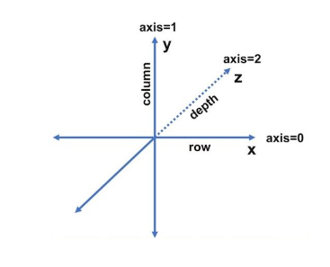

### 3차원 행렬, 텐서  

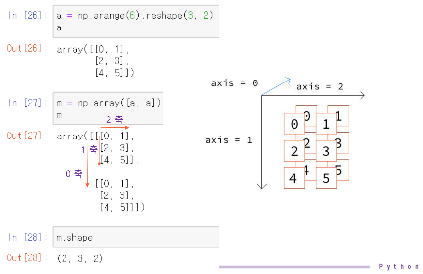

> 이미지가 모든 것을 설명한다. 참고!!

### ndarray : 다차원 배열 객체  

- **대용량 데이터를 다루는 유연한 자료 구조**

    - 같은 종류의 데이터를 저장하는 포괄적 자료구조 ; **모든 원소는 같은 자료형**  

    - 표준 파이썬의 리스트와 다름  

- **주요 속성**

    - ndim: 차원 또는 차수  

    - shape: 구조 

        (3, )
        (3, 2)
        (4, 2, 3)

    - dtype: 원소의 자료형  

- **ndarray 생성**  

    - np.array(다른 배열이나 순차적인 데이터)  

    - np.zeros(), np.ones() 
    
        np.zeros(10)
        np.zeros((2, 3))  

    - np.arange() : range()의 인자로 1차원 배열을 생성 ;
        
        np.arange(10)

### dtype

- **dtype 객체**

    빠른 메모리 참조를 위해 필요한 정보(메타데이터)를 담는 객체  

- **다양한 자료형**

    string, unicode 등등...

### astype() 함수

- **arr.astype(자료형)**

    배열 arr에 지정된 자료형으로 변환(casting)하여 새로운 배열을 복사하여 반환  

    형 변환 실패시 ValueError 발생  

## 브로드캐스팅 슬라이싱

### numpy 배열 산술 연산  

- **벡터화**

    for 문 없이 데이터를 일괄 처리 ; 같은 크기의 배열은 각 원소 별로 연산, 스칼라 인자 (배열 내의 모든 원소에 스칼라 인자가 적용)  

    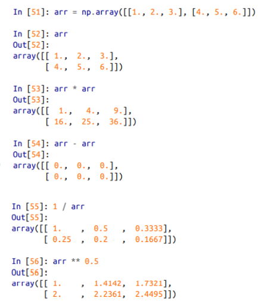

    배열의 비교 연산 ; 결과 - boolean 배열

    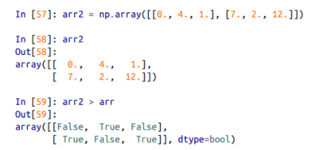  

- **브로드캐스팅**

    크기가 다른 배열 간의 연산  

### 브로드캐스팅  

- **Shape이 같은 두 배열에 대한 이항 연산은 배열의 요소별로 수행**  

- **두 배열 간의 Shape이 다를 경우**

    크기가 다른 배열 간의 연산  

    두 배열 간의 형상을 맞추는 BroadCasting 과정을 거쳐 계산  

    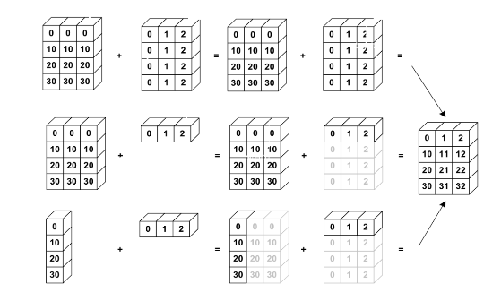

### 색인과 슬라이싱 기초  

- **부분이나 한 원소의 참조**

    - 반환 값의 배열 조각은 원본 배열의 뷰이다.  

        그러므로 반환 값을 수정하면 원본에도 반영  

        대용량의 데이터 처리를 위해 설계

            복사하기 위해서는
            arr[5:8].copy()

    - 2차원 배열 원소 참조

        arr[찾을 행][찾을 열]
        arr[찾을 행, 찾을 열]

    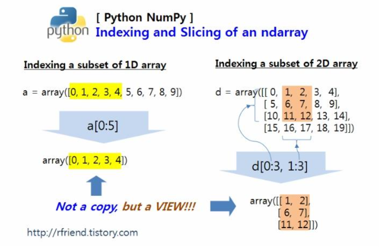
    

### 슬라이싱  

- **여러 개의 배열 요소를 참조할 때 슬라이싱을 사용**  

- **axis 별로 범위를 지정하여 실행**

    - 범위를 ``from_index:to_index`` 형태로 지정

        - ``from_index``는 범위의 시작 인덱스이며, ``to_index``는 범위의 종료 인덱스  

        - ``to_index``는 결과에 포함되지 않음  

        - ``from_index``는 생략 가능, 생략할 경우 0을 지정한 것으로 간주  

        - ``to_index`` 역시 생략 가능, 이 경우 마지막 인덱스로 설정

    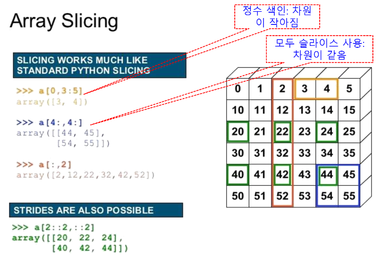

> 이미지의 STRIDES ARE ALSO POSSIBLE 은 시험문제로 출제된다..

### 2차원 배열의 축과 슬라이싱  

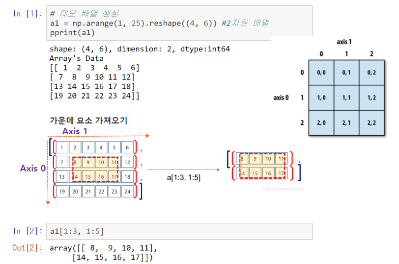

### 슬라이싱 정리

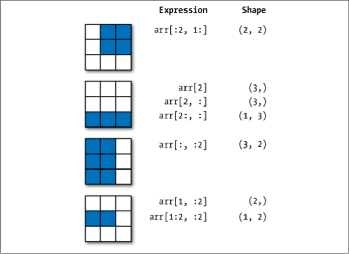

### 불리언 값으로 행 선택하기  

- **불리언 배열**

    색인하려는 축(행, 0)의 길이와 같아야 함

### 팬시 인덱싱(Fancy Indexing)

- **특정 순서로 로우(row)를 선택**

    순서가 명시된 ndarray나 리스트를 사용  

- **특정 순서로 열을 선택**

    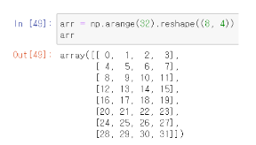

    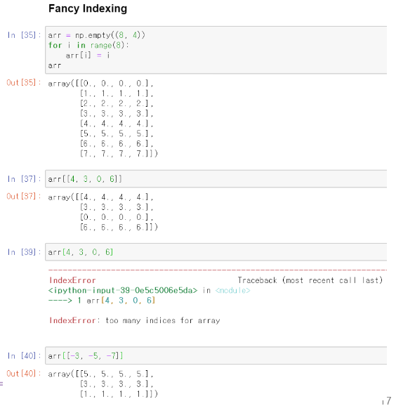

- **배열에 인덱스 배열을 전달하여 요소를 참조하는 방법**  

    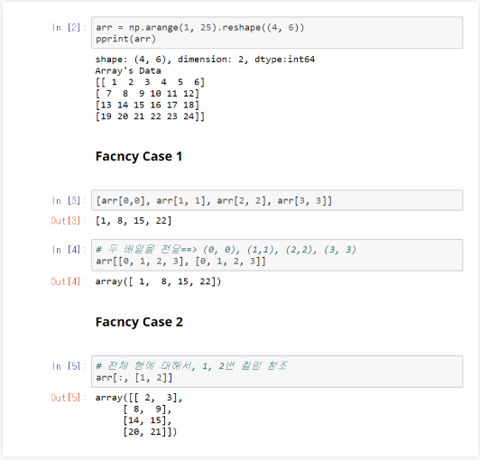

### 다차원 색인 배열

- **각각의 색인 튜플에 대응하는 1차원 배열 선택**

    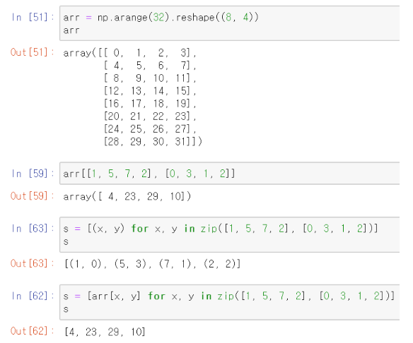

### 배열 전치와 축 바꾸기  

- **배열 전치**

    - 행 열을 바꾸는 것

        - 모양이 바뀐 뷰를 반환  

        - T라는 속성  

- **다차원 배열**

    - 축 번호를 받아서 교환

        - 첫 번째와 두 번째 축 번호가 바뀜  

    - 첨자 교환 ; 예) 5

        - 첨자: (0, 1, 1)
        - 교환
        - 수정된 첨자: (1, 0, 1)

    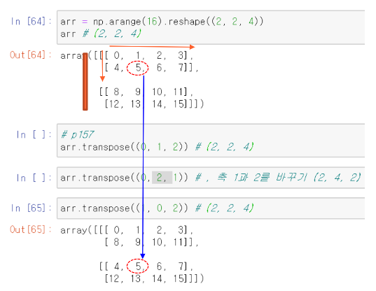

### 배열 형태 변경: 전치(Transpose)  

- **행렬의 인덱스가 바뀌는 변환**

    [numpy.ndarray 객체].T 속성  

    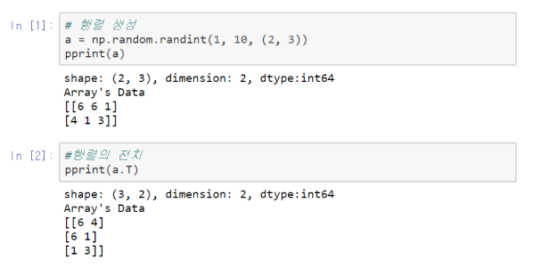

### 배열 형태 변경: reshape 메서드 이해  

- **[numpy.ndarray 객체]의 shape을 변경한 것을 반환**

    자체는 변환되지 않음.

    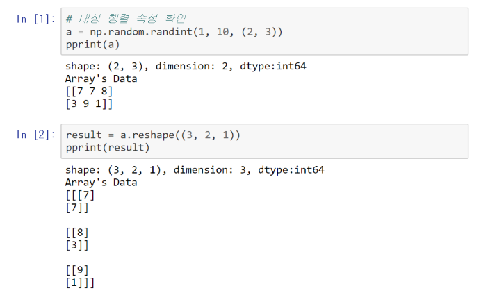

> 나머지는 교수님 pdf 참고..

### arr.swapaxes()

- **두 개의 축 번호를 교환**

    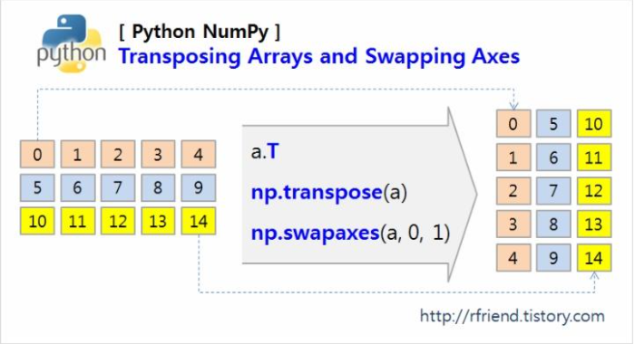

### 배열 형태 변경 : ravel 메서드  

- **배열의 shape을 1차원 배열로 만드는 메서드**

    - [numpy.ndarray 객체].ravel()

        - 배열을 1차원 배열로 반환하는 메서드  
        - 자체는 변환되지 않음

    - 주의

        - ravel이 반환하는 배열은 a 행렬의 view  
        - 반환 행렬의 데이터를 변경하면 a 행렬도 변경  

    
    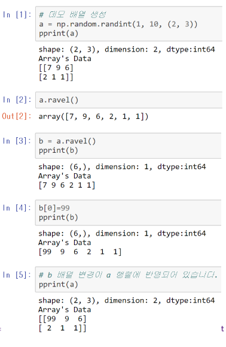

### 배열 슬라이스도 배열을 참조  

- **교재 p144**

    Pythontutor.com에서 테스트해볼 수 있다.  

        import numpy as np
        arr = np.arange(10)
        a = arr[3:5]
        a[0] = 20
        print(arr)

    
    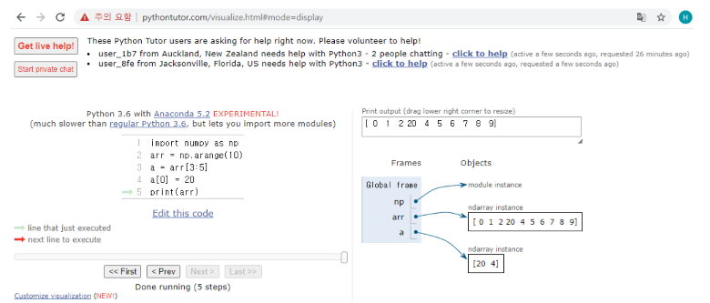

## 배열 관련 함수 난수  

### 유니버설 함수  

- **Ufuc**

    - Ndarray 안의 원소 별로 연산을 수행하는 함수  
    - 단항 함수
        
        - ``np.sqrt(arr)``  

        - ``np.exp(arr)``  
            [2.7183(원소0), 2.7183(원소1), 2.7183(원소2)]

        - ``rem, whole = np.modf(arr)``  
            소수(rem)와 정수(whole)로 부분으로 나눈 배열 2개를 반환  
            내장함수 divmod()의 벡터화 함수  

        - out 인자를 지정가능
            np.sqrt(arr1, arr2)
    
    - 이항 함수 

        - ``np.maximun(arr1, arr2)``

### 배열을 이용한 배열지향 프로그래밍  

- **Numpy 배열의 장점**

    - 반복문을 사용하지 않고 다양한 데이터 처리 가능  
        - 벡터화
        - **순수 파이썬 연산에 비해 10~n00배 빠름**

- **메쉬그리드 함수**

    - xs, ys = np.meshgrid(x,y)

        - 인자, 2개의 1차원 배열  
        - 가능한 모든 (x, y) 짝을 만들 수 있는 2차원 배열 두 개를 반환 

    - 그리드 상의 두 점을 간단하게 계산

        - z = np.sqrt(xs**2 + ys ** 2)

### 수학 메소드와 통계 메소드

- **배열 메소드**

    - 배열 전체 혹은 배열에서 한 축을 따르는 자료에 대한 통계를 수학 함수에 사용  

    - 전체 합, 평균, 표준편차 사용 방법 2가지 ; ``np.mean(arr), arr.mean()``

    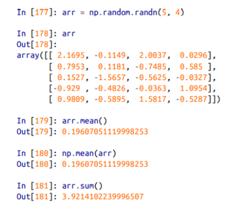

### 축에 따른 연산

- **축 옵션 axis=**

    - 0, row, 행
    - 1, column, 열

    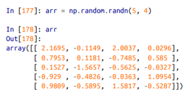

    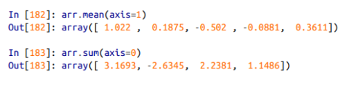

    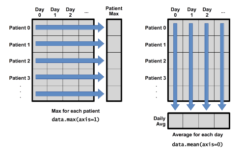

    

