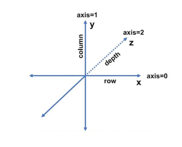
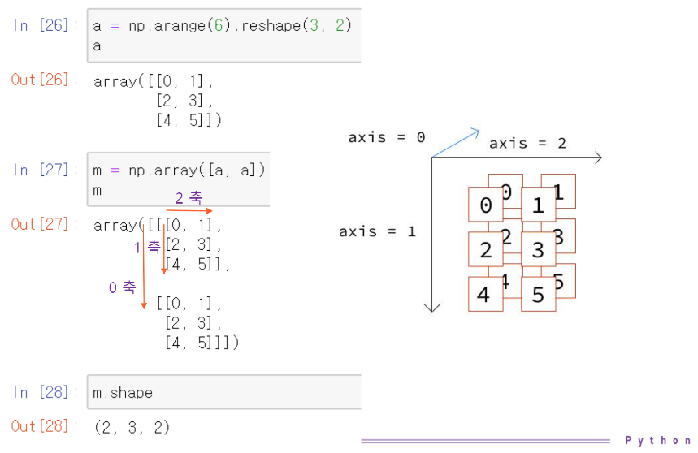
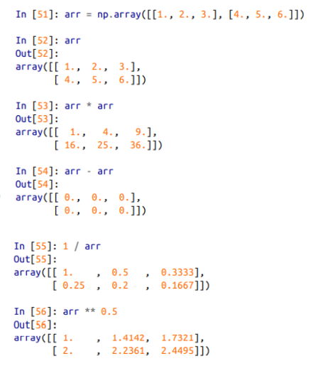
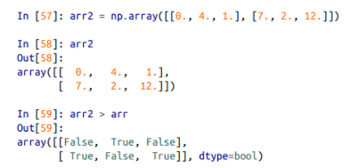
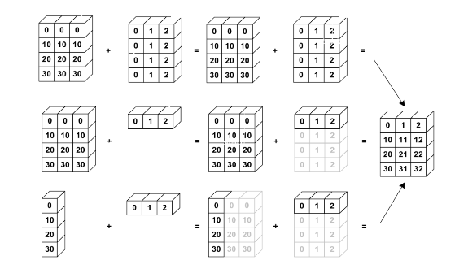

# 2020-06-19 Study

2020-06-19 목요일 수업 내용

> [교수님 파이썬 데이터 분석 및 시각화 git 바로가기](https://github.com/lee7py/Pydata-ANS-VIS)

## 파이썬 라이브러리를 활용한 데이터 분석 4장 numpy 기본 : 배열과 벡터 연산  

### Numpy 기본 : 배열과 벡터 연산 

- **Numerical python**

    과학 기술을 위한 산술 계산 라이브러리 ; 대규모 다차원 배열과 행렬 연산에 필요한 다양한 함수를 제공  

    제공 기술 ; 다차원 배열 ndarray (정교한 브로드캐스팅기능), 전체 데이터 배열을 빠르게 계산하는 표준 수학 함수, 선형대수/난수 생성기  

    장점 ; 대용량 배열 데이터를 효율적으로 다뤄 빠르게 처리  

### 스칼라, 벡터, 행렬, 텐서  

- **넓은 의미로 자료의 모임이 텐서(tensor)**

    작은 의미로 특히 3차원 이상 배열을 텐서(tensor)라고도 부름  ex) [ [[1, 2], [3, 4]], [[5, 6], [7, 8]] ]  

- **스칼라**

    스칼라는 하나의 숫자만으로 이루어진 데이터를 의미 ex) 3  

- **벡터**

    여러 숫자가 순서대로 모여 있는 것으로, 일반적인 일차원 배열이 벡터 ex) [1, 2, 3, 4]  

- **행렬**

    복수의 차원을 가지는 데이터가 다시 여러 개 있는 경우의 데이터를 합쳐서 표기한 것  

    일반적으로 2차원 배열이 행렬 ex) [[1, 2], [3, 4]]

### 다차원 배열  

- **자료형 ndarray 제공**  

    다차원 배열의 데이터 방향을 axis로 표현  

    각각 axis=0, axis=1 그리고 axis=2로 지정 ; 행방향(높이), 열방향(폭), 깊이(채널 방향)이라는 표현  

    

### 3차원 행렬, 텐서  

> 이미지가 모든 것을 설명한다. 참고!!

### ndarray : 다차원 배열 객체  

- **대용량 데이터를 다루는 유연한 자료 구조**

    같은 종류의 데이터를 저장하는 포괄적 자료구조 ; **모든 원소는 같은 자료형**  

    표준 파이썬의 리스트와 다름  

- **주요 속성**

    ndim: 차원 또는 차수  

    shape: 구조 

        (3, )
        (3, 2)
        (4, 2, 3)

    dtype: 원소의 자료형  

- **ndarray 생성**  

    np.array(다른 배열이나 순차적인 데이터)  

    np.zeros(), np.ones() 
    
        np.zeros(10)
        np.zeros((2, 3))  

    np.arange() : range()의 인자로 1차원 배열을 생성 ;
        
        np.arange(10)

### dtype

- **dtype 객체**

    빠른 메모리 참조를 위해 필요한 정보(메타데이터)를 담는 객체  

- **다양한 자료형**

    string, unicode 등등...

### astype() 함수

- **arr.astype(자료형)**

    배열 arr에 지정된 자료형으로 변환(casting)하여 새로운 배열을 복사하여 반환  

    형 변환 실패시 ValueError 발생  

## 브로드캐스팅 슬라이싱

### numpy 배열 산술 연산  

- **벡터화**

    for 문 없이 데이터를 일괄 처리 ; 같은 크기의 배열은 각 원소 별로 연산, 스칼라 인자 (배열 내의 모든 원소에 스칼라 인자가 적용)  

    

    배열의 비교 연산 ; 결과 - boolean 배열

      

- **브로드캐스팅**

    크기가 다른 배열 간의 연산  

### 브로드캐스팅  

- **Shape이 같은 두 배열에 대한 이항 연산은 배열의 요소별로 수행**  

- **두 배열 간의 Shape이 다를 경우**

    크기가 다른 배열 간의 연산  

    두 배열 간의 형상을 맞추는 BroadCasting 과정을 거쳐 계산  

    