# 2020-06-25 Study

2020-06-25 목요일 수업 내용

> [교수님 파이썬 데이터 분석 및 시각화 git 바로가기](https://github.com/lee7py/Pydata-ANS-VIS)

## 3장 numpy 기본 : 배열과 벡터 연산 ; 누적 값 계산  

### 계단 오르내리기  

- **계단을 오르거나(+1) 내리거나(-1) 값의 누적합**  

    리스트 walk에는 난수 0, 1의 누적 합이 저장 

    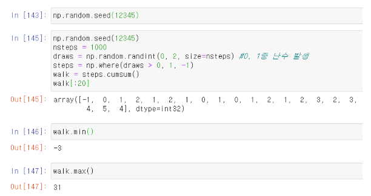

 
### 계단 처음에서 10칸 이상 떨어지기까지 소요 횟수  

- **np.abc(walk) >= 10**

    리스트 walk에서 절대 값이 10 이상인 원소의 논리 배열 ; 처음 위치에서 10칸 이상 떨어진 시점을 알려주는 논리배열  

- **처음 색인을 반환하는 argmax() 사용**

    - ``(np.abs(walk) >= 10).argmax()``
    
        처음 위치에서 10칸 이상 떨어진 첫 위치 반환  

    

### 5000번 모의 실험  

- **2차원 배열 walks (5000 x 1000)**  

    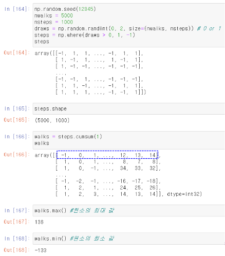

### 어느 행이 조건 (30 칸 이상 떨어지는)을 만족하는 지 검사  

- **각 행에서 30칸 이상 떨어진 점이 있는 지의 논리 배열**

    - ``hits30 = (np.abs(walk) >= 30).any(1)``

        논리 값이 True인 실험에서 30 칸 이상 떨어진 점이 있다 ; 논리 값이 False인 실험에서 30 칸 이상 떨어진 점이 없다 라는 의미.  

- **5천 번의 실험 중에 누적 합이 30 또는 -30 이상 모의 실험 횟수**

    - ``hits30.sum() # Number that hit 30 or -30``

        실험에서 30 칸 이상 떨어진 점이 있는 총 모의실험 횟수  

    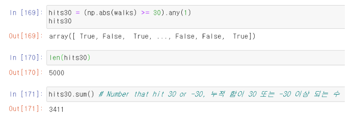

### 조건이 맞는 행(30 칸 이상 떨어지는)에서 처음으로 30칸 이상 떨어지는 지점 찾기  

- **30 칸 이상 떨어진 점이 있는 행``(walks[hits30])``에서 처음으로 30칸 이상 떨어지는 지점을 반환**

    - ``crossing_times = (np.abs(walks[hits30]) >= 30 ).argmax(1)``

        walks에서 hits30이 만족하는 행(절대값이 30이 넘는 경우)을 선택한 후 ; 축 1에 따라 (각 행에서) 최대값 첨자를 구하면 처음으로 30칸 이상 떨어지는 지점을 반환  

    - 절대값이 30이 넘는 실험 행에서 누적 절대값이 30 이상이 되는 최소 횟수의 목록  

        이 목록의 수도 hits30의 수와 같이 3411개  

- **절대값이 30 이 넘는 실험 행에서 누적 절대갑싱 30 이상이 되는 평균 횟수**

    - ``crossing_times.mean()``

    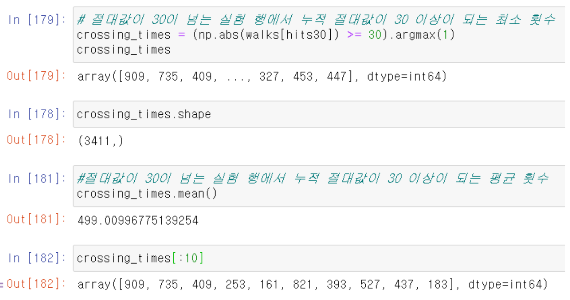

## 3장 numpy 기본 : 배열과 벡터 연산 ; 배열 결합과 분리  

### 배열 결합 : concatenate  

- **배열 합치기, 기본은 0 축(세로)으로**

    np.concatenate((a1, a2, ...), axis=0)  
    a1, a2, ... : 배열

    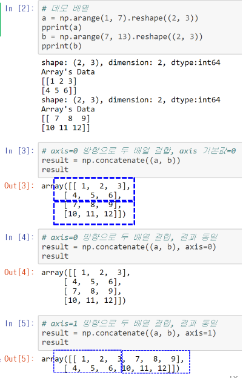

### 배열 결합 : vstack  

- **수직 방향 배열 결합**

- **np.vstack(tup)**

    - tup:튜플  

    - 튜플로 설정된 여러 배열을 수직 방향으로 연결 (axis=0 방향, 세로)  

    - np.concatenate(tup, axis=0)와 동일  

    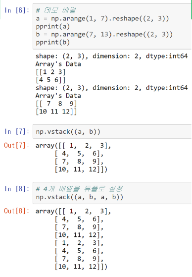

### 배열 결합 : hstack  

- **수평 방향 배열 결합**

- **np.hstack(tup)**

    - tup: 튜플  

    - 튜플로 설정된 여러 배열을 수평 방향으로 연결 (axis=1 방향, 가로)  

    - np.concatenate(tup, axis=1)와 동일  

    

### 배열 분리 : hsplit  

- **np.hsplit(ary, indices_or_sections)**  

    지정한 배열을 수평(행) 방향으로 분할  

    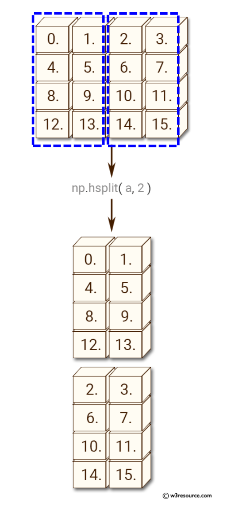

### 배열 분리 : hsplit

- **hsplit**

    결과는 배열의 리스트  

    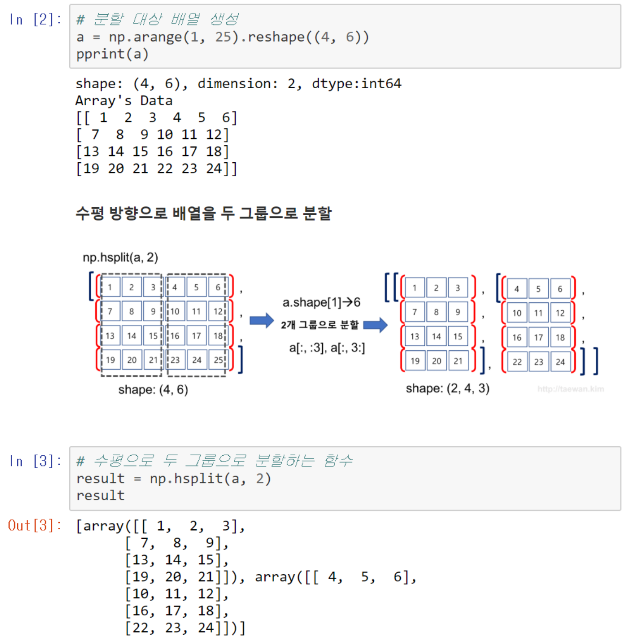

    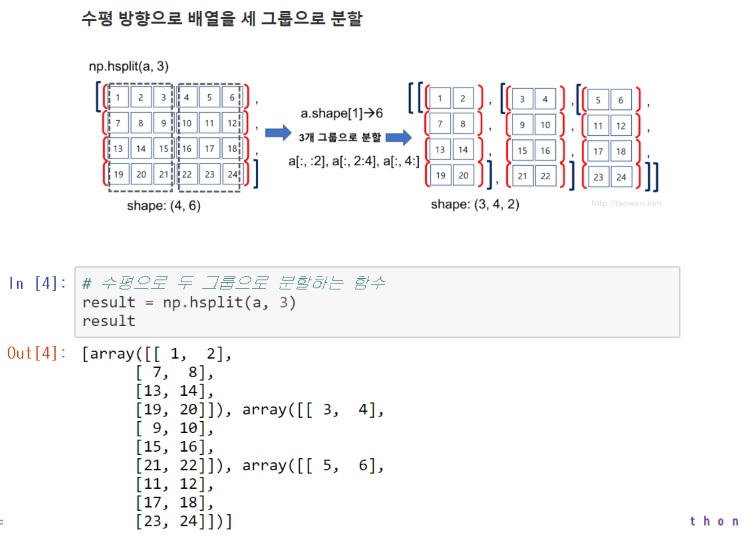

    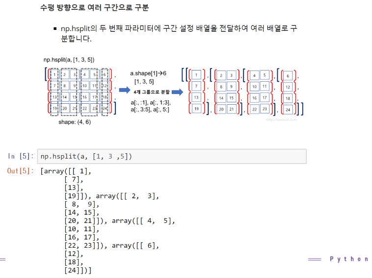

### 배열 분리 : vsplit  

- **배열을 수직 방향(행 방향)으로 분할하는 함수**

    - ``np.vsplit(ary, indices_or_sections)``

    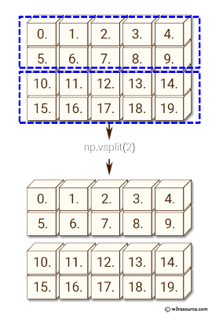

    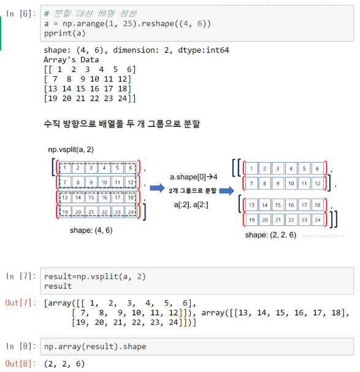

    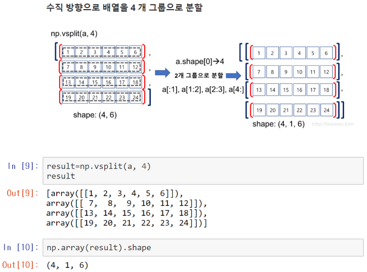

    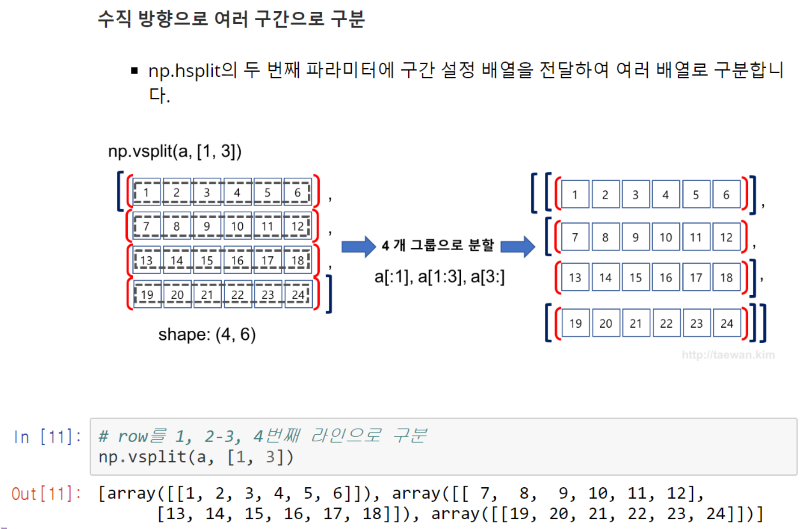

### 행렬 곱 (내적)  

- **``np.dot(a,b)``**

- **``a.dot(b)``**

    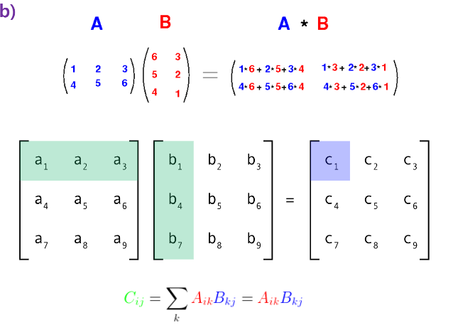

> 내적에서 A가 (A x M) * (M x B) 일 때 M은 서로 같아야 한다.

## 3장 numpy 기본 : 배열과 벡터 연산 ; 브로드캐스팅  

### 브로드캐스팅  

- **다른 모양의 배열 간의 산술 연산 방법**  

    - 배열 + 4(스칼라)

        - 4는 배열의 모든 원소로 브로드캐스트(전파)되어 계산  

### 2차원과 1차원 간의 브로드캐스트  

- **1차원을 2차원 모양으로 변환**  

    - 1차원을 2차원으로 확대 ; **내부 값을 복사**  

    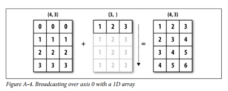

    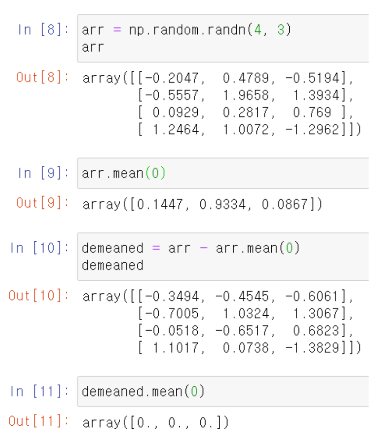

### 열을 늘리도록 브로드캐스트  

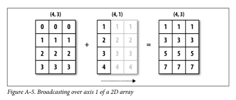

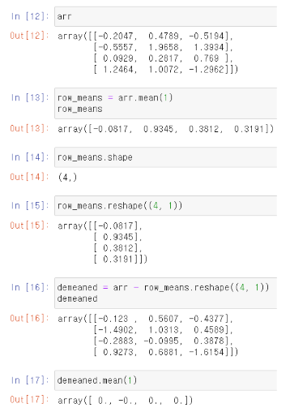

### 다양한 모양의 브로드캐스팅  

- **각각 모양을 모두 수정**

    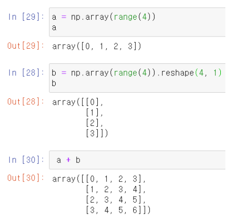

### 오류 발생  

- **모양 변형이 안되면 오류**  

    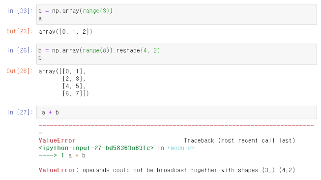
