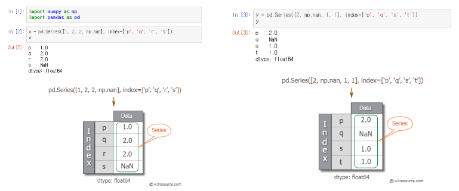
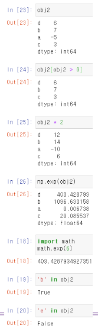
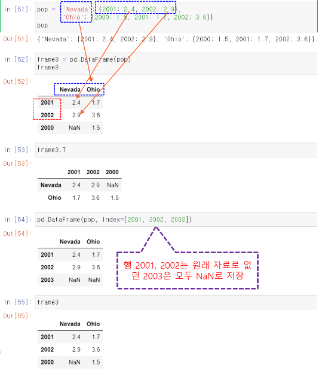
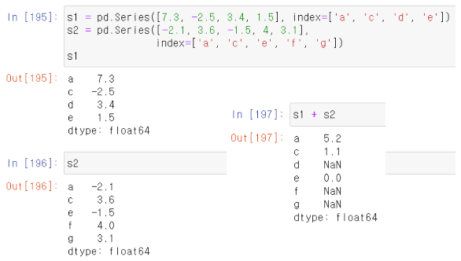

# 2020-06-25 Study

2020-06-25 목요일 수업 내용

> [교수님 파이썬 데이터 분석 및 시각화 git 바로가기](https://github.com/lee7py/Pydata-ANS-VIS)

## 3장 numpy 기본 : 배열과 벡터 연산 ; 누적 값 계산  

### 계단 오르내리기  

- **계단을 오르거나(+1) 내리거나(-1) 값의 누적합**  

    리스트 walk에는 난수 0, 1의 누적 합이 저장 

    

 
### 계단 처음에서 10칸 이상 떨어지기까지 소요 횟수  

- **np.abc(walk) >= 10**

    리스트 walk에서 절대 값이 10 이상인 원소의 논리 배열 ; 처음 위치에서 10칸 이상 떨어진 시점을 알려주는 논리배열  

- **처음 색인을 반환하는 argmax() 사용**

    - ``(np.abs(walk) >= 10).argmax()``
    
        처음 위치에서 10칸 이상 떨어진 첫 위치 반환  

    

### 5000번 모의 실험  

- **2차원 배열 walks (5000 x 1000)**  

    

### 어느 행이 조건 (30 칸 이상 떨어지는)을 만족하는 지 검사  

- **각 행에서 30칸 이상 떨어진 점이 있는 지의 논리 배열**

    - ``hits30 = (np.abs(walk) >= 30).any(1)``

        논리 값이 True인 실험에서 30 칸 이상 떨어진 점이 있다 ; 논리 값이 False인 실험에서 30 칸 이상 떨어진 점이 없다 라는 의미.  

- **5천 번의 실험 중에 누적 합이 30 또는 -30 이상 모의 실험 횟수**

    - ``hits30.sum() # Number that hit 30 or -30``

        실험에서 30 칸 이상 떨어진 점이 있는 총 모의실험 횟수  

    

### 조건이 맞는 행(30 칸 이상 떨어지는)에서 처음으로 30칸 이상 떨어지는 지점 찾기  

- **30 칸 이상 떨어진 점이 있는 행``(walks[hits30])``에서 처음으로 30칸 이상 떨어지는 지점을 반환**

    - ``crossing_times = (np.abs(walks[hits30]) >= 30 ).argmax(1)``

        walks에서 hits30이 만족하는 행(절대값이 30이 넘는 경우)을 선택한 후 ; 축 1에 따라 (각 행에서) 최대값 첨자를 구하면 처음으로 30칸 이상 떨어지는 지점을 반환  

    - 절대값이 30이 넘는 실험 행에서 누적 절대값이 30 이상이 되는 최소 횟수의 목록  

        이 목록의 수도 hits30의 수와 같이 3411개  

- **절대값이 30 이 넘는 실험 행에서 누적 절대갑싱 30 이상이 되는 평균 횟수**

    - ``crossing_times.mean()``

    

## 3장 numpy 기본 : 배열과 벡터 연산 ; 배열 결합과 분리  

### 배열 결합 : concatenate  

- **배열 합치기, 기본은 0 축(세로)으로**

    np.concatenate((a1, a2, ...), axis=0)  
    a1, a2, ... : 배열

    

### 배열 결합 : vstack  

- **수직 방향 배열 결합**

- **np.vstack(tup)**

    - tup:튜플  

    - 튜플로 설정된 여러 배열을 수직 방향으로 연결 (axis=0 방향, 세로)  

    - np.concatenate(tup, axis=0)와 동일  

    

### 배열 결합 : hstack  

- **수평 방향 배열 결합**

- **np.hstack(tup)**

    - tup: 튜플  

    - 튜플로 설정된 여러 배열을 수평 방향으로 연결 (axis=1 방향, 가로)  

    - np.concatenate(tup, axis=1)와 동일  

    

### 배열 분리 : hsplit  

- **np.hsplit(ary, indices_or_sections)**  

    지정한 배열을 수평(행) 방향으로 분할  

    

### 배열 분리 : hsplit

- **hsplit**

    결과는 배열의 리스트  

    

    

    

### 배열 분리 : vsplit  

- **배열을 수직 방향(행 방향)으로 분할하는 함수**

    - ``np.vsplit(ary, indices_or_sections)``

    

    

    

    

### 행렬 곱 (내적)  

- **``np.dot(a,b)``**

- **``a.dot(b)``**

    

> 내적에서 A가 (A x M) * (M x B) 일 때 M은 서로 같아야 한다.

## 3장 numpy 기본 : 배열과 벡터 연산 ; 브로드캐스팅  

### 브로드캐스팅  

- **다른 모양의 배열 간의 산술 연산 방법**  

    - 배열 + 4(스칼라)

        - 4는 배열의 모든 원소로 브로드캐스트(전파)되어 계산  

### 2차원과 1차원 간의 브로드캐스트  

- **1차원을 2차원 모양으로 변환**  

    - 1차원을 2차원으로 확대 ; **내부 값을 복사**  

    

    

### 열을 늘리도록 브로드캐스트  

### 다양한 모양의 브로드캐스팅  

- **각각 모양을 모두 수정**

    

### 오류 발생  

- **모양 변형이 안되면 오류**  

    

## 파이썬 라이브러리를 활용한 데이터 분석 3장 : 판다스 시작하기

### 판다스  

- **개요**

    - 표 형식의 데이터나 다양한 형태의 테이블을 처리하기 위한 라이브러리  

    - 주 자료 구조
        **시리지와 데이터프레임**

    

### 판다스 홈페이지  

- **pandas.pydata.org**

### Series 개요  

- **``pd.Series``**

    - Numpy에서 제공하는 **1차원 배열**과 비슷  

    - 각 데이터의 의미를 표시하는, 레이블(label)이라 하는 인덱스(index)를 붙일 수 있고  

    - 데이터 자체는 값(value)

    

### DataFrame 개요  

- **``pd.DataFrame``**

    - R의 dataframe 데이터 타입을 참고하여 만든 것이 바로 pandas DataFrame  

    - 테이블 형태의 자료 ; **행과 열을 인덱스(index)와 칼럼(column)으로 구분**  

### DataFrame 이해  

- **여러 시리즈의 모임**

    

- **인덱스와 칼럼**

    

### 판다스 시작하기  

- **판다스 특징**  

    - 표 형식의 데이터, 다양한 데이터를 처리하는 것에 초점  

    - Numpy: 단일 산술 배열 데이터 처리에 특화  

    - 800 여명이 함께 개발하는 공개 SW  

### 시리즈 생성  

- **일련의 객체를 담는 1차원 배열 구조**  

    - 색인(index): 배열의 데이터와 연관된 이름  

        - 지정하지 않으면 [0, ..., N-1]로 자동 지정  
        - ``pd.Series([4, 7, -5, 3])``

    - 속성: values, index, array  

    

### 시리즈 참조와 값 대입  

- **여러 값 선택**  

    - 색인 리스트 사용  

    

    

### 데이터, 색인, NaN  

- **``pd.Series(사전)``**

    - 키는 인덱스  

- **``pd.Series(데이터, index=리스트)``**  

    - 기존의 데이터라면 지정한 인덱스를 기반으로 생성 ; **'Utah'는 데이터에 없으므로 빠짐**  

    - NaN(Not a Number) 

        - **np.nan**
        - **pd.isnull()**
        - **pd.notnull()**  

        

> 사진에 Califonia가 없으므로 NaN이 색인.  

### 산술 연산과 속성  

- **산술 연산**  

    - 색인과 라벨로 자동 정렬  
    - 피연산자가 해당 색인이 있어야 계산  

- **속성**

    - name  
    - index.name

        

### DataFrame 다양한 참조 방법과 삭제  

 

### DataFrame 생성  

- **열은 서로 다른 종류의 값도 가능**  

    

### 열명 지정  

- **옵션 columns=**

    - 새로 만들 때  
    - 기존의 것을 사용시 ; **순서 이동**  

    

### 주요 속성  

- **결측치는 NaN**  
- **속성**  

    - columns ; **열 색인 값**  
    - df.칼럼명

        df['칼럼명']  
        열 조회

    
    
> frame.year 이거나 frame['year']는 서로 같다. 이 때 year 영역은 변수타입이여야 저렇게 .(comma)로 참조가 가능하다.  

### 행과 열 참조  

- **``df.loc['행명']``**  

- **``df['열명']``**

    - 없는 열에 대입하면 ; **새로운 열 생성**  

      

### 열 추가와 삭제  

- **``df['새로운_열명'] = 값``**  

    새로운 열 추가  

- **``df['기존_열명'] = 값``**  

    값 수정  

- **``del df['기존_열명']``**  

    기존_열명의 열 삭제  

      

### 사전 데이터  

- **사전의 키**

    - 열명  
    - 값의 내부에도 사전이 있다면 ; **키는 인덱스**  

      

### 주요 속성  

- **index.name**  

- **columns.name**  

- **values**  

      

### 색인  

- **색인**

    중복을 허락  

      

### 재색인  

- **obj.reindex()**

    - 새로운 색인에 맞도록 새로 생성  
    - 존재하지 않는 색인의 값에는 NaN 추가  

     

     

     

### loc[행명, 열명]

- **이름을 여러 개**

    리스트 형태로  

- **슬라이싱도 가능**

    ``frame.loc['a':'c', 'Texas':'Califonia']``     

- **Columns 재색인**  

    

### 하나의 행이나 열 삭제  

- **선택한 값들이 삭제된 객체를 반환**  

    - 옵션 ``inplace=True`` ; **원본 객체에 반영**  

- **행 삭제**

    - ``drop('행명')`` ; **``['행명1','행명2', ...]``**

- **열 삭제**

    - ``drop('열명', axis=1)`` ; **``['열명1', '열명2', ...]``**  

    

      

> axis=1 이나 axis='columns'가 같고 axis=0 이나 axis='index'는 같다.  

### 시리즈 색인  

- **정수와 인덱스 라벨 모두 가능**  

    **라벨 슬라이싱은 끝점도 포함**  

      

### 데이터프레임의 열과 행 참조  

- **``df['열명'], df['열명1', '열명2', ...]``**  

- **``df[m:n]``**  

    - 슬라이싱으로 로우(row)를 선택  

    - ``df[정수]`` ; **정수의 열이 없으면 오류**  

- **``df[조건]``**  

    - 조건이 참인 로우를 선택 ; 로우의 수가 일치해야 한다.

    

    

### loc과 iloc으로 선택하기  

- **이름 선택: df.loc(행명, 열명)**  

    슬라이싱도 가능 :끝 도 포함  

- **정수 색인 선택: df.iloc(행번호, 열번호)**  

    슬라이싱도 가능  

    

    

> i는 정수 int의 의미.

### 데이터프레임 색인  

- **정리**  

    

### 정수 색인  

- **정수 색인**

    ``iloc()`` 사용 권장  

- **라벨 색인**  

    ``ser.loc[:1]``

    

> [만약에 다양한 함수들을 자세히 알고 싶으면 클릭](https://pandas.pydata.org/docs/) 클릭한 후 search에서 보고싶은 함수를 검색하여서 자세히 알아보자.  

### 시리즈 산술 연산과 데이터 정렬  

- **+ 연산**  

    연산에 참여하는 값이 하나라도 nan라면 결과는 ; NaN  

    

### 데이터프레임 산술 연산과 데이터 정렬  

- **양쪽에 겹치지 않은 부분은 NaN**  

    

### 산술 연산 메소드에 채워 넣을 값 지정하기  

- **옵션 ``fill_value=0``**  

    

### 데이터프레임과 시리즈 간의 연산(1)  

- **브로드캐스팅과 동일**

    column을 맞추고 row로 전파  

    

- **색인 값을 DataFrame의 열이나 Series의 색인에서 찾을 수 없다면**  

    - 그 개체는 형식을 맞추기 위해 재색인  

    - 중복되지 않는 부분은 NaN  

    

### 시리즈 값을 열로 전파  

- **행 연산: ``axis='index'`` 또는 ``axis=0``**

    원래는 column에 맞추고 row로 전파하나 축이 0이므로 그대로 열로 전파  

    

### 함수 적용과 매핑  

- **Numpy 유니버설 함수 적용 가능**  

    각 원소에 적용되는 메소드  

- **``df.apply(함수, axis=0)``**

    - 축 행에 따른 연산이 기본  

    - axis=1 ; **축 열에 따라 계산**

    

    

### 함수 반환 값이 시리즈  

- **여러 값을 가진 시리즈 반환도 가능**  

    

### 배열의 원소에 적용되는 함수 사용  

- **``df.applymap(함수명)``**  

    - ``Series.map(함수명)`` 

     
  