# 2020-06-26 Study

2020-06-26 금요일 수업 내용

> [교수님 파이썬 데이터 분석 및 시각화 git 바로가기](https://github.com/lee7py/Pydata-ANS-VIS)

## 파이썬 라이브러리를 활용한 데이터 분석 3장 : 판다스 시작하기  

### 정렬과 순위  

- **행, 열의 색인을 정렬: sort_index**  

    - 옵션 ``axis=``

    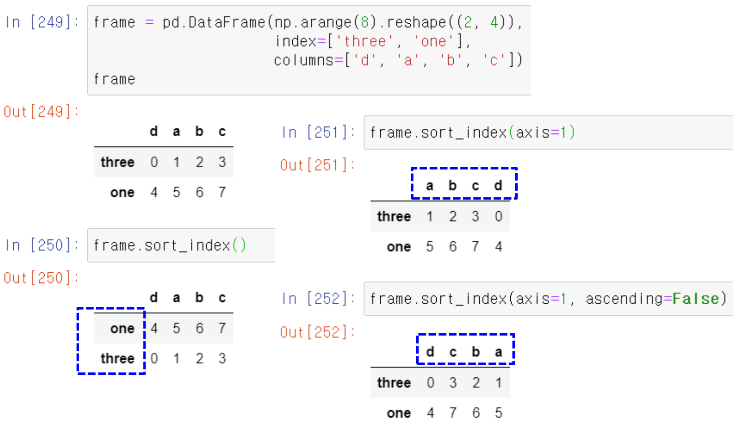

### 값에 따른 정렬  

- **메소드 ``df.sort_values()``**       

    - 시리즈에서 NaN는 마지막에 배치  
    - 데이터프레임에서 반드시 필요한 인자 ``by='열명'``
        - 정렬할 열명, 없으면 오류  
        - ``by=['열명1', '열명2', ...]``

    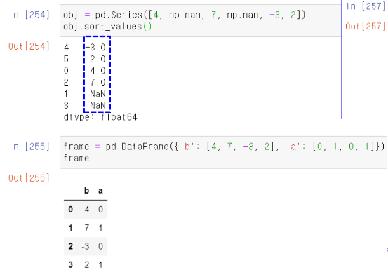

    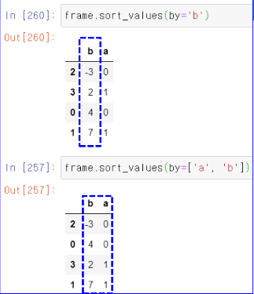

### 값에 따른 정렬 axis=1

- **지정된 행의 값에 따라 정렬**  

    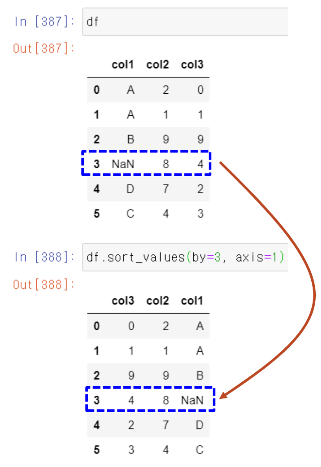

### 시리즈 항목의 순위  

- **메소드 ``series.rank(), df.rank()``**

    - 동점인 항목은 평균 순위가 기본  
    - 옵션 ``method='first', method='max'``
        - **먼저 나타난 순서대로 순위**
        - **동등이면 큰 값으로** ; 1등이 3개면 모두 3  

    - 옵션 ``ascending=False``  
        - **내림차순으로**

    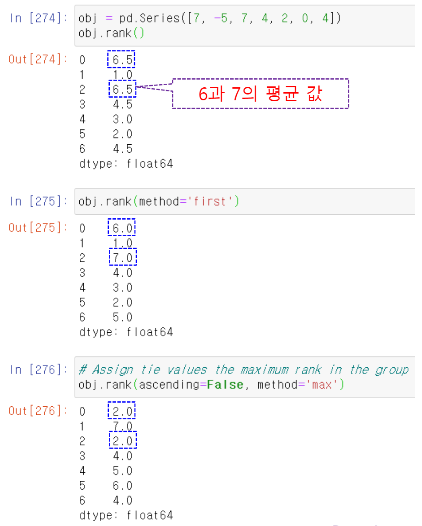
 

### 데이터프레임 항목의 순위  

- **메소드 ``df.rank()``**

    - 동점인 항목은 평균 순위가 기본  
    - 옵션 ``method='first', method='max'``
        - **먼저 나타난 순서대로 순위**
        - **동등이면 큰 값으로** ; 1등이 3개면 모두 3  

    - 옵션 ``ascending=False``  
        - **내림차순으로**

- **데이터프레임에서**

    - 모든 열에 대해 순위를 매김  

    - axis=1 ; **모든 행에 대해 각 값의 순위를 매김** - 3등, 2등, 1등 (사진 상 빨간색 라인이랑 같이..)

    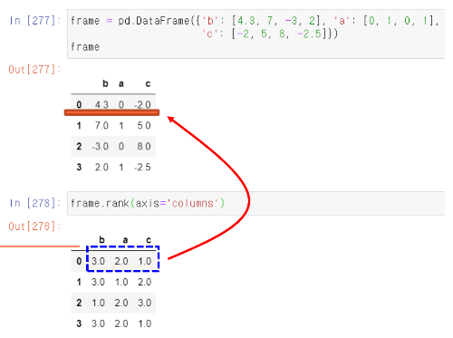

### 각 열에서 등수 표시  

- **옵션 ``axis=0``**

    ``axis=0``이 default ; **각 열에서의 값의 등수 표시**  

    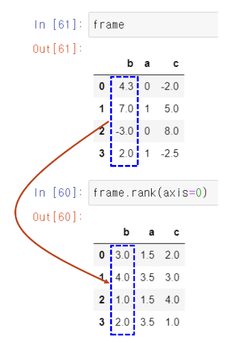

### 중복 색인  

- **색인 값은 중복 가능**  

    - 시리즈에서 참조 시 결과가 여러 개면 시리즈 반환  

    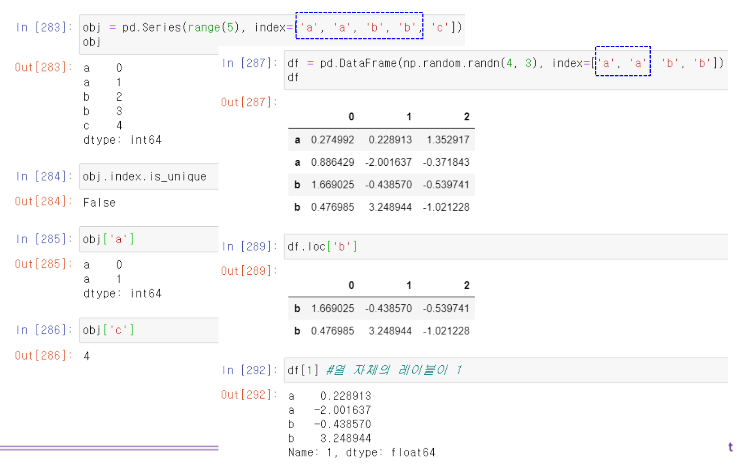

## 파이썬 라이브러리를 활용한 데이터 분석 ; 5장 3절 기술통계 계산과 요약  

### 메소드 df.sum()

- **기본이 축 0을 중심**  

    - 열의 합을 반환  
    - ``axis=0``, 'index'가 default  
    - 옵션 ``axis=1``, 'columns' ; **축 1을 중심으로 행 합을 반환**  

- **누락된 데이터는 제외하고 계산**

    - 옵션 ``skipna=True``가 default  
    - ``skipna=False``로 하면 결과는 NaN

    

    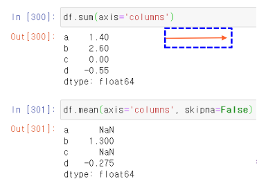

### 메소드 idxmax(), cumsum()

- **cumsum()**  

    -NaN은 0으로 취급하며, 그 위치는 그대로 NaN으로 반환  

    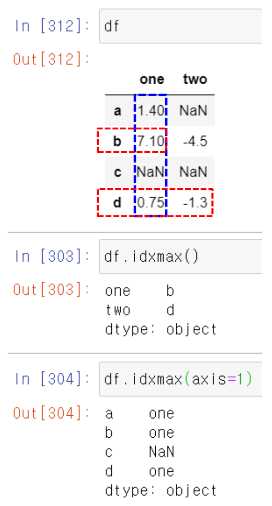

    

### describe()

- **여러 개의 통계 결과**  

    수치 값이 아니면 다른 통계량  

    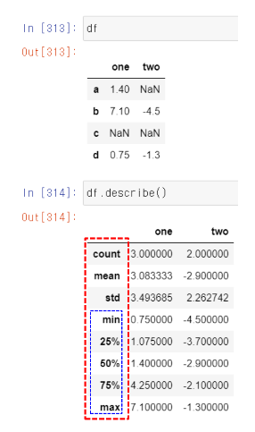

    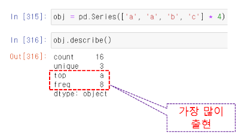

### 상관 관계  

- **두 주식 간의 상관 관계(corr)가 어느 정도인가?**  

    - 마이크로소프트와 IBM

        corr <= .3          # 약한 상관 관계  
        .3 < corr <= .7     # 강한 상관 관계  
        .7 <= corr          # 매우 강한 상관 관계

    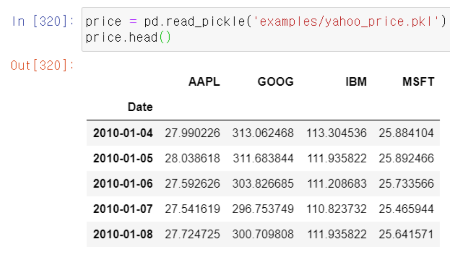

    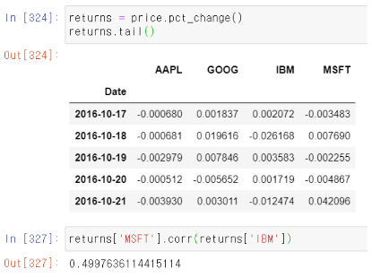

> pct_change()는 전날대비 변화 비율? 같은것.. 잘 모르겠으면 구글링!

### 전체 상관 관계 분석  

- **전체**  

    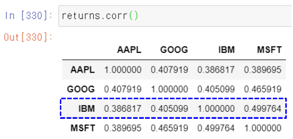

> 대각선은 자기 자신과의 상관 관계 이므로 전부 1로 나온다

- **IBM과 다른 회사 간의 상관 관계**  

    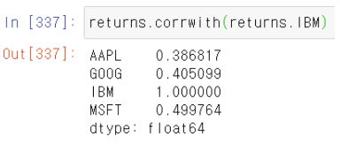

### 유일 값, 값 세기  

- **unique()**  
- **value_counts()**  

    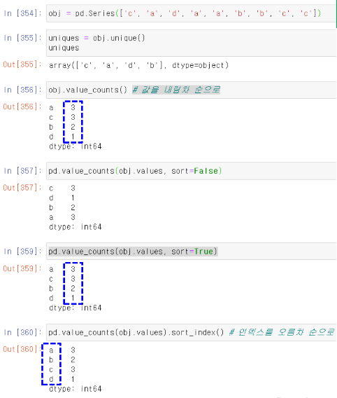

### series.isin(['값1', '값2', ...])

- **어떤 값이 시리즈에 있는 지 검사**  

    논리 벡터를 반환  

- **``obj[obj.isin(['b', 'c'])]``**

    값이 b 또는 c인 값만 시리즈 반환  

    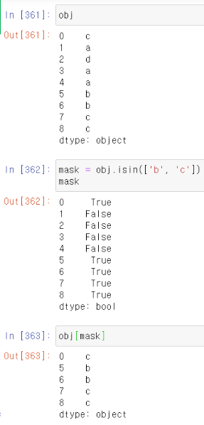

### Index.get_indexer()

- **``pd.Index(unique_vals).get_indexer(to_match)``**  

    - 인자인 to_match 원소 값이 유일한 값으로 구성된 Index와 매칭되는 첨자로 구성되는 배열을 반환  

        - **결과는 인자인 to_match수와 일치**  

    - ``get_indexer()``를 호출하는 인덱스는 반드시 원소 값이 unique해야 함  

- **간단 예제**  

    - ``index = pd.Index(['c', 'a', 'b'])``  
    - ``index.get_indexer(['a', 'b', 'x'])``
        - ``array([1, 2, -1])``

    > 만약 ``index = pd.Index(['c', 'a', 'b'])``에서 c = 0, a = 1, b = 2 라고 한다면 ``index.get_indexer(['a', 'b', 'x'])``에서 말 그대로. get_indexer.. 인덱스를 가져오라는 의미로 a에는 1이 대입되고 b에는 2가 대입된다.

    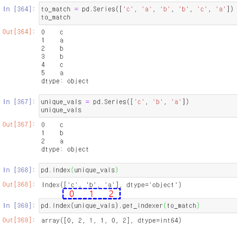

### 데이터프레임에 value_count() 적용  

- **각 열에서 값이 나온 수를 계산**  

    - 축 0에 따라  ; **각 값의 출현 횟수를 세어 각 값이 인덱스로.. 출현 수가 값으로 대입!!**  

    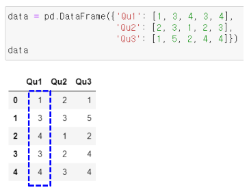

    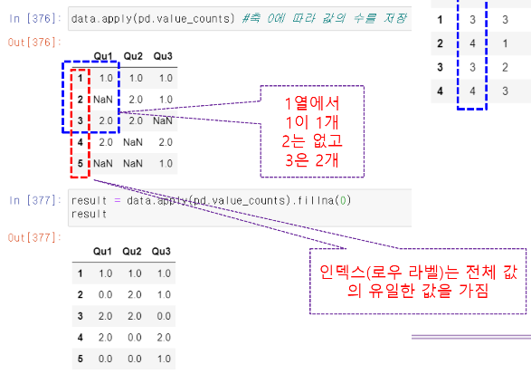

### 각 행에서 값이 나온 수를 계산  

- **옵션 ``axis=1``**

    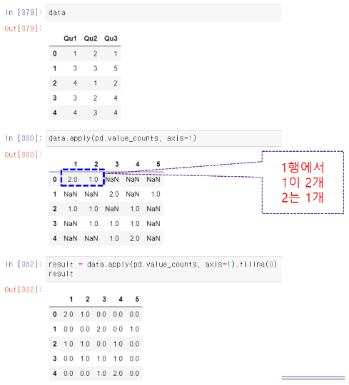