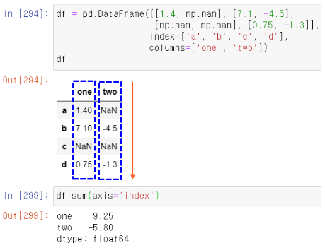
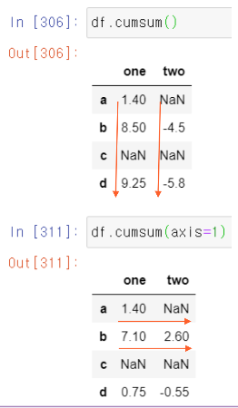
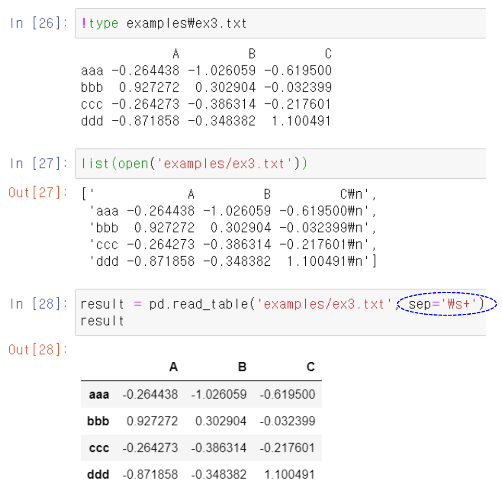
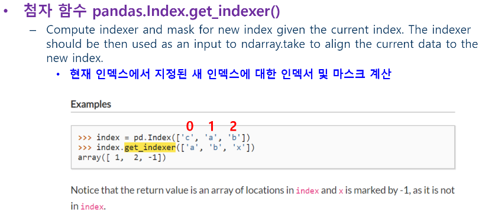

# 2020-06-26 Study

2020-06-26 금요일 수업 내용

> [교수님 파이썬 데이터 분석 및 시각화 git 바로가기](https://github.com/lee7py/Pydata-ANS-VIS)

## 파이썬 라이브러리를 활용한 데이터 분석 3장 : 판다스 시작하기  

### 정렬과 순위  

- **행, 열의 색인을 정렬: sort_index**  

    - 옵션 ``axis=``

    

### 값에 따른 정렬  

- **메소드 ``df.sort_values()``**       

    - 시리즈에서 NaN는 마지막에 배치  
    - 데이터프레임에서 반드시 필요한 인자 ``by='열명'``
        - 정렬할 열명, 없으면 오류  
        - ``by=['열명1', '열명2', ...]``

    

    

### 값에 따른 정렬 axis=1

- **지정된 행의 값에 따라 정렬**  

    

### 시리즈 항목의 순위  

- **메소드 ``series.rank(), df.rank()``**

    - 동점인 항목은 평균 순위가 기본  
    - 옵션 ``method='first', method='max'``
        - **먼저 나타난 순서대로 순위**
        - **동등이면 큰 값으로** ; 1등이 3개면 모두 3  

    - 옵션 ``ascending=False``  
        - **내림차순으로**

    
 

### 데이터프레임 항목의 순위  

- **메소드 ``df.rank()``**

    - 동점인 항목은 평균 순위가 기본  
    - 옵션 ``method='first', method='max'``
        - **먼저 나타난 순서대로 순위**
        - **동등이면 큰 값으로** ; 1등이 3개면 모두 3  

    - 옵션 ``ascending=False``  
        - **내림차순으로**

- **데이터프레임에서**

    - 모든 열에 대해 순위를 매김  

    - axis=1 ; **모든 행에 대해 각 값의 순위를 매김** - 3등, 2등, 1등 (사진 상 빨간색 라인이랑 같이..)

    

### 각 열에서 등수 표시  

- **옵션 ``axis=0``**

    ``axis=0``이 default ; **각 열에서의 값의 등수 표시**  

    

### 중복 색인  

- **색인 값은 중복 가능**  

    - 시리즈에서 참조 시 결과가 여러 개면 시리즈 반환  

    

## 파이썬 라이브러리를 활용한 데이터 분석 ; 5장 3절 기술통계 계산과 요약  

### 메소드 df.sum()

- **기본이 축 0을 중심**  

    - 열의 합을 반환  
    - ``axis=0``, 'index'가 default  
    - 옵션 ``axis=1``, 'columns' ; **축 1을 중심으로 행 합을 반환**  

- **누락된 데이터는 제외하고 계산**

    - 옵션 ``skipna=True``가 default  
    - ``skipna=False``로 하면 결과는 NaN

    

    

### 메소드 idxmax(), cumsum()

- **cumsum()**  

    -NaN은 0으로 취급하며, 그 위치는 그대로 NaN으로 반환  

    

    

### describe()

- **여러 개의 통계 결과**  

    수치 값이 아니면 다른 통계량  

    

    

### 상관 관계  

- **두 주식 간의 상관 관계(corr)가 어느 정도인가?**  

    - 마이크로소프트와 IBM

        corr <= .3          # 약한 상관 관계  
        .3 < corr <= .7     # 강한 상관 관계  
        .7 <= corr          # 매우 강한 상관 관계

    

    

> pct_change()는 전날대비 변화 비율? 같은것.. 잘 모르겠으면 구글링!

### 전체 상관 관계 분석  

- **전체**  

    

> 대각선은 자기 자신과의 상관 관계 이므로 전부 1로 나온다

- **IBM과 다른 회사 간의 상관 관계**  

    

### 유일 값, 값 세기  

- **unique()**  
- **value_counts()**  

    

### series.isin(['값1', '값2', ...])

- **어떤 값이 시리즈에 있는 지 검사**  

    논리 벡터를 반환  

- **``obj[obj.isin(['b', 'c'])]``**

    값이 b 또는 c인 값만 시리즈 반환  

    

### Index.get_indexer()

- **``pd.Index(unique_vals).get_indexer(to_match)``**  

    - 인자인 to_match 원소 값이 유일한 값으로 구성된 Index와 매칭되는 첨자로 구성되는 배열을 반환  

        - **결과는 인자인 to_match수와 일치**  

    - ``get_indexer()``를 호출하는 인덱스는 반드시 원소 값이 unique해야 함  

- **간단 예제**  

    - ``index = pd.Index(['c', 'a', 'b'])``  
    - ``index.get_indexer(['a', 'b', 'x'])``
        - ``array([1, 2, -1])``

    > 만약 ``index = pd.Index(['c', 'a', 'b'])``에서 c = 0, a = 1, b = 2 라고 한다면 ``index.get_indexer(['a', 'b', 'x'])``에서 말 그대로. get_indexer.. 인덱스를 가져오라는 의미로 a에는 1이 대입되고 b에는 2가 대입된다.

    

### 데이터프레임에 value_count() 적용  

- **각 열에서 값이 나온 수를 계산**  

    - 축 0에 따라  ; **각 값의 출현 횟수를 세어 각 값이 인덱스로.. 출현 수가 값으로 대입!!**  

    

    

### 각 행에서 값이 나온 수를 계산  

- **옵션 ``axis=1``**

    

## 파이썬 라이브러리를 활용한 데이터 분석 ; 6장 데이터 로딩과 저장, 파일 형식  

### 텍스트 파일에서 데이터를 읽고 쓰는 법  

- **메소드 ``read_csv(), read_table()``**  

    

### 옵션  

- **색인**  

    하나 이상의 컬럼을 색인으로 지정  

- **자료형 추론과 데이터 변환**  

    ``read_csv()``등은 자료형을 띠로 지정하지 않으므로 자료형 추론을 실행  

- **날짜 분석**

- **반복**

- **정제되지 않은 데이터 처리**

    주석 건너뛰기, 천 단위 자릿수  

### 메소드 pd.read_csv() 개요  

  

> 빨갛게 칠한 것을 확인하자!

### 칼럼 명 해제 및 지정  

- **옵션: header = None**  
- **옵션: names = [...]**  
- **특정 칼럼을 인덱스로 활용**  
    ``index_col='message'``     

    

### 계층적 색인 지정  

- **칼럼 번호나 이름의 리스트 사용**  

    

    

### 데이터를 공백이나 패턴으로 구분  

- **옵션 sep=**

    - ``'\s'`` ; **정규 표현식**  

        - 여러 개의 공백 문자  

- **데이터 추론**

    - 첫 로우가 데이터가 하나 적음 ; **칼럼 명으로 추론**  

    

### 옵션 skiprows=

- **행 건너뛰기**  

    

### 누락 값 처리  

- **NaN, Null, 또는 빈 부분 사용**  

    

### 옵션 na_values=

- **직접 특정한 값을 누락 값으로 지정**

    - 리스트나 사전 형식 ; **칼럼마다 다른 NaN 값을 사전 형식으로 지정**  

    

### 조금씩 읽어 오기  

- **처음 일부 읽기**  

    옵션 ``nrows=n``

- **여러 조각으로 나누어 읽기**

    - 옵션 ``chunksize=n``  
    - key 열에서 값의 횟수 세기 ; **chuner를 for in에 사용**  

    

## 파이썬 라이브러리를 활용한 데이터 분석 ; 7장 데이터 정제 및 준비  

### 데이터 정제 및 준비  

- **데이터를 합치고 재배열 필요**  

    원천 데이터는 분석하기 어려운 형태로 기록되어 제공  

- **주요 내용**  

    - 누락된 데이터 처리

        - **``isnull() / np.nan / dropna(), fillna()``**  
    
    - 데이터 변형  

        - **``duplicated() / drop_duplicates() / map() / replace() / cut(), qcut()``**  

    - 문자열 다루기  

        - **정규 표현식**  

## 7장 데이터 정제 및 준비 ; 누락 데이터 처리 데이터 변형  

### 누락된 데이터 처리  

- **전처리**

    - 누락된 데이터(결측치) 처리가 중요  

        - pandas는 기술 통계에서 누락 데이터 제외  
        - 출력 표기: ``NaN``  
        - 코드: ``np.nan`` ; R에서 NA(not available) 차용 / 파이썬 None도 결측치로 취급  

### NaN 처리 메소드 dropna() 

- **기본**  

    - 결측치가 하나라도 있는 행이나 열을 제거 ; **시리즈에서는 NaN 제거**  

    - 옵션 ``how='all'`` ; **모두 NaN이면 행 제거**  

    - 옵션 ``axis=1`` ; **열에 대한 제거**  

    - 옵션 ``thresh=2`` ; **NaN가 2개 이상이면 행 제거**  

      

    

### 결측치 채우기, fillna()

- **메소드 ``df.fillna(값)``**  

    - 값은 사전(dict)으로 가능 ; **키가 정수로 열 첨자가 됨**  

    - 새로운 객체를 반환 ; **인자 ``inplace=True``로 기존 객체 수정 반영이 가능**  

    - 평균 ``mean()``으로 결측 값을 대입 ; **``data.fillna(data.mean())``**  

    

- **보간(interpolation) 방법, 옵션 ``method=``**  
     
    - 결측치를 채워 넣는 방법  
    - 옵션 ``method='ffill': forward fill`` ; **바로 이전 열 값(위 값)으로 삽입**  

- **결측 치를 최대 몇 개 까지 대입, 옵션 ``limit=``**  

    

    
    

### df.fillna() 예제

### 데이터 변형  

- **중복 제거하기**  

    - 메소드 ``duplicated()`` ; **각 로우(행)가 중복인지를 알려주는 boolean 시리즈를 반환**  

    - 메소드 ``drop_duplicates()`` ; **중복인 행을 제거하고 데이터프레임을 반환**  

    - 메소드 ``drop_duplicates(['k1'])`` ; **중복 체크 열 k1을 지정**  

    - 메소드 ``drop_duplicates(['k1', 'k2'], keep = 'last')`` ; **마지막 중복된 행을 남긴 결과를 반환**  

### 메소드 duplicated()

- **각 행(로우)이 중복인지를 알려주는 논리 Series 반환**  

- **메소드 ``drop_duplicates()``**

    duplicated 배열이 False인 데이터프레임 반환  

    

    

### duplicated(['키1', '키2', ...])

- **여러 키의 조합으로 중복 검사**  

- **옵션 ``keep='last'``**  

    - 마지막으로 발견된 값을 남겨 반환 ; **default는 처음 발견된 값을 유지**

    

    

### 함수나 매핑을 이용한 데이터 변형  

 

### 변형 메소드  

- **함수 적용**  

    - ``Series.map(meat_to_animal)``  

- **값 치환**  

    - ``df.replace(-999, np.nan)`` ; **-999를 np.nan으로 수정**  

    - ``df.replace([-999, -1000], [np.nan, 0])`` ; **-999를 np.nan으로, -1000을 0으로 수정**  

    - ``df.replace({-999: np.nan, -1000: 0})`` ; **-999를 np.nan으로, -1000을 0으로 수정**  

### replace(from, to)  

- **값 치환**  

     

### 축 색인 이름 바꾸기  

- **축 색인에 적용하는 ``map()``**  

- **새로운 객체를 생성: ``rename()``**  

    

      

    > str.title은 첫 글자만 대문자로 만들라는 의미!!

## 7장 데이터 정제 및 준비 ; 구간 구분, 특잇값 원핫 인코딩(표시자 / 더미표기)  

### 범주(categories)로 구분  

- **함수 ``cut()``과 ``qcut()``**  

    

### 개별화와 양자화  

- **함수 ``pd.cut()``**  

    - 구간 리스트를 사용하여 그에 맞는 구간 그룹으로 나누는 함수  

    - 반환 자료 ; **Categorical**  

    - 자료형 Categorical의 속성 ; **codes, categories**  

    - 인자 labels ; **그룹의 이름 지정**  

    

### N등분 구간으로  

- **``pd.cut(data, 4, precision=2)``**

    데이터에서 최대값과 최소값을 기준으로 균등한 길이의 그룹을 자동으로 계산 ; **4등분의 소수점 아래 2자리(precision=2)로 계산**   

    

### 함수 qcut()

- **``pd.qcut(data, 4)``**  

    - 4 분위로 분류 : 구간 소속 분포의 등분 ; **Data 분포 수가 똑같은 구간으로 나눔**  

    - 만일 data의 수가 1000개 라면 ; **4개의 구간으로 나누는데 각 구간은 250개씩의 데이터를 가짐**  

      

### 함수 qcut()로 분포의 수 비율을 지정  

- **분포의 변 위치를 리스트로 직접 지정**  

    - 0에서 1사이로 ; **[0, 0.1, 0.5, 0.9, 1] , 만약 100개 라면 10, 40, 40, 10개의 위치의 그룹으로 나눔**  

    

### 특잇값을 찾고 수정하기  

- **Outlier**  

    특잇값을 제외하거나 적당한 값으로 대체  

- **칼럼 2에서 3을 초과하는 수 찾기**  

      

### any(1)  

- **조건을 하나라도 만족하는 값이 있는 모든 행 검색**  

    예제 ; 절대 값이 3을 초과  

- **3을 초과하는 수를 -3 또는 3으로 지정**  

     

     

### 치환과 임의 샘플링  

- **``np.random.permutation(n)``**  

    0에서 n-1까지의 임의의 순서 조합 반환  

- **``pd.take(로우_순서_리스트)``**  

    행을 임의의 순서로 재배치  

     

### 임의의 행 선택  

- **``df.sample(n)``**  

    옵션 ``replace=True`` ; **동일 행의 반복 선택을 허용**  

     

### 표시자 / 더미 변수 계산  

- **함수 ``get_dummies(키)``**  

    - 키 열의 모든 종류를 K개의 열로 구성된 데이터프레임을 만들고 속한 값을 표현하는 1과 0을 저장 ; **Convert categorical variable into dummy/indicator variables**  

    - 인자 prefix ; **열 이름의 접두어를 지정해 수정**  

     

     

### MovieLens 영화 평점 자료  

 

### 원 핫 인코딩(더미/지시자) 방식으로 변환  

 

### 영화 자료에서 장르 추출  

- **장르 열에서**

    - |로 구분되어 있는 장르 추출  

    - 배열 genres에 저장  

    - 배열 genres ; **모든 장르가 있는 리스트**  

     

     

### 빈 장르 DataFrame 제작  

- **행은 영화 수 (3883), 열은 모든 장르 수 (18)**  

     

### 첫 영화의 장르를 추출해 모든 장르의 열 번호로 색인  

- **각 장르의 컬럼을 색인**

    **``dummies.columns.get_indexer(gen.split('|'))``**  

      

### 장르 데이터프레임: 속하는 자기 장르의 칼럼에 1을 저장  

  

### 함수 get_dummies()와 cut() 활용  

- **값의 분포로 표시자/더미 (원 인코딩)로 표현**  

    
