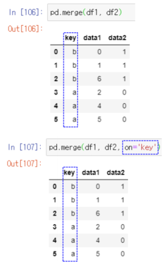
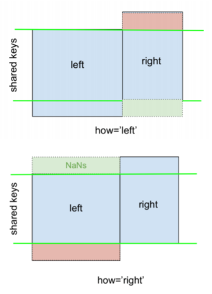

# 2020-06-26 Study

2020-06-26 금요일 수업 내용

> [교수님 파이썬 데이터 분석 및 시각화 git 바로가기](https://github.com/lee7py/Pydata-ANS-VIS)

## 파이썬 라이브러리를 활용한 데이터 분석 ; 8장 데이터 준비하기 : 조인, 병합, 변형  

### 다중 색인, 조인 병합, 변형  

- **데이터를 합치고 재배열 필요**  

    원천 데이터는 분석하기 어려운 형태로 기록되어 제공  

- **주요 내용**  

    - 계층 색인(다중 색인) ; **Multi-index**  
    - 데이터 합치기 ; **Merge**, **Join**, **Concat**, **Combine_first**  
    - 재형성과 피벗 ; **Stack**, **Unstack**, **Pivot**, **Melt**  

## 8장 데이터 준비하기 : 조인, 병합, 변형 <Multi-index>  

### 계층 색인(다중 인덱스)  

- **다중 인덱스(multi-index)를 설정: MultiIndex class**  

    - 행이나 열에 여러 계층을 가지는 인덱스  

        - 칼럼 ; 생성 시, columns 인수에 리스트 항목으로 리스트(행렬) 형태로 인덱스를 지정  

    - 열 인덱스들의 이름 지정  

        - columns 객체의 names 속성에 리스트를 넣어서 지정  

    

### 다중 (행) 인덱스  

- **index 인수**  

    - 리스트의 리스트(행렬) 형태로 인덱스를 넣으면  
    - 행 인덱스들의 이름 지정  
        - index 객체의 names 속성에 리스트를 넣어서 지정  

    

### 계층적 색인  

- **계층적 색인**  

    - 높은 차원의 테이블을 낮은 차원의 형식으로 다룰 수 있게 해주는 기능  

    

### 색인 중 내부 색인을 칼럼으로 변환  

- **Unstack**  

- **Stack**
    - 칼럼을 색인으로 변환

    

### 다중 색인의 생성

- **미리 생성해 재사용 가능**  

       

### 색인 계층의 순서 바꾸기  

- **swaplevel()**  

    - 데이터는 무관  

         

### 색인 정렬에 따른 자료 정렬  

- **sort_index()**

    - level: 정수나 이름 문자열 지정 가능  
    - axis: 기본 0이고 (행) 색인이며, 1이면 칼럼  

     

## 8장 데이터 준비하기: 조인, 병합, 변형 <set_index(), reset_index()>  

### (행) 인덱스 지정  

- **반드시 열만 지정**  

    - 기존의 열은 기본적으로 제거  

- **제거하지 않으려면**  

    - 인자 drop=False  

     

     

### reset_index()  

- **기존 인덱스를 열로 이동**  

    - 행 인덱스가 모두 칼럼으로 이동  

    - 결과의 인덱스는 정수 인덱스

    

## 8장 데이터 준비하기: 조인, 병합, 변형 ; 8.2 데이터 합치기  

### 데이터 합치기

- **데이터프레임 합치기**  

    - merge ; **하나 이상의 키로 데이터프레임의 row를 합치기**  

    - Join ; **인덱스로 데이터프레임의 row를 합치기**  

    - concat ; **하나의 축에 따라 '이어 붙이기'**  

    - combine_first ; **두 객체를 쪼개서 한 객체에서 누락된 데이터를 다른 객체에 있는 값으로 채우기**  

## Merge  

### 병합 개요 : 기본 연산, 내부 병합  

- **합치다 merge**  

    - 두 데이터 프레임의 공통 열 (혹은 인덱스)를 기준으로 두 개의 테이블을 합침  

    - 공통 키에 대한 합침  

        - **기본은 내부 병합** 

            교집합 공통 키인 모든 행 구성  

            공통 키가 없는 행은 제외  

    - 결과 열은 항상 두 데이터 프레임 모든 열의 합  

        - 왼쪽만 있는 열, 오른쪽만 있는 열 포함  

        - 공통 열은 하나만 포함  

     

> row를 가져올 때 어떻게 가져오느냐..? 가 그림이 표현해주는 것.  

### 병합 개요 : 외부 병합  

- **합치다 merge**  

    - 두 데이터 프레임의 공통 열 혹은 인덱스를 기준으로 두 개의 테이블을 합침  

    - 공통 키에 대한 합침  

        - **기본은 내부 병합** ; 교집합 공통 키인 모든 행 구성  

        - **외부 병합** ; 합집합 키인 모든 행 구성  

     

### merge

- **merge 기본**  

    - 두 데이터 프레임의 공통 열 혹은 인덱스를 기준으로 두 개의 테이블을 합침 ; **이 때 기준이 되는 열, 행의 데이터를 키(key)**  

    - 공통 열인 고객번호 열을 기준으로 데이터를 찾아서 합침 ; **기본적으로 양쪽 데이터프레임에 모두 키가 존재하는 데이터만 보여주는 inner join 방식을 사용**  

     

### how=

- **inner**

    - 키 ; **공통 열인 고객 번호 열**  

    - 기준으로 데이터를 찾아서 합침  

- **outer**  

    - 키 값이 한쪽에만 있어도 데이터를 보여줌  

     

> 데이터베이스 inner join, outer join과 비슷한 개념이라고 생각하면 훨씬 편하다.  

### 중복 열 지정 on=

- **공통인 열, key에서 교집합인 행만 표시**  

    

    

### 병합 방법 4가지  

- **inner, outer**  

    - 기본은 내부 병합 ( default는 inner)   

- **left**  

    - 왼쪽 키로만 구성  

- **right**  

    - 오른쪽 키로만 구성  

    

### how=  

- **left**  

    - 키 ; **공통 열인 고객번호 열**  
    
    - 왼쪽의 키로 구성된 모든 행 선택  

- **right**  

    - 오른쪽의 키로 구성된 모든 행 선택  

    

### 가능한 조합 구성  

- **키 값이 같은 데이터가 여러 개 있는 경우**  

    - 있을 수 있는 모든 경우의 수를 따져서 조합을 구성  

    - 키 값 setosa  

        - (키 값 setosa) 대해 왼쪽 데이터프레임은 1.4와 1.3이라는 2개의 데이터  

        - 오른쪽 데이터 프레임에 0.4라는 1개의 데이터  

        - 병합된 데이터에는 setora가 (1.4, 0.4), (1.3, 0.4) 두 개의 데이터가 생김 

    - 키 값 virginica  

        - 왼쪽 데이터 프레임에 1.5와 1.3이라는 2개의 데이터  

        - 오른쪽 데이터 프레임에 0.3와 0.5라는 2개의 데이터  

        - 2개와 2개의 조합에 의해 (2*2) 4가지 값  

    

> 사진을 참고하고 글을 읽자.  

### 인자 how=outer  

- **left**

    - 왼쪽의 모든 행을 포함  

- **right**  

    - 오른쪽의 모든 행을 포함  

- **outer**  

    - 모든 합집합  

    

### 인자 how=left  

### 인자 how=inner  

  

### 공통 기준열 명시 on=  

- **on 인수로 기준 열을 명시**  

    - 두 데이터프레임에서 이름이 같은 열은 모두 키  

    - 만약 이름이 같아도 키가 되면 안되는 열이 있다면 on으로 지정  

- **예제**  

    - 첫 번째 데이터프레임의 "데이터" ; **실제로는 금액을 나타내는 데이터**  

    - 두 번째 데이터프레임의 "데이터" ; **실제로는 성별을 나타내는 데이터**  

    - 이름이 같아도 다른 데이터 ; **따라서 이 열은 기준 열이 되면 안됨**  

    - 기준(키) 열이 아니면서 이름이 같은 열에는 _x 또는 _y 와 같은 접미사가 붙음  

    

### 인자 left_on= / right_on=  

- **left_on, right_on 인수를 사용하여 기준 열을 명시**  

    - 만일 키가 되는 기준열의 이름이 두 데이터프레임에서 다르다면 ; **다음처럼 열 이름이 다르면 모두 구성**  

    

    

### 좌우의 키를 지정, left_on= / right_on=  

    내부 조인을 수행해 교집합인 결과를 반환  

### 인자 left_index= / right_index=  

- **일반 데이터 열이 아닌 인덱스를 기준 열로 사용하려면**  

    - left_index 또는 right_index 인수를 True로 설정  

    

### 교재 예제 p.321  

### 여러 키의 공통으로 병합  

### 열 이름이 같지만 키에서 제외  

- **각각의 열이 결과 데이터프레임에 추가되려면**  

    - 열 이름 수정이 필요  

        - 자동으로 _x, _y가 왼쪽 오른쪽 이름 뒤에 붙음  

    - pd.merge(left, right, on = ['A', 'B'])  

    

### 병합된 동일 칼럼 이름 재설정: 옵션 suffixes  

- **기본**  

    - 이름_x, 이름_y  

    - suffixes로 지정 가능  

    

     

### merge()의 인자 목록  

- **pd.merge(...)**  

     

### Merge 요약  

 