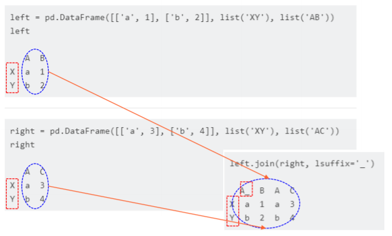

# 2020-07-02 Study

2020-07-02 금요일 수업 내용

> [교수님 파이썬 데이터 분석 및 시각화 git 바로가기](https://github.com/lee7py/Pydata-ANS-VIS)

## 파이썬 라이브러리를 활용한 데이터 분석 ; 8장 데이터 준비하기 : 조인, 병합, 변형  

### 다중 색인, 조인 병합, 변형  

- **데이터를 합치고 재배열 필요**  

    원천 데이터는 분석하기 어려운 형태로 기록되어 제공  

- **주요 내용**  

    - 계층 색인(다중 색인) ; **Multi-index**  
    - 데이터 합치기 ; **Merge**, **Join**, **Concat**, **Combine_first**  
    - 재형성과 피벗 ; **Stack**, **Unstack**, **Pivot**, **Melt**  

## 8장 데이터 준비하기 : 조인, 병합, 변형 <Multi-index>  

### 계층 색인(다중 인덱스)  

- **다중 인덱스(multi-index)를 설정: MultiIndex class**  

    - 행이나 열에 여러 계층을 가지는 인덱스  

        - 칼럼 ; 생성 시, columns 인수에 리스트 항목으로 리스트(행렬) 형태로 인덱스를 지정  

    - 열 인덱스들의 이름 지정  

        - columns 객체의 names 속성에 리스트를 넣어서 지정  

    

### 다중 (행) 인덱스  

- **index 인수**  

    - 리스트의 리스트(행렬) 형태로 인덱스를 넣으면  
    - 행 인덱스들의 이름 지정  
        - index 객체의 names 속성에 리스트를 넣어서 지정  

    

### 계층적 색인  

- **계층적 색인**  

    - 높은 차원의 테이블을 낮은 차원의 형식으로 다룰 수 있게 해주는 기능  

    

### 색인 중 내부 색인을 칼럼으로 변환  

- **Unstack**  

- **Stack**
    - 칼럼을 색인으로 변환

    

### 다중 색인의 생성

- **미리 생성해 재사용 가능**  

       

### 색인 계층의 순서 바꾸기  

- **swaplevel()**  

    - 데이터는 무관  

         

### 색인 정렬에 따른 자료 정렬  

- **sort_index()**

    - level: 정수나 이름 문자열 지정 가능  
    - axis: 기본 0이고 (행) 색인이며, 1이면 칼럼  

     

## 8장 데이터 준비하기: 조인, 병합, 변형 <set_index(), reset_index()>  

### (행) 인덱스 지정  

- **반드시 열만 지정**  

    - 기존의 열은 기본적으로 제거  

- **제거하지 않으려면**  

    - 인자 drop=False  

     

     

### reset_index()  

- **기존 인덱스를 열로 이동**  

    - 행 인덱스가 모두 칼럼으로 이동  

    - 결과의 인덱스는 정수 인덱스

    

## 8장 데이터 준비하기: 조인, 병합, 변형 ; 8.2 데이터 합치기  

### 데이터 합치기

- **데이터프레임 합치기**  

    - merge ; **하나 이상의 키로 데이터프레임의 row를 합치기**  

    - Join ; **인덱스로 데이터프레임의 row를 합치기**  

    - concat ; **하나의 축에 따라 '이어 붙이기'**  

    - combine_first ; **두 객체를 쪼개서 한 객체에서 누락된 데이터를 다른 객체에 있는 값으로 채우기**  

## Merge  

### 병합 개요 : 기본 연산, 내부 병합  

- **합치다 merge**  

    - 두 데이터 프레임의 공통 열 (혹은 인덱스)를 기준으로 두 개의 테이블을 합침  

    - 공통 키에 대한 합침  

        - **기본은 내부 병합** 

            교집합 공통 키인 모든 행 구성  

            공통 키가 없는 행은 제외  

    - 결과 열은 항상 두 데이터 프레임 모든 열의 합  

        - 왼쪽만 있는 열, 오른쪽만 있는 열 포함  

        - 공통 열은 하나만 포함  

     

> row를 가져올 때 어떻게 가져오느냐..? 가 그림이 표현해주는 것.  

> merge는 공통인 열에 대해서 작업

### 병합 개요 : 외부 병합  

- **합치다 merge**  

    - 두 데이터 프레임의 공통 열 혹은 인덱스를 기준으로 두 개의 테이블을 합침  

    - 공통 키에 대한 합침  

        - **기본은 내부 병합** ; 교집합 공통 키인 모든 행 구성  

        - **외부 병합** ; 합집합 키인 모든 행 구성  

     

### merge

- **merge 기본**  

    - 두 데이터 프레임의 공통 열 혹은 인덱스를 기준으로 두 개의 테이블을 합침 ; **이 때 기준이 되는 열, 행의 데이터를 키(key)**  

    - 공통 열인 고객번호 열을 기준으로 데이터를 찾아서 합침 ; **기본적으로 양쪽 데이터프레임에 모두 키가 존재하는 데이터만 보여주는 inner join 방식을 사용**  

     

### how=

- **inner**

    - 키 ; **공통 열인 고객 번호 열**  

    - 기준으로 데이터를 찾아서 합침  

- **outer**  

    - 키 값이 한쪽에만 있어도 데이터를 보여줌  

     

> 데이터베이스 inner join, outer join과 비슷한 개념이라고 생각하면 훨씬 편하다.  

### 중복 열 지정 on=

- **공통인 열, key에서 교집합인 행만 표시**  

    

    

### 병합 방법 4가지  

- **inner, outer**  

    - 기본은 내부 병합 ( default는 inner)   

- **left**  

    - 왼쪽 키로만 구성  

- **right**  

    - 오른쪽 키로만 구성  

    

### how=  

- **left**  

    - 키 ; **공통 열인 고객번호 열**  
    
    - 왼쪽의 키로 구성된 모든 행 선택  

- **right**  

    - 오른쪽의 키로 구성된 모든 행 선택  

    

### 가능한 조합 구성  

- **키 값이 같은 데이터가 여러 개 있는 경우**  

    - 있을 수 있는 모든 경우의 수를 따져서 조합을 구성  

    - 키 값 setosa  

        - (키 값 setosa) 대해 왼쪽 데이터프레임은 1.4와 1.3이라는 2개의 데이터  

        - 오른쪽 데이터 프레임에 0.4라는 1개의 데이터  

        - 병합된 데이터에는 setora가 (1.4, 0.4), (1.3, 0.4) 두 개의 데이터가 생김 

    - 키 값 virginica  

        - 왼쪽 데이터 프레임에 1.5와 1.3이라는 2개의 데이터  

        - 오른쪽 데이터 프레임에 0.3와 0.5라는 2개의 데이터  

        - 2개와 2개의 조합에 의해 (2*2) 4가지 값  

    

> 사진을 참고하고 글을 읽자.  

### 인자 how=outer  

- **left**

    - 왼쪽의 모든 행을 포함  

- **right**  

    - 오른쪽의 모든 행을 포함  

- **outer**  

    - 모든 합집합  

    

### 인자 how=left  

### 인자 how=inner  

  

### 공통 기준열 명시 on=  

- **on 인수로 기준 열을 명시**  

    - 두 데이터프레임에서 이름이 같은 열은 모두 키  

    - 만약 이름이 같아도 키가 되면 안되는 열이 있다면 on으로 지정  

- **예제**  

    - 첫 번째 데이터프레임의 "데이터" ; **실제로는 금액을 나타내는 데이터**  

    - 두 번째 데이터프레임의 "데이터" ; **실제로는 성별을 나타내는 데이터**  

    - 이름이 같아도 다른 데이터 ; **따라서 이 열은 기준 열이 되면 안됨**  

    - 기준(키) 열이 아니면서 이름이 같은 열에는 _x 또는 _y 와 같은 접미사가 붙음  

    

### 인자 left_on= / right_on=  

- **left_on, right_on 인수를 사용하여 기준 열을 명시**  

    - 만일 키가 되는 기준열의 이름이 두 데이터프레임에서 다르다면 ; **다음처럼 열 이름이 다르면 모두 구성**  

    

    

### 좌우의 키를 지정, left_on= / right_on=  

    내부 조인을 수행해 교집합인 결과를 반환  

### 인자 left_index= / right_index=  

- **일반 데이터 열이 아닌 인덱스를 기준 열로 사용하려면**  

    - left_index 또는 right_index 인수를 True로 설정  

    

### 교재 예제 p.321  

### 여러 키의 공통으로 병합  

### 열 이름이 같지만 키에서 제외  

- **각각의 열이 결과 데이터프레임에 추가되려면**  

    - 열 이름 수정이 필요  

        - 자동으로 _x, _y가 왼쪽 오른쪽 이름 뒤에 붙음  

    - pd.merge(left, right, on = ['A', 'B'])  

    

### 병합된 동일 칼럼 이름 재설정: 옵션 suffixes  

- **기본**  

    - 이름_x, 이름_y  

    - suffixes로 지정 가능  

    

     

### merge()의 인자 목록  

- **pd.merge(...)**  

     

### Merge 요약  

 

## 8장 데이터 준비하기 : 조인, 병합, 변형 ; join

### 조인 개요  

- **색인으로 병합(merge)**  

    - 컬럼은 겹치지 않게 모든 칼럼은 추가, 빠지는 열이 없음 ; **이름이 겹치면 열 이름 접미어 추가**  

    - 각 행은 행 색인으로 병합, 옵션 how로 4가지 지정  

- **구문**  

    - ``DateFrame.join(self, other, on=None, how= 'left', lsuffix='', rsuffix='', sort=False) ; **lsuffix와 rsuffix는 자동으로 지정이 안되니 직접 지정해야 한다.**
        
        - **how : 결과의 색인 선택 기준**  
        - **lsuffix : 중복되는 열의 왼쪽 열이름, 접미어 지정**  
        - **sort : 조인 키에 의한 정렬, 기본은 안됨**  

      

### 조인 방법 : how=

- **left(default)**  

    왼쪽 데이터프레임의 색인(왼쪽 색인) 모두 사용하여 병합  

- **right**

    오른쪽 데이터프레임의 색인 모두 사용하여 병합  

- **inner**  

    두 데이터프레임의 공통된 색인만을 사용하여 병합(교집합)

- **outer**  

    두 데이터프레임의 색인 모두 사용하여 병합 (합집합)  

   

### 조인 이해  

- **Join**  

    - 각각의 인덱스(행 색인)를 기반으로 데이터 프레임과 결합  

        - 겹치는 열이 있으면 join은 왼쪽 데이터프레임에서 겹치는 열 이름에 접미사(_)를 추가 ; 인자 lsuffix  

    

### 외부 조인  

- **색인이 추가되고 열도 모두 추가되어 5 개의 열**  

   

### 교재 p.324  

- **외부 조인: 모든 합집합**  

   

### 왼쪽의 키(인덱스 지정) on=  

- **옵션 on=**  

    - 왼쪽 데이터 프레임의 특정한 열을 조인 키로 사용  
    - 여전히 오른쪽은 기본 인덱스를 사용  

- **결과의 색인**  

    - 왼쪽 조인이므로 왼쪽의 인덱스로  

   

### 왼쪽의 키(인덱스 지정) on=  

- **왼쪽 데이터프레임의 키를 지정하여 왼쪽 조인**  

    - 오른쪽은 기본 색인 사용  
    - how가 없으므로 왼쪽 조인(색인이 왼쪽만 구성)  

     

### 인자 없는 조인  

- **기본은 두 데이터프레임의 색인 대 색인으로 병합**  

    - How가 없으므로 왼쪽 조인 ; **왼쪽의 색인 만을 사용**  

   

### 여러 개를 병합  

- **왼쪽 조인**

    - 오른쪽 인자에 리스트로 활용  

     

- **외부 조인**  

    - 오른쪽 인자에 리스트로 활용, 모든 행과 열은 합집합  

     

### 판다스 홈 예제  

 

### 왼쪽 키를 on으로 지정  

- **지정한 열을 색인으로 사용해 join**  

    - 이 지정 열이 그대로 결과에 열로 사용됨.  

      

## 8장 데이터 준비하기: 조인, 병합, 변형 ; concat, append  

### Pandas concat()  

- **'이어 붙히기'**  

    - 두 데이터프레임을 무조건 세로로 '이어 붙히기'  

        - 구조가 같으면 이해가 쉬움  
        - 구조가 다르다면?  

       

### 축 따라 이어 붙히기  

- **이어 붙히기(concatenate)**  

    - Pandas에서는 concat()  
    - Numpy의 concatenate() 함수  

- **제일 먼저 고민**  

    - 기본은 행을 따라 붙히기  
    - 어느 축을 따라 붙힐 것인가?  
        - 행 또는 열   
        - 기본인 인자 axis=0 ; 세로로 행을 따라 붙히기  
        - axis=1 ; 가로로 열을 따라 붙히기  

      

### 기본은 축: 행 중심  

- **기본은 행(세로)으로 연결**  

    

    
    

### 인자 axis=1  

- **무조건 이어 붙히는 방식**  

    - 없는 값은 pd.na  

    

    

### 이어 붙힌 이후에 겹치는 행과 열을 처리 방법은?  

- **axis=0인 경우**  

    - 행 축으로 모두 이어 붙히고  
    - default: 칼럼은 합집합으로 구성 ; **join = 'outer'**  
    - 칼럼을 교집합으로만 구성하려면 ; **join = 'inner'**  

- **axis=1인 경우**  

    - 열 축으로 모두 이어 붙히고  
    - default: 행은 합집합으로 구성 ; **join = 'outer'**  
    - 행을 교집합으로만 구성하려면 ; **join = 'inner'**  

### concat axis=0  

- **pandas.concat(...)**  

    - pandas.concat(objs, axis=0, join='outer', join_axes=None, ignore_index=False, keys=None, levels=None, names=None, verify_integrity=False, sort=None, copy=True)  

- **합치는 축. 기본이 세로, 행 축에 따라 무조건 '이어 붙힌다'라는 개념**  

    - axis=0 ; **인덱스(행)은 모두 추가**  
    - 열 기본(join=outer) : 열도 합집합  
        - 공통 열은 하나로  
        - 다른 열은 모두 추가  

    - 옵션 join=inner  
        - 공통인 열만  

      

### concat axis=1  

- **합치는 축, 열에 따라, 가로로 무조건 '이어 붙히고'**  

    - axis=1  
    - 열은 모든 열을 추가하고  

- **행의 조인 방법 지정**  

    - join=inner ; **행은 공통인 것만 선택**  
    - join=outer (default) 
        - **행은 공통인 것은 하나로**  
        - **다른 것은 모두 추가**  

      

### 시리즈의 concat  

- **기준(key)을 사용하지 않고 단순히 데이터를 연결(concatenate)**  

    - 기본적으로는 위/아래로 데이터 행을 연결 ; **단순히 두 시리즈나 데이터프레임을 연결하기 때문에 인덱스 값이 중복 가능**  

      

     

### 기본은 세로로 붙히기  

- **default, axis=1**  

      

### axis=1  

- **만약 옆으로 데이터 열을 연결하고 싶으면**  

    - axis=1로 인수를 설정 ; **다른 것은 모두 추가**  

    - 행은 기본이 join='outer' ; **행은 공통인 것은 하나, 나머지는 모두 추가**  

    

### 인자 join  

- **axis=1**  

    - 가로로 붙히기  
    - default ; outer  
    - join=inner ; **공통인 인덱스만**  

    

      

### 인자 keys=  

- **이어 붙힌 축에 대한 색인을 생성**  

    - 계층적 색인이 됨  

      

### 인자 ignore_index  

- **기본은 False**  
    
    - ignore_index=true ; 이어 붙힌 축의 색인을 유지하지 않고 새로운 색인을 생성  

    

    

### df1.append(df2)  

- **df1과 df2를 행에 따라 붙히기**  

    - df1에 없는 열은 추가  
    - Pandas concat()과 동일, axis=0  

    

    

> multi-index-example66는 시험문제로 나온다. 둘이 같다라는 것만 알아두자!  

### 이어 붙히기 concat() 요약  

- **기본 축 axis=0**  

    - 행을 모두 이어 붙히고  
    - 열은 기본이 합집합으로 ; **옵션 join = 'outer'**  
    - 공통인 열만 ; **옵션 join = 'inner'**  

- **축 axis=1**  

    - 열은 모두 이어 붙히고  
    - 행은 기본이 합집합으로 ; **옵션 join = 'outer'**  
    - 공통인 행만 ; **옵션 join = 'inner'**  

    

## 8장 데이터 준비하기 : 조인, 병합, 변형 ; combine_first  

### 겹치는 데이터 합치기  

- **a.combine_first(b)**  
    
    - 인덱스에 맞게(행에 대해)  

        - a가 nan가 아니면 자신, nan이면 b,  
        - 남은 b의 것 추가하여, 인덱스로 정렬  

    

        

### 데이터프레임 행과 열에 대해서도 작동  

## 8장 데이터 준비하기 : 조인, 병합, 변형 ; stack unstack  

### 재형성과 피벗  

- **계층적 색인으로 재형성**  

    - index와 columns 사이의 이동  
    - Stack ; **index <= columns**  
    - Unstack ; **index => columns**  

    

- **긴 형식에서 넓은 형식으로**  

    - Pivot  

- **넓은 형식에서 긴 형식으로**  

    - Melt  

    

### Stack과 Unstack의 사전적 의미  

- **stack을 영어사전에서 찾아보면**  

    - stack

        - ~ (sth)(up) (깔끔하게 정돈하여) 쌓다[포개다]; 쌓이다, 포개지다  
        - ~ sth (with sth) (어떤 곳에 물건을 쌓아서) 채우다  

- **Stack**  

    - (위에서 아래로 길게, 높게) 쌓는 것이면  

- **Unstack**  

    - 옆으로 늘어 놓는 것(왼쪽에서 오른쪽으로 넓게)라도 생각  

- **용어 정리**  

    - Index == 인덱스 == 행 색인(인덱스)  
    - Columns == 열 == 열 색인(인덱스)  

### stack과 unstack  

- **열 인덱스를 행 인덱스로 바꾸거나 반대로 행 인덱스를 바꾸는 작업**  

    - stack(): 데이터의 칼럼을 row로 회전  

        - **열 인덱스 -> 행 인덱스로 변환**  
        - **열 인덱스가 반시계 방향으로 90도 회전한 것과 비슷한 모양**  

    - unstack(): row를 column으로 회전  

        - **행 인덱스 -> 열 인덱스로 변환**  
        - **마찬가지로 실행하면 행 인덱스가 반시계 방향으로 90도 회전한 것과 비슷**  

    - 인덱스를 지정 방법  

        - **문자열 이름과 순서를 표시하는 숫자 인덱스를 모두 사용 가능**  

      

### Reshaping by stacking  

- **Stack: 열 레이블 => 행 인덱스로 이동**  

    - stack: "pivot" a level of the (possible hierarchical) column labels, returning a DataFrame with an index with a new inner-most level of row labels.  

        - **(계층적) 열 레이블 수준을 "피벗"(회전)하여 가장 안쪽의 새로운 행 레이블의 인덱스 형태의 DataFrame을 반환**  

    
    

### 스택: 열 레이블 => 행 인덱스로 이동  

- **열의 레이블이 하나 줄어 행의 인덱스로 이동**  

    - "rotates" or pivots from the columns in the data to the rows  

    

### Reshaping by unstacking  

- **Unstack: 행 인덱스 => 열 레이블로 이동**  

    - unstack: (inverse operation of stack) "pivot" a level of the (possibly hierarchical) row index to the column axis, producing a reshaped DataFrame with a new inner most level of column labels.  

        - **unstack: (stack 역연산) (가급적 계층적) 행 인덱스의 레벨을 컬럼 축으로 "피벗"(회전)해 새로운 가장 안쪽 레벨의 컬럼 레이블로 재구성된 DataFrame을 반환**  

    

### unstack(색인 첨자 번호)  

- **다중 색인에서 첨자로 색인을 지정**  

      

### Unstack  

- **계층적 색인의 시리즈에서 다시 DataFrame을 반환(가로로 넓어짐)**  

    - 가장 안쪽부터(가장 큰 첨자 숫자) 열로 지정  

      

    - 레벨 숫자나 이름으로 단계를 지정 가능  

      

### Unstack, stack  

- **Unstack: 지정한 인덱스 state를 열로 지정**  

      

- **stack: 지정한 열 side를 인덱스로**  

### 색인과 칼럼이 모두 계층적 색인  

- **행과 열이 모두 2층인 계층적 색인**  

      

### DataFrame.stack('열이름')  

- **열 => 색인으로**  

      

### DataFrame.stack(열첨자)  

- **열 => 색인으로**  

      

### DataFrame.unstack('색인이름')  

- **색인 => 열로**  

      

### DataFrame.unstack(열첨자)  

- **색인 => 열로**  

      

### 요약 정리 stack unstack  

## 8장 데이터 준비하기: 조인, 병합, 변형 ; Pivot, Melt  

### pivot 개요  

- **pivot 테이블**  

    - 데이터 열 중에서 두 개의 열을 각각 행 인덱스, 열 인덱스로 사용  

        - **맞는 데이터를 저장하여 펼쳐놓은 것**

    

