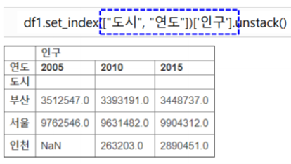
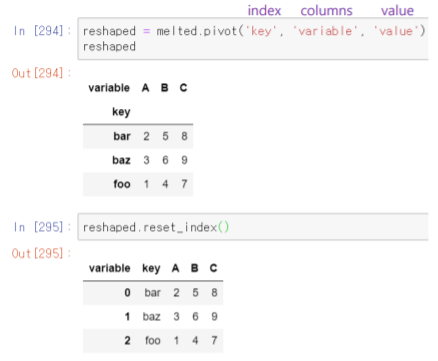

# 2020-07-03 Study

2020-07-03 금요일 수업 내용

> [교수님 파이썬 데이터 분석 및 시각화 git 바로가기](https://github.com/lee7py/Pydata-ANS-VIS)


## 8장 데이터 준비하기: 조인, 병합, 변형 ; Pivot, Melt  


### pivot 개요  

- **pivot 테이블**  

    - 데이터 열 중에서 두 개의 열을 각각 행 인덱스, 열 인덱스로 사용  

        - **맞는 데이터를 저장하여 펼쳐놓은 것**  

- **df1.pivot(index, columns, values)**  

    - index, cloumns: 각각 인덱스, 열 인덱스로 사용할 이름  

    - values: 데이터로 사용할 열 이름을 지정  

        - **행 인덱스의 라벨 값이 첫번째 키의 값과 같고 열 인덱스의 라벨 값이 두번째 키의 값과 같은 데이터를 찾아서 해당 칸에 저장**  

        - **만약 주어진 데이터가 존재하지 않으면 해당 칸에 NaN 값 저장**  

        


### 3개의 인자  

- **index='cust_id', columns='prod_cd', values**

    


### Pivot 옵션  

- **옵션 index**  
    
    - 인덱스 지정 ; **지정하지 않으면 원래 인덱스 사용**  

- **옵션 columns**

    - 열로 지정  

- **옵션 values**  

    - 값 지정 ; **지정하지 않으면 남아있는 모든 열이 다중 색인으로 열 이름이 들어감**  

- **옵션에 없는 열**  

    - 지역은 제거  

    


### pivot == set_index().unstack()  

- **pivot 테이블**

    - set_index 명령과 unstack 명령을 사용해서 생성도 가능  

        - **df.pivot(index, columns, values)**  
        - **df.set_index([index, columns])[values].unstack()**  

    - set_index()  

        - **지정한 열을 행 인덱스로 지정**  

    

    

    
    


### 녹이는 melt() 개요  

- **데이터프레임의 컬럼 이름 자체를 한 컬럼 variable에 모두 내리고 해당하는 값을 다른 칼럼 value에 따로 빼는 것**  

    - 변수 id_vars를 기준으로 원래 데이터프레임에 있던 여러 개의 칼럼 이름을 'variable' 칼럼에 위에서 아래로 길게 쌓아놓고, 'value' 칼럼에 id_vars와 variable에 해당하는 값을 넣어주는 식으로 데이터를 다시 생성  

        - **기존 index는 상관 없이 반환 값의 인덱스는 기본 정수 인덱스 RangeIndex**  

      


### 메소드 melt 인자  

- **DataFrame.melt(self, id_vars=None, value_vars=None, var_name=None, value_name='value', col_level=None**  

    - DataFrame를 와이드 형식에서 긴 형식으로 unpivot: 모양이 길어짐  

        - **선택적으로 식별자 집합(identifiers set)을 남김**  

            - 열을 그대로 유지하는 칼럼  
            - Unpivot a DataFrame from wide to long format, optionally leaving identifiers set.  

        - **식별자 변수(id_vars)에 지정된 여러 열을 유지하는 형태의 DataFrame으로 변환**  

            - 기본적으로 식별자 변수 id_vars 외의 모든 열은 두 개의 열인 'variable' 과 'value'로 'unpivoluted'됨  
            - 옵션으로 value_vars에 지정된 열만도 가능  

        - **단 두개의 열(non-identifier columns)인 'variable'과 'valuue'만 남음**  

            - 이 두 열의 이름은 각각 var_name, value_name으로 수정 가능  

      


### 두 개의 열로, 세로로 길게: melt()  

- **여러 칼럼을 두 개 열 variable과 value로 병합하고 긴 형태로 재구성**  

    - 인자가 없으면 모든 열을 variable과 value로 구성  
    - 인자 id_vars  
    - 인자 value_vars  
    - 인자 var_name, value_name  

      

      


### 함수 melt 인자 활용  

- **넓은 형식에서 긴 형식으로**  

    - 주요 인자  

        - id_vars: **하나 이상의 열을 식별자 집합으로 지정**  
        - value_vars: **열 variable과 value에 사용할 열 들을 지정**

            없으면 id_vars 외의 다른 열은 모두 variable과 value로 지정  

- **결과**  

    - id_vars와  'variable'와 'value' 열만 남음 

        - **'variable'은 열 이름이 저장**       

            variable 열 이름은 var_name으로 수정 가능  

        - **'value'에는 실제 값이 저장**  

            value 열 이름은 value_name으로 수정 가능  

     


### 칼럼 이름 수정 인자  

- **함수**  

    ```py
    pd.melt(
        frame: pandas.core.frame.DataFrame,
        id_vars=None,
        value_vars=None,
        var_name=None,
        value_name='value',
        col_level=None,
    )

    # variable 열은 var_name으로 수정 가능  
    # value 열은 value_name으로 수정 가능  
    ```  
      


### 구분자 인자: id_vars  

- **id_vars = ['key']**  

    - id_vars를 식별자 집합으로 사용  

    - 다른 2개의 열을 열 variable과 value에 저장 ; **열 이름과 값으로 지정해 사용**  

          


### 인자 value_vars  

- **value_vars: tuple, list, or ndarray, optional**  

    - 데이터 값으로 사용할 칼럼을 지정  

        - **열 variable에 값으로 사용되는 column 이름**  

          


### 식별자 변수 없이도 가능  

- **인자 id_vars 없이**  

    - 열 variable, value만 보임  

        


### pivot으로 원래의 형식으로 복원  

- **원 df를 녹인(melt) 후**  

    - 다시 pivot하여

        ``reset_index()``

        

        


### 변형 메소드 melt() 요약  

    


> [jupyter notebook 연습공부한 내용 바로가기](../PycharmExample/200703/myNumPandas.ipynb) 에 **merge, join, concat 등 연습** 참고해서 공부.


## 파이썬 라이브러리를 활용한 데이터 분석 : 9장 그래프와 시각화 ; Matplotlib  


### Matplotlib 개요  

- **2D 그래프를 위한 데스크탑 패키지**  

    - 파이썬에서 자료를 차트(chart)나 플롯(plot)으로 시각화(visualaization)하는 패키지  

    - 정형화된 차트나 플롯 이외에도 저수준 API를 사용한 다양한 시각화 기능을 제공  

        - **라인 플롯(line plot)**
        - **스캐터 플롯(scatter plot)**  
        - **컨투어 플롯(contour plot)**  
        - **서피스 플롯(surface plot)**  
        - **바 차트(bar chart)**  
        - **히스토그램(histogram)**  
        - **박스 플롯(box plot)**  

    - 2002년 존 헌터가 시작  


    - [Matplotlib 갤러리 웹 사이트 바로가기](http://matplotlib.org/gallery.html)


### 주피터 노트북 매직 명령어  

- **%matplotlib inline**  

    그림을 셀 아래에 결과로 삽입  

- **%matplotlib notebook**  

    대화형 시각화 도구

    


### API  

- **plot()**  

    - 가장 간단한 plot은 선을 그리는 라인 플롯 (line plot)  

    - 라인 플롯 (line plot)은 데이터가 시간, 순서 등에 따라 어떻게 변화하는지 보여주기 위해 사용  

    > [참고 공식사이트](https://matplotlib.org/api/pyplot_api.html#Matplotlib.pyplot.plot)  


### 한글 지원  

- **지원 폰트 확인 후**  

    - 지정  

      


### Figure와 subplot  

- **Figure 개요**  

    - 그려지는 그래프가 figure 객체 내에 존재, 그림을 그리는 종이라고 이해  

    - figsize=(10, 6)  

        - **Figure 생성**
        - **figure 명령을 사용하여 그 반환 값으로 Figure 객체를 얻음**    

            일반적인 plot 명령 등을 실행하면 자동으로 Figure를 생성해 주기 때문에 일반적으로는 figure 명령을 잘 사용하지 않음  

        - **figure 명령을 명시적으로 사용하는 경우**  

            여러 개의 윈도우를 동시에 띄워야 하거나(line plot이 아닌 경우), Jupyter 노트북 등에서 (line plot의 경우) 그림의 크기를 설정할 경우  

- **show()**  

    - 시각화 명령을 실제로 차트로 렌더링(rendering)하고 마우스 움직임 등의 이벤트를 기다리라는 지시  

    - 주피터 노트북에서는 셀 단위로 플롯 명령을 자동 렌더링 해주므로 show 명령이 필요 없음  

    - 일반 파이썬 인터프리터로 가동되는 경우를 대비하여 항상 마지막에 실행  


### 그림 구조  

- **Figure는 그림이 그려지는 캔버스나 종이**  

    - Axes는 하나의 플롯, 그리고 Axis는 가로축이나 세로축 등의 축  

     


### Subplot 개요  

- **그리드(grid) 형태의 Axes 객체들을 생성**  

    - Figure 안에 있는 각각의 plot은 Axes 라고 불리는 객체  

        - **Figure 내부에 행렬(matrix) 형태의 여러 그림이 있으며 이를 Axes라 함**  

- **Axes: 내부의 subplot**  

    ax1 = fig.add_subplot(2, 2, 1) # 크기 2 x 2, 4개의 그림 중 1번 그림  
    ax2 = fig.add_subplot(2, 2, 2)
    ax3 = fig.add_subplot(2, 2, 3)  

      


### plt.subplot  

- **그리드(grid) 형태의 Axes 객체들을 생성**  

    - Figure 안에 있는 각각의 plot은 Axes라고 불리는 객체  

        - **Figure 내부에 행렬(matrix) 형태의 여러 그림이 있으며 이를 Axes 라 함**  


- **ax1 = plt.subplot(2, 1, 1)**  

    - ax1 = plt.subplot('211') 로도 가능  

    - subplot(m, n, number)  

    - 3 개의 인수 
        - m, n ; 전체 그리드 행렬의 모양을 지시하는 두 숫자  

        - number ; 인수가 4개 중 어느 것인지를 의미하는 숫자 / 첫번째 plot을 가리키는 숫자가 0이 아니라 1임에 주의  

      


### 서브플롯 예  


### plt.subplot(m, n)  

- **메소드**  

    - matplotlib.pyplot.subplots(nrows=1, ncols=1, sharex=False, sharey=False, squeeze=True, subplot_kw=None, gridspec_kw=None, **fig_kw)  

    - 특정한 배치에 맞추어 여러 개의 서브플롯을 포함하는 figure를 생성  

        - 인자 sharex=True, sharey=True ; 각 축의 인자를 하나로 공유  

    
### 서브플롯 예  

  


### sub plot 간의 간격 조절하기  

- **plt.subplots_adjust(wspace=0, hspace=.3)**  

    - 서브플롯 간의 간격을 설정  

        - 비율로 명시 ; .3은 30%의 공간 비우기

      


### 색상 마커 선 스타일  

- **ax.plot(x, y, 'g--')**  

    - ax.plot(x, y, linestyle='--', color='g')  

      


### 옵션 drawstyle  

- **일정한 간격으로 지정된 지점을 연결**  

    - drawstyle or ds: {'default, 'steps', 'steps-pre', 'steps-mid', 'steps-post'}  

        - default: 'default'  

    


### 그래프를 꾸미는 방법 2가지 - 1  

- **방법 1**  

    - pyplot()으로 순차적으로  

        - **ax = fig.add_subplot(1, 1, 1)**  

    - 제공 API 사용  

        - **set_title()**  
        - **set_xlabel()**

      


### 그래프를 꾸미는 방법 2가지 - 2  

- **방법 2**  

    - 클래스 axes의 메소드 set() ; **여러 속성을 사전으로 지정**  

     


### 주석 달기  

- **matplotlib.pyplot.annotate(s, xy, *args, **kwargs)**  

    - ``ax.annotate(label, xy=(date, spx.asof(date) + 75),``
    - ``xytext=(date, spx.asof(date) + 225),``  
    - ``arrowprops=dict(facecolor='blue', headwidth=4, width=2, headlength=4),``  
    - ``horizontalalignment='left', verticalalignment='top')``  

        - **xy: 주석의 위치**  
        - **xytext: 주석 글자의 위치**  
        - **화살표는 xytext에서 xy로 그려짐**  

    
### 주석 화살표 그리기  

 


### 판다스 데이터 그리기  

- **시리즈**  

- **데이터프레임**  

     


### 데이터 프레임  

- **막대 그래프**  

    - index 이름이 범례 이름  

        


### 요일별 식당 인원 수 규모  

 


## 9장 그래프와 시각화 ; Seaborn  


### seaborn  

- **Series와 DataFrame 객체를 시각화하는 통계 그래픽 라이브러리**  

    - 마이클 와스콤이 개발  

    > [seaborn 공식홈페이지 바로가기](https://seaborn.pydata.org/)  


### Seaborn 패키지  

- **Matplotlib를 기반으로 다양한 색상 테마와 통계용 차트 등의 기능을 추가한 시각화 패키지**  

    - 기본적인 시각화 기능은 Matplotlib 패키지 기반  

    - 통계 기능은 Statsmodels 패키지에 의존  


### seaborn 그래프  

- **열**  

    - total_bill ; **팁이 포함된 총액**  
    - tip: ; **팁 액**  
    - smoker  
    - day  
    - time  
    - size ; **식사 인원**  
    - tip_pct ; **식비에서 팁의 비율**  

- **요일 별 팁 비율**  
    
    - x: 팁 비율    

        - **팁 비율의 평균**  
        - **가운데 직선** ; 95% 신뢰구간  

    - y: 요일  

- **해석**  

    - 일요일과 금요일에 팁 비율이 높음  

      


### 옵션 hue=  

- **내부 구분**  

    - hue='time'  

      


> 나머지는 교수님 강의 훑어보기  


> 시험 기본적으로 numpy, pandas 특징 등등... merge, join 등은 어려우니까 많이 공부합시다..
