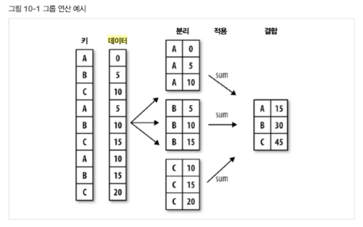

# 2020-07-09 Study

2020-07-09 금요일 수업 내용

> [교수님 파이썬 데이터 분석 및 시각화 git 바로가기](https://github.com/lee7py/Pydata-ANS-VIS)
 

## 파이썬 라이브러리를 활용한 데이터 분석 ; 10장 데이터 집계와 그룹 연산  

### 그룹 통계와 보고서 작성  

- **그룹 연산**  

    - 그룹으로 나누어 여러 총계량을 파악  

        - **연산 groupby()**

- **피벗테이블**  

    - 데이터를 하나 이상의 키(index)로 수집해서 분류해 열(columns)과 값(value)의 평균(옵션 aggfunc로 수정 가능)을 기술  

        - **연산 pivot_table()**  

- **주요 내용**  

    - 키로 판다스 객체를 여러 조각으로 나누기  
    - 그룹 요약 통계 계산: 합, 평균, 표준 편차, 사용자 정의 함수  
    - 피벗테이블 교차일람표 작성  
    - 변위치 분석 등  

### Python pandas의 groupby() 메카닉  

- **집단, 그룹별로 데이터를 집계, 요약하는 방법**  

    - split => apply(function) => combine  

        - **전체 데이터를 그룹 별로 나누고(split), 각 그룹벼롤 집계함수를 적용(apply)한 후, 그룹별 집계 결과를 하나로 합치는 단계를 거치게 됨**  

    - 분리  

        - 키를 기준으로 분리  
            
            axis = 0 or 1  

    - 적용  

        - 필요 함수의 적용  

    - 결합  

        - 함수를 적용한 결과를 객체에 결합  

      

> 나머지는 교수님 pdf 보고 공부..  

