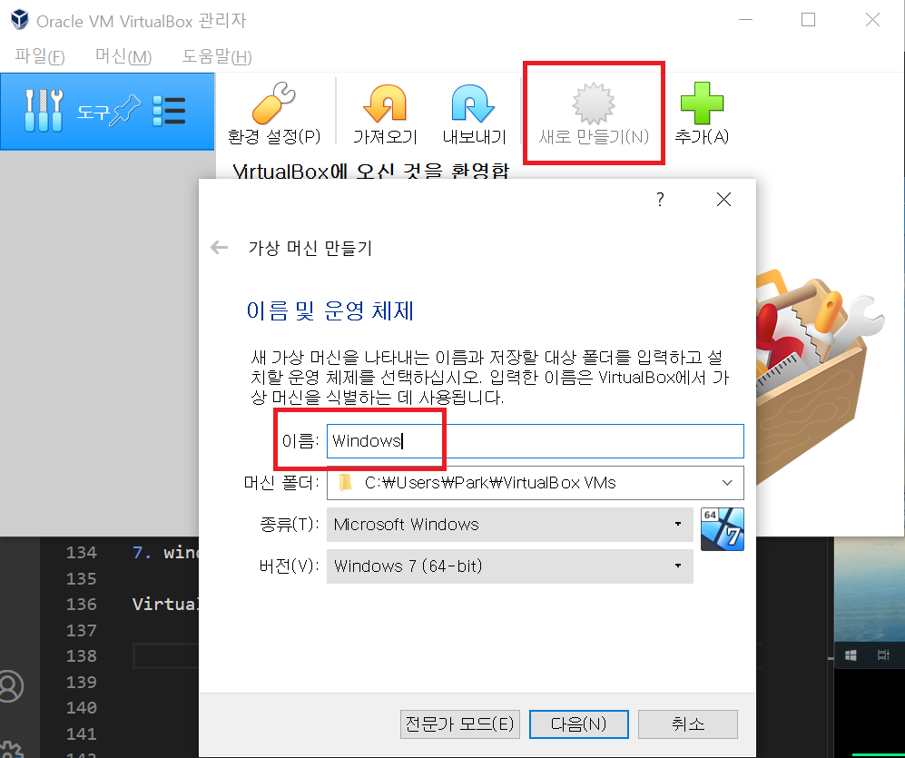
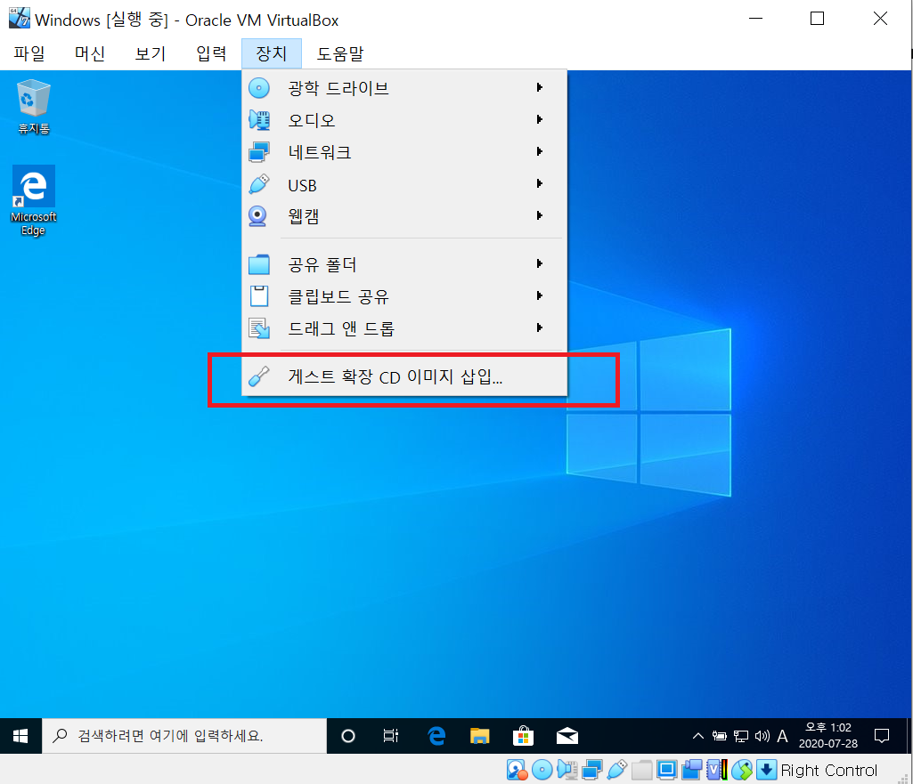
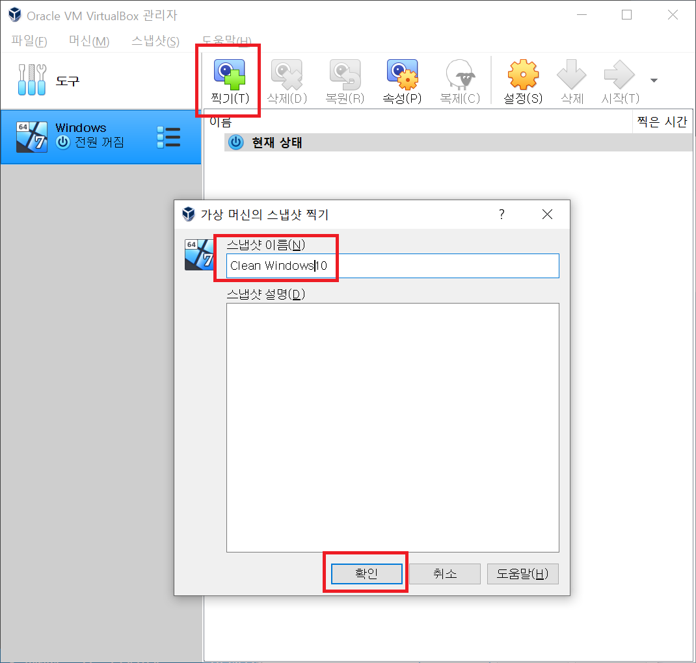

# 2020-07-28 Study

2020-07-28 화요일 온라인 수업 내용

## 데이터 처리 프로젝트  

데이터 처리 프로젝트는 DB를 이용해서 데이터를 처리하는 실습 위주로 구성  

### 학습 목표  

IT 기술에 기본이 되는 데이터베이스에 대한 개념을 학습하고 이를 관리하는 DBMS의 설치 및 조작에 대한 기본 내용을 학습.  

데이터 모델링 개념을 이해하고, 이를 DBMS와 연동하고 적용하는 기술을 배양한다.  

실사례 모델링을 통해서 DB에 적용하여 실무 감각을 배양 하고자 한다.

### 1. 데이터베이스 개요  

1. 데이터베이스와 데이터베이스 시스템

2. 데이터베이스 시스템의 발전  

3. 파일 시스템과 데이터베이스 관리 시스템  

4. 데이터베이스 시스템의 구성  


### 1. 5 데이터베이스와 데이터베이스 시스템 - 데이터베이스의 개념적 구조

- **외부 단계**  

    일반 사용자나 응용 프로그래머가 접근하는 계층으로 전체 데이터베이스 중에서 하나의 논리적인 부분을 의미  

    여러 개의 외부 스키마가 있을 수 있음  

    서브 스키마라고도 하며, 뷰(view)의 개념  

- **개념 단계**

    - 전체 데이터베이스의 정의를 의미  

    - 통합 조직별로 하나만 존재하며 DBA가 관리함  

    - 하나의 데이터베이스에는 하나의 개념 스키마가 있음  

- **내부 스키마**  

    - 물리적 저장 장치에 데이터베이스가 실제로 저장되는 방법의 표현  

    - 내부 스키마는 하나  

    - 인덱스, 데이터 레코드의 배치 방법, 데이터 압축 등에 관한 사항이 포함됨.  

- **데이터 독립성**  

    - 논리적 데이터 독립성

        - 외부 단계(외부 스키마)와 개념 단계(개념 스키마) 사이의 독립성  

        - 개념 스키마가 변경되어도 외부 스키마에는 영향을 미치지 않도록 지원  

        - 논리적 구조가 변경되어도 응용 프로그램에는 영향이 없도록 하는 개념  

    - 물리적 데이터 독립성  

        - 개념 단계(개념 스키마)와 내부 단계(내부 스키마) 사이의 독립성  

        - 저장장치 구조 변경과 같이 내부 스키마가 변경되어도 개념 스키마에 영향을 미치지 않도록 지원  

        - 성능 개선을 위하여 물리적 저장 장치를 재구성할 경우 개념 스키마나 응용 프로그램 같은 외부 스키마에 영향이 없음  

        - 물리적 독립성은 논리적 독립성보다 구현하기 쉬움  


### 2. DBMS 개요 및 실습 종류  

1. 데이터베이스 관리 시스템

2. OracleDB  

3. MySQL, MariaDB

4. SQLserver  

5. 티베로


### 3. VM 환경 구성(VirtualBox)

1. 가상환경 개념

2. 가상환경 종류

3. 윈도우즈 가상환경

4. 가상환경 프로그램 설치 (VirtualBox)

### 3.4 가상환경 프로그램 설치  

[VirtualBox 설치 바로가기](https://www.virtualbox.org/wiki/Downloads)  

1. 사이트에서 Windows hosts 클릭  

  

2. 확장팩도 설치

  

3. windows hosts로 설치 받은 압출파일을 압출 해제. 

> 그냥 따로 설정없이 default로 다 설치  

4. 설치 끝나면 실행 

  

5. 다운받은 확장팩 설정  

[파일] -> [환경설정] 을 클릭  

[확장]탭에서 [+]버튼을 눌러 확장팩 추가  

  

> 확장팩 추가 후에는 시스템 재부팅  

6. windows (clean한 window) 설치  

[window10 iso 파일 다운로드 바로가기](https://www.microsoft.com/ko-kr/software-download/windows10)  

해당 사이트에서 [지금 도구 다운로드] 클릭하여 windows 10 용 iso파일을 만들자.  

7. windows 가상 환경 만들기 

VirtualBox에서 [새로 만들기] 탭 클릭하여 다음과 같이 설정  

  

[다음]을 눌러 메모리 설정  

개발할 때 노트북이나 pc는 무조건 8GB 이상 되어야 원만하게 사용이 가능하다.  

따라서 다음과 같이 8GB의 절반인 4GB, 4096 사용.

  

다음으로 가상 디스크인 하드 디스크 설정  

동적으로 할당하니 80GB로 잡자..

  

이 후 생성한 화면

  

8. 만든 가상환경에 windows 이미지 연결  

아래 그림과 같이 만든 가상환경 window에서 설정을 누른 후 [저장소]탭으로 들어가 빨간 박스에서 보이는 [+]탭을 누른 후 다운받은 window10 이미지 파일 추가

  

추가한 화면 

  

추가하고 나서 위에 [시작]버튼 누르면 window 설치 실행

  

9. 가상머신에 게스트 확장 이미지 삽입

밑 그림과 같이 [게스트 확장 CD 이미지 삽입] 클릭

  

설치를 하고 [내 pc]로 이동하면 아래와 같이 CD 드라이브가 생성된 것을 확인.

  

CD 드라이브 설치.

> 설치는 아무런 설정없이 그냥 default로 놓고 계속 next를 눌러 진행.

> 설치가 다되면 리부팅  

10. 해당 윈도우 스냅샷 찍기

해당 가상머신을 종료한 후 아래와 같이 클릭

  

클릭한 후 [찍기]를 눌러 해당 스냅샷 이름을 설정해주고 [확인]

  


11. 가상머신 복제  

아래와 같이 누르면 virtualbox-example105 이미지와 같은 내용이 나온다.

  

> 복제하면 용량이 부족하니 그냥 하는걸루..  

12. 가상머신 네트워크 확인

아래 사진과 같이 가상머신의 [설정]에서 [네트워크]탭으로 직진.

  


- 가상머신의 NAT  

    - Guest -> Host : X
    - Guest <- Host : 포트 포워딩  
    - Guest1 <-> Guest2 : X
    - Guest -> Internet : O
    - Guest <- Internet : 포트 포워딩

    여기서 Host는 실제 pc나 노트북의 OS, Guest는 가상 머신 OS  


13. 가상머신에 Host(내 pc나 노트북 os)로 원격 접속 해보기

가상 머신에서 원격 접속 허용하게 해주기  

[내 PC] -> [속성] -> [고급 시스템 설정] -> [원격] -> [이 컴퓨터에 대한 원격 연결 허용]

  

이제 가상머신 설정에서 포트포워딩 설정

  

아래와 같이 설정

  

> 3389는 기본적인 원격접속 포트넘버, 13389는 host인 내가 이 포트로 접속하면 NAT에 의해서 Geust 포트넘버인 3389로 변환됨을 의미.  

내 pc에서 [원격 데스크탑 연결] app을 실행하여 아래와 같이 설정한 후 

  

연결한 Guest의 window id와 password를 입력하여 아래와 같이 접속 성공.

  


### 4. 시스템 콘솔 명령어 실습  

1. 콘솔창 실행

2. 관리자로 실행

3. 폰트 및 콘솔 환경 설정  

4. 폴더 이동, 생성, 삭제, 파일 목록  

### 5-1. MySQL 5.0 설치 및 실습

> MySQL 설치는 많이 해봤으므로 패스

1. 기본적인 내용을 확인하기 위해서 에디터인 notepad++ 설치

[notepad++ 설치 바로가기](https://notepad-plus-plus.org/downloads/v7.8.6/)  

> 영상에서 사용한 버전은 7.8.6 버전.  

사진과 같이 Download 64-bit x64에서 zip package를 설치.  

  

설치 후 실행하여 언어 설정. 아래와 같이 설정에서 English -> 한국어로 설정

  


2. MySQL 접속  

교수님은 MySQL 5.0 버전을 가지고 진행.

가장 기본적인 접속 명령어는

```bash
mysql -u root -p
```

하지만 아직 password를 안해준 상태이므로  

```bash
mysql -u root
```

로 접속  

3. 데이터베이스 확인

가지고있는 데이터베이스 확인

```sql
show databases;
```

4. 데이터베이스 사용  

현재 있는 데이터베이스 중 사용할 데이터베이스를 선택  

```sql
use mysql;          // 'mysql'이라는 데이터베이스를 사용하겠다란 의미
```  

5. 데이터베이스의 테이블 확인

현재 사용하고 있는 데이터베이스의 테이블을 확인

```sql
show tables;
```

6. 테이블의 스키마(내용)를 확인

현재 사용하고 있는 'mysql'이라는 데이터베이스의 table은 'user' 테이블의 스키마 확인

```sql
desc user;
```

7. 테이블의 데이터를 확인

'user' 테이블 안에 데이터 확인

```sql
select * from user;
```

8. localhost 패스워드 설정  

우선 localhost를 user테이블에서 확인

```sql
select host, user, password from user;
```

현재 패스워드가 없는 상태이므로 패스워드를 설정 

```sql
update user set password=password('하고싶은 패스워드') where user = 'root';
```

패스워드가 잘 들어갔는지 확인  

```sql
select host, user, password from user;
```

결과를 보면 password 탭에 값이 이상하게 인코딩되어서 들어간 것을 확인할 수가 있다.

> 패스워드는 본인만 알아야 하며 다른 모든 사람은 알 필요가 없으며, 알 수도 없다. 결국, 자동으로 암호화 된다.  

9. 패스워드 변경된 것을 반영.

패스워드 변경된 것 같이 시스템이 변경된 경우에는 변경된 사항을 적용시켜주어야 한다.

```sql
flush privileges;
```

10. 이 후 다시 재접속  

패스워드가 적용되었으므로  

```bash
> mysql -u root -p
```

명령어로 아까 설정했던 비밀번호로 접속이 되는 것을 확인.

### 5-2. MySQL 5.1 설치 및 실습

> MySQL 5.1도 5.0와 명령어가 똑같다.

### 5-3. MySQL 5.5 설치 및 실습

MySQL은 mysqld (서비스)가 자동으로 실행이 되질 않음.

따라서 CMD 창에서 서비스를 실행해주어야 한다.

```bash
// mysql 5.5 설치경로/bin 에서
> mysqld --install
> net start mysql   // mysql 실행
> net stop mysql    // mysql 중지
> sc delete mysql   // mysql 서비스 삭제
```  

> 그 외 명령어는 MySQL 5.0과 5.1과 동일.

### 5-4. MySQL 5.6 설치 및 실습  

MySQL 5.6은 서비스 등록 시 오류가 발생.

이 오류는 (Microsoft Visual C++ 2010 SP1 재배포 가능 패키지(x64))를 설치해주면 정상 동작.  

서비스 포트를 변경하려면? mysql 설치 폴더 밑에 my.init을 복사해놓은 다음 [mysqld]섹션 안에 [port = 주고싶은포트번호] 로 해서 저장한 다음 서비스를 재시작  

> 나머지 mysql 명령어는 5.0과 동일.  

### 5-5. MySQL 5.7 설치 및 실습  

MySQL 5.7은 installer로 설치를 안하고 그냥 설치할 시 초기화 작업이 필요.

```bash
// MySQL 5.7 폴더경로/bin 에서..

> mysqld --initialize-insecure
```

초기화 작업 시 그냥 기본 window만 설치된 곳에서는 에러가 발생.

에러는 5.6 버전시 에러와 똑같은 상황. --> VC++2013 재배포 가능 패키지 설치하면 끝  

그 다음 서비스 등록 필요

```bash
// MySQL 5.7 폴더경로/bin 에서..

> mysqld --install MySQL57      // MySQL57은 내가 설정한 alias
```

그 다음 서비스 실행  

```bash
// MySQL 5.7 폴더경로/bin 에서..

> net start mysql57     // 대소문자 구분 x
```

MySQL 5.7 부터는 접속한 후 password 설정부분에서 

``select host, user, password from user;`` 할 시

password는 없는 field 값이라고 나옴.

따라서 ``select host, user, plugin, authentication_string from user;`` 라고 해야한다. 

확인한 후 password 설정 시  

```sql
// 원래 다른 버전들
update user set password = password('하고싶은 비밀번호') where user= 'root';

// MySQL 5.7 버전
update user set authentication_string = password('하고싶은 비밀번호') where user = 'root';
```

변경사항 적용은 다른 버전과 동일

```sql
flush privileges;
```
