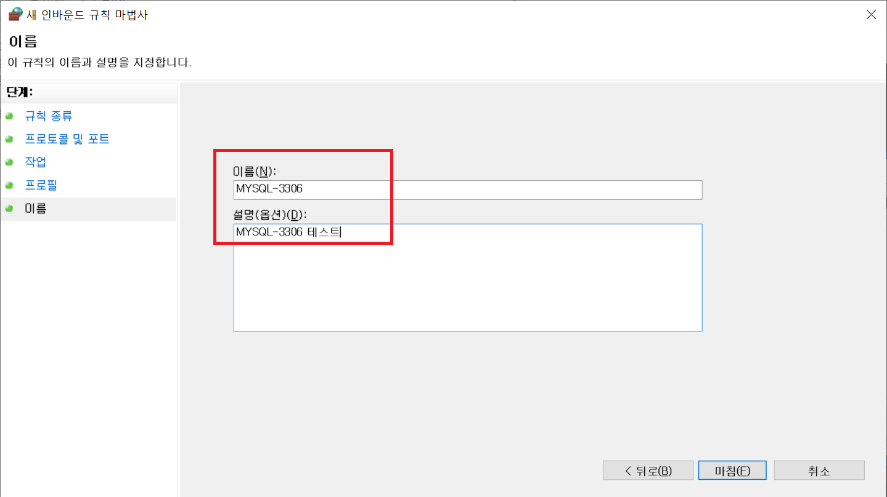
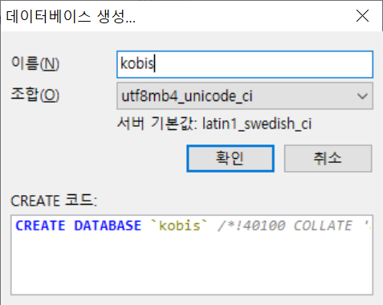
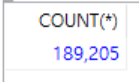

# 2020-08-04 Study

2020-08-04 화요일 온라인 수업 내용


### MySQL 8 버전 설치 및 실습  

1. 데이터베이스 초기화

MySQL 폴더를 가보면 mysql 파일이 없다.

```bash
// in mysql folder on bin

> mysqld --initialize-insecure
```

데이터베이스를 초기화하면 MySQL 폴더 안에 data라는 폴더가 생김.  

2. 데이터베이스 실행  

데이터베이스를 실행하기 위해서 서비스를 등록한다.  

```bash
// in mysql folder on bin

> mysqld --install MYSQL
```

[MYSQL]라는 이름으로 서비스 등록.

서비스 시작.

```bash
// in mysql folder on bin

> net start MYSQL
```

> MYSQL은 등록한 서비스 명.

3. MySQL 접속  

```bash
> mysql -u root
```

> 아직 패스워드를 설정하지 않았기 때문에 패스워드 없이 접속

4. MySQL 패스워드 설정  

우선 패스워드 확인

```sql
> select host, user, plugin, authentication_string from user;
```

패스워드 지정  

```sql
> alter user root@localhost identified by '설정할 비밀번호';
```

패스워드 확인

```sql
> select host, user, plugin, authentication_string from user;
```

> 패스워드가 암호화돼서 들어간것을 확인.  

5. 패스워드 설정한 것을 적용.  

```sql
> flush privileges;
```

만약 데이터베이스를 나만 사용한다면, 데이터베이스 서비스를 내렸다 올리는 것으로 해결 가능. 

> 다른 사람과 같이 사용하면 다른 사람이 사용하는 도중에 서비스를 내려버리면 안되므로

```sql
> net stop mysql
> net start mysql
```

> 대소문자 구분 x, 즉 [MYSQL]과 [mysql]은 서비스명이 같다.  

6. 패스워드를 입력하고 접속

```bash
> mysql -u root -p
```

> '설정할 패스워드'를 입력하고 접속하면 끝.

7. 데이터베이스 외부 접속  

실제 데이터베이스 서비스를 운영할 때 서버는 IDC나 클라우드에서 운영하기 때문에 외부접속이 필요

그래서 보통 작업하는 사람이 회사나 집, 또는 카페같은 곳에서 작업을 할 수 있으니 mysql은 **특정 계정**에 대해서 any로 설정하여 어느 IP 대역대도 접속이 가능하게 해준다.  


* MySQL 접속 툴 

    1. console을 통해서 접속 (mysql -u root -p)

    2. Workbench - GUI

    3. HeidiSQL - GUI

    4. Eclipse plugin

    5. SQLGate - 국내, 상용, Free(기능의 제한), 학생용 버전

    6. Toad for MySQL (국외)  

    7. Datagrip - Jetbrains(안드로이드스튜디오)  

    8. Dbever - 상용, 독립된 실행, Eclipse Plugin, 학생용 버전

    9. Navicast - UI가 좋다, win/mac 둘다 사용, 상용

8. HeidiSQL을 이용하여 데이터베이스 확인  

우선 MySQL 계정에 대해서 살펴보자.  

사진과 같이 [사람 아이콘] 클릭하면 계정에 대한 정보가 나온다

  

> test, webmodule 는 spring_vue 시간에 하던 내용  

9. HeidiSQL을 이용하여 데이터베이스 계정 추가  

사진과 같이 모든 곳에서 접근이 가능하도록 하여 계정 추가

  

결과

  

10. 추가한 계정에 전체 권한 다시 주기  

사진에서 했듯이 전체 권한을 체크하고 생성했지만 막상 보면 모든 권한은 안들어가져 있다.

  

모두 체크하고 완료.  

### 데이터베이스 원격 접속  

교수님은 Mac에서 VMware로 사용하는 window에 존재하는 mysql에 접속하려고 한다.  

Mac IP 주소는 196.168.0.14

vmware window ip주소는 196.168.0.186  

따라서 접속할 때 host를 196.168.0.186으로 설정하고 접속.  

하지만 window의 방화벽에 대해서 막힘.

따라서 window 방화벽 해제

  

고급설정에서 특정한 포트에 대해서만 허용.  

고급 방화벽 설정에는 **인바운드 규칙**과 **아웃바운드 규칙**이 존재.  

인바운드 규칙은 외부에서 나에게 들어오는 패킷에 대해서 규칙을 설정.

아웃바운드 규칙은 내가 외부로 나가는 패킷에 대해서 규칙을 설정.  

따라서 인바운드 규칙을 추가

  

포트에 대해서 규칙 설정

  

포트 3306에 대해서 규칙 설정

  

그 다음 계속 default 값으로 설정하고 next하고 밑 사진과 같이 이름을 설정하고 저장.

  

이 후 테스트 성공 

> 만약 timezone이 설정되어있지 않으면 설정하고 테스트 핑.  


### MySQL 실습 - 블로그  

1. 블로그 분석  

    - 회원이 블로그 생성
        - 아이디
        - 비밀번호
        - 이름
        - 가입일

    - 블로그
        - 카테고리
        - 작성일
        - 제목
        - 내용
        - 해시태그

    - 댓글
        - 작성자
        - 내용
        - 작성시간

2. HeidiSQL을 이용하여 블로그 스키마 생성  

사진과 같이 HeidiSQL에서 새 데이터베이스 생성

  

  

> 교수님 강의엔 서버 기본값이: utf8mb4_0900_ai_cl로 되어있음. 없으므로 그냥 아무 utf8mb4로 설정하고 진행.  

3. ERD 작성 툴  

    - ER-WIN
    - ER studio
    - DA SHOP
    - EXERD -> 이클립스형태의 플러그인
    - Workbench(ERD)  

4. ERD 작성  

  


* 데이터베이스 명명규칙  

    - 테이블명

    - 컬럼명

    - 대문자로된 언더바 표기법을 사용 


5. ERD를 가지고 스키마 생성  

```sql
// 회원 테이블
CREATE TABLE `MEMBER` (
	`USER_ID` VARCHAR(50) NOT NULL,
	`USER_NAME` VARCHAR(50) NULL,
	`PASSWORD` VARCHAR(255) NULL,
	`REG_DT` DATETIME	NULL,
	`AGE` SMALLINT NULL,
	`GENDER` CHAR(1)	NULL
);

ALTER TABLE `MEMBER` 
	ADD CONSTRAINT `PK_MEMBER`
		PRIMARY KEY (
			`USER_ID`
		);

// 블로그 정보
CREATE TABLE `BLOG_INFO` (
	`BLOG_ID`	VARCHAR(50)	NOT NULL,
	`USER_ID`	VARCHAR(50)	NULL,
	`INTRO`	VARCHAR(2000)	NULL,
	`REG_DT`	DATETIME	NULL
);

ALTER TABLE `BLOG_INFO`
	ADD CONSTRAINT `PK_BLOG_INFO`
		PRIMARY KEY (
			`BLOG_ID`
		);

// 블로그 게시글
CREATE TABLE `BLOG_ARTICLE` (
 	`ARTICLE_ID`	INT	NOT NULL,
 	`BLOG_ID`	VARCHAR(50) NULL,
 	`TITLE`		VARCHAR(255)	NULL,
 	`CONTENTS`	TEXT	NULL,
 	`REG_DT`		DATETIME	NULL,
 	`HASH_TAG`	VARCHAR(255)	NULL
 	);
 	
ALTER TABLE `BLOG_ARTICLE`
	ADD CONSTRAINT `PK_BLOG_ARTICLE`
		PRIMARY KEY (
			`ARTICLE_ID`
		);
		
ALTER TABLE `BLOG_ARTICLE`
	MODIFY COLUMN `ARTICLE_ID` INT NOT NULL AUTO_INCREMENT;


// 블로그 기사 댓글
CREATE TABLE `BLOG_REPLY` (
	`REPLY_ID`	INT	NOT NULL,
	`ARTICLE_ID`	INT	NULL,
	`USER_NAME`	VARCHAR(50)	NULL,
	`COMMENTS`	VARCHAR(2000)	NULL,
	`REG_DT`	DATETIME	NULL
);

ALTER TABLE `BLOG_REPLY`
	ADD CONSTRAINT `PK_BLOG_PEPLY`
		PRIMARY KEY (
			`REPLY_ID`
		);
		
ALTER TABLE `BLOG_REPLY`
	MODIFY COLUMN `REPLY_ID` INT NOT NULL AUTO_INCREMENT;
```

6. 테이블 관계 설정  

각 테이블에 주요키를 참조한 외래키 추가

```sql
ALTER TABLE `BLOG_INFO`
	ADD CONSTRAINT `FK_MEMBER_TO_BLOG_INFO`
		FOREIGN KEY (
			`USER_ID`
		)
		REFERENCES `MEMBER` (
			`USER_ID`
		);
		
ALTER TABLE `BLOG_ARTICLE`
	ADD CONSTRAINT `FK_BLOG_INFO_TO_BLOG_ARTICLE`
		FOREIGN KEY (
			`BLOG_ID`
		)
		REFERENCES `BLOG_INFO` (
			`BLOG_ID`
		);
		
ALTER TABLE `BLOG_REPLY`
	ADD CONSTRAINT `FK_BLOG_ARTICLE_TO_BLOG_REPLY`
		FOREIGN KEY (
			`ARTICLE_ID`
		)
		REFERENCES  `BLOG_ARTICLE` (
			`ARTICLE_ID`
		);	
```  

7. member 테이블에 데이터 추가 C : INSERT

member 테이블에 회원 추가

```sql
// INSERT INTO [테이블명]
// (INSERT 할 칼럼명1, 칼럼명2, ...)
// VALUES
// (INSERT할 값1, 값2, ...)
// ;

INSERT INTO member 
(USER_ID, USER_NAME, REG_DT, GENDER, AGE, PASSWORD)
VALUES
('test01', '박준경', NOW(), 'M', 20, '1234')
;
```

결과 확인

  

사진과 같아지도록 나머지 작업 수행

  

8. member 테이블에 데이터 수정 U : UPDATE

데이터 값 변경

```sql
// UPDATE [테이블명]
// SET
// [변경할 값의 컬럼] = [변경할 값]
// WHERE
// [찾을 조건의 칼럼] = [찾을 조건의 값]
// ;

UPDATE member
SET
	AGE = 29
WHERE 
	USER_ID = 'test01'
;
```

결과 확인  

  

9. member 테이블 데이터 삭제 D : DELETE

```sql
// DELETE FROM [실행할 테이블명]
// WHERE [찾을 조건의 컬럼명] = [찾을 조건의 값]
// ;

DELETE FROM member
WHERE USER_ID = 'test05';
```

결과 확인  

  

10. member 테이블 데이터 읽기 R : SELECT

```sql
// SELECT [찾을 컬럼명1, 컬럼명2, ...]
// FROM [찾을 테이블명];

SELECT *
FROM MEMBER;
```

> 조건은 WHERE을 사용.  

11. blog_info 테이블에 데이터 추가  

```sql
INSERT INTO blog_info
(
	BLOG_ID,
	USER_ID,
	INTRO,
	REG_DT
)
VALUES
(
	'devstory',
	'test01',
	'개발에 대한 내용을 작성한 블로그입니다.',
	NOW()
);
```  

아래 사진과 같이 데이터 추가  

  

12. blog_article 테이블에 데이터 추가  

```sql
INSERT INTO blog_article
(
	BLOG_ID,
	TITLE,
	CONTENTS,
	REG_DT,
	HASH_TAG
)
VALUES
(
	'devstory',
	'데이터베이스 이야기',
	'데이터베이스는 재밌으면서도 어렵다...',
	NOW(),
	'데이터베이스, 매우어렵'
);
```

아래 사진과 같이 데이터 추가  

  

13. blog_reply 테이블에 데이터 추가  

```sql
INSERT INTO blog_reply
(
	ARTICLE_ID,
	USER_NAME,
	COMMENTS,
	REG_DT
)
VALUES
(
	2,
	'유성용',
	'축하축하 이이 화이팅!!!',
	NOW()
);
```  

아래 사진과 같이 데이터 추가  

  


### MySQL 실습 - 영화 정보  

영화 정보에 대한 실습  

1. kobis라는 데이터베이스 추가  

  

2. kobis 데이터베이스에 actor 테이블 shema 추가  

```sql
-- auto-generated definition
create table actor
(
    code    varchar(10)  not null
        primary key,
    name    varchar(50)  null,
    engName varchar(100) null,
    birth   varchar(20)  null,
    country varchar(50)  null,
    domain  varchar(20)  null,
    pilmo   varchar(255) null
);
```

> 자료는 data_processing/200804/sample_movie_info_query에 존재.  

3. actor 테이블에 데이터 추가  

자료에 데이터 쿼리가 18만건이 존재. 복붙하면 넘치므로  

heidiSQL에서 쿼리파일을 불러와서 실행.  

  

  

  

결과 확인  

```sql
SELECT COUNT(*)
FROM ACTOR;
```

  

4. actor 테이블로 select 실습  

    - limit 사용

    데이터가 많을 때 몇백만 건을 select 하는 것은 매우 위험한 일 따라서 limit 절을 이용

    ```sql
    SELECT * 
    FROM ACTOR
    LIMIT 10;
    ```

    - alias 별칭 사용

    데이터 컬럼명이 길거나 겹치게 되는 경우가 존재 그때는 alias 사용  

    ```sql
    SELECT CODE, NAME, ENGNAME AS ENGLISH_NAME, BIRTH, COUNTRY, DOMAIN, PILMO
    FROM ACTOR
    LIMIT 5;
    ```  

    - count 사용  

    전체 데이터가 몇개인지 알고싶을 때

    ```sql
    SELECT COUNT(*)
    FROM ACTOR;
    ```

    - 국가별로 데이터가 한개씩만 나오도록  

    ```sql
    SELECT DISTINCT COUNTRY
    FROM ACTOR;
    ```

    - 한국인 사람만 확인

    ```sql
    SELECT *
    FROM ACTOR 
    WHERE COUNTRY='한국';

    SELECT COUNT(*)
    FROM ACTOR 
    WHERE COUNTRY='한국';
    ```

    - 한국인이 아닌 사람만 확인

    ```sql
    SELECT *
    FROM ACTOR 
    WHERE COUNTRY <> '한국';

    SELECT COUNT(*)
    FROM ACTOR 
    WHERE NOT COUNTRY'한국';
    ```  

> 다음 시간엔 생년월일이 20대인 배우를 찾기부터..
