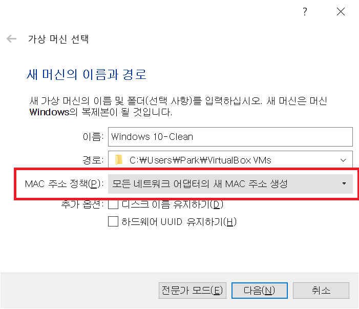
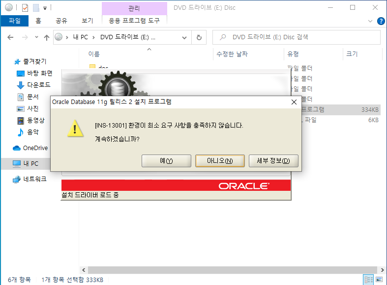
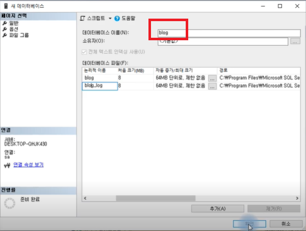
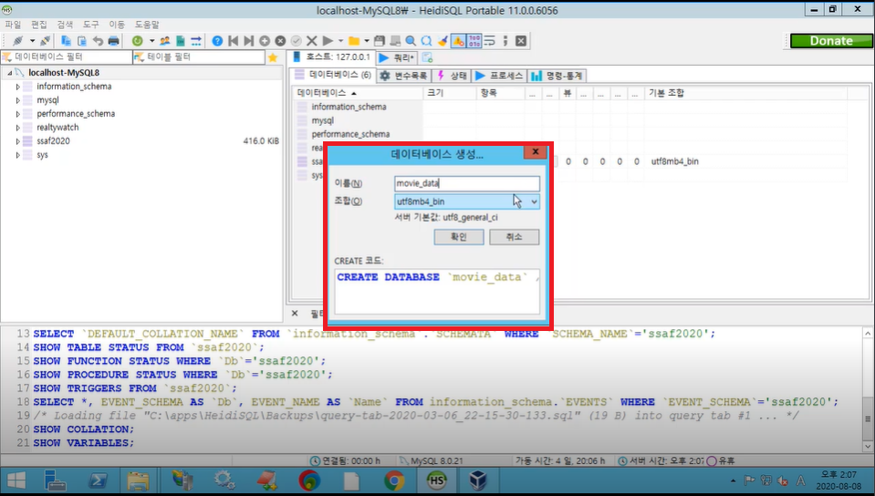

# 2020-08-10 Study

2020-08-10 월요일 온라인 수업 내용  


**교수님의 강의 진행 방향은 Oracle, MySQL, MsSQL을 설치를 하고 쿼리를 비교해보는 방식으로 진행**  

**Oracle DB 설치하는 건 현재 사용하고 있는 OS가 오염될 수 있으므로 VirtualBox를 이용해서 진행하는 것을 추천**

## VirtualBox window 10 복사

아래 그림과 같이 [복제] 클릭

  

다음과 같이 설정 지정  

  

  

  

[복제]를 누르면 다음과 같은 화면이 나옴.  

  

복제를 한 가상OS에 반디집과 chrome 설치  

## Oracle DB 설치  

[Oracle db download 바로가기](https://www.oracle.com/kr/downloads/)  

홈페이지로 가서 다음과 같이 Database 선택  

  

Window 64 bit를 설치

> 오라클 계정이 있어야 설치가 가능. [pjk 네이버 계정/첫문자는 대문자인 이메일 계정이 포함되지 않은 비밀번호 (특수문자 없어도됨)]  

설치한 후 1번을 압축 해제하면 [database]라는 폴더 안에 압축을 해제하게 된다. 2번도 그냥 압축 해제하면 같은 폴더 안에 압축 해제.  

이제 이 폴더안에 내용을 iso파일로 압축.

  

> 이렇게 하면 압축파일과 압축해제폴더인 database라는 폴더는 필요없게 됨  

그러고나서 iso파일을 클릭하면 [내 PC]에 [DVD 드라이브]가 생성됨.  

이 상태에서 oracle 설치 진행.  

설치를 하면 오류가 발생할 수 있으므로 .NET Framework를 설치해야 한다.  

> 우선 [DVD 드라이브]를 우클릭해서 [꺼내기]를 눌러서 디스크 해제한 다음 [프로그램 및 기능]에 들어가 [Windows 기능 켜기/끄기]를 눌러서 [.NET Framework 3.5(NET 2.0 및 3.0 포함)]이 클릭이 안되어있다면 클릭해서 설치를 진행해야 한다  

  

설치를 진행한 후 재부팅 해주어야 한다.  

재부팅 후 [DVD 드라이브]를 클릭해서 [setup.exe]파일 클릭하여 설치 진행.  

다음과 같이 오류가 발생하는 이유는 압축해제를 합쳐서 iso파일로 진행했기 때문에 발생하는 오류 그냥 [예]를 눌러서 설치 진행.

  

아래와 같이 보안 갱신 수신을 해제하고 진행하며 그 밑 그림과 같이 진행.

  

  

  

  

이렇게 진행한 다음 [완료]를 눌러서 설치 진행.  

설치 중간에 방화벽 어쩌구저쩌구.. Java 관련된 방화벽 내용이 나오면 [액세스 허용]을 클릭하여 설치 진행.  

설치가 완료되면 아래 그림과 같이 [비밀번호 관리..]를 눌러서 비밀번호 관리

  

  

완료되면 다음과 같은 메세지가 나옴.

  


## Oracle sqldeveloper 설치  

다음과 같이 오라클 홈페이지에서 [개발자 툴] 클릭하고 진행

  

  

  

> 물론 설치할 때에는 오라클 계정이 필요.  

실습에서 교수님은 다운로드 파일들을 C드라이브의 새 폴더 [DEV] 폴더를 만들어서 거기에다가 다운받은 파일들을 압축해제함  

압축해제 후 폴더에서 [sqldeveloper.exe]라는 파일을 실행하여 설치 진행.  

다음과 같은 오류메세지가 나오면 [아니오]를 클릭하고 진행.  

  


## Oracle sqldeveloper 를 이용하여 oracle db 접속  

다음과 같이 새 데이터베이스 접속 

  

다음과 같이 설정하고 테스트

  

에러가 발생. 왜? **리스너가 제대로 올라가있지 않아서 인거 같다.**  

따라서 리스너 확인.  

명령프롬프트를 관리자권한으로 실행 후 다음과 같이 명령어 실행.  

  

localhost를 127.0.0.1로 변경 후 다시 테스트.

그래도 핑 실패..  

내 컴퓨터 정보를 이용해 oracle 설정을 변경해본다.  

그러기 위해서는 notepad가 필요. 따라서 notepad++ 설치  

> notepad++ 설치할 때 [zip package]를 설치한다.  

설치를 진행한 후 oracle listener를 보기위해 oracle 설치경로 에서 다음과 같은 파일 확인  

C:\oracle\product\11.2.0\dbhome_1\NETWORK\ADMIN 폴더에서 **listener.ora**를 다음과 같이 편집  

  

> VM-WIN10은 VirtualBox Window10 시스템 이름  

다시 리스너를 정지하고 올려보자 

lsnrctl stop -> lsnrctl start  

그래도 테스트 실패..  

재부팅 후 다시 다음과 같이 설정하고 테스팅 해보면 성공

  

## cmd 관리자 프롬프트를 이용해서 쿼리실행  

cmd를 관리자권한으로 실행.  

다음과 같은 명령으로 dbms 접속

```bash
> sqlplus / as sysdba
```  

관리자 계정인 sys로 게속해서 접속할 수 없으므로 실습용 계정을 하나 생성한 후 권한을 부여  

```sql
> create user blog identified by blog2020;
> grant dba to blog;
```  

생성된 계정을 확인하고 계정을 변경하기 위해서 다음과 같은 명령 실행  

```sql
> connect blog/blog2020;
```  

[연결되었습니다.] 라는 문구가 나오면 성공  

확인

```sql
> show user;
```  

[USER은 "BLOG"입니다.] 라고 나오면 성공.  

다시 blog를 통해서 외부에서부터 접속해보기  

exit를 통해 나간 다음 다음과 같이 명령 실행  

  

> password 는 blog2020

다시 이 blog라는 계정으로 sqldeveloper를 통해 접속해 보기  

다음과 같이 설정한 후 접속

  

> 이미 sys로 접속되어 있는 상태면 왼쪽 localhost db를 오른쪽 클릭 후 [속성]을 눌러서 설정.  

## 테이블 생성

다음과 같이 쿼리를 작성 후 실행

  


## 생성한 테이블에 대해서 외부에서 접속이 가능한지 확인  

실행하고 있던 가상머신 종료 후 실행했던 가상머신의 [설정]을 눌러 다음과 같이 [네트워크] 확인  

> Nat 설정이 안된다.. 나는 패스 나중에 구글링해보고 혼자 공부해보자.  

## MSSQL 설치  

구글에서 [sqlserver2017-ssei-dev.exe]를 검색 후   

www.tektutorialshub.com 이라는 곳으로 접속 후 다음과 같은 설치 파일 클릭  

  

설치파일을 설치한 후 설치파일을 실행하여 [사용자 정의 설치]를 누른다음 default로 설정한 후 설치

  

설치가 완료되면 다음과 같은 파일이 열린다.  

  

다음 사진과 같이 계속 설치 진행.  

  

  

  

> 실습 목적이므로 체크 해제.

  

  

  

  

  

> 비밀번호는 dystudy, [현재 사용자 추가]를 눌러서 계정 추가해야지만 다음으로 넘어간다.  

여태까지 설정한 사항들을 확인하고 설치 진행

  

설치가 완료되면 다음과 같은 화면이 나온다.  

  

## MSSQL 접속 

다음과 같이 mssql 실행  

  

mssql에 접속하려면 접속 툴인 **SQL Server Management Studio** 가 있으면 좋다.  

따라서 SSDT 설치  

다음과 같은 화면처럼 설치 진행  

  

  

경로는 default로 설치 진행.  

설치가 완료되면 다시 시작.  

다음과 같은 파일 실행.  

  

> virtualbox가 너무 느려서 교수님 강의로 진행

파일을 실행한 다음 다음과 같이 진행  

  

> 아까 설치할 때 설정한 비밀번호 dystudy, 서버 이름은 localhost  

접속하면 다음과 같은 화면이 나온다.

  

[새 쿼리]를 눌러서 쿼리 작성할 페이지를 열고 쿼리작성

  


## MSSQL 쿼리 실행

tempdb 라는 db 사용  

```sql
use tempdb;
```

다음과 같이 변하는 것을 확인.  

  


blog라는 데이터베이스 생성해보기  

```sql
create database blog;
```  

blog 데이터베이스 사용하기

```sql
use blog;
```

다음과 같이 변하는 것을 확인.  

  

member 테이블 생성

```sql
craete table member (
    id int primary key,
    name varchar(5)
);
```

다음과 같이 변하는 것을 확인.  

  

> 결론적인 쿼리문은 다 동일하다..


## MSSQL 쿼리 실습

blog라는 db를 만들고 blog db를 관리하는 blog_user 유저를 생성하는 실습  

쿼리를 이용해서 db를 생성할 수도 있지만 툴을 이용해서 생성 가능  

다음과 같이 진행.

  

  

새 로그인 유저 생성  

  

  

  

  

설정하고 [확인]  

SQL Server Management Studio 를 껏다가 키고 새로운 계정으로 접속  

  

쿼리문을 이용하지 않고 툴을 이용하여 테이블 생성  

  

  

id를 primary key로 설정하기  

  

id auto_increment 해주기  

  


## 영화 정보를 통한 mssql, mysql, oracle db 실습  

인스턴스명 : movie_data
계정명 : movie_user
비밀번호 : movie_2020  

보통 인스턴스, 계정은 root, sys, sa 계정이 처리한다. 

- 우선 MYSQL 실습 

다음과 같이 movie_data라는 db 생성

  

다음과 같이 계정 생성  

  

- 다음으로 MSSQL 으로 인스턴스와 계정 생성  

데이터베이스 우클릭 -> 새 데이터베이스 생성  

  

로그인 우클릭 -> 로그인 계정 추가  

  

  

  

- 다음으로 oracle 서버에 접속하여 인스턴스와 계정 생성  

우선 sql plus 실행  

```bash
> sqlplus / as sysdba
```

movie_user라는 계정을 생성해야하지만 오라클은 계정명과 db명이 같아지므로 계정명을 movie_data로 생성.  

```sql
> CREATE USER MOVIE_DATA IDENTIFIED BY movie_2020;
```

권한 부여

```sql
> GRANT DBA TO MOVIE_DATA;
```

DB 연결

```sql
> CONNECT MOVIE_DATA/movie_2020;
```

유저 확인

```sql
> SHOW user;
``` 

[USER은 "MOVIE_DATA"입니다] 라고 나오면 성공.

sqldevelopment를 통해서 사용자를 movie_data 암호를 movie_2020으로 지정하고 포트를 알맞게 적용해서 접속  

접속 후 테이블 생성 테스트

```sql
create table member
(
    id int primary key,
    name varchar2(50)
)
```

그 다음 200810 폴더 안에 있는 sample_movie_info_query를 이용하여 스키마 추가  

```sql
create table actor
(
    code varchar(10) NOT NULL PRIMARY KEY,
    NAME VARCHAR(50) NULL,
    ENG_NAME VARCHAR(1000) NULL,
    BIRTH VARCHAR(50) NULL,
    COUNTRY VARCHAR(50) NULL,
    DOMAIN  VARCHAR(20) NULL,
    PILMO   VARCHAR(255) NULL
);
```

> MYSQL에서 테이블을 생성할 때에는 대문자로 테이블을 지정해도 소문자로 만들어지는 상황 발생, 이 것을 해결하려면 my.ini 파일을 편집. [mysqld]밑에 lower_case_table_names를 보면 default로 "1"로 지정되어있는 것을 "2"로 변경하면 해결

```sql
CREATE TABLE COMPANY
(
    CODE    VARCHAR(10) NOT NULL    PRIMARY KEY,
    COMPANY_NAME    VARCHAR(255)    NULL,
    ENG_COMPANY_NAME    VARCHAR(255)    NULL,
    CATEGORY    VARCHAR(255)    NULL,
    CEO VARCHAR(255)    NULL,
    PHONE   VARCHAR(255)    NULL,
    HOMEPAGE    VARCHAR(255)    NULL,
    ADDR    VARCHAR(255)    NULL,
    INTRO   VARCHAR(2000)   NULL,
    PILMO   VARCHAR(2000)   NULL
);
```

```sql
CREATE TABLE MOVIE
(
    CODE    VARCHAR(10) NOT NULL    PRIMARY KEY,
    TITLE    VARCHAR(255)    NULL,
    ENG_TITLE    VARCHAR(255)    NULL,
    PUB_YEAR    VARCHAR(10)    NULL,
    COMPANY VARCHAR(100)    NULL,
    MOVIE_TYPE   VARCHAR(50)    NULL,
    GENRE    VARCHAR(50)    NULL,
    OPEN_FLAG    VARCHAR(20)    NULL,
    DIRECTOR   VARCHAR(500)   NULL,
    PRODUCTION   VARCHAR(1000)   NULL
);
```


```sql
CREATE TABLE SCREEN
(
    CODE    VARCHAR(10) NOT NULL    PRIMARY KEY,
    SIDO    VARCHAR(255)    NULL,
    GUGUN    VARCHAR(255)    NULL,
    SCREEN_NAME    VARCHAR(255)    NULL,
    SCREEN_COUNT VARCHAR(255)    NULL,
    SEAT_COUNT   VARCHAR(255)    NULL,
    OPEN_TYPE    VARCHAR(255)    NULL,
    REG_TYPE    VARCHAR(255)    NULL,
    BIZ_NAME   VARCHAR(255)   NULL,
    OPEN_DATE   VARCHAR(255)   NULL,
    OPEN_STATUS   VARCHAR(255)   NULL
);
```

> ORACLE은 VARCHAR라는 타입말고 VARCHAR2라는 타입이 있다.

  | 접속주소 | 접속포트 | 계정 | 비밀번호 | SID 
---|:---:|:---:|:---:|:---:|---:
Oracle11g | win10.waveon.co.kr | 61521 | MOVIE_DATA | movie_2020 | orcl
MSSQLServer2017 | win10.waveon.co.kr | 61433 | movie_user | movie_2020
MySQL | win10.waveon.co.kr | 63306 | movie_user | movie_2020  

- 실제로 접속 테스트  

  

  

- 실습에 사용한 쿼리

```sql
SELECT * FROM ACTOR;

SELECT * FROM COMPANY;

SELECT * FROM MOVIE;

SELECT * FROM SCREEN;

/*
4개의 테이블에 대해서 MEMBER 추가
*/
CREATE TABLE MEMBER
(
	ID	INT	NOT NULL PRIMARY KEY AUTO_INCREMENT,
	NICK_NAME	VARCHAR(50)	NULL,
	USER_NAME	VARCHAR(50)	NULL,
	USER_PASSWORD	VARCHAR(255)	NULL,
	IN_DT	DATETIME	NULL,
	UP_DT	DATETIME	NULL
);

INSERT INTO MEMBER(NICK_NAME, USER_NAME, USER_PASSWORD, IN_DT)
VALUES
(
	'박준경',
	'박준경',
	'test',
	NOW()
);

UPDATE MEMBER
SET
    NICK_NAME = '박준경2',
    UP_DT = NOW()
WHERE
    ID = 1
;

DELETE FROM MEMBER 
WHERE 1 = 1;

DROP TABLE MEMBER;
```

> MSSQL은 NOW()가 아닌 GETDATE(). ORACLE은 SYSDATE

ORACLE에서는 insert 할 때 ID값도 넣어주어야 한다

```sql
INSERT INTO MEMBER(ID, NICK_NAME, ...) 
VALUES (1, '홍길동', ...);
```

하지만 INSERT할 때 항상 ID값을 알고있을 순 없으므로 함수로 대체 

```sql
INSERT INTO MEMBER (ID, NICK_NAME, ...)
VALUES ((SELECT NVL(MAX(ID), 0) + 1 FROM MEMBER), '홍길동2', '홍길동2', ...);
```

