# 2020-07-01 Study

장고기간 웹 프로그래밍 (Django based Web Programming)

2020-07-01 **온라인** 강의 수업 내용

## 장고 기반 웹 프로그래밍

- **목표**

  웹 서비스에 대한 기본 개념의 이해와 실무에 활용가능한 웹사이트를 제작하는 것을 목표로 한다.

  다양한 방면에 사용되고 있는 python 언어를 통해서 웹 서비스를 제작하는 것을 목표로 한다.

  Python언어에서 사용가능한 웹 프레임워크인 장고 프레임워크를 통해서 웹 서비스를 제작하고 이를 실무에 활용할 수 있는 내용을 학습하고자 한다.

### 1. 웹 프로그래밍이란??

- **웹 프로그래밍의 세계**

  - 웹 프로그래밍

    - 웹 사이트 혹은 웹 페이지를 만드는 과정

    - 웹 사이트에 접속했을 때 보이는 화면을 구성하는 것들을 만들어 내는 과정

  - 다양한 언어로 진행

    - 웹 브라우저 단 : HTML, CSS, JavaScript

      - 프로트엔드 프로그래밍(클라리언트 사이드 프로그래밍)
      - 퍼블리싱
      - 실무에서는 퍼블리셔와 프론트엔드 프로그래머가 하는 일이 분리됨.
      - 서버 컴퓨터에서 동작하는 코드 ; Python, Ruby, PHP, Java, C#, JavaScript
      - 서버 사이드 프로그래밍
      - 많은 언어가 존재
      - 언어뿐만 아니라 프레임워크를 많이 사용함 -> 반복적이고 지루한 작업이 많음 -> 프레임워크를 통해서 효율적으로 처리

  - 웹 프레임워크

    - 풀스택 프레임워크

      - 웹 서비스를 만드는데 필요한 다양한 기능(DB, 인증, 템플릿 엔진 등)이 포함된 형태
      - 프레임워크를 설치하자마자 기본적인 웹 서비스를 할 수 있을 정도
      - 커스터마이징이 용이하지 않음
      - 코드의 양이 많기 떄문에 상대적으로 느림

    - 마이크로 프레임워크

      - 적은 코드가 초기에 설치됨
      - 많은 기능이 없기 때문에 가볍고 빠른 장점
      - 커스터마이징이 용이함
      - 기능 개발에 비교적 시간이 오래 걸림

### 2. 웹 서버와 웹 어플리케이션 서버

- **웹 서버**

  - 프레임워크를 활용하거나 언어 자체로 웹 서비스를 만들고 인터넷 공간 어딘가에 컴퓨터를 준비해두고 그 컴퓨터에 웹 어플리케이션이 동작하도록 함
  - 다양한 기능을 하는 각각의 소프트웨어가 동작할 수 있는 환경이 컴퓨터

- **웹 서버 프로그램**

  - 사용자가 브라우저를 통해 서버 컴퓨터에 접속했을 때 요청을 처리하고 웹 어플리케이션으로 전달하는 역할을 하는 프로그램

- **웹 어플리케이션 서버**

  - 웹 서비스 자체가 돌아가는 서버

- **CGI: 이전에 요청을 처리하는 방식**

  - 상당히 느리고 비효율적 -> 아파치 웹 서버의 fast_cgi로 발전 -> 웹 어플리케이션 서버 방식으로 발전
  - 자바의 경우 톰캣
  - 파이썬 장고나 루비 레일즈같은 경우 미들웨어 서버 방식으로 사용

### 3. 장고

- **WSGI**

  - Web Server Gateway Interface
  - 미들웨어 방식으로 웹 어플리케이션 서버를 구동해 적은 리소스로 높은 효율성을 내기 위해 발전
  - WSGI를 이용한 방식으로 배포
  - 파이썬에서 어플리케이션, 즉 파이썬 스크립트가 웹 서버와 통신하기 위해 명세
  - 프로토콜 개념

### 4. 인프라

- **인프라**

  - 웹 서버와 웹 어플리케이션 서버가 동작하려면 컴퓨터가 필요
  - 웹 서비스를 하기 위해서는 한대의 컴퓨터만 가지고 일하지는 않음
  - 사용자 접속량에 따라 수백대 이상의 서버를 사용해 웹 어플리케이션을 동작시키고 데이터베이스 서버, 파일 이미지 서버 등이 별도로 동작

### 5. Python과 Django

- **파이썬**

  - 인문용 언어 / 범용 언어
  - 모던 프로그래밍 트렌드를 선도하는 언어
  - 귀도 반 로섬, 파이썬 소프트웨어 재단에서 관리

- **장고**

  - 구글 웹 엔진에서 장고를 채용해서 유명해짐

- **장점**

  - 파이썬은 어플리케이션 제작, 데이터 분석, 머신러닝 등 다양한 분야에서 쓰이고 있기 때문에 장고의 필요성이 날로 높아짐 -> 어떤 형태로 파이썬을 활용하던지 웹 서비스가 붙어야 하는 경우가 많기 때문

### 6. 개발 환경 셋팅

- 파이썬 설치 (3.8.3) / Add Python to PATH / Python 버전 확인 / 파이참 설치

### 7. 파이참 Django Project Example

1. 파이참에서 new project를 누른 후 새로운 프로젝트를 실행할 프로젝트 명과 설치 폴더를 선택.

2. 파이썬은 다른 파이썬 강의에서 배우듯이 **가상환경**이라는 것을 사용하여 해당 프로젝트에서 필요한 라이브러리(?), 패키지(?)들을 필요에 맞게 설치한 환경을 셋팅해주어야 한다.

3. 따라서 파이참에서 새로운 프로젝트를 만들 시 가상환경을 어떤 가상환경을 사용할 지 셋팅할 수가 있다.

> default로 가상환경 명은 프로젝트 명.

4. 셋팅을 한 후 Terminal을 열어 `pip --version`을 통해 pip (python 패키지 관리자? - npm과 같은 개념..?) 버전을 체크해주고 `pip list`를 통해 현재 사용하고 있는 가상환경에 default로(설치한 패키지가 없으므로..) 설치된 패키지를 확인할 수가 있다.

> 파이참 터미널의 내용을 지우고 싶으면 `cls`명령어를 이용.

5. django를 실행해야 하므로 `pip install django`를 한 후 설치가 완료되면 venv (내가 선택한 가상환경 유형) 폴더에 들어간 후 django 라이브러리를 확인.

6. 이제 django 프로젝트를 만들 차례. django를 설치했으면 `django-admin`이라는 명령어를 사용할 수가 있다. `django-admin startproject config .`명령어를 통해 .(현재 폴더)에 config(관례적으로 사용하는 폴더명)라는 폴더를 만들어서 django프로젝트를 실행한다.

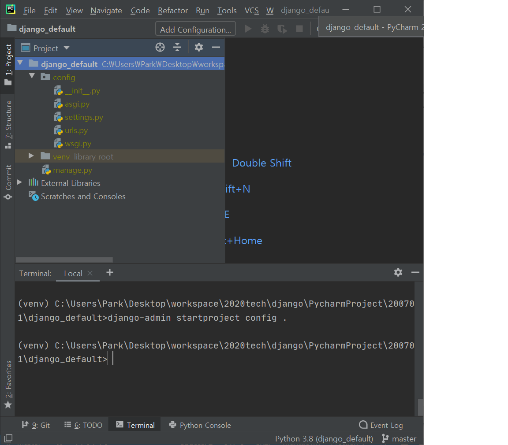

> 완료된 모습

7. django 프로젝트 실행 `python manage.py runserver`명령어를 친 후 127.0.0.1:8000로 접속

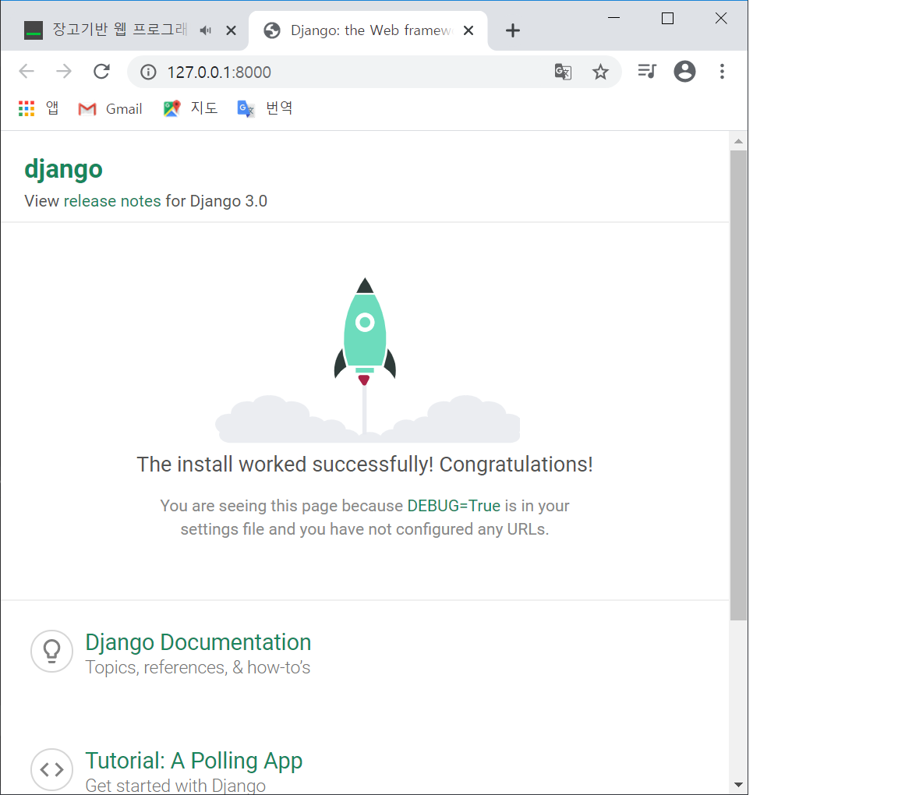

> 접속한 모습

8. django 프로젝트를 위한 마이그레이션 `python manage.py migrate`

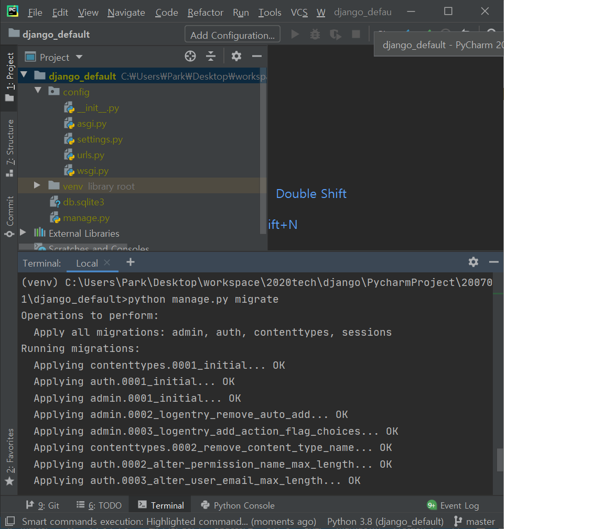

> 마이그레이션을 한 후 여러가지 OK뜨는 것을 확인. 그리고 폴더를 보면 sqlite3가 있는것을 확인하면 된다.

9. db를 편하게 관리하기 위해서 heidiSQL를 설치. **Portable version(zipped): 32 bit, 64 bit**에서 운영체제에 맞는 버전을 설치한 후 적당한 폴더에 압축을 해제

10. heidiSQL을 실행 후 신규를 선택하여 관리할 세션 이름(alias)를 적당히 저장 후 사진에서 보이는 바와 같이 네트워크 유형을 자신이 사용할 db 유형에 맞게 설정한 후 Database filename에서 Django project에서 `python manage.py migrate`로 생성한 db인 sqlite3를 선택

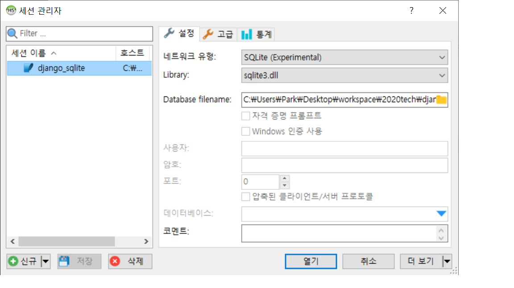

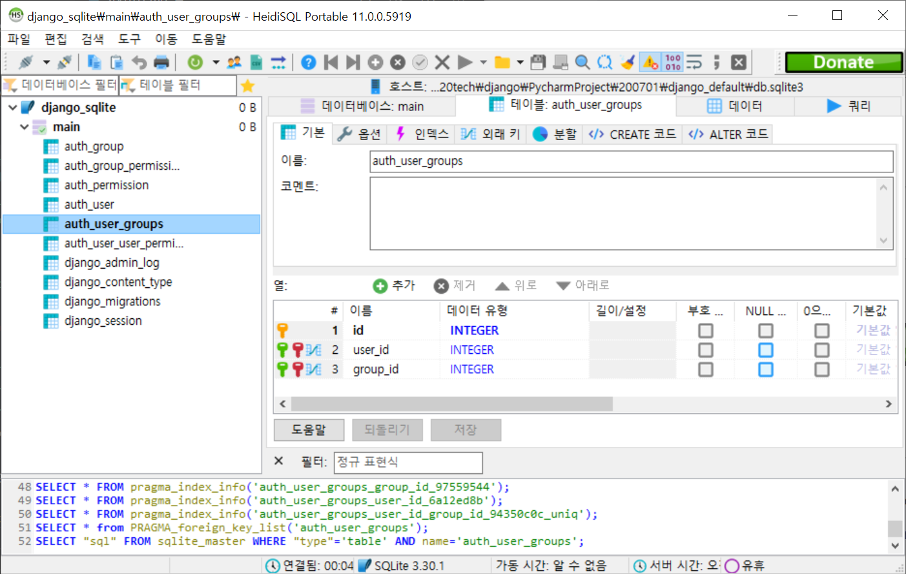

11. Django project를 설치하고 db 마이그레이션을 했으면 app을 추가! `python manage.py startapp app_default`명령어를 통해서..

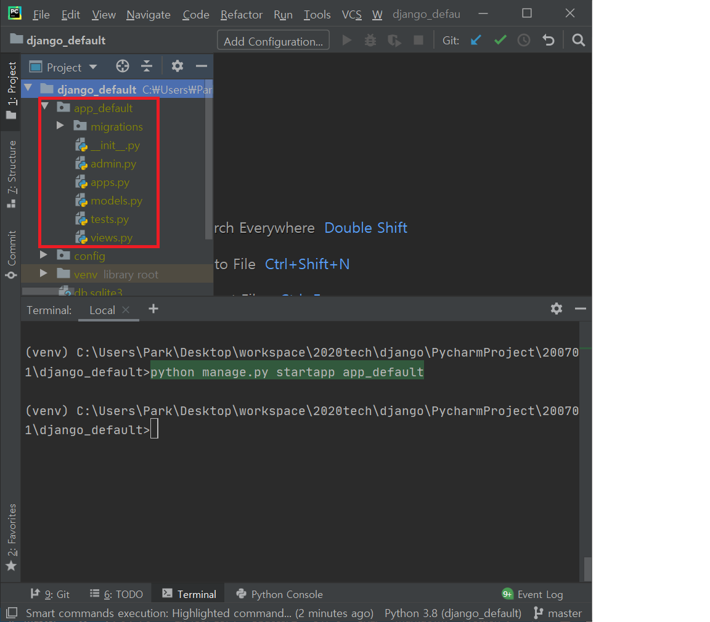

- **프로젝트 구조**

  - config : 프로젝트 설정 파일과 웹 서비스 실행을 위한 파일 / django-admin startproject 명령을 사용해 프로젝트를 만들 때 정해짐.. 굳이 config라는 프로젝트 명을 사용할 필요는 없음.

    - `__init__.py`

      - 2.x대 버전과 호환을 위해 만들어짐
      - 3.x는 불필요함 (없어도 된다!)
      - 지워도 다시 생성됨

    - `settings.py`

      - 프로젝트 설정에 관한 다양한 내용이 들어 있다.

    - `urls.py`

      - 특정 기능을 수행하기 위해 접속하는 주소를 url이라 하면 이를 설정해 주는 것
      - 한 프로젝트 안에 여러 개의 urls 파일을 만듬
      - config 폴더 안에 있는 urls 파일이 최초로 탐색되는 기준 url 파일
      - 기준 url 파일은 `settings.py`에서 변경 가능

    - `wsgi.py`
      - 웹 서비스를 실행하기 위한 wgsi 관련 내용
      - 특별히 변경할 일은 거의 없음

  - venv 폴더 : 프로젝트 구동에 필요한 가상 환경이 들어 있는 폴더 / 가능하면 임의로 수정 x

  - db.sqlite3: SQLite3 DB 파일 / 임의로 삭제하거나 위치를 이동하면 안됨

  - manage.py

    - django의 다양한 명령어를 실행하기 위한 파일
    - 임의로 변경하면 안됨
    - 가장 많이 사용하는 파일

* **settings.py에 관해**

  - `BASE_DIR`
    프로젝트 루트 폴더

  - `SECRET_KEY`
    다양한 보안을 위해 사용, 세션값의 보호나 비밀번호 변경시 사용되는 보안 URL을 만드는 등의 일에 주로 사용

  - `DEBUG`
    디버그 모드 설정, 실제로 배포할 때는 False로 변경 후 배포

  - `ALLOWED_HOSTS`
    현재 서비스의 호스트 설정, 개발 시에는 비어두고 사용, 배포 시에는 `"*"`이나 실제 도메인을 기록

  - `INSTALLED_APPS`
    django 웹 서비스는 다양한 웹의 결합으로 만들어짐, 현재 프로젝트에서 사용하는 앱의 목록을 기록하고 관리

  - `MIDDLEWARE`  
    django의 모든 요청/응답 메시지 사이에 실행되는 특수한 프레임워크, 주로 보안에 관련된 내용

  - `ROOT_URLCONF`
    기준이 되는 urls.py 파일의 경로를 설정

  - `TEMPLATES`  
    django에서 사용하는 템플릿 시스템에 관한 설정, 템플릿 해석 엔진과 템플릿 폴더의 경로 등을 변경

  - `WSGI_APPLICATION`  
    실행을 위한 wsgi 어플리케이션을 설정

  - `DATABASES`  
    db에 관련 설정

  - `AUTH_PASSWORD_VALIDATORS`
    비밀번호 검증을 위한 설정

  - `LANGUAGE_CODE`  
    다국어에 관한 설정

### 8. Django 기본 명령어

- **명령어**

  - `django-admin startproject`
    장고 프로젝트를 만드는 명령어, 웹 서비스를 만들 때마다 한번 실행

  - `startapp`
    프로젝트에 기능 단위인 앱을 새로 만들 때 사용

  - `makemigrations`
    어플리케이션에 변경 사항을 추적해 DB에 적용할 내용을 정리

  - `sqlmigrate`  
    실행할 SQL 명령문을 출력

  - `migrate`  
    실제 변경사항을 DB에 반영

  - `showmigrations`
    프로젝트의 DB 변경사항 목록과 상태를 출력

  - `runserver`  
    테스트 서버를 실행

  - `dumpdata`
    현재 DB의 내용을 백업할 때 사용

  - `loaddata`  
    백업 파일에서 DB에 내용을 복구할 때 사용

  - `flush`
    DB 테이블은 그대로 두고 테이블의 내용만 전부 삭제

  - `shell`  
    django shell을 실행

  - `dbshell`  
    db에 직접 접근할 수 있는 쉘을 실행

  - `createsuperuser`  
    관리자 계정을 생성

  - `changepassword`  
    계정의 비밀번호를 변경

### 9. 디자인 패턴과 MTV

- **디자인 패턴**

  여러 사람이 협업해서 개발할 때 다른 사람이 작성한 코드, 기존에 존재하는 코드를 이해하는 것은 어렵다. 이런 코드를 수정하거나 새로운 기능을 추가해야 하는데 의도치 않은 결과나 버그를 발생시키기 쉽고 성능을 최적화 시키기도 어렵다. 이로 인해 시간과 예산이 소모된다. 디자인 패턴은 의사소통 수단의 일종으로써 이런 문제를 해결해줌.

- **MVC**

  - Model

    - db구조를 결정
    - 대부분의 경우 테이블을 작성할 때 사용
    - 테이블의 이름, 각 열의 이름과 타입 등을 설계할 때 사용

  - View

    - 사용자에게 보여지는 UI
    - HTML 코드 등 실질적으로 클라이언트에게 보여지는 부분

  - Controller

    - 기능, 로직 부분

- **MTV**

  Model-Template-View ; Model = Model, Template = View, View = Controller

- **MTV 패턴은 장고 전체에 사용**

- **철저하게 분리해서 사용**

### 10. 관리자 계정 생성 및 사이트 확인 실습

- **관리자 계정 생성**

  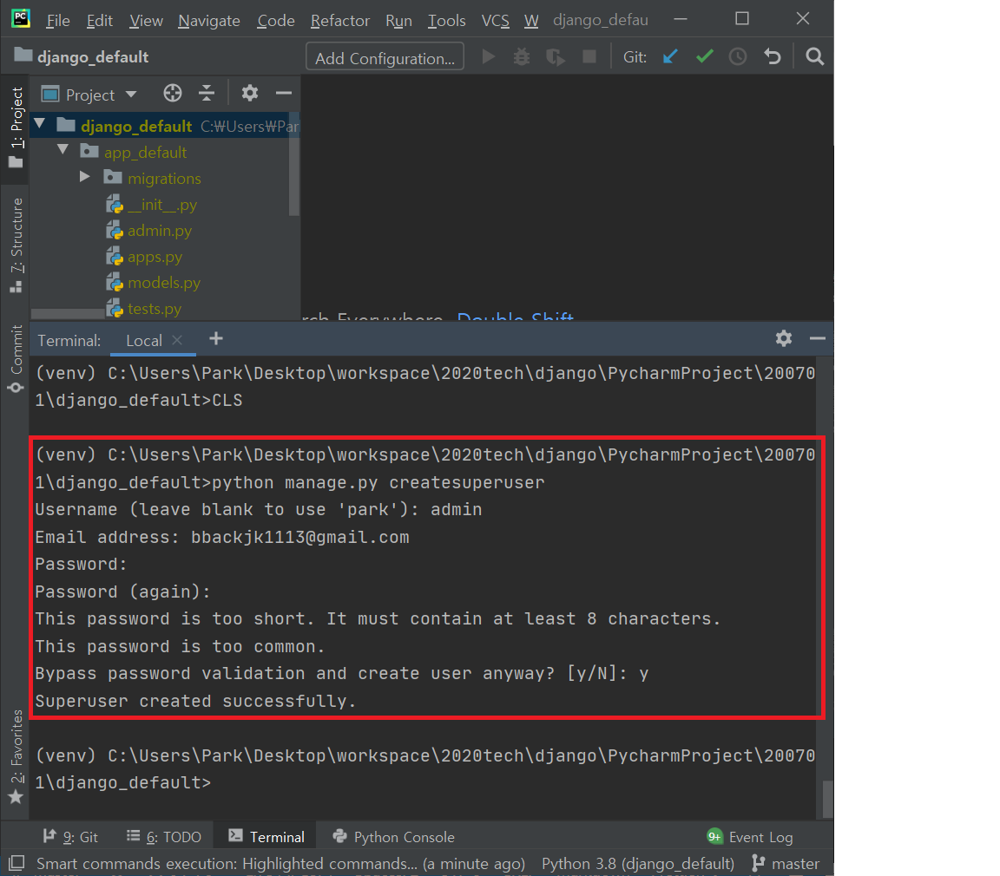

- **관리자 계정 접속**

  127.0.0.1:8000/admin으로 접속

  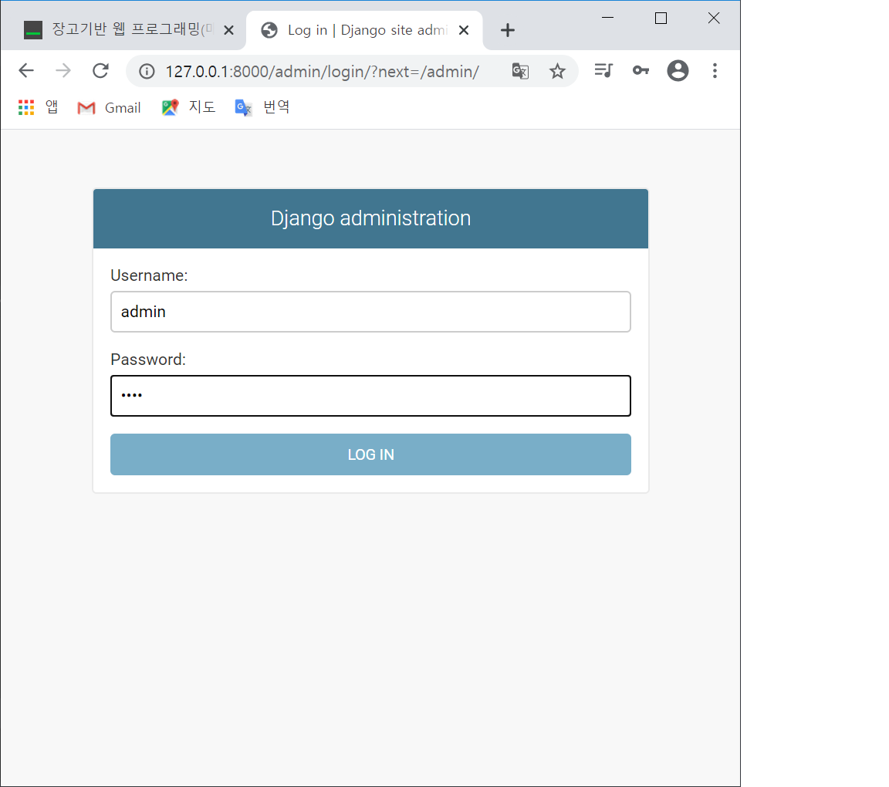

  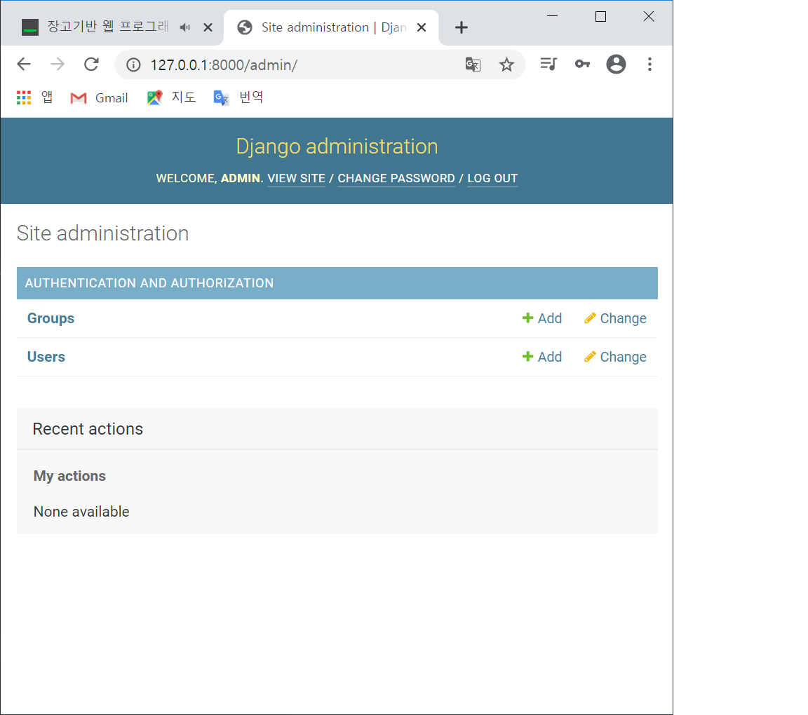

### 11. 설문 조사 웹 어플리케이션 예제 실습

- **DB 설계**

  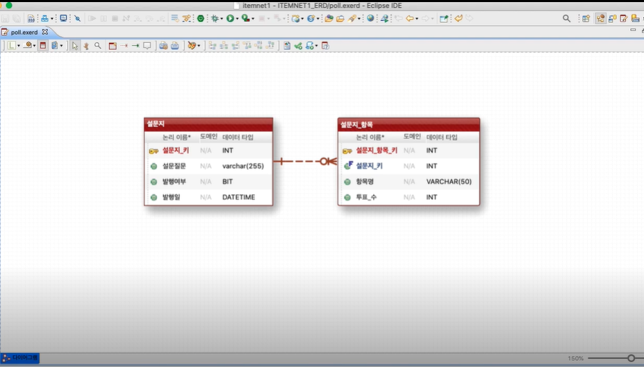

- **프로젝트 생성**

  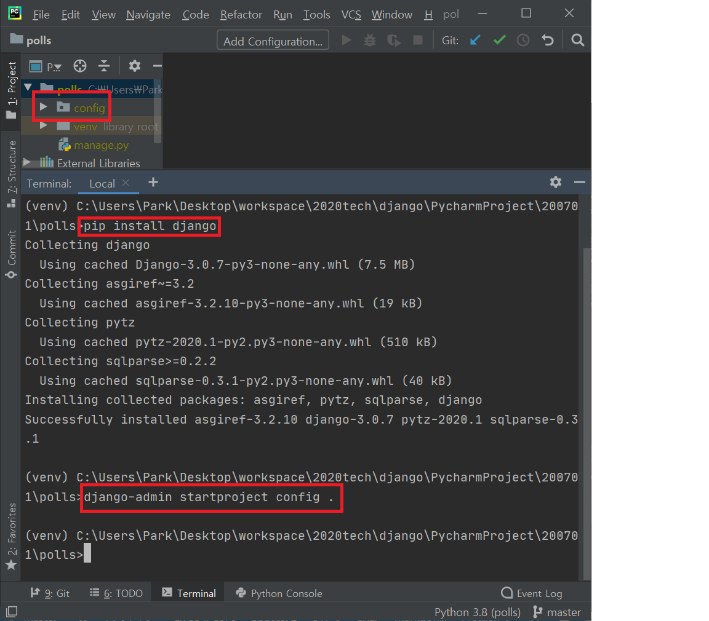

- **프로젝트 마이그레이션**

  `python manage.py migrate`로 sqlite3 생성 확인

- **프로젝트 앱 생성**

  `python manage.py startapp polls`로 polls 폴더앱 생성 확인.

- **polls 앱에 views.py에 view 추가**

  ```py
  # in polls/views.py

  from django.http import HttpResponse

  def index(request): # request 인자를 가진 함수 index 생성
    return HttpResponse("Hello, World. You're at the polls index.")
  ```

- **polls 앱 url 지정**

  polls -> new python file -> urls.py

  ```py
  # in polls/urls.py

  from django.urls import path
  from . import views

  urlpatterns = [
    # path 지정 '' ; polls앱 root (ex 127.0.0.1:8000/polls) / views.  index ; views.py에 만든   index파일을 호출
    path('', views.index, name='index')
  ]
  ```

- **django 전체에 polls 앱 view 추가**

  config 폴더 (`django-admin startproject config .`로 만든 config 폴더) 에 urls.py안에 urlpatterns에 polls 경로 추가

  ```py
  # in config/urls.py

  from django.contrib import admin
  from django.urls import path

  from django.urls import include

  urlpatterns = [
      # polls 경로 추가
      path('polls/', include('polls.urls')),
      path('admin/', admin.site.urls),
  ]
  ```

  > 보면 routing 개념인거같아 보임.

- **django 앱 테스트**

  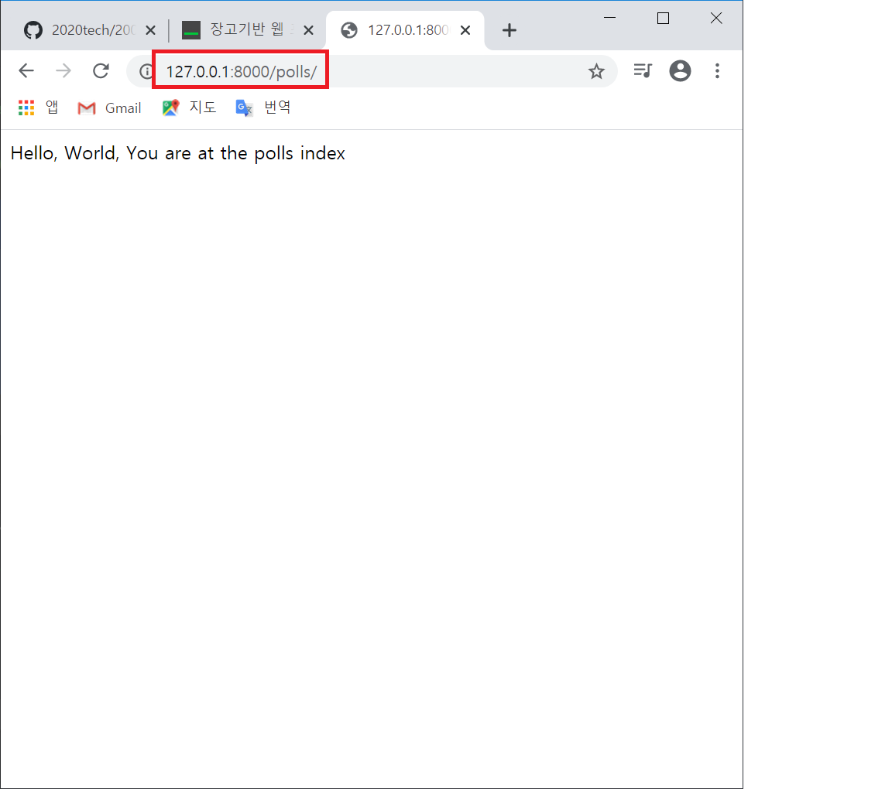

- **데이터 모델 만들기 전 데이터베이스 초기화 작업**

  `python manage.py migrate`

  > 아까 초기화해서 migrate 할 내용이 없다고 출력됨.

- **데이터베이스 모델링**

  polls 폴더안에 있는 models.py에

  처음했던 **DB 설계**를 가지고 모델링

  ```py
  # in polls/models.py

  # django model에 있는 Model을 상속받는 클래스 Question을 생성
  class Question(models.Model):
      question_text = models.CharField(max_length=200)
      pub_date = models.DateTimeField('date published')
  class Choice(models.Model):
      question = models.ForeignKey(Question, on_delete=models.CASCADE)
      choice_text = models.CharField(max_length=200)
      votes = models.IntegerField(default=0)
  ```

- **모델링 후 db가 모델링 인식하게 해주기**

  전체 django 프로젝트 config에 있는 setting.py에 들어가서 INSTALLED_APPS에 만들어준 polls 추가

  ```py
  # in config/setting.py

  INSTALLED_APPS = [
      'django.contrib.admin',
      'django.contrib.auth',
      'django.contrib.contenttypes',
      'django.contrib.sessions',
      'django.contrib.messages',
      'django.contrib.staticfiles',
      'polls.apps.PollsConfig',
      # polls 추가. 이때 PollsConfig는 polls 폴더에 apps.py에 있는 클래스명
  ]
  ```

  그 후 heidiSQL에서 database filename을 polls에 있는 sqlite3로 지정한 후 DB 변화 확인

  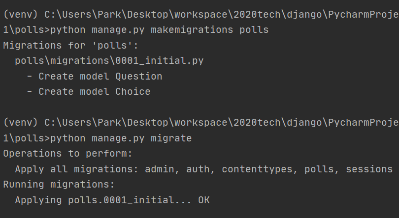

  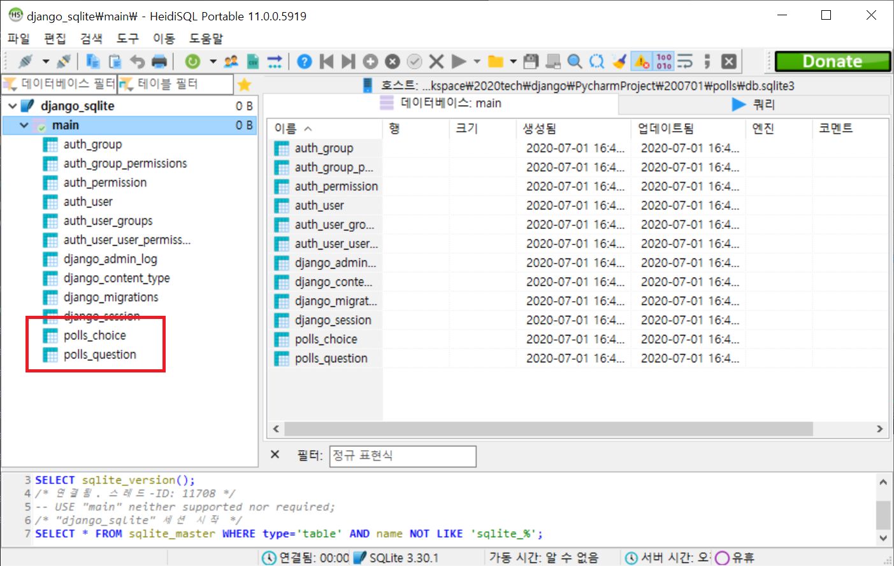

  > `python manage.py makemigrations polls` 후 `python manage.py migrate`를 해주어야 db에 테이블이 실제로 생성된다.

- **모델에 있는 클래스내에 **str**메소들 추가하여 내용이 화면에 출력되도록 하기**

  ```py
  # in polls/models.py

  from django.db import models
  from django.utils import timezone

  import datetime

  class Question(models.Model):
    question_text = models.CharField(max_length=200)
    pub_date = models.DateTimeField('date published')

    def __str__(self):
        return self.question_text

    def was_publised_recently(self):
        return self.pub_date >= timezone.now() - datetime.timedelta(days=1)

  class Choice(models.Model):
    question = models.ForeignKey(Question, on_delete=models.CASCADE)
    choice_text = models.CharField(max_length=200)
    votes = models.IntegerField(default=0)

    def __str__(self):
      return self.choice_text
  ```

- **Question클래스 확인하기 위한 관리자 계정 추가**

  `python manage.py createsuperuser`

- **admin.py에서 Question 추가**

  ```py
  # in polls/admin.py
  from django.contrib import admin

  from .models import Question

  admin.site.register(Question)
  ```

  후에 `python manage.py runserver`로 서버를 돌려서 admin으로 접속 후 확인.

  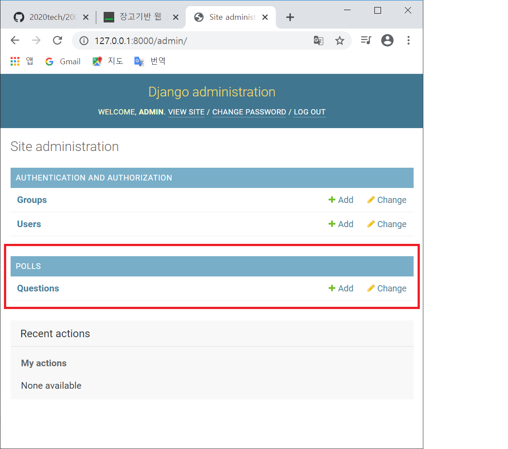

- **Question Add**

  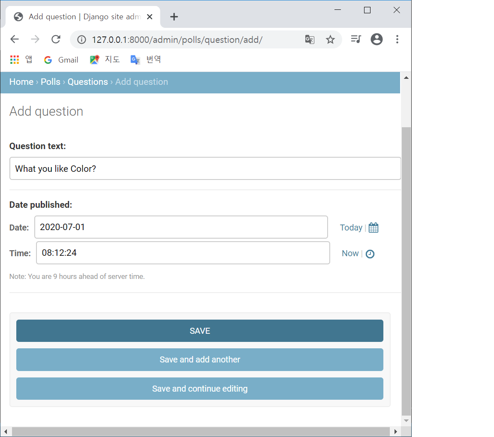

  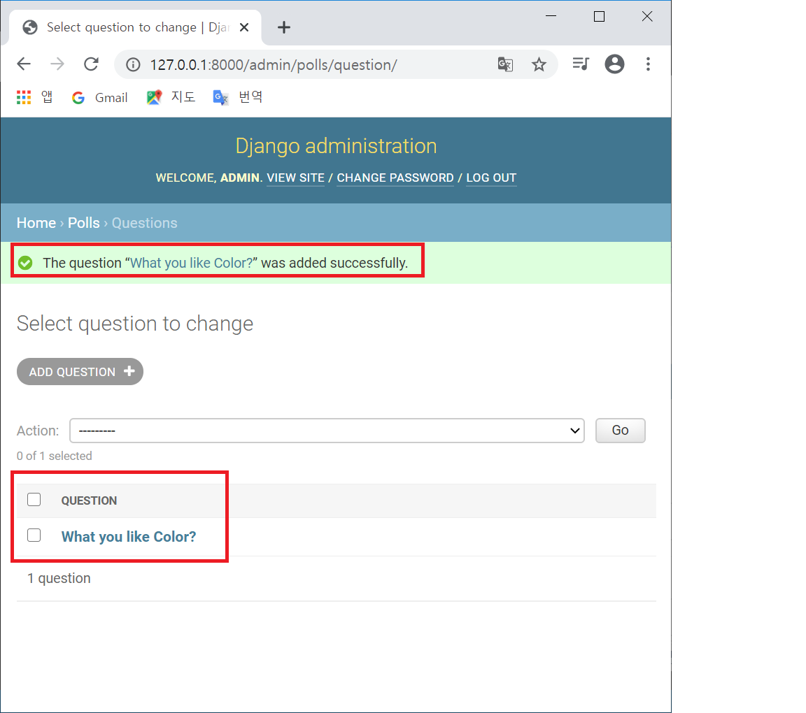

* **관리자 화면에 추가한 Question이 관리자가 아닌 다른 유저 view에도 나오게 하기**

  polls폴더에 view 추가

  ```py
  # in polls/views.py

  from django.http import HttpResponse

  def index(request):
    return HttpResponse("Hello, World, You are at the polls index")

  def detail(request, question_id):
    return HttpResponse("You're looking at question %s." %question_id)

  def result(request, question_id):
    response = "You're looking at the results of question %s."
    return HttpResponse(response % question_id)

  def vote(request, question_id):
    response = "You're voting on question %s." % question_id
    return HttpResponse(response)
  ```

  view를 `urls.py`에 맵핑

  ```py
    # ex) /polls/
    path('', views.index, name='index'),

    # ex) /polls/2/
    path('<int:question_id>/', views.detail, name='detail'),

    # ex) /polls/2/results/
    path('<int:question_id>/results/', views.results, name='results')

    # ex) /polls/2/vote
    path('<int:question_id>/vote/', views.vote, name='vote')
  ```

  확인

  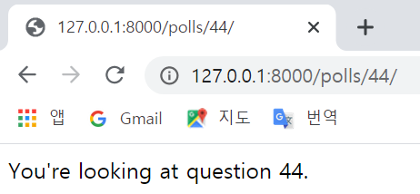

  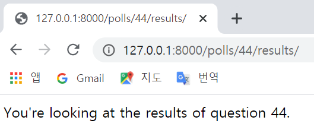

  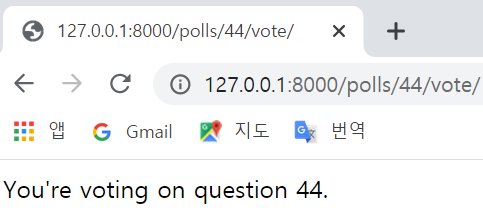

- **polls 인덱스페이지에 Question 띄우기**

  ```py
  # in polls/views.py

  from django.http import HttpResponse
  from .models import Question

  def index(request):
    # return HttpResponse("Hello, World, You are at the polls index")

    lasted_question_list = Question.objects.order_by('-pub_date')[:5] # pub_date를 정렬하는데 desc순으로 (역순)으로 정렬하고 5개를 뽑는다.

    output = ', '.join([q.question_text for q in lasted_question_list])

    return HttpResponse(output)
  ```

  확인

  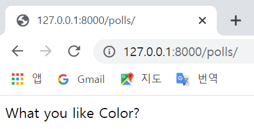

- **django template 만들기**

  polls app (polls 폴더)에 templates라는 폴더를 만들고 templates폴더 안에 다시 polls라는 폴더를 생성.

  그 후 index.html을 생성

  그 후 polls앱의 index(루트)에 랜더링시킨다.

  ```py
  from django.http import HttpResponse
  from .models import Question
  from django.template import loader

  def index(request):
    # return HttpResponse("Hello, World, You are at the polls index")

    """
    lasted_question_list = Question.objects.order_by('-pub_date')[:5]
    output = ', '.join([q.question_text for q in lasted_question_list])
    return HttpResponse(output)
    """
    lasted_question_list = Question.objects.order_by('-pub_date')[:5]
    context = {
        'lasted_question_list' : lasted_question_list
    }
    template = loader.get_template('polls/index.html')
    return HttpResponse(template.render(context, request))
  ```

  그 후 polls/templates/polls/index.html 코드 변경

  ```html
  <!DOCTYPE html>
  <html lang="en">
    <head>
      <meta charset="UTF-8" />
      <title>Polls</title>
    </head>
    <body>
      

      <li>
        <a href="#">{{question.question_text}}</a>
      </li>

      
    </body>
  </html>
  ```

  확인

  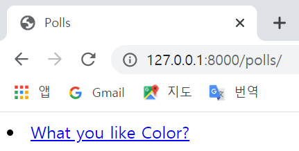

- **실제코드화(값이 없을 때를 대비해서)**

  templates/polls/index.html에서 lasted_question_list가 없는 경우도 있을 수 있다. 그럴 경우를 대비해서 코딩하는 것이 바람직.

  ```html
  <body>
     

    <li>
      <a href="#">{{question.question_text}}</a>
    </li>

     
    <p>설문지가 없습니다.</p>
    
  </body>
  ```

  확인 (polls/views.py에서 context 변수에 있는 값 'lasted_question_list'를 'lasted_question_list1'으로 바꾸었을 때)

  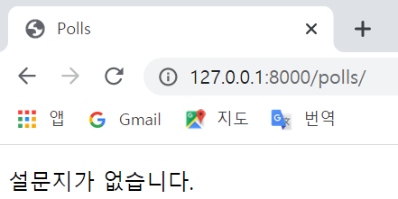

- **Question 링크 연결**

  ```html
  <li>
    <a href="/polls/{{question.id}}/">{{question.question_text}}</a>
  </li>
  ```

  question을 누르면 polls/question.id로 넘어가진다.

  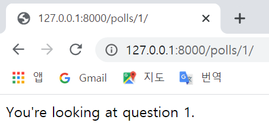

- **단축형으로 rendering 해보기**

  render부분을 조금 줄여보자.

  ```py
  lasted_question_list = Question.objects.order_by('-pub_date')[:5]
  context = {
      'lasted_question_list': lasted_question_list
  }

  return render(request, 'polls/index.html', context)
  ```

- **상세내용 view 수정**

  ```py
  def detail(request, question_id):
    # return HttpResponse("You're looking at question %s." %question_id)

    question = Question.objects.get(pk=question_id)

    return render(request, 'polls/detail.html', {'question': question})
  ```

  이 상태로 실행하면 templates에 detail.html이 없으므로 오류가 발생.

  따라서 detail.html 생성

  ```html
  <!DOCTYPE html>
  <html lang="en">
    <head>
      <meta charset="UTF-8" />
      <title>Polls</title>
    </head>
    <body>
      {{question}}
    </body>
  </html>
  ```

  이 때 pk가 question_id인 것을 찾아서 렌더링을 하기로 코딩되어 있지만 사용자가 잘못하여 없는 id값을 url을 입력하였을 경우 에러페이지를 내뱉는다. 이럴 때 try catch문을 이용하면 좋다.

  ```py
  def detail(request, question_id):
    # return HttpResponse("You're looking at question %s." %question_id)

    try:
        question = Question.objects.get(pk=question_id)
    except Question.DoesNotExist:
        raise Http404("질문이 존재하지 않습니다.")

    return render(request, 'polls/detail.html', {'question': question})
  ```

  결과 확인

  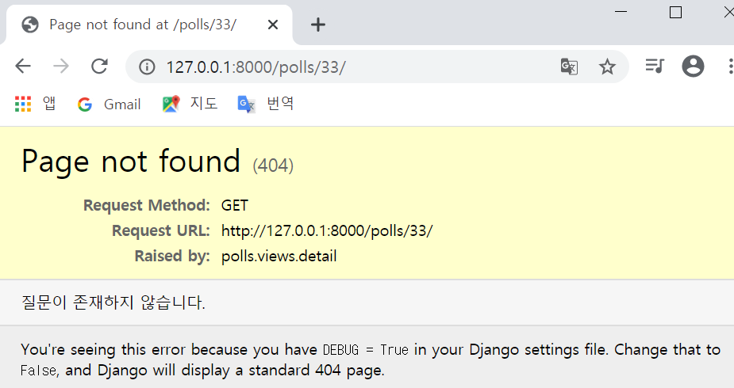
