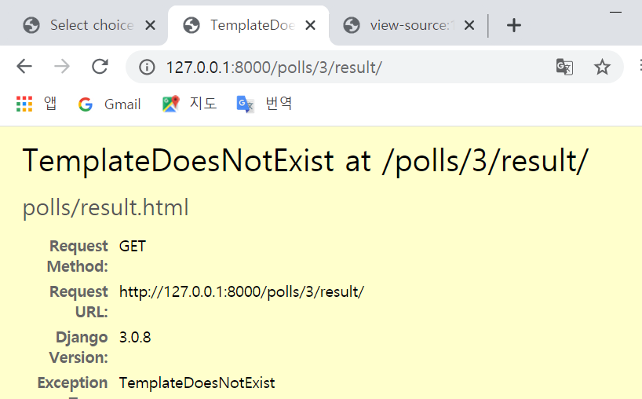

# 2020-07-08 Study

장고기간 웹 프로그래밍 (Django based Web Programming)

2020-07-08 **온라인** 강의 수업 내용

## 복습

서버 실행 ; `python manage.py runserver`

`127.0.0.1:8000/admin/polls/question`에 접속하면 총 6개의 질문지들이 있지만 `127.0.0.1:8000/polls`에 접속 시 5개만 보이는 것을 확인.

admin.py에서 models.py에 있는 Question을 연결하고자

```py
# in admin.py

from django.contrib import admin

from .models import Question # models.py에 있는 Question 불러오기

admin.site.register(Question) # admin site에 Question 등록하여 CRUD를 쉽게 하기
```

등록한 후 views.py에 보면

```py

def index(request):
    lasted_question_list = Question.objects.order_by('-pub_date')[:5]
    context = {
        'lasted_question_list': lasted_question_list
    }

    return render(request, 'polls/index.html', context)

```

메소드에 있는 `[:3]`부분을 통해 5개만 출력되는 것을 확인

### 12. 설문 조사 웹 어플리케이션 예제 실습 - 상세 페이지 구현

- **detail.html 변경**

  ```html
  <body>
    <h1>설문 상세</h1>

    {{question}}
  </body>
  ```

- **선택지 추가**

  - 관리자 페이지에서 choice를 등록하기 위해 polls/admin.py 편집

    ```py
    from django.contrib import admin

    from .models import Question, Choice

    admin.site.register(Question)
    admin.site.register(Choice)

    ```

    

  - 데이터 추가

    

- **detail.html 수정**

  ```html
  <!DOCTYPE html>
  <html lang="en">
    <head>
      <meta charset="UTF-8" />
      <title>Polls</title>
    </head>
    <body>
      <h1>설문 상세</h1>

      <h2>{{question}}</h2>

      <br />

      {{question.choice_set.all}}

      <ul>
        
        <li>{{choice.choice_text}}</li>
        
      </ul>
    </body>
  </html>
  ```

  결과 화면

  

- **선택지 출력을 했으니 라디오 형태로 나오게 하기위해 detail.html 또 수정**

  ```html
  <head>
    <meta charset="UTF-8" />
    <title>Polls</title>
    <!-- ul, li 점 없애기-->
    <style>
      ul,
      li {
        list-style: none;
      }
    </style>
  </head>

  ... ...

  <ul>
    
    <li>
      <input
        type="radio"
        name="choice"
        id="choice_{{forloop.counter}}"
        value="{{choice.id}}"
      />
      <label for="choice_{{forloop.counter}}">{{choice.choice_text}}</label>
    </li>
    
  </ul>
  ```

  결과 화면

  

- **선택한 데이터 서버로 저장**

  - polls/views.py 수정

  ```py
  from django.urls import path
  from . import views

  # app_name을 사용해서 네임스페이스 지정
  app_name = 'polls'

  urlpatterns = [
    # path 지정 '' ; polls앱 root (ex 127.0.0.1:8000/polls) / views.  index ; views.py에 만든   index파일을 호출
    # ex) /polls/
    path('', views.index, name='index'),
  ...
  ```

  - detail.html 수정

  ```html
  ...
  <!-- url 'polls:vote' 는 polls/urls.py 에 있는 polls의 name이 vote인 path를 참조한 것.-->
  <form action=" " method="post">
    <!-- csrf_token을 해주어야 forbidden이 안뜬다!!-->
    
    <ul>
      
      <li>
        <input
          type="radio"
          name="choice"
          id="choice_{{forloop.counter}}"
          value="{{choice.id}}"
        />
        <label for="choice_{{forloop.counter}}">{{choice.choice_text}}</label>
      </li>
      
    </ul>
    <button type="submit">Vote</button>
  </form>
  ...
  ```

  결과 화면

  

  

- **vote 템플릿 구성하기위해 polls/views.py 수정**

  ```py
  from django.http import HttpResponse, HttpResponseRedirect
  from .models import Question, Choice

  from django.shortcuts import get_object_or_404
  from django.urls import reverse

  ...

  def vote(request, question_id):
      #response = "You're voting on question %s." % question_id
      #return HttpResponse(response)

      question = get_object_or_404(Question, pk=question_id)

      try:
          # request.POST('choice')에서 chioice는 detail.html에서 input 속성 name을 말함.
          # question.choice_set 전체 질문들 중에서
          # get 하나를 가져올건데
          # pk=request.POST('choice') 선택된 값을 가져와서 selected_choice에 저장할 것이다.
          selected_choice = question.choice_set.get(pk=request.POST['choice'])
      except (KeyError, Choice.DoesNotExist):
          return render(request, 'polls/detail.html', {
              'question':question,
              'error_messgae': "Yor didn't select a choice."
          })
      else:
          selected_choice.votes += 1
          selected_choice.save()

          # polls/views.py에 있는 result 함수로 보내겠다.
          return HttpResponseRedirect(reverse("polls:result",args=(question.id,)))
  ```

  결과 화면

  

  데이터베이스 vote 변경 확인 화면

  

- **결과 페이지 내용 출력**

  - views.py의 result 함수 수정

    ```py
    def result(request, question_id):
      # response = "You're looking at the results of question %s."
      # return HttpResponse(response % question_id)

      question = get_object_or_404(Question, pk=question_id)
      return render(request, 'polls/result.html', {'question': question})
    ```

    결과 화면

    

    > 아직 result.html이 없으므로 에러

  - result.html 추가

    ```html
    <!DOCTYPE html>
    <html lang="en">
      <head>
        <meta charset="UTF-8" />
        <title>Polls</title>
        <style>
          ul,
          li {
            list-style: none;
          }
        </style>
      </head>
      <body>
        <h1>설문 상세</h1>

        <h2>{{question}}</h2>
        <ul>
          
          <li>
            <!-- {{choice.votes|pluralize}}를 통해서 복수개를 작성-->
            {{choice.choice_text}} -- {{choice.votes}}
            vote{{choice.votes|pluralize}}
          </li>
          
        </ul>
        <a href=" "> vote again ?</a>
        |
        <a href="">list</a>
      </body>
    </html>
    ```

    결과 화면

    

- **choice 선택 안했을 시 에러메시지 구현**

  - detail.html 수정

    ```html
    <body>
      ...

      <h1>설문 상세</h1>

      
      <strong>{{error_message}}</strong>
      

      <h2>{{question}}</h2>

      <br />
      ...
    </body>
    ```

    결과

    

### 13. 설문 조사 웹 어플리케이션 예제 실습 - generic view 사용하기

- **index view를 추가해서 index 내용을 표시해보기**

  기존에 있던 `def index(request):`는 잠시 주석처리 하거나 `def temp_index(request)`로 변경

  - polls/views.py 수정

  ```py
  # in polls/views.py

  from django.views import generic

  class IndexView(generic.ListView):
    template_name = 'polls/index.html'  # template 이름 지정
    context_object_name = 'lasted_question_list'

    def get_queryset(self):
      return Question.objects.order_by('-pub_date')[:5]

  ...
  ```

  - polls/urls.py 수정

  ```py
  # in polls/urls.py
  ...

  # ex) /polls/
  # path('', views.index, name='index'),
  # indexview 사용
  path('', views.IndexView.as_view(), name='index'),

  ...
  ```

  결과 화면

  

- **detail view를 추가해서 detail 내용을 표시해보기**

  기존에 있던 `def detail(request, question_id):`는 잠시 주석처리 하거나 `def temp_detail(request, question_id)`로 변경

  - polls/views.py 수정

  ```py
  ...

  class DetailView(generic.DetailView):
      model = Question
      template_name = 'polls/detail.html'

  ...
  ```

  - polls/urls.py 수정

  ```py
  ...

  # ex) /polls/2/
  # path('<int:question_id>/', views.detail, name='detail'),
  path('<int:pk>/', views.DetailView.as_view(), name='detail'),

  ...
  ```

- **result view 적용**

  기존에 있던 `def result(request, question_id):`는 잠시 주석처리 하거나 `def temp_result(request, question_id)`로 변경

  - polls/views.py 수정

  ```py
  ...

  class ResultView(generic.DetailView):
      model = Question
      template_name = 'polls/result.html'

  ...
  ```

  - polls/urls.py 수정

  ```py
  ...

  # ex) /polls/2/result/
  # path('<int:question_id>/result/', views.result, name='result'),
  path('<int:pk>/result/', views.ResultView.as_view(), name='result'),

  ...
  ```

### 13. 설문 조사 웹 어플리케이션 예제 실습 - 정적 파일 사용하기

- **static 폴더 만들고 그 밑에 polls폴더 그 밑에 css폴더 그 안에 main.css 파일 추가.**

  

- **구글에서 설문조사 아이콘 다운받고 static 폴더 밑에 polls 폴더 밑에 images 폴더를 만들고 그 안에 복붙.**

  

- **main.css 파일 수정**

  ```css
  body {
    background-color: gray;
  }

  li a {
    color: green;
  }

  .logo {
    height: 100px; // 이미지 크기 줄이기 위해서 사용
  }
  ```

- **index.html에 css파일 적용**

  ```html
  <head>
    <meta charset="UTF-8" />
    <title>Polls</title>
    
    <link rel="stylesheet" href="" />
  </head>
  ```

  결과 확인

  

- **index.html 이미지 올리기**

  ```html
  ...

  <body>
    <div class="logo">
      
    </div>

    
    <ul>
       ...
    </ul>
  </body>

  ...
  ```

### 14. 설문 조사 웹 어플리케이션 예제 실습 - admin 페이지 커스터마이징

- **커스터마이징 하기 위해서 admin.py 수정**

  ```py
  ...

  # admin.site.register(Question)
  admin.site.register(Choice)

  class QuestionAdmin(admin.ModelAdmin):
    fieldsets = [
      (None, {
        'fields': ['question_text']
      }),
      ('Date information', {
        'fields':['pub_date']
      }),
    ]

  admin.site.register(Question, QuestionAdmin)

  ...
  ```

  결과 확인 (차이 확인)

  

  

- **다른 클래스 만들기 위해 admin.py 수정**

  ```py
  ...

  class ChoiceInline(admin.StackedInline):
      model = Choice
      extra = 3   # 기본적으로 3개의 값을 추가할 수 있도록 만들어줌

  class QuestionAdmin(admin.ModelAdmin):
      fieldsets = [
          (None, {
              'fields': ['question_text']
          }),
          ('Date information', {
              'fields':['pub_date']
          })
      ]

      inlines = [ChoiceInline]

  ...
  ```

  결과 화면

  

- **다른 속성 부여하기 위해 admin.py 수정**

  ```py
  ...

  # class ChoiceInline(admin.StackedInline):
  #     model = Choice
  #     extra = 3   # 기본적으로 3개의 값을 추가할 수 있도록 만들어줌

  class ChoiceInline(admin.TabularInline):
      model = Choice
      extra = 3   # 기본적으로 3개의 값을 추가할 수 있도록 만들어줌

  ...
  ```

  결과 화면

  

- **정렬 커스터마이징**

  ```py
  # in polls/admin.py
  ...

  class QuestionAdmin(admin.ModelAdmin):
      fieldsets = [
          (None, {
              'fields': ['question_text']
          }),
          ('Date information', {
              'fields':['pub_date']
          }),
      ]

      # was_published_recently는 models.py에 있는 Question 클래스에 존재하는 메소드
      list_display = ('question_text', 'pub_date', 'was_published_recently')
      inlines = [ChoiceInline]

  ...

  ```

  결과 확인

  

  

### 15. 설문 조사 웹 어플리케이션 예제 실습 - 필터 기능 추가

- **polls/admin.py 수정**

  ```py
  ...

  class QuestionAdmin(admin.ModelAdmin):
      fieldsets = [
          (None, {
              'fields': ['question_text']
          }),
          ('Date information', {
              'fields':['pub_date']
          }),
      ]

      # was_published_recently는 models.py에 있는 Question 클래스에 존재하는 메소드
      list_display = ('question_text', 'pub_date', 'was_published_recently')
      inlines = [ChoiceInline]

      # pub_date에 대해서 필터 추가
      list_filter = ['pub_date']

  ...
  ```

  결과 화면

  

### 16. 설문 조사 웹 어플리케이션 예제 실습 - 검색 기능 추가

- **polls/admin.py 수정**

  ```py
  ...

  class QuestionAdmin(admin.ModelAdmin):
      fieldsets = [
          (None, {
              'fields': ['question_text']
          }),
          ('Date information', {
              'fields':['pub_date']
          }),
      ]

      # was_published_recently는 models.py에 있는 Question 클래스에 존재하는 메소드
      list_display = ('question_text', 'pub_date', 'was_published_recently')
      inlines = [ChoiceInline]

      # pub_date에 대해서 필터 추가
      list_filter = ['pub_date']
      # question_text에 대해서 검색 기능 추가
      search_fields = ['question_text']

  ...
  ```

  결과 확인

  

  > choice에 대해서도 기능을 추가하고 싶으면 polls/admin.py 에서 choiceAdmin란 클래스를 새로 만들어서 questionAdmin과 같이 해주면 된다.

### 17. 북마크 관리 프로젝트 만들기

- **새 프로젝트 생성**

  이름은 `bookmark`로 설정

- **django 설치**

  `pip install django`

- **장고 프로젝트 선언**

  `django-admin startproject config .`

- **sqlite 데이터베이스 생성**

  `python manage.py migrate`

- **관리자 계정 생성**

  `python manage.py createsuperuser`

- **bookmark라는 앱 추가**

  `python manage.py startapp bookmark`

- **erd로 데이터베이스 모델링**

  

- **모델링을 위해 models.py 수정**

  ```py
  from django.db import models

  # Create your models here.

  class Bookmark(models.Model):
    site_name = models.CharField(max_length=100)

    # django에서는 http://exma...과 같은 형식을 지원해주는 스키마지정이 있다.
    url = models.URLField('Site URL')
  ```

- **django 프로젝트에 만든 bookmark app 추가**

  django 프로젝트인 config에 있는 settings.py에 INSTALLED_APPS에 bookmark 추가

  ```py
  ...

  INSTALLED_APPS = [
    'django.contrib.admin',
    'django.contrib.auth',
    'django.contrib.contenttypes',
    'django.contrib.sessions',
    'django.contrib.messages',
    'django.contrib.staticfiles',
    'bookmark',
  ]

  ...
  ```

- **추가한 bookmark 모델을 sqlite3에 마이그레이션**

  `python manage.py makemigrations bookmark`

- **번외) cmd에서 마이그레이션 해보기**

  

  위 사진처럼 show in explorer를 누르면 해당 폴더 위치의 탐색기가 나온다. bookmark 폴더로 들어가서 탐색 경로부분에 cmd를 치면 현재 위치에 해당하는 경로를 가진 cmd창이 열린다.

  

  해당 위치에서 `python manage.py makemigrations bookmark`를 누르면 아래와 같이 오류 발생

  

  여태까지 우리는 가상환경에서 진행을 했기 때문.

  따라서 가상환경을 실행.

  

  

  가상환경에서 마이그레이션 진행

  

  > 이미 pycharm에서 실행한 후 이므로 변화한게 없다고 나온다. 실행안하면 마이그레이션 진행 ok.

  마이그레이션을 하면

  

  처럼 0001-initial.py 파일이 생김.

  이제 프로젝트에서 진행한 마이그레이션을 실제 db에 마이그레이션하기 전에 이럴 경우도 생김. 실제 변경된 파일이 어떤 변경이 이루어졌는지 확인해야하는 경우

  `python manage.py sqlmigrate bookmark 0001`

  

  이제 진짜 실제 db로 마이그레이션

  `python manage.py migrate bookmark`

  

  HeidiSQL을 이용해서 확인하면

  

  만약 여기서 bookmark 모델에서 comments라는 추가하려면

  ```py
  class Bookmark(models.Model):
    site_name = models.CharField(max_length=100)

    # django에서는 http://exma...과 같은 형식을 지원해주는 스키마지정이 있다.
    url = models.URLField('Site URL')

    # comments 추가
    comments = models.CharField(max_length=255)

  ```

  추가한 내용을 적용시켜야 하므로 `python manage.py makemigrations bookmark`

  

  하면 사진과 마찬가지로 어떻게 할것이냐? 라고 물어본다.  
  **왜?**  
  구조가 변경되었으니까.

  ```
  물어보는 것은 기존의 구조로 데이터를 가지고 있을 수도 있고 없을 수도 있지만 comments라는 필드를 추가해서 구조가 변경되었을 때 기존에 있던 데이터에는 comments라는 필드값을 어떻게 디폴트로 설정할거야?? 라고 묻는것.
  ```

  

  사진과 같이 1번을 선택한 후 default 값을 '' (공백)으로 지정해주면 마이그레이션 완료. 그 변경에 대해서는 0002에 저장됨.(밑 사진 참고)

  

  이 후 `python manage.py sqlmigrate bookmark 0002`를 해주어 변경 사항 확인

  변경 사항을 직접 확인해 보자! 최상위 bookmark 폴더에 sample.sql 파일을 만들어서 변경사항내용을 복붙

  

  변경내용을 잘 살펴보면 기존에 있던 테이블앞에 new**를 붙혀서 임시로 복사할 테이블을 만들고 그 테이블에 기존에 있던 데이터들을 복사하는데 comments는 ''(공백)으로 복사한다.  
  그러고 기존에 있던 db인 bookmark는 삭제하고  
  임시로 만들어진 new**bookmark를 bookmark로 변경(alter)

  이제 쿼리를 실행해보자

  `python manage.py migrate bookmark 0002`

  

  HiediSQL로 확인해봐도 comments가 필드로 자리잡혀 있는 것을 확인 가능.

- **관리자 페이지에 bookmark를 편집할수 있도록 bookmark/admin.py 수정**

  ```py
  from django.contrib import admin

  # Register your models here.

  from .models import Bookmark

  admin.site.register(Bookmark)
  ```

  

  bookmark 내용 추가

  

- **bookmark를 toString 메소드를 추가하여 이쁘게 나오게 하기위해 models.py 수정**

  ```py
  ...

  class Bookmark(models.Model):
    site_name = models.CharField(max_length=100)

    # django에서는 http://exma...과 같은 형식을 지원해주는 스키마지정이 있다.
    url = models.URLField('Site URL')

    def __str__(self):
        return "이름: " + self.site_name + ", 주소: " + self.url

  ...
  ```

  확인

  

- **실제 유저(프론트)에서 목록을 볼 수 있도록 템플릿생성**

  루트 bookmark폴더 밑에 bookmark 폴더 밑에 templates 폴더를 만들고 그 밑에 list.html 생성

  ```html
  <!DOCTYPE html>
  <html lang="en">
    <head>
      <meta charset="UTF-8" />
      <title>북마크</title>
    </head>
    <body>
      <h1>북마크 관리</h1>
    </body>
  </html>
  ```

- **view 파일 만들기위해 views.py 수정**

  ```py
  from django.shortcuts import render

  # Create your views here.

  from django.views.generic.list import ListView

  class BookmarkListView(ListView):
    # templates 폴더 밑에 있는 bookmark 밑에 list.html을 참조
    template_name = 'bookmark/list.html'
  ```

- **bookmark url 지정**

  bookmark app밑에 urls.py 생성한 후 편집

  ```py
  from django.contrib import admin
  from django.urls import path

  from .views import BookmarkListView

  urlpatterns = [
    path('', BookmarkListView.as_view(), name="list"),
  ]
  ```

- **django 프로젝트 urls에 url지정**

  ```py

  from django.contrib import admin
  from django.urls import path

  from django.urls import include

  urlpatterns = [
    path('admin/', admin.site.urls),
    path('bookmark/', include('bookmark.urls'))
  ]

  ```

  

- **모델이 없다고 에러가 나므로 모델 지정하기위해 views.py 수정**

  ```py
  ...

  # bookmark import
  from .models import Bookmark

  class BookmarkListView(ListView):
    # templates 폴더 밑에 있는 bookmark 밑에 list.html을 참조
    template_name = 'bookmark/list.html'
    # 모델 추가
    model = Bookmark
  ```

  

- **코드 간결화**

  `template_name = 'bookmark/list.html'`를 일부러 오타 내면 밑에와 같은 에러를 내뿜는다.

  

  에러 내용을 읽어보면 **bookmark/list.html, bookmark_list.html**을 찾을 수 없다고 나와있다.

  의문은 bookmark/list.html은 내가 지정해준건데 bookmark_list.html은??

  **default로 참조하는 파일명.**

  따라서 template view 파일명을 bookmark_list.html로 바꾸면 `template_name= 'bookmark/list.html'`이 없어도 정상 동작한다.

  따라서 이름 바꾸고 views.py 수정

  ```py
  class BookmarkListView(ListView):
    # templates 폴더 밑에 있는 bookmark 밑에 list.html을 참조
    # template_name = 'bookmark/list.html'
    # 모델 추가
    model = Bookmark
  ```

  정상 동작한다.

- **데이터 templates에 데이터를 뿌리기 위해 views.py 에 context_object_name 지정**

  ```py
  class BookmarkListView(ListView):
    # templates 폴더 밑에 있는 bookmark 밑에 list.html을 참조
    # template_name = 'bookmark/list.html'
    # 모델 추가
    model = Bookmark
    # 컨텍스트 추가
    context_object_name = 'bookmark_list'
  ```

  ```html
  ...

  <body>
    <h1>북마크 관리</h1>

    {{bookmark_list}}
  </body>

  ...
  ```

- **bookmark_list.html에 ui 입히기**

  ```html
  ...

  <body>
    <h1>북마크 관리</h1>

    {{bookmark_list}}
    <p />
    <table>
      <thead>
        <tr>
          <th scope="col">#</th>
          <th scope="col">Site</th>
          <th scope="col">URL</th>
        </tr>
      </thead>
      <tbody>
        
        <tr>
          <td>
            {{forloop.counter}}
          </td>
          <td>
            <a href="#">{{bookmark.site_name}}</a>
          </td>
          <td>
            <a href="#">{{bookmark.url}}</a>
          </td>
        </tr>
        
      </tbody>
    </table>
  </body>

  ...
  ```

  결과 화면

  

- **수정 삭제 버튼 추가**

  ```html
  <!-- in bookmark_list.html -->
  <body>
    <h1>북마크 관리</h1>

    {{bookmark_list}}
    <p />
  </body>
  ```


    <div>
      <a href="#">북마크 추가하기</a>
    </div>

    <p/>

    <table>
      <thead>
        <tr>
          <th scope="col">#</th>
          <th scope="col">Site</th>
          <th scope="col">URL</th>
          <th scope="col">수정</th>
          <th scope="col">삭제</th>
        </tr>
      </thead>
      <tbody>
        
          <tr>
            <td>
              {{forloop.counter}}
            </td>
            <td>
              <a href="#">{{bookmark.site_name}}</a>
            </td>
            <td>
              <a href="#">{{bookmark.url}}</a>
            </td>
            <td>
              <a href="#">수정</a>
            </td>
            <td>
              <a href="#">삭제</a>
            </td>
          </tr>
        
      </tbody>
    </table>

  </body>
  ```

결과 화면


- **북마크 create 페이지 만들기**

  templates폴더에 `bookmark_add.html` 파일 생성 후

  view를 연결해주기 위해 `views.py` 수정

  ```py

  from django.views.generic.list import ListView
  from django.views.generic.edit import CreateView

  ...

  # class craete bookmark 추가
  class BookmarkCreateView(CreateView):
    model = Bookmark
  ```

  url 연결해주기 위해 `bookmark/urls.py` 수정

  ```py

  from .views import BookmarkListView, BookmarkCreateView

  urlpatterns = [
    path('', BookmarkListView.as_view(), name="list"),
    path('add/', BookmarkCreateView.as_view(), name="add"),
  ]
  ```

  이제 링크로 이동하기 위해서 `bookmark_list.html` 수정

  ```html
  ...

  <div>
    <!-- <a href="/bookmark/add/">북마크 추가하기</a> -->
    <!-- 조금더 동적으로 연결해보자 django 스럽게-->
    <a href="">북마크 추가하기</a>
  </div>

  ...
  ```

  결과 화면
  

  필드가 필요하다고 한다.

  왜? create는 데이터를 생성하려는거니까 입력값이 필요.

  어떤 입력값이 있어야 하는지 정보가 필요.

- **views.py에 field 셋팅**

  ```py
  class BookmarkCreateView(CreateView):
    model = Bookmark
    # 필드 추가
    fields = ['site_name', 'url']
  ```

  

  이제는 `bookmark_form.html`이 필요하다고 함.

  따라서 `bookmark_create.html`을 `bookmark_form.html`으로 변경

  

  하지만 북마크 추가가 아닌 수정할 때도 `bookmark_form.html`이 필요하다고 함.

  겹치면 안되니까 북마크 추가를 그냥 `bookmark_create.html`로 지정하고 `views.py` 수정

  ```py
  class BookmarkCreateView(CreateView):
    model = Bookmark
    # 필드 추가
    fields = ['site_name', 'url']
    # templates suffix 추가
    template_name_suffix = '_create'
  ```

  정상적으로 동작하는 것을 확인.

- **북마크 추가 페이지 ui 삽입**

  ```html
  <!DOCTYPE html>
  <html lang="en">
    <head>
      <meta charset="UTF-8" />
      <title>북마크</title>
    </head>
    <body>
      <h1>북마크 추가하기</h1>

      <form method="post">
        <!-- views.py에 BookmarkCreateView에서 fields에 있는 값에 의해 결정-->
        {{form.as_p}}
        <button type="submit">저장</button>
      </form>
    </body>
  </html>
  ```

  결과 확인

  

- **데이터 넣어보기**

  사진에서 Site name과 Site url에 아무 값이나 입력해서 넣고 저장버튼을 누르면 에러 발생.

  

  CSRF token이 missing 났다.

  빨간색 박스를 보면 form tag 밑에 추가하라는 말이 있다.

  다시 `bookmark_create.html` 수정

  ```html
  ...

  <form method="post">
    <!-- csrf 토큰 추가-->
    
    <!-- views.py에 BookmarkCreateView에서 fields에 있는 값에 의해 결정-->
    {{form.as_p}}
    <button type="submit">저장</button>
  </form>

  ...
  ```

  결과 화면

  

  리다이렉션 에러 발생. django에 의해 편리하게 값은 저장되었지만 리다이렉션을 안해주어서 에러 발생.

- **리다이렉션 추가**

  `views.py` 편집

  ```py
  from django.views.generic.list import ListView
  from django.views.generic.edit import CreateView
  # reverse_lazy 추가
  from django.urls import reverse_lazy

  ...

  class BookmarkCreateView(CreateView):
    model = Bookmark
    # 필드 추가
    fields = ['site_name', 'url']
    # templates suffix 추가
    template_name_suffix = '_create'

    # 리다이렉션 reverse 추가
    # 저장이 성공(success)할 시
    # list(bookmark/urls.py에 있는 name인 list)로 가라.
    success_url = reverse_lazy('list')
  ```

  

- **상세 페이지 작성**

  `views.py`에서 상세 페이지에 관한 클래스 추가

  ```py
  ...

  from django.views.generic.edit import CreateView
  from django.views.generic.detail import DetailView
  from django.urls import reverse_lazy

  ...

  class BookmarkDetailView(DetailView):
    model = Bookmark
  ```

  url 추가 `urls.py`

  ```py
  from .views import BookmarkListView, BookmarkCreateView, BookmarkDetailView

  urlpatterns = [
    path('', BookmarkListView.as_view(), name="list"),
    path('add/', BookmarkCreateView.as_view(), name="add"),
    path('detail/<int:pk>/', BookmarkDetailView.as_view(), name="detail"),
  ]
  ```

  연결할 링크를 `bookmark_list.html`에서 수정

  ```html
  ...

  <td>
    {{forloop.counter}}
  </td>
  <td>
    <!--  <a href="/bookmark/detail/{{bookmark.id}}">{{bookmark.site_name}}</a>-->
    <a href="">{{bookmark.site_name}}</a>
  </td>
  <td>
    <a href="#">{{bookmark.url}}</a>
  </td>

  ...
  ```

  결과 화면

  

  에러를 보면 `bookmark_detail.html`이 없다고 에러를 뿜음.

- **bookmark_detail.html 생성**

  ```html
  <!DOCTYPE html>
  <html lang="en">
    <head>
      <meta charset="UTF-8" />
      <title>북마크</title>
    </head>
    <body>
      <h1>북마크 상세 정보</h1>

      <p>
        <!-- object는 views.py에서 context_object_name을 지정해주지 않아서 이렇게 사용 물론 다른 클래스도 싹 다 가능하다.-->
        이름: {{object.site_name}}
      </p>
      <p>
        주소: {{object.url}}
      </p>
    </body>
  </html>
  ```

  결과 화면

  

- **수정 페이지 작성**

  `bookmark/views.py` 수정

  ```py
  from django.views.generic.edit import CreateView, UpdateView

  ...

  class BookmarkUpdateView(UpdateView):
    model = Bookmark
  ```

  url 지정하기 위해 urls.py 수정

  ```py
  from .views import BookmarkListView, BookmarkCreateView, BookmarkDetailView, BookmarkUpdateView

  urlpatterns = [
    path('', BookmarkListView.as_view(), name="list"),
    path('add/', BookmarkCreateView.as_view(), name="add"),
    path('detail/<int:pk>/', BookmarkDetailView.as_view(), name="detail"),
    path('update/<int:pk>/', BookmarkUpdateView.as_view(), name="update"),
  ]
  ```

  `bookmark_list.html`에서 링크 수정

  ```html
  ...

  <td>
    <a href="">수정</a>
  </td>
  <td>
    <a href="#">삭제</a>
  </td>

  ...
  ```

  수정 버튼을 누르고

  결과 화면

  

  에러를 보면 create 때와 마찬가지로 fields를 지정해주라고 나옴.

  다시 `views.py`수정

  ```py
  class BookmarkUpdateView(UpdateView):
    model = Bookmark
    fields = ['site_name', 'url']
  ```

  결과 화면

  

  에러를 보면 `bookmark_form.html`을 만들라고 한다.  
  create때와 마찬가지로 suffix를 이용해서 `bookmark_update.html`을 사용하도록 함.

  ```py
  class BookmarkUpdateView(UpdateView):
    model = Bookmark
    fields = ['site_name', 'url']
    template_name_suffix = '_update'
  ```

  `bookmark_update.html`생성 후 편집

  ```html
  <!DOCTYPE html>
  <html lang="en">
    <head>
      <meta charset="UTF-8" />
      <title>북마크</title>
    </head>
    <body>
      <h1>북마크 추가</h1>

      <form method="post">
         {{form.as_p}}
        <button type="submit">저장</button>
      </form>
    </body>
  </html>
  ```

  결과 확인

  

- **수정한 것을 저장 후 리다이렉션 추가**

  `success_url`을 지정할 수 있지만 `get_absolute_url`로도 가능. 이번엔 `get_absolute_url` 사용해서 리다이렉션

  `get_absolute_url`는 models.py에서 Bookmark클래스에 추가하여야 한다.

  models.py 수정

  ```py
  from django.db import models

  from django.urls import reverse
  # Create your models here.

  class Bookmark(models.Model):
  site_name = models.CharField(max_length=100)

    # django에서는 http://exma...과 같은 형식을 지원해주는 스키마지정이 있다.
    url = models.URLField('Site URL')

    def __str__(self):
      return "이름: " + self.site_name + ", 주소: " + self.url

    def get_absolute_url(self):
      return reverse('detail', args=[str(self.id)])
  ```

  이렇게 하면 detail 페이지로 수정된 값으로 잘 넘어가는 것을 확인할 수 있다.

- **상세 페이지에서 목록 페이지로**

  `bookmark_detail.html` 수정

  ```html
  ...

  <h1>북마크 상세 정보</h1>

  <p>
    이름: {{object.site_name}}
  </p>
  <p>
    주소: {{object.url}}
  </p>

  <div>
    <a href="">목록</a>
  </div>

  ...
  ```

- **북마크 삭제 구현**

  삭제 페이지 url과 view를 만들기

  `views.py` 수정

  ```py
  ...

  # deleteview import
  from django.views.generic.edit import CreateView, UpdateView, DeleteView

  ...

  class BookmarkDeleteView(DeleteView):
    model = Bookmark

  ...
  ```

  `urls.py` 수정

  ```py
  ...

  from .views import BookmarkListView, BookmarkCreateView, BookmarkDetailView, BookmarkUpdateView, BookmarkDeleteView

  urlpatterns = [
    path('', BookmarkListView.as_view(), name="list"),
    path('add/', BookmarkCreateView.as_view(), name="add"),
    path('detail/<int:pk>/', BookmarkDetailView.as_view(), name="detail"),
    path('update/<int:pk>/', BookmarkUpdateView.as_view(), name="update"),

    # delete view 추가
    path('delete/<int:pk>/', BookmarkDeleteView.as_view(), name="delete"),
  ]
  ```

  - urls 컨버터 종류

    `<int:pk>`와 같은 것들이 몇개 더 있다.

    - str : 비어있지 않은 모든 문자와 매칭('/'는 제외)
    - int : 0을 포함한 양의 정수와 매칭
    - slug : 아스키 문자나 숫자, 하이픈, 언더스코어를 포함한 슬러그 문자열과 매칭
    - uuid : UUID와 매칭, 같은 페이지에 여러 URL이 연결 되는 것을 막으려고 사용

  다시 본문으로..

  `bookmark_list.html` 수정

  ```html
  ...

  <td>
    <a href="">수정</a>
  </td>
  <td>
    <!-- 삭제 링크 추가-->
    <a href="">삭제</a>
  </td>

  ...
  ```

  결과 화면

  

  결과 화면을 보면 `bookmark_confirm_delete.html`이 필요하다고 한다.

- **`bookmark_confirm_delete.hmtl` 구현**

  templates/bookmark에 `bookmark_confirm_delete.html` 생성 후 편집

  ```html
  <!-- detail.html 참고해서 수정-->
  <!DOCTYPE html>
  <html lang="en">
  <head>
    <meta charset="UTF-8">
    <title>북마크</title>
  </head>
  <body>
    <h1>북마크 삭제</h1>

    <p>북마크를 삭제하시겠습니까? ({{object}})</p>

    <form method="post">
        
        <button type="submit">삭제</button>
    </form>

    </p>

    <div>
        <a href="">목록</a>
    </div>
  </body>
  </html>
  ```

  결과 화면

  

  삭제 버튼을 누르면?

  

  삭제는 제대로 진행되었지만 삭제를 완료 후 리다이렉션이 필요(어디로 갈지 - success url)

- **success url 지정**

  `views.py` 수정

  ```py
  class BookmarkDeleteView(DeleteView):
    model = Bookmark
    # 리다이렉션을 하는데 url name이 list인 것을 찾아서 가라.
    success_url = reverse_lazy('list')
  ```

  성공적으로 리다이렉션하는 것을 확인.

- **template 리팩토링**

  보면 html이 총 5개가 있다. 하지만 html title은 모두 같아야 하는데 5개를 전부다 일일이 바꿔주기 귀찮다.

  즉, 공통적으로 쓰이는 것은 공통적으로 관리를 하자!

  프로젝트(bookmark) 밑으로 templates 폴더를 만들고 `base.html` 이란 파일을 만들어서 관리

  ```html
  <!DOCTYPE html>
  <html lang="en">
    <head>
      <meta charset="UTF-8" />
      <title>북마크 관리</title>
    </head>
    <body></body>
  </html>
  ```

  </body>
  </html>
  ```

일단 이렇게 만들고 이 `base.html`이 템플릿 파일이라는 것을 적용시켜주기 위해서 `config/settings.py` 에서 `TEMPLATES` 수정

```py
...

TEMPLATES = [
  {
    'BACKEND': 'django.template.backends.django.DjangoTemplates',
    # templates 파일 경로 지정
    'DIRS': [os.path.join(BASE_DIR, 'templates')],
    'APP_DIRS': True,
    'OPTIONS': {
        'context_processors': [
            'django.template.context_processors.debug',

...
```

이제 base.html 편집

```html
...

<body>
  
  <!-- 컨텐츠 영역 이제 이 영역만 바뀌는 것을 확인.-->
  
</body>

...
```

하나의 예시로 `bookmark_create.html` 편집

```html
<!-- 원래있던 !DOCTYPE html 태그 다 지우고 base.html의 확장이라고 선언-->
 
<h1>북마크 추가하기</h1>

<form method="post">
  <!-- csrf 토큰 추가-->
  
  <!-- views.py에 BookmarkCreateView에서 fields에 있는 값에 의해 결정-->
  {{form.as_p}}
  <button type="submit">저장</button>
</form>

```

잘 실행되는 것을 확인할 수 있다.

> title도 ` `로 가능

- **디자인 입히기 - bootstrap 적용**

  getbootstrap.com 사이트에 접속하여 get started에서 css `<link>`태그된 부분을 복사하여 `base.html`에 입력

  ```html
  ...

  <head>
    <meta charset="UTF-8" />
    <title>북마크 관리</title>
    <link
      rel="stylesheet"
      href="https://stackpath.bootstrapcdn.com/bootstrap/4.5.0/css/bootstrap.min.css"
      integrity="sha384-9aIt2nRpC12Uk9gS9baDl411NQApFmC26EwAOH8WgZl5MYYxFfc+NcPb1dKGj7Sk"
      crossorigin="anonymous"
    />
  </head>

  ...
  ```

  JS `<script>`태그 부분도 복사하여 `base.html`에 입력

  ```html
  ...

  <head>
    <meta charset="UTF-8" />
    <title>북마크 관리</title>
    <link
      rel="stylesheet"
      href="https://stackpath.bootstrapcdn.com/bootstrap/4.5.0/css/bootstrap.min.css"
      integrity="sha384-9aIt2nRpC12Uk9gS9baDl411NQApFmC26EwAOH8WgZl5MYYxFfc+NcPb1dKGj7Sk"
      crossorigin="anonymous"
    />

    <script
      src="https://code.jquery.com/jquery-3.5.1.slim.min.js"
      integrity="sha384-DfXdz2htPH0lsSSs5nCTpuj/zy4C+OGpamoFVy38MVBnE+IbbVYUew+OrCXaRkfj"
      crossorigin="anonymous"
    ></script>
    <script
      src="https://cdn.jsdelivr.net/npm/popper.js@1.16.0/dist/umd/popper.min.js"
      integrity="sha384-Q6E9RHvbIyZFJoft+2mJbHaEWldlvI9IOYy5n3zV9zzTtmI3UksdQRVvoxMfooAo"
      crossorigin="anonymous"
    ></script>
    <script
      src="https://stackpath.bootstrapcdn.com/bootstrap/4.5.0/js/bootstrap.min.js"
      integrity="sha384-OgVRvuATP1z7JjHLkuOU7Xw704+h835Lr+6QL9UvYjZE3Ipu6Tp75j7Bh/kR0JKI"
      crossorigin="anonymous"
    ></script>
  </head>

  ...
  ```

- **`bookmark_list.html`에 디자인 입히기**

  원래 화면

  

  `bookmark_list.html` 수정

  ```html
  ...

  <!-- table이라는 class 명 추가-->
  <table class="table">
    ...
  </table>
  ```

  디자인 적용 화면

  

  북마크 추가하기인 `<a>` 태그에 버튼 디자인 입히기

  ```html
  <div>
    <!-- <a href="/bookmark/add/">북마크 추가하기</a> -->
    <a href="" class="btn btn-info">북마크 추가하기</a>
  </div>
  ```

  

> 나머지 디자인은 코드를 보고 확인!
