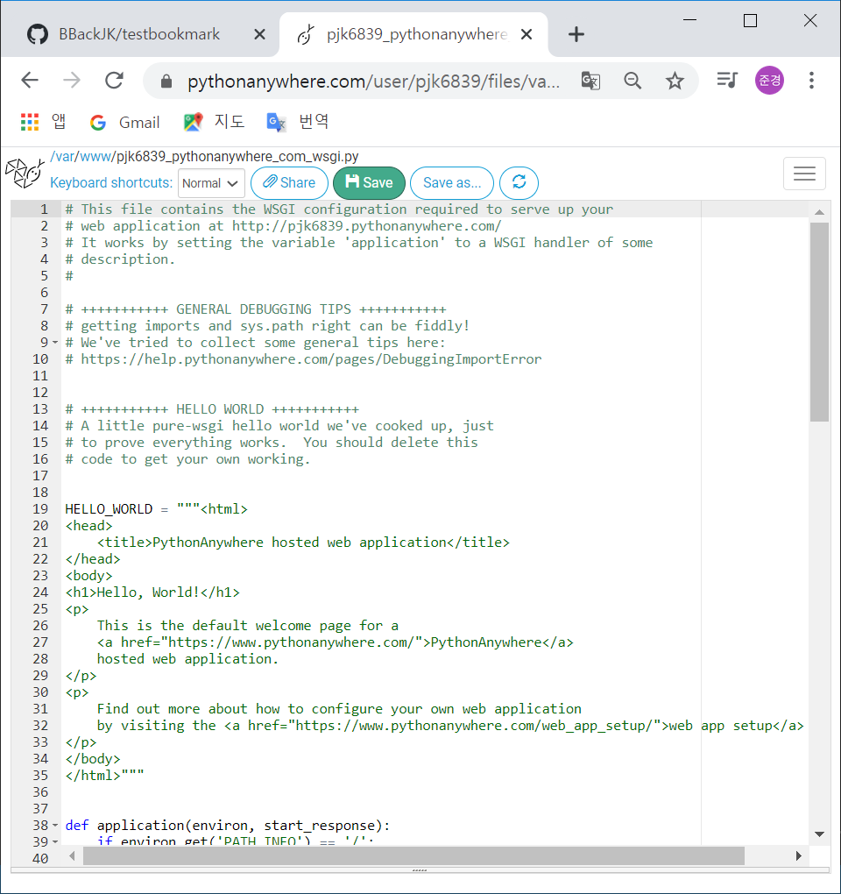
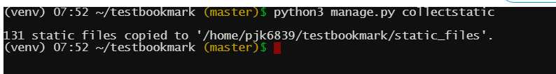

# 2020-07-15 Study

장고기간 웹 프로그래밍 (Django based Web Programming)

2020-07-15 **온라인** 강의 수업 내용  


### 북마크 관리 프로젝트 2  

- **네비게이션 추가**

    ``base.html`` 수정

    bootstrap - navbar를 카피해서 ``base.html`` body태그 안에다가 복붙

    ```html
    ...

    <body>
        <div class="container">
            <nav class="navbar navbar-expand-lg navbar-light bg-light">
            <a class="navbar-brand" href="/bookmark/">북마크 관리</a>
            <button class="navbar-toggler" type="button" data-toggle="collapse" data-target="#navbarSupportedContent" aria-controls="navbarSupportedContent" aria-expanded="false" aria-label="Toggle navigation">
                <span class="navbar-toggler-icon"></span>
            </button>

            <div class="collapse navbar-collapse" id="navbarSupportedContent">
                <ul class="navbar-nav mr-auto">
                <li class="nav-item active">
                    <a class="nav-link" href="/bookmark/"> 홈 <span class="sr-only">(current)</span></a>
                </li>
            </div>
            </nav>

            <div class="row">
                <div class="col">
                    
                        <!-- 컨텐츠 영역 이제 이 영역만 바뀌는 것을 확인.-->
                    
                </div>
            </div>
        </div>
    </body>

    ...
    ```  

    결과 화면

      
    

- **버튼 스타일 추가**  

    ``bookmark_create.html`` 수정  

    ```html
    ...

    <form method="post">
        <!-- csrf 토큰 추가-->
        
        <!-- views.py에 BookmarkCreateView에서 fields에 있는 값에 의해 결정-->
        {{form.as_p}}
        <!--<button type="submit">저장</button> -->
        <button type="submit" class="btn btn-success">저장</button>
    </form>

    ...
    ```

    결과 화면

      


- **리스트 페이지 페이징 처리하기**  

    ``views.py`` 수정하여 페이징기능 추가하기

    ```py
    class BookmarkListView(ListView):
        # templates 폴더 밑에 있는 bookmark 밑에 list.html을 참조
        # template_name = 'bookmark/list.html'
        # 모델 추가
        model = Bookmark
        # 컨텍스트 추가
        context_object_name = 'bookmark_list'
        # 페이징 기능 추가
        paginate_by = 5
    ```

    ``base.html`` 에 paginated 추가

    ```html
    ...

    <div class="row">
        <div class="col">
            
                <!-- 컨텐츠 영역 이제 이 영역만 바뀌는 것을 확인.-->
            

            
                <!-- 페이지네이트 기능 추가할 곳은 이것을 사용 -->
            
        </div>
    </div>

    ...
    ```

    페이징 처리를 하기 위해 ``bookmark_list.html`` 수정  

    ```html
    

    ...

    

    

        
            
                <a href="{{ request.path }}?page={{forloop.counter}}">
                    {{forloop.counter}}
                </a>
            
        

        <p>
            is_paginated: {{is_paginated}}
        </p>

        <p>
            page_obj.has_previous: {{page_obj.has_previous}}
        </p>

        <p>
            page_obj.has_next: {{page_obj.has_next}}
        </p>

        <p>
            page_obj.paginator: {{page_obj.paginator.page_range}}
        </p>

    
    ```  
    
    결과 화면  

        


- **페이지 디자인 입히기**  

    bootstrap에서 pagination을 검색 후 바로 있는 코드를 ``bookmark_list.html``에 복붙한 다음에 수정  

    ```html
    ...

    
        
            <ul class="pagination justify-content-center">
                <li class="page-item"><a class="page-link" href="#">Previous</a></li>
                
                    <li class="page-item">
                        <a class="page-link" href="{{ request.path }}?page={{forloop.counter}}">
                            {{forloop.counter}}
                        </a>
                    </li>
                
                <li class="page-item"><a class="page-link" href="#">Next</a></li>
            </ul>
        

        <p>
            is_paginated: {{is_paginated}}
        </p>

        <p>
            page_obj.has_previous: {{page_obj.has_previous}}
        </p>

        <p>
            page_obj.has_next: {{page_obj.has_next}}
        </p>

        <p>
            page_obj.paginator: {{page_obj.paginator.page_range}}
        </p>

    
    ```  

    결과 화면 

      

- **prev, next 버튼 기능 추가하기**  

    ``bookmark_list.html`` 수정

    ```html
    
        
            <ul class="pagination justify-content-center">

                
                    <li class="page-item">
                        <a class="page-link" href="?page={{page_obj.previous_page_number}}">
                            Previous
                        </a>
                    </li>
                
                    <li class="page-item disabled">
                        <a class="page-link" href="#" tabindex="-1">
                            Previous
                        </a>
                    </li>
                

                
                    <li class="page-item">
                        <a class="page-link" href="{{ request.path }}?page={{forloop.counter}}">
                            {{forloop.counter}}
                        </a>
                    </li>
                

                
                    <li class="page-item">
                        <a class="page-link" href="?page={{page_obj.next_page_number}}">
                            Next
                        </a>
                    </li>
                
                    <li class="page-item disabled">
                        <a class="page-link" href="#" tabindex="-1">
                            Next
                        </a>
                    </li>
                
            </ul>
        

    ...
    ```  

    결과 화면  

      

      

- **현재 페이지는 disabled(클릭안되게) 처리하기**  

    ``bookmark_list.html`` 수정

    ```html
    
        
            <li class="page-item disabled">
                <a class="page-link" href="#" tabindex="-1">
                    {{forloop.counter}}
                </a>
            </li>
        
            <li class="page-item">
                <a class="page-link" href="{{ request.path }}?page={{forloop.counter}}">
                    {{forloop.counter}}
                </a>
            </li>
        
    
    ```

- **정적파일 추가해보기**  

    정적파일을 추가하기 위해서는 ``config/settings.py``에 정적파일경로를 설정해주어야 한다.

    ```py
    # 추가 하기
    STATICFILES_DIRS = [os.path.join(BASE_DIR, 'static')]
    ```  

    그 다음 사진과 같은 구조로 ``main.css`` 생성  

      

    그 후 수정 

    ```py
    body {
        background-color: darkgray;
        font-size: 14px;
    }
    ```

    ``base.html``에 static main.css 파일 적용

    ```html
    <head>
    ...

        <script src="https://code.jquery.com/jquery-3.5.1.slim.min.js" integrity="sha384-DfXdz2htPH0lsSSs5nCTpuj/zy4C+OGpamoFVy38MVBnE+IbbVYUew+OrCXaRkfj" crossorigin="anonymous"></script>
        <script src="https://cdn.jsdelivr.net/npm/popper.js@1.16.0/dist/umd/popper.min.js" integrity="sha384-Q6E9RHvbIyZFJoft+2mJbHaEWldlvI9IOYy5n3zV9zzTtmI3UksdQRVvoxMfooAo" crossorigin="anonymous"></script>
        <script src="https://stackpath.bootstrapcdn.com/bootstrap/4.5.0/js/bootstrap.min.js" integrity="sha384-OgVRvuATP1z7JjHLkuOU7Xw704+h835Lr+6QL9UvYjZE3Ipu6Tp75j7Bh/kR0JKI" crossorigin="anonymous"></script>

        <!-- static 파일 load-->
        
        <link rel="stylesheet" href=""/>
    </head>
    ```  

    결과 화면 

      


- **북마크 프로젝트 github에 올리기**  

    git을 설치한 후 global config 셋팅 

    ```bash
    git config --global user.name "하고싶은 이름"
    git config --global user.email "하고싶은 이메일"
    
    // 확인하는 법
    git config --global --list
    user.name="하고싶은 이름"
    user.email="하고싶은 이메일"
    ```

    git repository에 그림을 참고하여 bookmark라는 이름과 같이 repository 생성  

      

    생성하고 나면 아래와 같이 명령어를 사용하라고 나온다.  

      

    일단 git으로 관리하지 않을 파일 선택하기 위해서 ``.gitignore`` 파일 생성  

    ```
    // in .gitignore

    /.idea
    *.pyc
    *~
    /venv/
    __pycache__
    db.sqlite3
    ```
    
    그리고 난 후 해당 프로젝트 (bookmark)에 ``git init`` 을 통한 git 저장소라고 초기화를 해준다.  

    이제 파일을 원격저장소에 올리기 위해  

    파일들을 커밋하기 전 상태로 만들기  

    ```bash
    git add -A  // 모든 것을 add 커밋상태 전 상태로 만들기
    ```  

    그 후 커밋 상태로 만들기

    ```bash
    git commit -m "first commit"
    ```  

    그 후 커밋된 파일들을 원격 저장소로 올리기 위해 자신의 pc(local)에 원격 저장소의 url 알려주기

    ```bash
    git remote add origin https://github.com/계정이름/원격저장소이름.git 
    ```  

    그 후 push 명령어로 데이터 전송  

    ```bash
    git push -u origin master
    ```


- **다른 사람과 작업하는 시나리오 적용해보기**  

    git repository에서 settings 클릭 후 왼쪽 배너에 보면 Manage access라는 탭이 보인다. 클릭.  

      

    Invite a collaborator를 클릭 후 다른 협업 사용자(편의상 B, 초대 한 사람은 편의상 A라고 지칭)를 추가

      

    > 동영상 사진을 따와서 올린다. 나는 계정이 하나밖에 없으므로..  

    git 계정(B)에 등록한 email로 들어가보면 git mail (추가됐다는 메일)이 와 있다

      

    view invitation을 클릭해 추가 승낙을 누르면 계정 repository에 초대받은 repository가 생긴다.  

    그럼 이제 B는 자신의 pc에서 git clone https://github.com/satcop-daum/bookmark.git 이라는 프로젝트를 클론.  

    그러고 나서 B는 해당 프로젝트의 파일을 수정하고 다시 원격 repository에 코드를 저장해야 됨.  

    ``git status`` 로 변화가 있는 파일을 확인 (전체적인 상태 확인)  

    ``git add *`` 로 모든 파일을 스테이징 상태로 변화시키고  

    ``git commit -m "수정할 내용"``으로 커밋 상태로 변경  

    ``git push`` 명령어로 원격 저장소에 데이터 저장  

    그럼 이제 A는 자신의 저장소에서 commit을 확인해보면 B가 수정한 내용을 확인할 수 있다.  

    그 원격 저장소에 변경된 내용을 A의 pc에 적용하고 싶으면 ``git pull origin master``로 파일들을 끌어온다.  


- **git clone으로 서버 실행해보기**  

    일단 gitignore로 원격저장소로 업로드 되지 않았던 파일이 있지만 git clone으로 cloning하고 pycharm에서 제대로 작동시켜보기

    일단 ``git clone https://github.com/bbackjk/testbookmark.git``으로 코드 내려받기  

    pycharm에서 열면 가상환경 셋팅이 되어있지 않다.

    가상환경 셋팅하기.  

    File -> Settings 을 열어서

      

    사진과 같이 interpreter 클릭 보면 빨간색으로 되어있는 것을 볼 수 있다.  

    우리는 가상환경 셋팅을 처음부터 해야하므로 옆에 설정과 비슷한 아이콘을 클릭 후 ADD

      

    사진과 같이 가상환경 셋팅 후 OK  

    가상환경 설치 후 처음에 했던 것과 같이 ``pip install django`` 로 django 설치  

    설치 후 ``python manage.py runserver``를 이용하여 서버를 실행하면 사진과 같이 오류가 난다.  

      

    왜? dbsqlite가 없으므로.  

    따라서 ``python manage.py migrate`` 로 db 마이그레이션 설정해주고 다시 서버를 실행.

      

    사진과 같이 서버는 잘 실행되지만 안에 데이터가 없는 것을 볼 수가 있다.  

- **코드 수정한 후 다시 push 해보기**  

    git을 이용해서 다시 push를 해보자!  

    > 항상 하던 거라 패스!  


- **python anywhere에 배포해보기**  

    새로운 폴더 ``python-deploy``를 만들어서 다시 ``git clone https://github.com/bbackjk/testbookmark.git``으로 cloning  

    가상환경을 구성해야 하므로 ``python -m venv venv``
    (시간이 조금 걸린다)  

    가상환경을 구성했으므로 cmd 창에서 

    ```bash
    > cd venv
    > cd Scripts
    > activate.bat 
    ```
    으로 batch파일 실행하면 가상환경 in  

    그 후 django 설치 (``pip install django``)  

    설치 후 db도 마이그레이션 (``python manage.py migrate``)  

    서버 실행하면 서버가 실행이 잘 된다.  

    구글에 pythonanywhere을 검색하고 홈페이지 접속.  

    **pythonanywhere는 파이썬 기반의 배포 서비스.**  

    ``https://www.pythonanywhere.com/pricing/`` 에 접속 후 ``create a beginner account`` 버튼 클릭하여 계정 생성  

      

    가입하고 난 후 화면  

      

    이메일 인증 후 사용하라고 나와있다.  

      

    빨간색 박스를 눌러서 이메일 인증.  

      
    
    bash를 눌러서 bash shell 접속. 

    자 이제 배포할 수 있게 하자.  

      

    자 아무것도 없는 ubuntu 환경. git도 없는지 확인해 보자.  

    ```bash
    > git --version
    git version 2.7.4
    ```  

    ``git --version``을 이용하여 git의 유무를 확인.  

    이제 git clone으로 git 클라우드에 있는 내 코드 땡겨오기  

      

    > 사진 상의 username과 password를 물어보는 것은 현재 bash상에서 user가 누군지 모르고 가져오려고 하는 repository 자체가 private이므로 username, password를 물어본다.  

    자 이제 가상환경을 구성해야 하므로 python 버전을 확인해보자. (python 기반 클라우드라 기본적으로 깔려있음.)  

    ```bash
    > python3 --version
    Python 3.8.0
    ```  

    ``python --version``은 2점대 버전이라 가상환경 셋팅 법이 다를 수 있다. 따라서 python3을 이용하여 가상환경 구성  

    ``python3 -m venv venv``로 가상환경 구성  

    자, 이제 가상환경 접속  

    ```bash
    > cd venv
    > cd bin            # 우분투 환경은 Scripts가 아닌 bin폴더에 있다
    > source ./activate
    ```

    접속한 후 django 설치  

      

    다시 testbookmark 폴더로 이동하여서 db migrate 실행과 superuser 생성

    ```bash
    > cd ../../
    > python3 manage.py migrate
    > python3 manage.py createsuperuser
    ```  

    생각해보니 배포를 위한 setting를 안해주었음.  

    다시 ``testbookmark/config/settings.py``에서 수정  

    ```py
    DEBUG = False   # 실제로 배포할 때는 디버그 false  

    ALLOWED_HOSTS = ['*']   # 호스트 전부 다 쌉가능
    ```  

    변경 후 ``git push -u origin master``로 원격 저장소에 코드 업로드.  

    그럼 다시 python anywhere bash 쉘에선 그 코드를 내려받기 위해 ``git pull origin master``

    > 마찬가지로 username, password를 물어봄

      

    자, 이제 bash 준비는 끝남.  

    오른쪽 상단 햄버거 메뉴를 클릭하여 Web을 눌러 Web page로 이동  

    [Add a new web app]을 클릭하여 새로운 web app 생성  

      

    빨간색 박스에 표시된 도메인 이름 확인한 다음 Next

    [Select a Python Web Framework]에서 [Manual configuration]을 클릭  

    [Select a Python version]에서 [Python 3.8] 클릭  

    그 다음 next를 눌러주면  

    app이 하나 생성되는 것을 확인 가능  

      

    > 보면 3달 정도만 돌려주겠다고 얘기함 ㅎ. 이거 테스팅 후 계정 삭제해야할듯..ㅎㅎ  

      

    사진처럼 Code 부분을 찾고 빨간색 박스를 클릭  

      

    안에 코드 싹 다 지우고 편집  

    ```py
    import os
    import sys
    path = "/home/pjk6839/testbookmark"

    if path not in sys.path:
        sys.path.append(path)

    from django.contrib.staticfiles.handlers import StaticFilesHandler
    from django.core.wsgi import get_wsgi_application

    os.environ.setdefault("DJANGO_SETTINGS_MODULE", "config.settings")
    application = StaticFilesHandler(get_wsgi_application())
    ```  

    save 후 뒤로가기 이제 가상환경 path 잡아주기  

    밑으로 내리다 보면 [Virtualenv: ]라는 곳이 있음 편집 버튼을 눌러서 

    사진과 같이 작성  

      

    자 path를 다 잡아주었으니 web app reload

      

    reload 후 위 사진에서 [Configuration for pjk6839.pythonanywhere.com] 에서 도메인 클릭 후 /bookmark/로 접속  

      

    자 근데 구글 개발자 모드를 선택해서 Network 탭을 누른 후 페이지를 새로고침해보면 main.css를 불러오지 못하는 것을 확인할 수 있다.  

    > 이상하게 나는 바로 불러와짐..ㄷㄷ;;

    해결 방법은 ``testbookmark/config/settings.py`` 편집  

    ```py
    # 맨 밑에 추가
    STATIC_ROOT = os.path.join(BASE_DIR, 'static_files')
    ```  

    근데 잘 보면 static_files라는 폴더는 없다.  

    파이썬에서 static파일들을 static_files라는 폴더로 모이게 해주는 명령어가 있음  

    ``python manage.py collectstatic``  

      

      

    하지만 이 static_files는 버전관리할 필요가 없다

    (왜? **항상 바로바로 만들어낼 수 있는 파일이므로**)  

    따라서 gitignore행

    ```
    /.idea
    *.pyc
    *~
    /venv/
    __pycache__
    db.sqlite3
    /static_files
    ```  

    자 이제 이제 로컬에서는 변경된 파일이 2가지. settings.py(static path 설정), .gitignore (static_files 추가)  

    다시 ``git push -u origin master``  

    자, 이제 다시 배포 bash 쉘에서 다시 pull  

      

    이제 ``python3 manage.py collectstatic``으로 static파일 모아주기

      

    131개의 static 파일이 생겼으므로 webapp이 이 static file을 읽을 수 있도록

      

    사진과 같이 설정  

    그리고 나서 소스를 다시 수정  

    [Code :]탭에 ..._wsgi.py 를 다시 수정  

    ```py
    import os
    import sys
    path = "/home/pjk6839/testbookmark"

    if path not in sys.path:
        sys.path.append(path)

    from django.contrib.staticfiles.handlers import StaticFilesHandler
    from django.core.wsgi import get_wsgi_application

    os.environ.setdefault("DJANGO_SETTINGS_MODULE", "config.settings")
    application = get_wsgi_application()
    ```  
    
    > staticfileshandler 삭제..

    그리고 

          

    다시 reload  

    그러고 나면 main.css가 업로드되는 것을 확인