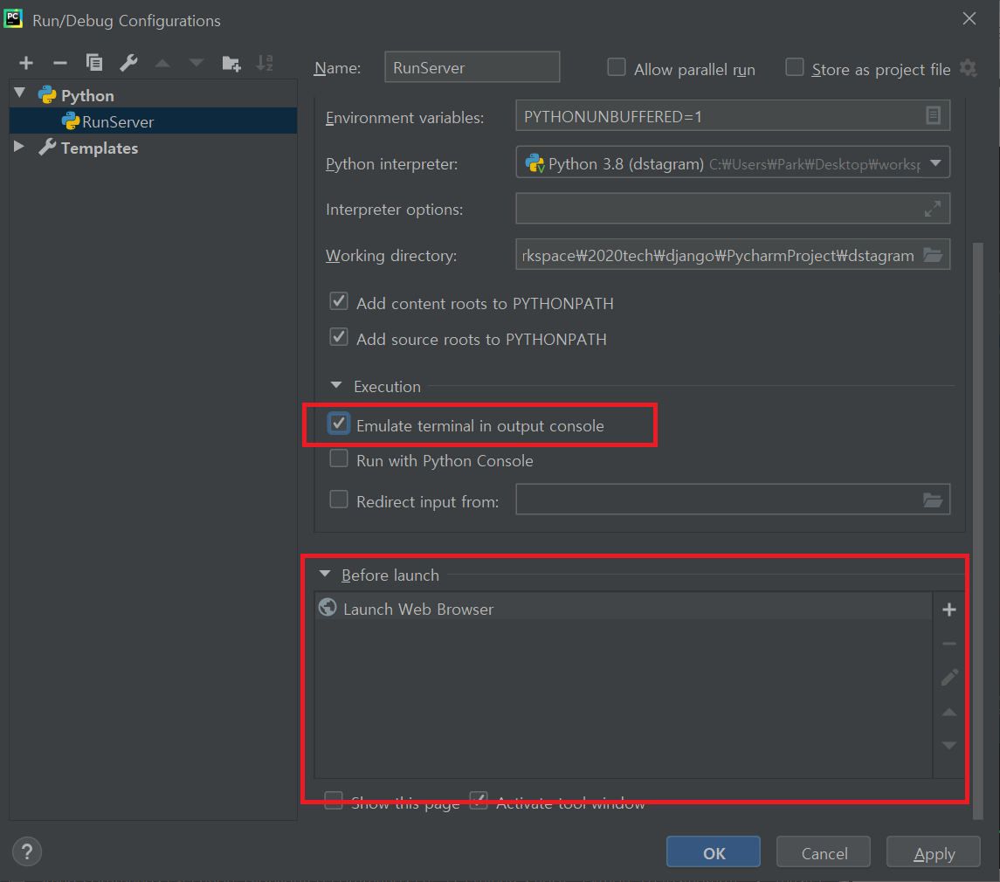
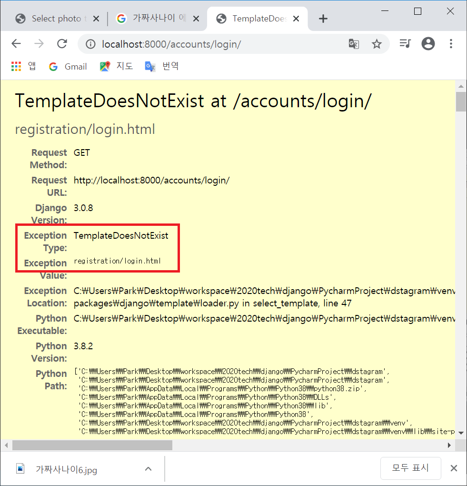

# 2020-07-22 Study

장고기간 웹 프로그래밍 (Django based Web Programming)

2020-07-22 **온라인** 강의 수업 내용  

## Django로 Dstagram 프로젝트 만들기 (인스타그램 copy)  

1. Pycharm으로 새 프로젝트 Dstagram 생성  

가상환경은 venv로 설정하여 생성  

2. django framework 설치  

``pip install django``로 django 설치  

3. django project 생성

``django-admin startproject config .``

4. db 마이그레이션 작업  

``python manage.py migrate``  

5. admin 계정 생성  

``python manage.py createsuperuser``

> db를 migration 해준 다음에 admin 계정을 생성하여야 한다.

6. 앱 실행하여 동작하는지 확인  

``python manage.py runserver``  

7. 프로젝트 다른 방법으로 생성  

  

위 사진과 같이 Add Configuration.. 을 클릭  

  

위 사진과 같은 화면이 나옴.

  

위 사진과 같이 + 버튼을 클릭하여 Python을 누른 후 빨간 박스처럼 설정  

  

위 사진처럼 RunServer라는 것이 생김.  

그 옆에 > 화살표 버튼을 누르면 ``python manage.py runserver``가 실행됨.  

8. 기존 Runserver에서 서버가 돌아가면 바로 브라우저에 띄울 수 있도록 하기  

기존 RunServer를 눌러서 Edit Configuration..  

밑으로 내리면 

Before launch가 존재.  

옆에 + 버튼을 눌러서 사진과 같이 Launch Web Browser를 클릭

  

다시 Launch Web Browser를 눌러서 url 주소 설정해주기.

  

**실행결과로 > 버튼을 눌러보면 바로 브라우저에 서버가 뜬다.**  

9. photo라는 app 만들기  

``python manage.py startapp photo``  

10. 만든 photo app을 환경설정에 추가  

``config/settings.py`` 수정

```py
INSTALLED_APPS = [
    'django.contrib.admin',
    'django.contrib.auth',
    'django.contrib.contenttypes',
    'django.contrib.sessions',
    'django.contrib.messages',
    'django.contrib.staticfiles',
    'photo',    # 추가
]
```  

11. database 모델링  

  

12. photo에 대한 model 생성  

``photo/models.py`` 수정  

```py
from django.db import models

from django.contrib.auth.models import User

class Photo(models.Model):

    author = models.ForeignKey(User, on_delete=models.CASCADE, related_name='user_photos')

    photo = models.ImageField(upload_to="photos/%Y/%m/%d", default="photos/no_image.png")   # 이미지가 업로드 되면 photos라는 폴더가 생긴다.
    text = models.TextField()

    created = models.DateTimeField(auto_now_add=True)   # 데이터가 insert될 때 자동으로 현재 시각이 들어감.
    updated = models.DateTimeField(auto_now=True)   # 데이터가 변경될 때 자동으로...
```  

13. 데이터베이스 마이그레이션 

``python manage.py makemigrations photo``  

하면 에러가 나온다. photo의 ImageField에서 Pillow라는 라이브러리가 설치되지 않았다고..

그러면서 Hint를 준다 ``python -m pip install Pillow``를 하라고.

  
  

14. Pillow 설치  

``pip install Pillow``  

15. 다시 데이터베이스 마이그레이션  

``python manage.py makemigrations photo``  

마이그레이션한 내용

```py
# in photo/migrations/0001_initial.py
# Generated by Django 3.0.8 on 2020-07-22 02:08

from django.conf import settings
from django.db import migrations, models
import django.db.models.deletion


class Migration(migrations.Migration):

    initial = True

    dependencies = [
        migrations.swappable_dependency(settings.AUTH_USER_MODEL),
    ]

    operations = [
        migrations.CreateModel(
            name='Photo',
            fields=[
                ('id', models.AutoField(auto_created=True, primary_key=True, serialize=False, verbose_name='ID')),
                ('photo', models.ImageField(default='photos/no_image.png', upload_to='photo/%Y/%m/%d')),
                ('text', models.TextField()),
                ('created', models.DateTimeField(auto_now_add=True)),
                ('updated', models.DateTimeField(auto_now=True)),
                ('author', models.ForeignKey(on_delete=django.db.models.deletion.CASCADE, related_name='user_photos', to=settings.AUTH_USER_MODEL)),
            ],
        ),
    ]
```

16. 마이그레이션한 내용을 가지고 마이그레이션 진행  

``python manage.py migrate photo 0001``  

17. HiediSQL로 확인  

  


18. admin에서 photo 나오게 해주기  

``photo/admin.py`` 수정  

```py
from django.contrib import admin

# Register your models here.

from .models import Photo

admin.site.register(Photo)      # photo admin에 Photo 등록
```

  


19. photo에 내용 추가

  

  

[Photo object (1)] 깔끔하게 해주어야 한다. 

``photo/models.py`` 수정

```py
...

updated = models.DateTimeField(auto_now=True)   # 데이터가 변경될 때 자동으로...

    def __str__(self):
        return self.author.username + ', ' + self.created.strftime('%Y.%m.%d %H:%M:%S')
```

  

20. 실제 pycharm에서 photos/yy/mm/dd 폴더 확인  

  


21. photos를 특정 폴더 밑에 넣고싶다.  

``config/settings.py`` 수정

```py
...
STATIC_URL = '/static/'

MEDIA_URL = '/media/'                           # 추가
MEDIA_ROOT = os.path.join(BASE_DIR, 'media')    # 추가
```  

22. 데이터를 더 추가해서 media 폴더 확인  

  

23. 데이터를 updated 역순으로 보여주기  

최근에 변경된 사진부터 보여주기

즉, SELECT * FROM photo_photo ORDER BY updated desc로 정렬하기  

일단 __str__메소드에서 created가 아닌 updated로 만들어줘서 보기 편하도록 ``photo/models.py`` 수정  

```py
def __str__(self):
    return str(self.id) + ', ' +self.author.username + ', ' + self.updated.strftime('%Y.%m.%d %H:%M:%S')
```

updated 순으로 desc 정렬하기 위해 ``photo/models.py`` 수정  

```py
def __str__(self):
    return str(self.id) + ', ' +self.author.username + ', ' + self.updated.strftime('%Y.%m.%d %H:%M:%S')

class Meta:
    ordering = ['-updated'] # -를 붙혀서 desc로 정렬.
```

  

24. 관리자페이지 커스터마이징  

``config/admin.py`` 수정  

```py
# 추가
class PhotoAdmin(admin.ModelAdmin):
    list_display = ['id', 'author', 'created', 'updated']
    raw_id_fields = ['author']  # 내용이 길 경우 이렇게 바꾸어라

    list_filter = ['created', 'updated', 'author']
    search_fields = ['text', 'created']
    ordering = ['-updated', '-created']

admin.site.register(Photo, PhotoAdmin)
# admin.site.register(Photo) 는 주석처리 해야함.
```

  


25.  일반 사용자 화면에서 내용 수정할 수 있게 만들기  

- 우선 list(목록)을 보여줄 페이지 만들기

``photo/views.py`` 수정  

```py
from django.shortcuts import render

# Create your views here.

from .models import Photo

def photo_list(request):
    post_list = Photo.objects.all()

    return render(request, 'photo/list.html', {
        'post_list' : post_list
    })
```

- photo에 urls.py 만들기  

```py
# in photo/urls.py - 없으므로 생성해야함
from django.urls import path

from .views import photo_list

urlpatterns = [
    path('', photo_list, name='photo_list'),
]
```

- photo에서 만든 url을 config urls.py에서 포함시키기

```py
from django.contrib import admin
from django.urls import path, include

urlpatterns = [
    path('admin/', admin.site.urls),
    path('', include('photo.urls')),
]
```  

- 결과 화면  

  

- photo에 list.html 만들기  

다음과 같은 구조로 list.html 생성

  

```html
<!DOCTYPE html>
<html lang="en">
<head>
    <meta charset="UTF-8">
    <title>Title</title>
</head>
<body>
photo 리스트
</body>
</html>
```

``photo/urls.py`` 수정  

```py
from django.urls import path

from .views import photo_list

app_name= 'photo'   # app name 추가

urlpatterns = [
    path('', photo_list, name='photo_list'),
]
```

- 결과 화면

  

- 공통적인 layout 잡기위해 전체 프로젝트 dstagram 밑에 base.html 생성  

  

구조를 잡고 생성 후 수정  

```html
<!DOCTYPE html>
<html lang="en">
<head>
    <meta charset="UTF-8">
    <title>
        Dstagram
        
        
    </title>
</head>
<body>
 <h1>디스타그램</h1>
 
 
</body>
</html>
```

- 만든 base.html를 setting에서 설정해주기  

```py
# in config/setting.py
...

TEMPLATES = [
    {
        'BACKEND': 'django.template.backends.django.DjangoTemplates',
        'DIRS': [os.path.join(BASE_DIR, 'templates')],  # 이렇게 경로를 알려준다 
        'APP_DIRS': True,
        'OPTIONS': {
            'context_processors': [
                'django.template.context_processors.debug',
                'django.template.context_processors.request',
                'django.contrib.auth.context_processors.auth',
                'django.contrib.messages.context_processors.messages',
            ],
        },
    },
]

...
```

- list.html에서 base.html사용하겠다고 명시

```html



    - 포토 목록




    {{post_list}}


```  

- 결과 화면 

  


- 전체 프로젝트에 bootstrap css 적용하기

[bootstrap 바로가기](https://getbootstrap.com/docs/4.5/getting-started/introduction/)  

들어가서 css부분 카피한 후  ``base.html`` 수정  

```html
<head>
    <meta charset="UTF-8">
    <title>
        Dstagram
        
        
    </title>

    <link rel="stylesheet" href="https://stackpath.bootstrapcdn.com/bootstrap/4.5.0/css/bootstrap.min.css" integrity="sha384-9aIt2nRpC12Uk9gS9baDl411NQApFmC26EwAOH8WgZl5MYYxFfc+NcPb1dKGj7Sk" crossorigin="anonymous">

    <script src="https://code.jquery.com/jquery-3.5.1.slim.min.js" integrity="sha384-DfXdz2htPH0lsSSs5nCTpuj/zy4C+OGpamoFVy38MVBnE+IbbVYUew+OrCXaRkfj" crossorigin="anonymous"></script>
    <script src="https://cdn.jsdelivr.net/npm/popper.js@1.16.0/dist/umd/popper.min.js" integrity="sha384-Q6E9RHvbIyZFJoft+2mJbHaEWldlvI9IOYy5n3zV9zzTtmI3UksdQRVvoxMfooAo" crossorigin="anonymous"></script>
    <script src="https://stackpath.bootstrapcdn.com/bootstrap/4.5.0/js/bootstrap.min.js" integrity="sha384-OgVRvuATP1z7JjHLkuOU7Xw704+h835Lr+6QL9UvYjZE3Ipu6Tp75j7Bh/kR0JKI" crossorigin="anonymous"></script>

</head>
```  

- 결과 화면  

  


- bootstrap navbar 적용  

[bootstrap 바로가기](https://getbootstrap.com/docs/4.5/components/navbar/)  

바로 첫번째 코드 카피한 후 코드 정리해서 적용

```html
...

<body>
<div class="container">
    <header class="header clearfix">
        <nav class="navbar navbar-expand-lg navbar-light bg-light">
            <a class="navbar-brand" href="#">Navbar</a>
            <button class="navbar-toggler" type="button" data-toggle="collapse" data-target="#navbarSupportedContent"
                    aria-controls="navbarSupportedContent" aria-expanded="false" aria-label="Toggle navigation">
                <span class="navbar-toggler-icon"></span>
            </button>

            <div class="collapse navbar-collapse" id="navbarSupportedContent">
                <ul class="navbar-nav mr-auto">
                    <li class="nav-item active">
                        <a class="nav-link" href="#">Home <span class="sr-only">(current)</span></a>
                    </li>
                    <li class="nav-item">
                        <a class="nav-link" href="#">Link</a>
                    </li>
                    <li class="nav-item dropdown">
                        <a class="nav-link dropdown-toggle" href="#" id="navbarDropdown" role="button" data-toggle="dropdown"
                           aria-haspopup="true" aria-expanded="false">
                            Dropdown
                        </a>
                        <div class="dropdown-menu" aria-labelledby="navbarDropdown">
                            <a class="dropdown-item" href="#">Action</a>
                            <a class="dropdown-item" href="#">Another action</a>
                            <div class="dropdown-divider"></div>
                            <a class="dropdown-item" href="#">Something else here</a>
                        </div>
                    </li>
                    <li class="nav-item">
                        <a class="nav-link disabled" href="#" tabindex="-1" aria-disabled="true">Disabled</a>
                    </li>
                </ul>
                <form class="form-inline my-2 my-lg-0">
                    <input class="form-control mr-sm-2" type="search" placeholder="Search" aria-label="Search">
                    <button class="btn btn-outline-success my-2 my-sm-0" type="submit">Search</button>
                </form>
            </div>
        </nav>
    </header>

    
    
    
    <footer class="footer">
        <p>@Copy; 2020 DY. Powered By Django</p>
    </footer>
</div>
</body>
```

- 결과 화면  

  

- 메뉴 수정  

``base.html`` 수정

```html
<header class="header clearfix">
    <nav class="navbar navbar-expand-lg navbar-light bg-light">
        <a class="navbar-brand" href="/">Dstagram</a>
        <button class="navbar-toggler" type="button" data-toggle="collapse" data-target="#navbarSupportedContent"
                    aria-controls="navbarSupportedContent" aria-expanded="false" aria-label="Toggle navigation">
            <span class="navbar-toggler-icon"></span>
        </button>

        <div class="collapse navbar-collapse" id="navbarSupportedContent">
            <ul class="navbar-nav mr-auto">
                <li class="nav-item active">
                    <a class="nav-link" href="#">Home <span class="sr-only">(current)</span></a>
                </li>
                <li class="nav-item">
                    <a class="nav-link" href="#">Link</a>
                </li>
                <li class="nav-item dropdown">
                    <a class="nav-link dropdown-toggle" href="#" id="navbarDropdown" role="button" data-toggle="dropdown"
                    aria-haspopup="true" aria-expanded="false">
                    Dropdown
                    </a>
                    <div class="dropdown-menu"  aria-labelledby="navbarDropdown">
                        <a class="dropdown-item" href="#">Action</a>
                        <a class="dropdown-item" href="#">Another action</a>
                            <div class="dropdown-divider"></div>
                        <a class="dropdown-item" href="#">Something else here</a>
                    </div>
                </li>
                <li class="nav-item">
                    <a class="nav-link disabled" href="#" tabindex="-1" aria-disabled="true">Disabled</a>
                </li>
            </ul>
        </div>
    </nav>
</header>
```  

- 다시 리스트 출력하기  

``list.html`` 수정  

```html



    - 포토 목록




    

    <div class="row">
        <div class="col-md-2"></div>
        <div class="col-md-8">
            <div class="panel panel-default">
                <div>
                    
                </div>
                <p>{{post.text}}</p>
                <div>
                    <a href="#">상세보기</a>
                </div>
            </div>
        </div>
        <div class="col-md-2"></div>
    </div>

    


```

- 결과 화면  

  

- 이미지를 static으로 추가  

``config/urls.py`` 수정

```py
from django.contrib import admin
from django.urls import path, include
from django.conf.urls.static import static      # static 추가
from django.conf import settings                # settings 추가

urlpatterns = [
    path('admin/', admin.site.urls),
    path('', include('photo.urls')),
]

urlpatterns += static(settings.MEDIA_URL, document_root=settings.MEDIA_ROOT)
```

- 결과 화면  

  

- author와 상세보기 위치 변경  

``list.html`` 수정

```html
<div class="panel panel-default">
    <div>
        
    </div>
    <p>{{post.text}}</p>
    <div class="text-left">
        <p>{{post.author.username}}</p>
    </div>
    <div class="text-right">
        <a href="#" class="btn btn-info btn-xs">상세보기
        </a>
    </div>
</div>
```

- 결과 화면 

  


26. 게시글 등록하는 페이지 만들기  

- ``base.html``에서 [파일추가하기]라는 버튼을 넣어보기

```html
...

<header class="header clearfix">
    <nav class="navbar navbar-expand-lg navbar-light bg-light">
        <a class="navbar-brand" href="/">Dstagram</a>
        <button class="navbar-toggler" type="button" data-toggle="collapse" data-target="#navbarSupportedContent"
        aria-controls="navbarSupportedContent" aria-expanded="false" aria-label="Toggle navigation">
            <span class="navbar-toggler-icon"></span>
        </button>

        <div class="collapse navbar-collapse" id="navbarSupportedContent">
            <ul class="navbar-nav mr-auto">
                <li class="nav-item active">
                    <a class="nav-link" href="/">Home <span class="sr-only">(current)</span></a>
                </li>
                <li class="nav-item">
                    <a class="nav-link" href="">포토 작성</a>
                </li>
            </ul>
        </div>
    </nav>
</header>

...
```

- views.py 수정  

```py
...
from django.views.generic.edit import CreateView
from django.shortcuts import redirect

...

class PhotoUploadView(CreateView):
    model = Photo
    fields = ['photo', 'text']
    template_name = 'photo/upload.html'

    def form_valid(self, form):
        form.instance.author_id = self.request.user.id
        if form.is_valid():
            form.instance.save()
            return redirect('/')

        else:
            return self.render_to_response({'form': form})
```  

- url 맵핑  

``photo/urls.py`` 수정

```py
from django.urls import path

from .views import photo_list
from .views import PhotoUploadView

app_name= 'photo'

urlpatterns = [
    path('', photo_list, name='photo_list'),
    path('photo/upload/', PhotoUploadView.as_view(), name='photo_upload')     # url 추가
]
```

- upload.html 생성

```html



    - 포토 업로드





    <div class="row">
        <div class="col-md-2"></div>
        <div class="col-md-8">
            <div class="panel panel-default">

                <form method="post">
                    
                    {{form.as_p}}
                    <div>
                        <button type="submit" class="btn btn-primary btn-xs">업로드</button>
                    </div>
                </form>
            </div>
        </div>
        <div class="col-md-2"></div>
    </div>

```

- 결과 화면  

  

- 값을 넣고 submit 한 결과  

  

보면 파일이 ``media/photos/2020/07/22`` 밑에 파일이 저장되질 않는다. 

- form 수정  

``upload.html`` 수정  

```html
...
<!-- encoding form-data로 변경 -->
<form method="post" enctype="multipart/form-data">  
    
    {{form.as_p}}
    <div>
        <button type="submit" class="btn btn-primary btn-xs">업로드</button>
    </div>
</form>
...
```

- 결과 화면  

  


27. 상세페이지 만들기  

- url 맵핑  

``photo/urls.py`` 수정

```py
...
from django.views.generic.detail import DetailView

from .models import Photo
from .views import photo_list
from .views import PhotoUploadView

urlpatterns = [
    path('', photo_list, name='photo_list'),
    path('photo/upload/', PhotoUploadView.as_view(), name='photo_upload'),

    # view 없이 model로 지정할 수가 있다
    path('photo/detail/<int:pk>', DetailView.as_view(model=Photo, template_name='photo/detail.html'), name='photo_detail')
]
```  

- list.html에서 a link 수정  

```html
<div class="text-right">
    <a href="" class="btn btn-info btn-xs">상세보기</a>
</div>
```

- photo/detail.html 생성

```html



    - 포토 상세보기




    <div class="row">
        <div class="col-md-2"></div>
        <div class="col-md-8">
            <div class="panel panel-default">
                <div>
                    
                </div>
                <p>{{object.text}}</p>
                <div class="text-left">
                    <p>{{object.author.username}}</p>
                </div>
                <div class="text-right">
                    <a href="" class="btn btn-outline-info btn-sm">목록</a>
                    <a href="#" class="btn btn-outline-success btn-sm">수정</a>
                    <a href="#" class="btn btn-outline-danger btn-sm">삭제</a>
                </div>
            </div>
        </div>
        <div class="col-md-2"></div>
    </div>



```

- 결과 화면

  


28. 수정 페이지 만들기

- view 만들기

``photo/views.py`` 수정

```py
from django.views.generic.edit import CreateView, UpdateView

...

class PhotoUpdateView(UpdateView):
    model = Photo
    fields = ['photo', 'text']
    template_name = 'photo/update.html'
```

- url 맵핑  

``photo/urls.py`` 수정

```py
...

from .views import PhotoUploadView, PhotoUpdateView

...

urlpatterns = [
    path('', photo_list, name='photo_list'),
    path('photo/upload/', PhotoUploadView.as_view(), name='photo_upload'),
    # view 없이 model로 지정할 수가 있다
    path('photo/detail/<int:pk>', DetailView.as_view(model=Photo, template_name='photo/detail.html'), name='photo_detail')

    path('photo/update/<int:pk>', PhotoUpdateView.as_view(), name='photo_update')
]
```  

- ``detail.html`` 수정

```html
...

<div class="text-right">
    <a href="" class="btn btn-outline-info btn-sm">목록</a>
    <!-- url 수정 -->
    <a href="" class="btn btn-outline-success btn-sm">수정</a>   
    <a href="#" class="btn btn-outline-danger btn-sm">삭제</a>
</div>

...
```  

- update.html 생성 후 수정

```html



    - 포토 수정





    <div class="row">
        <div class="col-md-2"></div>
        <div class="col-md-8">
            <div class="panel panel-default">

                <form method="post" enctype="multipart/form-data">
                    
                    {{form.as_p}}
                    <div>
                        <button type="submit" class="btn btn-primary btn-xs">수정</button>
                    </div>
                </form>
            </div>
        </div>
        <div class="col-md-2"></div>
    </div>


```

- 수정한 이후 가야할 페이지를 설정  

``models.py`` 수정

```py
# 추가
    def get_absolute_url(self):
        return reverse('photo:photo_detail', args=[self.id])
```

> 수정이 잘 되는 것을 확인.  

29. 삭제 페이지 만들기  

- views.py에서 delete view 만들기  

```py
from django.views.generic.edit import CreateView, UpdateView, DeleteView

...

class PhotoDeleteView(DeleteView):
    model = Photo
    template_name = 'photo/delete.html'
    success_url = '/'       # 삭제 후 '/'로 이동
```

- urls 맵핑  

photo/urls.py 수정

```py
from .views import PhotoUploadView, PhotoUpdateView, PhotoDeleteView

...

urlpatterns = [
    path('', photo_list, name='photo_list'),
    path('photo/upload/', PhotoUploadView.as_view(), name='photo_upload'),
    # view 없이 model로 지정할 수가 있다
    path('photo/detail/<int:pk>', DetailView.as_view(model=Photo, template_name='photo/detail.html'), name='photo_detail'),

    path('photo/update/<int:pk>', PhotoUpdateView.as_view(), name='photo_update'),

    # 추가
    path('photo/delete/<int:pk>', PhotoDeleteView.as_view(), name='photo_delete')
]
```  

- delete.html 생성 후 수정

```html



    - 포토 삭제





    <div class="row">
        <div class="col-md-2"></div>
        <div class="col-md-8">
            <div class="panel panel-default">
                <p class="alert alert-info">{{object}} 삭제하시겠습니까? </p>

                <form method="post" enctype="multipart/form-data">
                    
                    {{form.as_p}}
                    <div>
                        <button type="submit" class="btn btn-danger btn-xs">삭제</button>
                    </div>
                </form>
            </div>
        </div>
        <div class="col-md-2"></div>
    </div>


```

- 삭제 버튼 링크 추가  

``detail.html`` 수정  

```html
...

<div class="text-right">
    <a href="" class="btn btn-outline-info btn-sm">목록</a>
    <a href="" class="btn btn-outline-success btn-sm">수정</a>

    <!-- 수정 -->
    <a href="" class="btn btn-outline-danger btn-sm">삭제</a>
</div>

...
```

- 결과 화면  

  


30. 계정을 위한 account app 만들기 

- app 생성

``python manage.py startapp accounts``  

- config/settings.py 에서 accounts app 추가

```py
INSTALLED_APPS = [
    'django.contrib.admin',
    'django.contrib.auth',
    'django.contrib.contenttypes',
    'django.contrib.sessions',
    'django.contrib.messages',
    'django.contrib.staticfiles',
    'photo',
    'accounts',     # 추가
]
```  

31. login, logout 만들어보기

- urls에 login, logout 추가

accounts에 urls.py를 생성 후 수정

```py
from django.urls import path
from django.contrib.auth import views as auth_view

app_name = 'account'

urlpatterns = [
    path('login/', auth_view.LoginView.as_view(), name='accounts_login'),
    path('logout/', auth_view.LogoutView.as_view(), name='accounts_logout'),
]
```

- 전체 프로젝트인 config에 account에 대한 url 추가  

```py
urlpatterns = [
    path('admin/', admin.site.urls),
    path('', include('photo.urls')),
    # 추가
    path('accounts/', include('accounts.urls')),
]
```

- base.html 에 로그인 버튼 생성해보기  

```html
...

<li class="nav-item">
    <a class="nav-link" href="">로그인</a>
</li>

...
```  

- 결과 화면

  

로그인 클릭 하면?

  

registration/login.html이 필요하다고 나옴.

- login 페이지 생성 후 편집  

  

```html



    - 포토





    <div class="row">
        <div class="col-md-2"></div>
        <div class="col-md-8">
            <div class="panel panel-default">

                <p class="alert alert-info">로그인 정보를 입력해 주세요.</p>

                <form method="post">
                    
                    {{form.as_p}}

                    <div>
                        <button type="submit">로그인</button>
                    </div>
                </form>

            </div>
        </div>
        <div class="col-md-2"></div>
    </div>


```

- 결과 화면

  

> 아무것도 없는데 as_p로 데이터를 가져올 수 있는 이유는 관리자 페이지 접속할 때 로그인 페이지 뜨는 것을 가져와서 사용하기 때문 (accounts/urls.py에서.. ``from django.contrib.auth import views as auth_view``)  

- 로그인 시도 결과 화면  

  

로그인 한 후 리다이렉션을 설정해줘야 한다.

- 리다이렉션 설정  

``config/settings.py`` 수정

```py
...

LOGIN_REDIRECT_URL = '/'    # 맨 마지막에 추가
```  

- 로그인 시도 결과 화면  

  


- 로그아웃 버튼 추가  

``base.html`` 수정

```html
<li class="nav-item">
    <a class="nav-link" href="">로그인</a>
</li>
<!-- 추가 -->
<li class="nav-item">
    <a class="nav-link" href="">로그아웃</a>
</li>
```  

로그아웃을 누르면 로그아웃이 성공하긴 하는데 django에 있는 default 페이지가 나옴.

- 로그아웃 페이지 설정하기  

``accounts/urls.py`` 수정

```py
urlpatterns = [
    path('login/', auth_view.LoginView.as_view(), name='accounts_login'),
    path('logout/', auth_view.LogoutView.as_view(template_name='registration/logout.html'), name='accounts_logout'),    # 수정
]
```

- 로그아웃 페이지 생성  

templates/registration 밑에 logout.html 생성 및 편집  

```html



    - 포토 로그아웃





    <div class="row">
        <div class="col-md-2"></div>
        <div class="col-md-8">
            <div class="panel panel-default">

                <p class="alert alert-info">성공적으로 로그아웃 되었습니다.</p>
                    <div>
                        <a href="" class="btn btn-info">로그인 하기</a>
                    </div>
            </div>
        </div>
        <div class="col-md-2"></div>
    </div>


```  

- 결과 화면  

  

  


- 로그인 / 로그아웃 둘 중에 하나만 보이게 하기  

``base.html`` 수정

```html
...

<!-- 로그인한 정보를 담고 있다-->

    <!-- 포토 작성 또한 로그인한 상태에서만 가능해야 한다. -->
    <li class="nav-item">
        <a class="nav-link" href="#">{{user.get_username}} 님 안녕하세요.</a>
    </li>
    <li class="nav-item">
        <a class="nav-link" href="">포토 작성</a>
    </li>
    <li class="nav-item">
        <a class="nav-link" href="">로그아웃</a>
    </li>
    
    <li class="nav-item">
        <a class="nav-link" href="">로그인</a>
    </li>

```  

32. 회원가입 페이지 만들기  

- 기본적인 회원가입 버튼 생성

```html
...


    <li class="nav-item">
        <a class="nav-link" href="">로그인</a>
    </li>
    <li class="nav-item">
        <a class="nav-link" href="#">회원가입</a>
    </li>


...
```  

- view에 회원가입 페이지 등록하기  

``accounts/views.py`` 편집

```py
def register(request):
    return render(request, 'registration/register.html',  {})   # 아직 넘겨주는 데이터는 x
```

- url 등록

``accounts/urls.py`` 편집 

```py
...

from .views import register

...

urlpatterns = [
    path('login/', auth_view.LoginView.as_view(), name='accounts_login'),
    path('logout/', auth_view.LogoutView.as_view(template_name='registration/logout.html'), name='accounts_logout'),
    path('register/', register, name='accounts_register'),
]
```
- base.html에서 생성했던 회원가입 버튼 url 지정  

```html
...

<li class="nav-item">
    <a class="nav-link" href="">회원가입</a>
</li>

...
```  

- 결과 화면  

  

- 회원가입 form 만들기 

accounts 밑에 forms.py 생성 후 편집  

```py
from django.contrib.auth.models import User
from django import forms

class RegisterForm(forms.ModelForm):
    password = forms.CharField(label='Password', widget=forms.PasswordInput)
    password2 = forms.CharField(label='Repeat Password', widget=forms.PasswordInput)

    class Meta:
        model = User    # hiediSQL로 보면 auth_user라는 테이블에 컬럼을 참조하겠단 의미
        fields = ['username', 'first_name', 'last_name', 'email']

    def clean_password2(self):

        data = self.cleaned_data

        if data['password'] != data['password2']:
            raise forms.ValidationError('비밀번호와 비밀번호 확인이 일치하지 않습니다.')
        
        return data['password2']
```  

- 만든 form을 적용하기 위해 view 편집

``accounts/views.py`` 편집  

```py
from django.shortcuts import render

from .forms import RegisterForm

def register(request):

    if request.method == 'POST':
        user_form = RegisterForm(request.POST)

        if user_form.is_valid():    # valid가 문제 없으면
            new_user = user_form.save(commit=False) 
            new_user.set_password(user_form.cleaned_data['password'])   # password 2개가 있지만 cleaned 함수를 통해서 하나를 지워서 남은 하나를 password로 지정한다.
            new_user.save()

            return render(request, 'registration/register_done.html', {'new_user': new_user})

    else:
        user_form = RegisterForm()
        return render(request, 'registration/register.html', {'form': user_form})
```

- 결과 화면  

  


- user_form.is_valid()에서 render하는 register_done.html 만들기  

```html



    - 회원 가입





    <div class="row">
        <div class="col-md-2"></div>
        <div class="col-md-8">
            <div class="panel panel-default">

                <p class="alert alert-info">{{new_user.username}}님, 성공적으로 회원가입이 되었습니다.</p>

                <a href="/" class="btn btn-primary">메인으로 이동</a>

            </div>
        </div>
        <div class="col-md-2"></div>
    </div>


```

- 결과 화면  

  

- 비밀번호를 다르게 했을 시 화면  

  

valueerror가 났음.

``accounts/views.py`` 수정  

```py
def register(request):

    if request.method == 'POST':
        user_form = RegisterForm(request.POST)

        if user_form.is_valid():
            new_user = user_form.save(commit=False)
            new_user.set_password(user_form.cleaned_data['password'])
            new_user.save()

            return render(request, 'registration/register_done.html', {'new_user': new_user})

    else:
        user_form = RegisterForm()
        
    return render(request, 'registration/register.html', {'form': user_form})       # 전체 return으로 바꿔줌

```

- 결과 화면  

  

- 관리자페이지에서 유저 확인

  

33. 댓글 기능 추가하기  

- 데이터베이스 모델링  

  


> disqus.com 에서 댓글을 관리할 수 있게 해준다 django 베이스로..  

- disqus 가입하기  

[disqus 바로가기](https://disqus.com)  

  

[get started]로 가입하기

  

가입 후 사진처럼 [I want to install Disqus on my site] 클릭

  

사진과 같이 작성 후 [Create site] 클릭

  

basic 버전을 사용 -> [Subscribe now] 클릭

  

django 플랫폼이 보이질 않아서 사진과 같은 버튼 클릭.  

맨 밑으로 내려와 Configuration을 눌러서 설정을 시작.  

  

설정은 나중에라도 가능하고 WebName을 잘 기억하고 [Complete Setup] 클릭.

그 다음 [Dismiss setup]을 클릭하여 아래 사진과 같이 대시보드 화면이 나오면 ok  

  


- django에 disqus 설치  

``pip install django-disqus``  

- 프로젝트에 disqus를 인식하게 하기 위해 app 추가  

``config/settings.py`` 수정  

```py
...

INSTALLED_APPS = [
    'django.contrib.admin',
    'django.contrib.auth',
    'django.contrib.contenttypes',
    'django.contrib.sessions',
    'django.contrib.messages',
    'django.contrib.staticfiles',
    'photo',
    'accounts',
    'django.contrib.sites',         # 추가
    'disqus',                       # 추가
]

...
```  

- database 마이그레이션 작업

``python manage.py migrate``  

에러. (버전이 맞질 않는다.)

  

빨간색 라인으로 된 곳으로 향한다.

  

- six 라이브러리 install

``pip install six``  

- ``__init.py__`` 수정 

```py
import json

# from django.utils.six.moves.urllib.parse import urlencode
# from django.utils.six.moves.urllib.request import urlopen
from django.core.management.base import CommandError

from six.moves.urllib.parse import urlencode    # 추가
from six.moves.urllib.request import urlopen    # 추가
```  

- 다시 데이터베이스 마이그레이션 작업  

``python manage.py migrate``  

- 프로젝트에 website name 알려주기

``config/settings.py`` 수정  

```py
...

DISQUS_WEBSITE_SHORTNAME = 'django0722' # 추가
SITE_ID = 1                             # 추가
```

> [disqus 적용 documentation 바로가기](https://django-disqus.readthedocs.io/en/latest/installation.html)

- 댓글을 상세보기 페이지에 붙히기

``photo/tamplates/photo/detail.html`` 수정  

```html
...

<div>
    
    
</div>

...
```

- 결과 화면  

  