# 2020-08-05 Study

장고기간 웹 프로그래밍 (Django based Web Programming)

2020-08-05 **온라인** 강의 수업 내용  


## Django로 쇼핑몰 페이지 만들기  

1. 새 프로젝트를 생성  

이름은 onlineshop으로..

그 외 설정은 default.  

2. 프로젝트에 django 설치  

``pip install django``  

3. django 프로젝트 생성  

``django-admin startproject config .``  

4. 프로젝트에 mariadb 사용  

[mariadb 설치 바로가기](https://mariadb.org/download/)

default로 두고 설치 진행.  

root 패스워드는 마음대로 진행.

설정은 UTF-8로 설정  

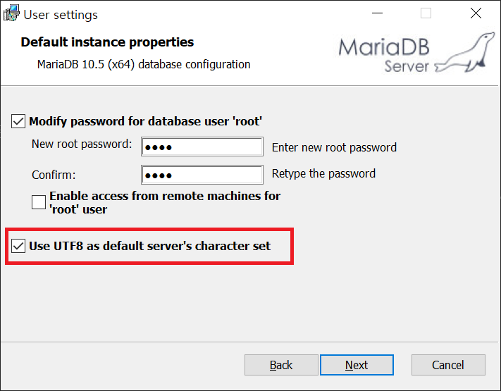  

mysql에서 3306 포트를 사용하고 있으므로 포트는 3309로 설정  

설치가 완료되면 HeidiSQL이 설치됨.  

> MariaDB는 HeidiSQL을 기본적으로 탑재.  

5. MariaDB 접속  

cmd에서 maria db 설치 폴더 bin으로 들어가서 접속.  

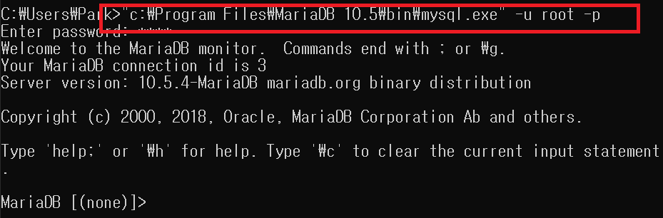  

아니면  

HeidiSQL를 이용하여 접속  

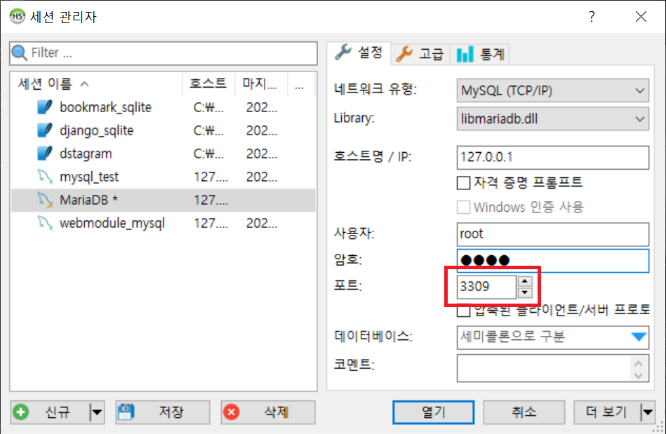  

6. 사용할 데이터베이스 생성 및 유저 권한 부여  

root는 모든 권한이 있지만 root 비밀번호가 해킹당하였을 경우  

모든 데이터베이스에 대한 위험이 노출되기 때문에 유저를 만들고 권한을 부여하여 생성.  

우선 데이터베이스 생성  

```sql
> CREATE DATABASE `onlineshop`;
```

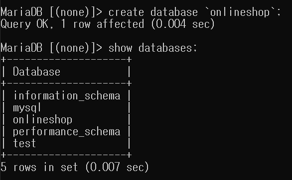  

그 다음 유저 생성  

```sql
> CREATE USER `django`@localhost IDENTIFIED BY 'test';
```

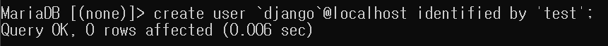  

생성한 유저에 대해서 권한 부여  

```sql
> GRANT ALL PRIVILEGES ON `onlineshop`.* TO `django`@localhost;
```  

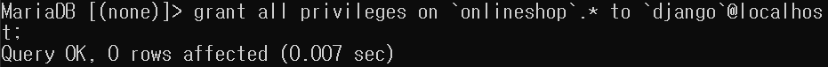  

생성한 유저 확인  

```sql
> SELECT * FROM USER WHERE USER=`django`;
```  

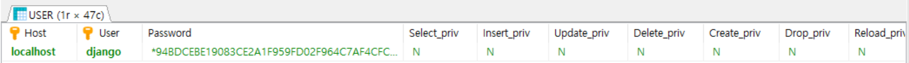  

권한 작업 반영  

```sql
> FLUSH PRIVILEGES;
```

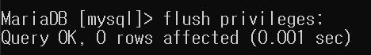  

7. heidiSQL에서 새로 생성한 계정 'django'로 접속해보기  

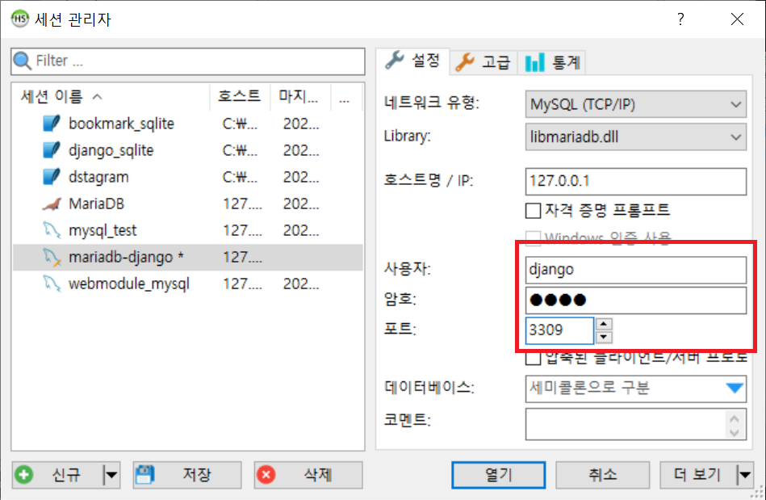  

접속하면 아래 사진과 같이 onlineshop 데이터베이스 (그 외에는 기본적인 것들) 만 보인다.  

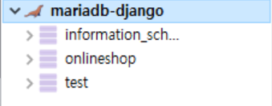  

8. django 프로젝트에서 mariadb 연동을 위한 라이브러리 설치  

``pip install pymysql``

9. 프로젝트에서 설치한 pymysql 라이브러리 연동  

``config/settings.py`` 에서 연동

```py
import pymysql

pymysql.install_as_MySQLdb()
```  

그 후 ``settings.py``에서 databases에 대한 정보 수정  

```py
# 기본으로 지정된 sqlite3에 대한 설정을 지우고 mysql에 대한 설정으로 교체

DATABASES = {
    'default': {
        'ENGINE': 'django.db.backends.mysql',
        'NAME': 'onlineshop',
        'USER': 'django',
        'PASSWORD': 'test',
        'HOST': 'localhost',
        'PORT': '3309',         # 우리가 설정한 mariadb port 번호는 3309
    }
}
```  

10. database 마이그레이션  

``python manage.py migrate``


* 에러 발생  

다음과 같은 에러를 발생한다.

``django.core.exceptions.ImproperlyConfigured: mysqlclient 1.4.0 or newer is required; you have 0.10.0.``  

보면 나는 0.10.0 버전을 가지고 있고, 새로운 1.4.0 버전을 설치하라고 한다. pymysql를 설치하면 mysqlclient가 기본적으로 설치되는데 버전업이 안되어있는거 같다.  

해결한 방법은 ``settings.py``에서 pymysql을 불러와서 

``pymysql.install_as_MySQLdb()``를 진행하기 전에  

버전을 지정해주는 것

```py
import pymysql
pymysql.version_info = (1, 4, 0, "final", 0)
pymysql.install_as_MySQLdb()
```  

> 보통 파이썬에서도 pymysql 설치가 아닌 그냥 mysqlclient 설치를 권장하는 것 같다.  

11. 프로젝트 관리자 계정 생성  

``python manage.py createsuperuser``  

12. 프로젝트에 shop app 생성  

``python manage.py startapp shop``

13. 프로젝트에 생성한 shop app 설정  

``config/settings.py`` 에서 [INSTALLED_APPS]에서 shop 추가  

```py
INSTALLED_APPS = [
    'django.contrib.admin',
    'django.contrib.auth',
    'django.contrib.contenttypes',
    'django.contrib.sessions',
    'django.contrib.messages',
    'django.contrib.staticfiles',
    'shop',                         # 추가
]
```  

14. shop database category 스키마 모델링  

``shop/models.py`` 에서 모델링  

```py
from django.db import models

from django.urls import reverse

class Category(models.Model):
    name = models.CharField(max_length=200, db_index=True)
    meta_description = models.TextField(blank=True)

    # 일반적으로 이미 확보된 데이터로부터 유효한 URL을 만드는 방법
    slug = models.SlugField(max_length=200, db_index=True, unique=True, allow_unicode=True) 

    class Meta:
        ordering = ['name']
        verbose_name = 'category'
        verbose_name_plural = 'categories'

    def __str__(self):
        return self.name

    def get_absolute_url(self):
        return reverse('shop:product_in_category', args=[self.slug])
```

15. product 테이블 스키마 모델링  

``shop/models.py`` 에서..

```py
class Product(models.Model):

    # on_delete는 cascade 같은 개념. category가 삭제 될 때 이 필드는 어떻게 하겠는가?
    category = models.ForeignKey(Category, on_delete=models.SET_NULL, null=True, related_name='products')

    name = models.CharField(max_length=200, db_index=True)

    slug = models.SlugField(max_length=200, db_index=True, unique=True, allow_unicode=True)

    image = models.ImageField(upload_to='products/%Y/%m/%d', blank=True)

    description = models.TextField(blank=True)

    meta_description = models.TextField(blank=True)

    price = models.DecimalField(max_digits=10, decimal_places=2)

    stock = models.PositiveIntegerField()

    available_display = models.BooleanField('Display', default=True)
    available_order = models.BooleanField('Order', default=True)

    created = models.DateTimeField(auto_now_add=True)
    updated = models.DateTimeField(auto_now=True)

    class Meta:
        ordering = ['-created'] # created 필드를 desc, 역순 정렬
        index_together = [['id', 'slug']]

    def __str__(self):
        return self.name

    def get_absolute_url(self):
        return reverse('shop:product_detail', args=[self.id, self.slug])
```  

16. app에서 이미지를 사용하기 위해 Pillow 설치 

``pip install Pillow``  

17. shop 데이터베이스 모델링 마이그레이션  

``python manage.py makemigrations shop``  

18. 마이그레이션한 shop 데이터베이스 mariadb에 적용

``python manage.py migrate shop``

19. 테이블이 정상적으로 만들어졌는지 확인.  

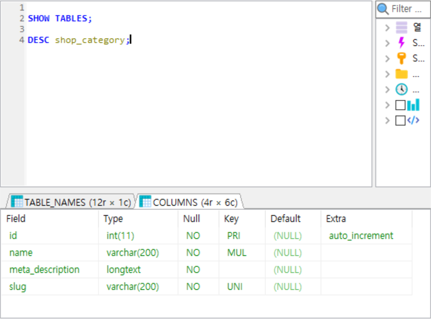  


20. shop app view, list view 생성  

``shop/views.py``에서 수정

```py
from django.shortcuts import render, get_object_or_404

from .models import *

def product_in_category(request, category_slug=None):
    current_category = None
    categories = Category.objects.all()
    products = Product.objects.filter(available_display=True)

    if category_slug:
        current_category = get_object_or_404(Category, slug=category_slug)
        products = products.filter(category=current_category)

    return render(request, 'shop/list.html', {'current_category': current_category, 'categories': categories, 'products': products})
```

21. shop app view, product detail view 생성


```py
...

def product_detail(request, id, product_slug=None):
    product = get_object_or_404(Product, id = id, slug=product_slug)

    return render(request, 'shop/detail.html', {'product': product})
```

22. url에 만든 view 연결  

``shop``폴더에 ``urls.py``를 생성 후 편집

```py
from django.urls import path

from .views import *

app_name = 'shop'

urlpatterns = [
    path('', product_in_category, name='product_all'),
    path('<slug:category_slug>/', product_in_category, name='product_in_category'),
    path('<int:id>/<product_slug>/', product_detail, name='product_detail')
]
```

``config/urls.py``에 ``shop/urls.py``를 적용  

```py
from django.contrib import admin
from django.urls import path, include   # include 추가

urlpatterns = [
    path('admin/', admin.site.urls),
    path('', include('shop.urls')), # 추가
]
```  

23. view url에 적용할 template 생성 - 레이아웃 구성  

아래 사진과 같은 구조로 ``base.html`` 생성 후 편집

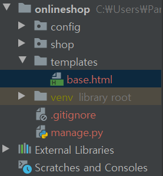  


```html
<!DOCTYPE html>
<html lang="en">
<head>
    <meta charset="UTF-8">
    <title> </title>
    <link rel="stylesheet" href="https://stackpath.bootstrapcdn.com/bootstrap/4.1.3/css/bootstrap.min.css" integrity="sha384-MCw98/SFnGE8fJT3GXwEOngsV7Zt27NXFoaoApmYm81iuXoPkFOJwJ8ERdknLPMO" crossorigin="anonymous">

    <script src="https://code.jquery.com/jquery-3.3.1.min.js" crossorigin="anonymous"></script>
    <script src="https://cdnjs.cloudflare.com/ajax/libs/popper.js/1.14.3/umd/popper.min.js" integrity="sha384-ZMP7rVo3mIykV+2+9J3UJ46jBk0WLaUAdn689aCwoqbBJiSnjAK/l8WvCWPIPm49" crossorigin="anonymous"></script>
    <script src="https://stackpath.bootstrapcdn.com/bootstrap/4.1.1/js/bootstrap.min.js" integrity="sha384-smHYKdLADwkXOn1EmN1qk/HfnUcbVRZyYmZ4qpPea6sjB/pTJ0euyQp0Mk8ck+5T" crossorigin="anonymous"></script>

    
    

    
    
</head>
<body>
<nav class="navbar navbar-expand-lg navbar-light bg-light">
    <a class="navbar-brand" href="/">Django Shop</a>
    <button class="navbar-toggler" type="button" data-toggle="collapse" data-target="#navbarSupportedContent" aria-controls="navbarSupportedContent" aria-expanded="false" aria-label="Toggle navigation">
        <span class="navbar-toggler-icon"></span>
    </button>

    <div class="collapse navbar-collapse justify-content-end" id="navbarSupportedContent">
    <ul class="navbar-nav justify-content-end">
      <li class="nav-item">
        <a class="nav-link btn btn-outline-success" href="">
            Cart
            
                ${{ cart.get_product_total }} with {{ cart | length }} items
            
                : Empty
            
        </a>
      </li>
    </ul>
  </div>
</nav>
<div class="container">
    
    
</div>
</body>
</html>
```  

24. base.html을 django project에 등록  

``config/settings.py``에 ``TEMPLATES``에 등록.  

```py
...

import os

...

TEMPLATES = [
    {
        'BACKEND': 'django.template.backends.django.DjangoTemplates',
        'DIRS': [os.path.join(BASE_DIR, 'templates')],
        'APP_DIRS': True,
        'OPTIONS': {
            'context_processors': [
                'django.template.context_processors.debug',
                'django.template.context_processors.request',
                'django.contrib.auth.context_processors.auth',
                'django.contrib.messages.context_processors.messages',
            ],
        },
    },
]

...
```

25. view url에 적용할 template 생성 - list 구성  

아래 사진과 같이 list.html 생성 후 편집  

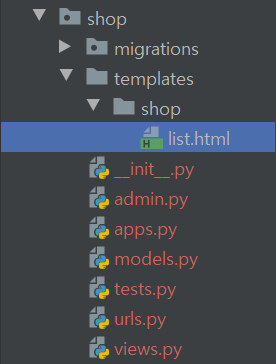  

```html



    Category



    <div class="row">
        <div class="col-2">
            <div class="list-group">
                <a href="/" class="list-group-item active" >All</a>
                
                    <a href="{{c.get_absolute_url}}" class="list-group-item active" >{{c.name}}</a>
                
            </div>
        </div>
        <div class="col">
            <div class="alert alert-info" role="alert">
                
                    {{current_category.name}}
                
                    All Products
                
            </div>
            <div class="row">
                
                    <div class="col-4">
                        <div class="card">
                            
                            <div class="card-body">
                                <h5 class="card-title">{{product.name}}</h5>
                                <p class="card-text">{{product.description}}
                                    <span class="badge badge-secondary">
                                        ${{product.price}}
                                    </span>
                                </p>
                                <a href="{{product.get_absolute_url}}" class="btn btn-primary">View Detail</a>
                            </div>
                        </div>
                    </div>
                
            </div>
        </div>
    </div>

```  

26. view url에 적용할 template 생성 - detail 구성  

``shop/templates/shop/detail.html`` 생성 후 편집  

```html


 Product Detail 


    <div class="container">
        <div class="row">
            <div class="col-4">
                
            </div>
            <div class="col">
                <h1 class="display-6">
                    {{ product.name }}
                </h1>
                <p>
                    <span class="badge badge-secondary">Price</span>
                    {{ product.price }}
                </p>
                <form action="" method="post">
                    {{ add_to_cart }}
                    
                    <input type="submit" class="btn btn-primary btn-sm" value="Add to Cart">
                </form>
                <h5>
                    <span class="badge badge-secondary">Description</span>
                    {{ product.description | linebreaks }}
                </h5>
            </div>
        </div>
    </div>

```  

27. 프로젝트 테스트 실행

``python manage.py runserver``  

> 현재 실행하면 Cart가 없다고 rendering 에러가 남. 교수님은 잘되는거 보니 이미 만들어 놓은 것이 있는 듯..  

28. 관리자 페이지 생성  

``shop/admin.py`` 수정  

```py
from django.contrib import admin

from .models import *

class CategoryAdmin(admin.ModelAdmin):
    list_display = ['name', 'slug']
    prepopulated_fields = {'slug': ('name',)}   # slug 필드의 name이 자동으로 설정되도록..?

admin.site.register(Category, CategoryAdmin)

class ProductAdmin(admin.ModelAdmin):
    list_display = ['name', 'slug', 'category',
                    'price', 'stock', 'available_display',
                    'available_order', 'created', 'updated']

    list_filter = ['available_display', 'created', 'updated', 'category']
    prepopulated_fields = {'slug': ('name',)}

    list_editable = ['price', 'stock', 'available_display', 'available_order']

admin.site.register(Product, ProductAdmin)
```

29. 관리자 페이지 접속  

``python manage.py runserver``

결과 화면  

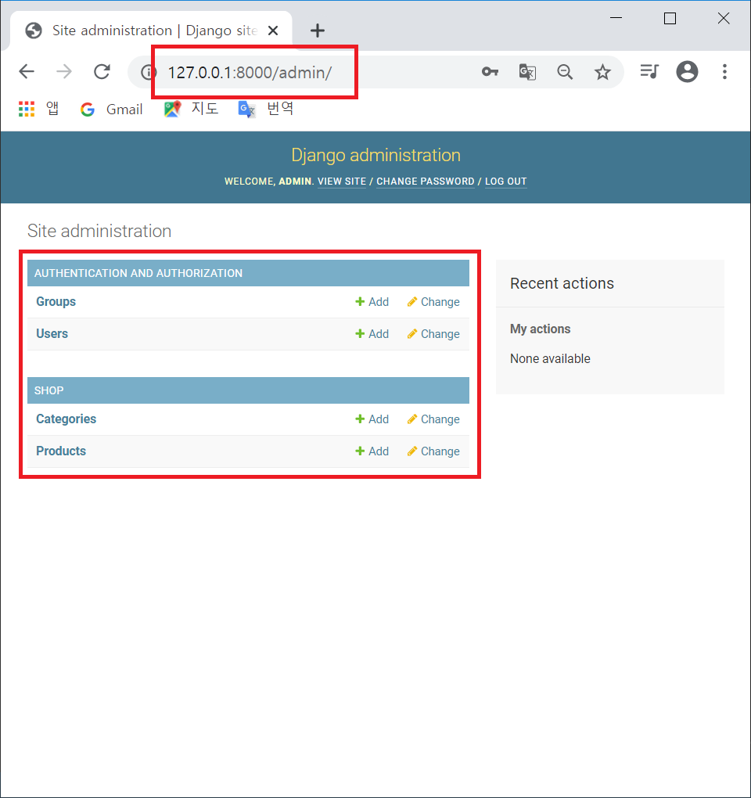  


30. 관리자 카테고리 추가  

사진과 같이 [Add]버튼 클릭

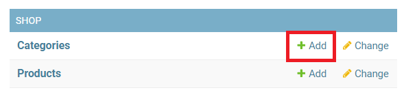  

사진과 같이 카테고리 데이터 추가

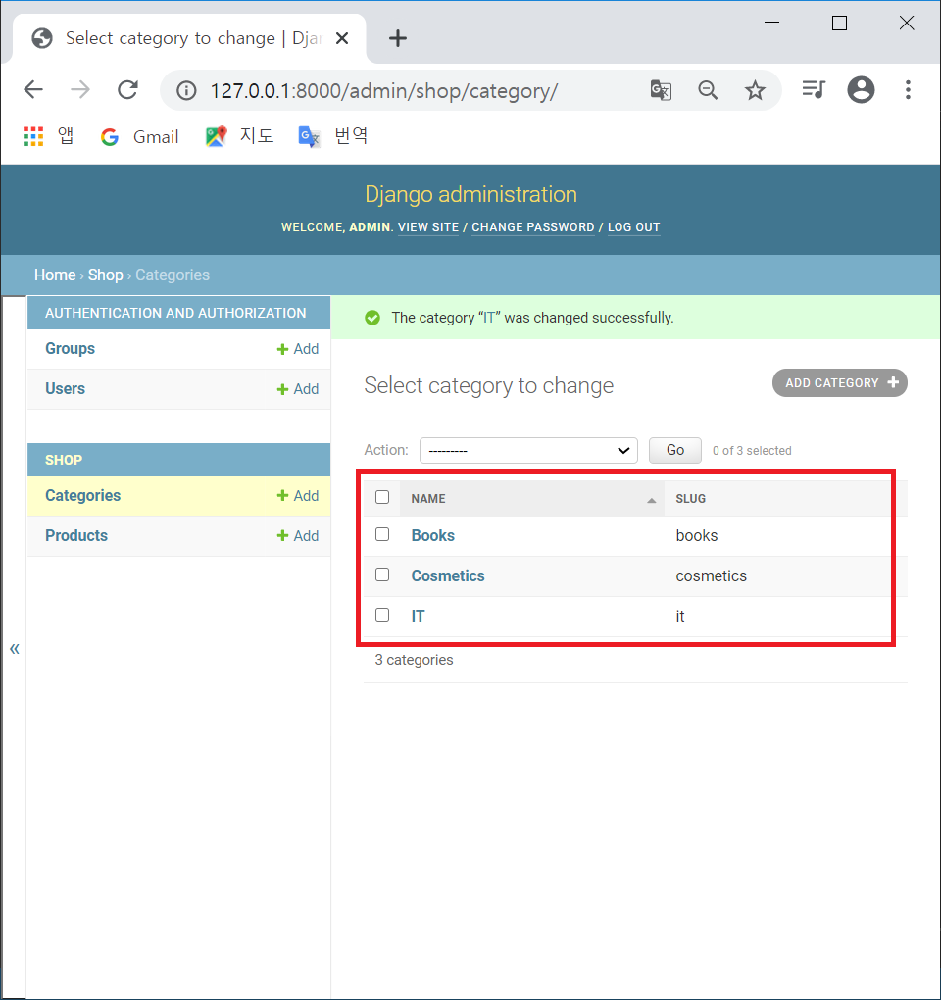  

사진과 같이 상품 데이터 추가

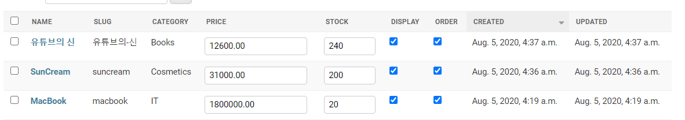  

> 상품 데이터의 이미지는 django/200805/django-image-sample/ 밑에 존재 

31. 상품 이미지 media 설정  

``config/settings.py`` 수정

```py
...

MEDIA_URL = '/media/'

MEDIA_ROOT = os.path.join(BASE_DIR, 'media')

...
```

media url 지정

``config/urls.py`` 수정  

```py
from django.contrib import admin
from django.urls import path, include
from django.conf import settings            # 추가
from django.conf.urls.static import static  # 추가

urlpatterns = [
    path('admin/', admin.site.urls),
    path('', include('shop.urls')),
]

urlpatterns += static(settings.MEDIA_URL, document_root=settings.MEDIA_ROOT)        # 추가
```

> 이제 상품이미지는 전체 프로젝트인 onlineshop/media/products폴더 밑으로 들어가게 된다.

32. 프로젝트 테스트

``python manage.py runserver``

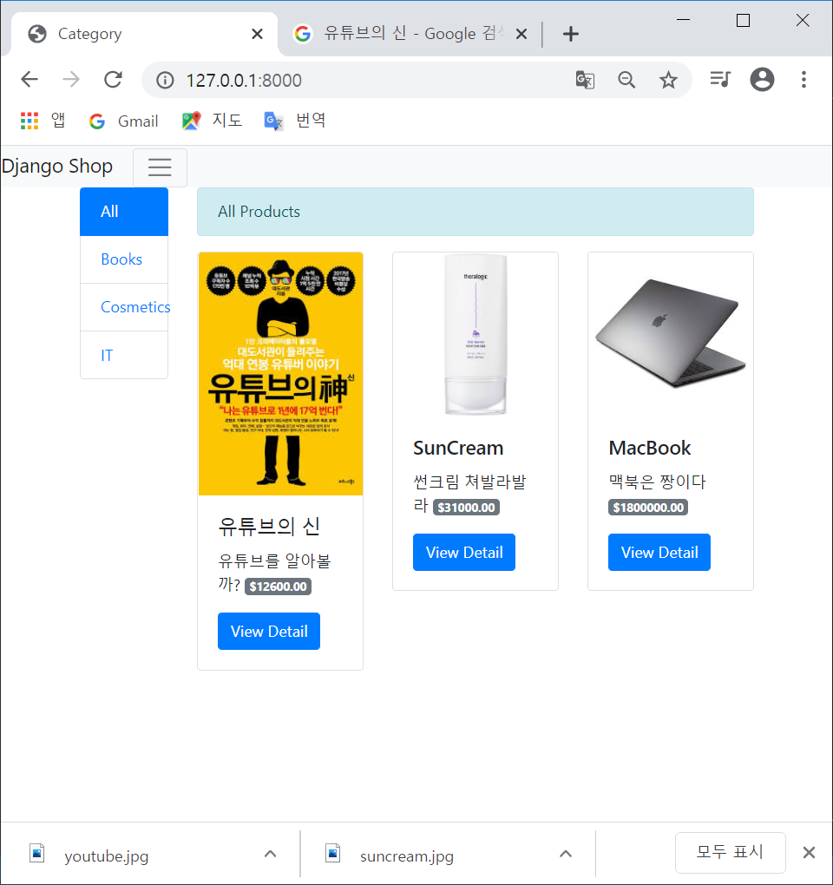  

> 우선 base.html 에 있는 cart에 대해서 지우고 진행한 상황  

33. 네이버 로그인 기능 추가  

django-allauth를 이용하여 네이버 로그인 사용!!

django-allauth를 사용하기 위해 우선 django-allauth 라이브러리를 설치  

``pip install django-allauth``  

설치 후 ``config/settings.py``에 라이브러리를 사용한다고 추가  

```py
...

INSTALLED_APPS = [
    'django.contrib.admin',
    'django.contrib.auth',
    'django.contrib.contenttypes',
    'django.contrib.sessions',
    'django.contrib.messages',
    'django.contrib.staticfiles',
    'shop',
    'django.contrib.sites',                         # 추가
    'allauth',                                      # 추가
    'allauth.account',                              # 추가
    'allauth.socialaccount',                        # 추가
    'allauth.socialaccount.providers.naver',        # 추가
]

...

AUTENTICATION_BACKENDS = (
    'django.contrib.auth.backends.ModelBackend',
    'allauth.account.auth_backends.AuthenticationBackend',
)

SITE_ID = 1
LOGIN_REDIRECT_URL = '/'        # 맨 밑에 추가!
```  

``config/urls.py``를 수정하여 로그인할 수 있는 url을 지정  

```py
urlpatterns = [
    path('admin/', admin.site.urls),
    path('', include('shop.urls')),
    path('accounts/', include('allauth.urls')),  # 추가
]
```  

이제 이러한 allauth가 사용하는 테이블을 생성하기 위해서 마이그레이션  

``python manage.py migrate``  

데이터베이스 확인..

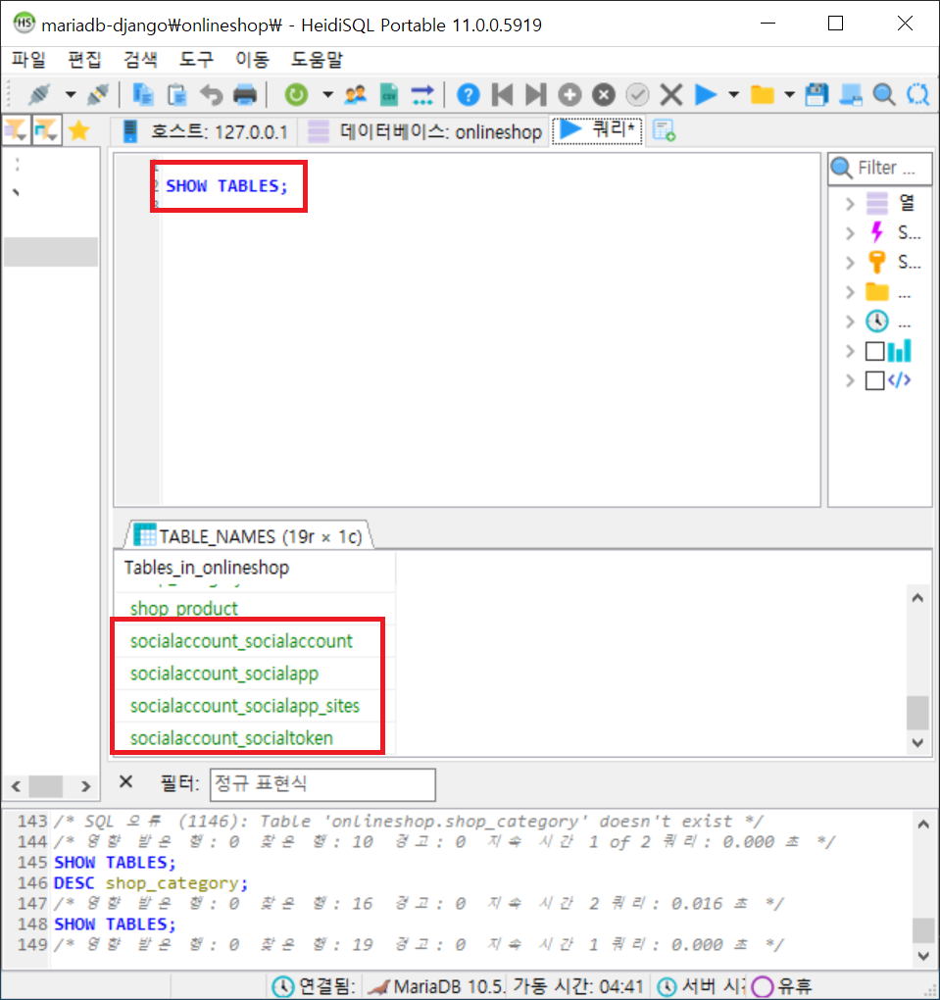  

34. 로그인 버튼 생성

``base.html`` 수정

```html
...

    <ul class="navbar-nav justify-content-end">
        <!-- 추가 -->
        <li class="nav-item">
            <a class="nav-link" href="">Login</a>
        </li>
        <li class="nav-item">
            <a class="nav-link btn btn-outline-success">
                Cart
                
                    ${{ cart.get_total_price }} with {{ cart | length }} items
                
                    : Empty
                
            </a>
        </li>
    </ul>
...
```

> 보니까 교수님 ``href=""`` 감쪽같이 지우셨었음...   

결과 화면  

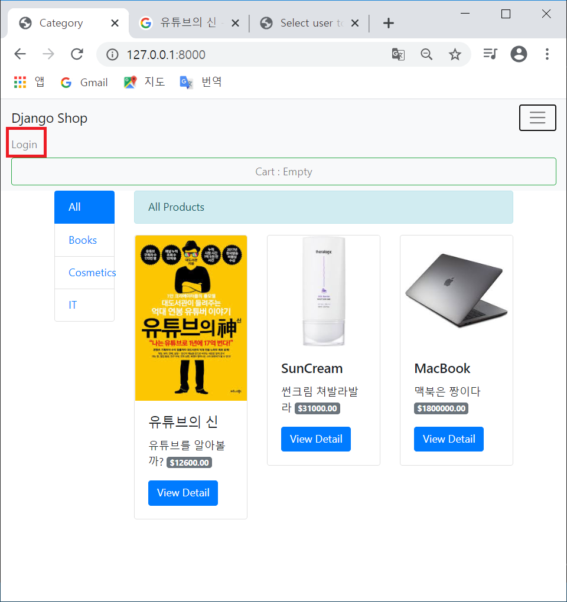  

35. 로그인 계정에 대해서 logout / login 버튼 생성  

``base.html`` 수정  

```html
...

<div class="collapse navbar-collapse justify-content-end" id="navbarSupportedContent">
    <ul class="navbar-nav justify-content-end">
        <li class="nav-item">
            
                <a class="nav-link" href="">Logout</a>
            
                <a class="nav-link" href="">Login</a>
            
        </li>
        <li class="nav-item">
            <a class="nav-link btn btn-outline-success">
                Cart
                
                    ${{ cart.get_total_price }} with {{ cart | length }} items
                
                    : Empty
                
            </a>
        </li>
    </ul>
</div>

...
```  

결과 화면 

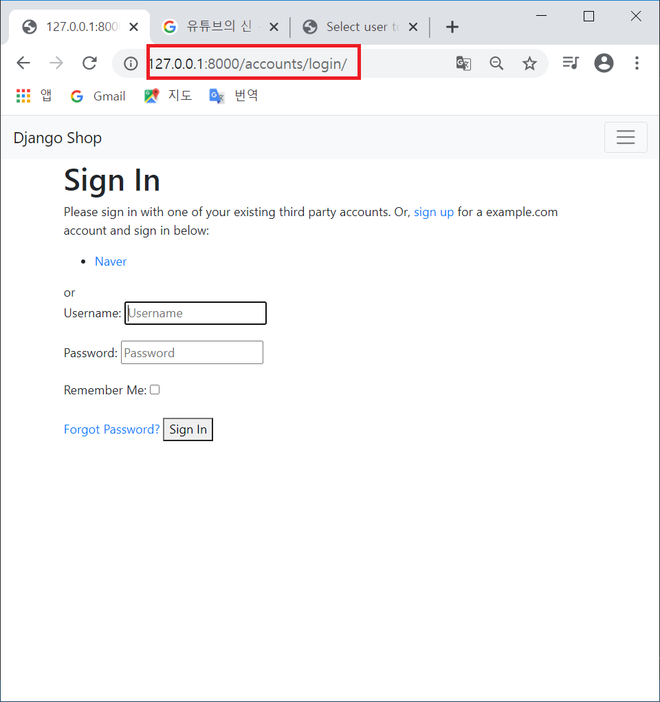  

36. 계정 생성 

사진과 같이 [sign up] 클릭.  

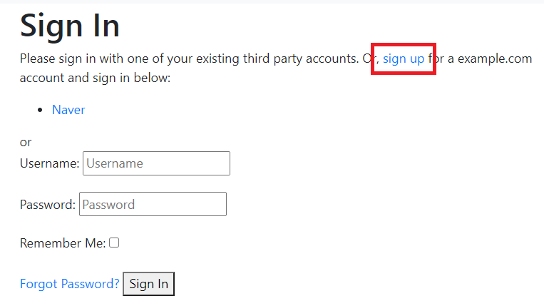  

아래와 같이 하고싶은 걸로 지정

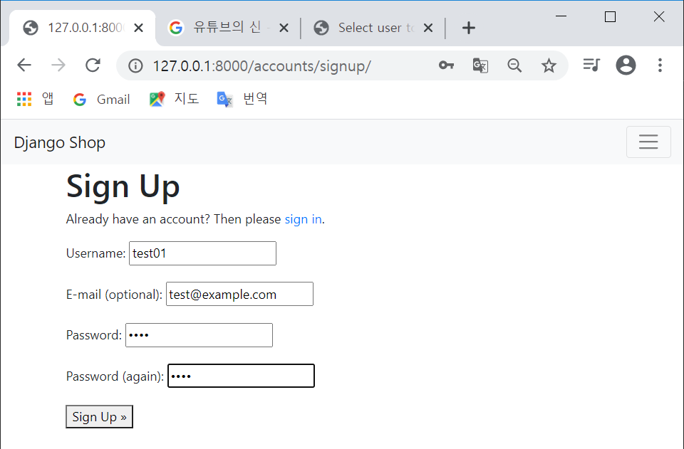  

> 패스워드는 특수문자를 섞어야 한다.  

아래와 같이 에러 발생  

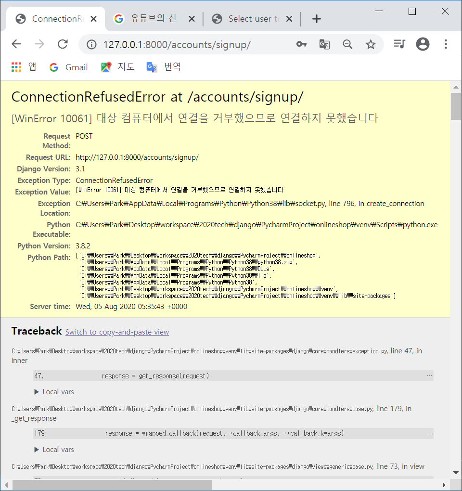  

이유는? email 검증하는 것에 대해서 문제를 일으킴.  

37. 이메일 검증하지 않도록 설정  

``config/settings.py`` 수정 

```py
...

ACCOUNT_EMAIL_VERIFICATION = 'none' # 맨 마지막에 추가
```

계정 추가 결과 화면  

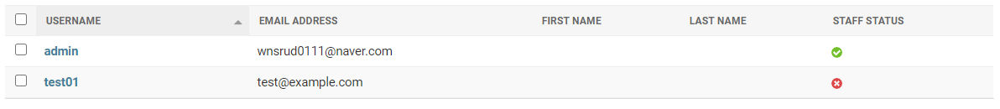  


38. 네이버로그인 사용하기 위해 네이버 오픈 api 정보 등록

네이버 api 사용  

[네이버 api 바로가기](https://developers.naver.com/main/)  

아래 사진과 같이 [네이버 아이디로 로그인 api]를 클릭

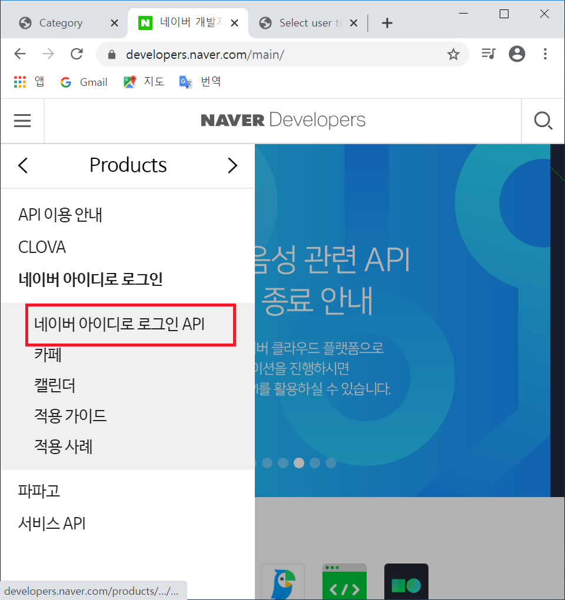  

아래 사진과 같이 [오픈 API 신청] 클릭

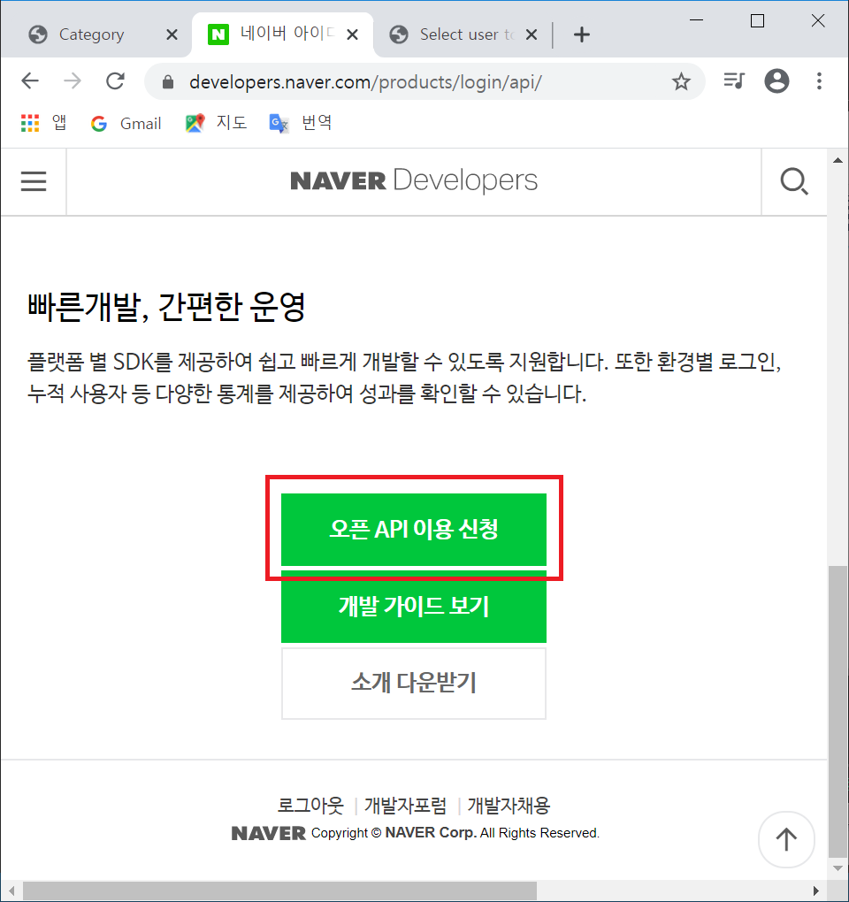  

약관 동의하고 인증절차 마친 후 다음과 같이 설정  

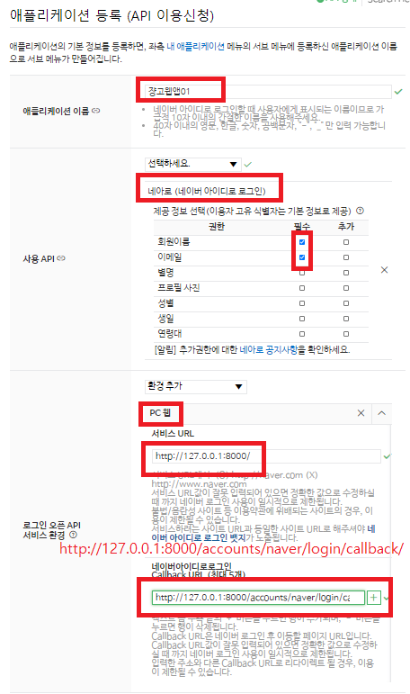  

완료 하면 마지막으로 어플리케이션 정보가 나옴 이것을 확인.

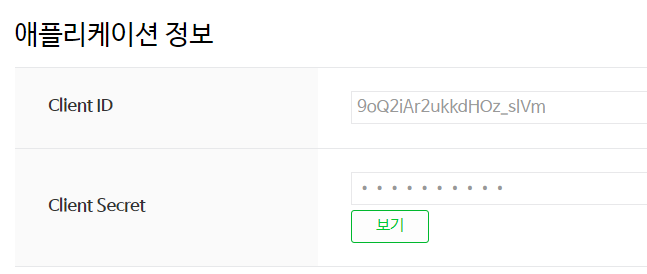  

39. django admin에 네이버 open api 정보 등록  

django admin social applications 에서 add한 후 정보 입력  

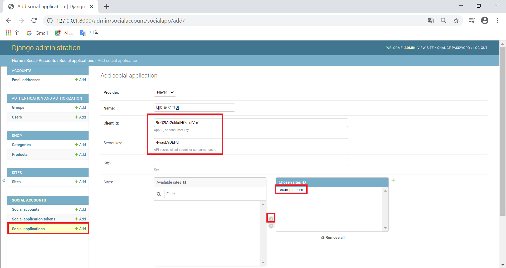  

40. 네이버로그인 테스트  

``python manage.py runserver`` 후 LOGIN 버튼 클릭

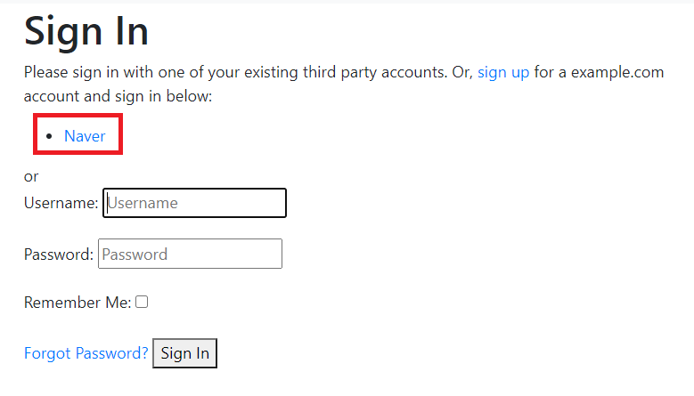  

Naver 버튼 클릭 하면

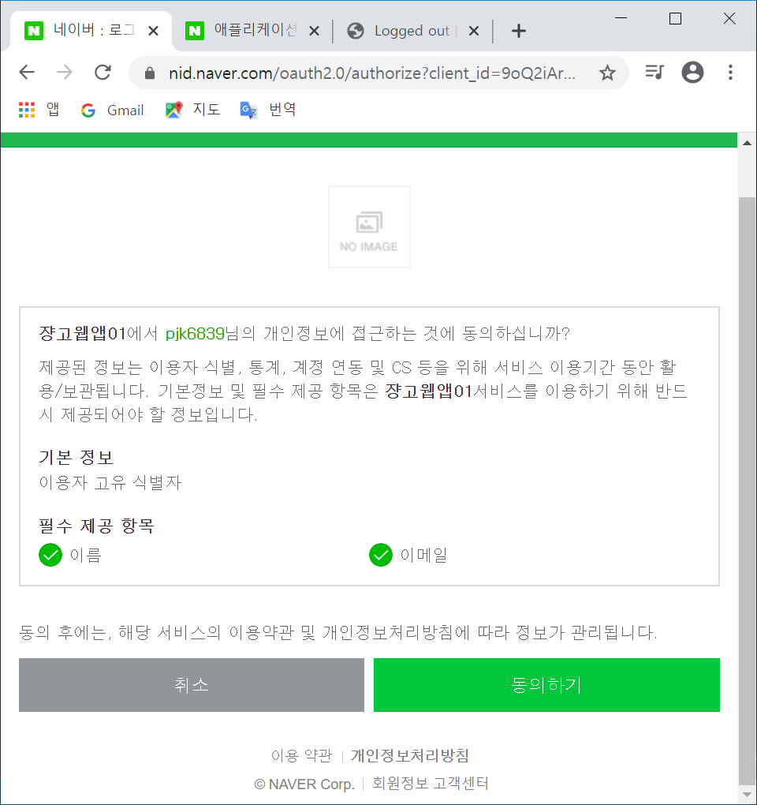  

[동의하기] 버튼 누르면 정상적으로 네이버 로그인 성공.  

41. django admin으로 네이버 사용자 확인  

실행한 프로젝트에서 로그아웃 하고 

admin 페이지로 이동하여 admin계정으로 접속 후 아래와 같이 확인.

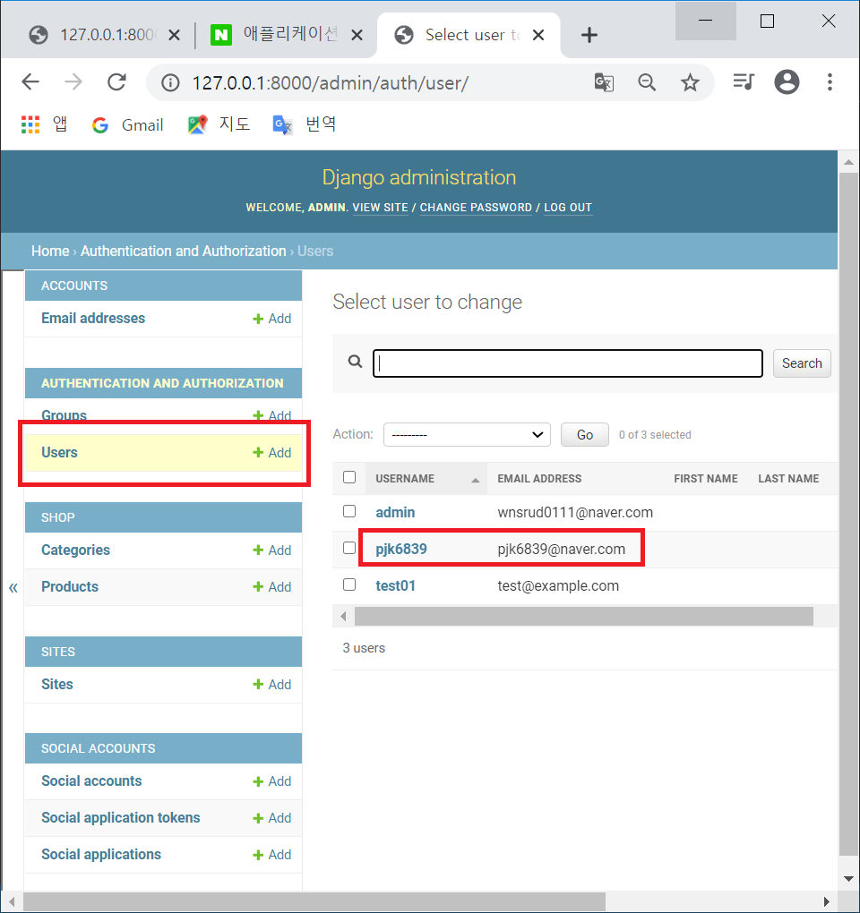  

42. Cart app 생성  

``python manage.py startapp cart``  

43. 만든 cart app을 settings.py에 설정  

``config/settings.py`` 수정  

```py
...

INSTALLED_APPS = [
    'django.contrib.admin',
    'django.contrib.auth',
    'django.contrib.contenttypes',
    'django.contrib.sessions',
    'django.contrib.messages',
    'django.contrib.staticfiles',
    'shop',
    'django.contrib.sites',
    'allauth',
    'allauth.account',
    'allauth.socialaccount',
    'allauth.socialaccount.providers.naver',
    'cart',         # 추가
]

...
```

> 카트에 대한 내용을 저장할 때에는 세션방식과 데이터베이스방식이 있다. 세션방식은 로그아웃하면 정보가 그냥 사라짐. 따라서 데이터베이스 방식 사용

44. cart 클래스 생성  

``onlineshop/cart`` 밑에 cart.py 생성 후 편집  

```py
from django.conf import settings
from shop.models import Product
from decimal import Decimal

class Cart(object):
    # 생성자
    def __init__(self, request):
        self.session = request.session
        cart = self.session.get(settings.CART_ID)
        if not cart:
            cart = self.session[settings.CART_ID] = {}

        self.cart = cart


    # 카트에 있는 item 총 갯수를 가져오는 함수
    def __len__(self):
        return sum(item['quantity'] for item in self.cart.values())

    # 카트 iteration 객체를 가져오는 함수
    def __iter__(self):
        product_ids = self.cart.keys()

        products = Product.objects.filter(id__in=product_ids)

        for product in products:
            self.cart[str(product.id)]['product'] = product

        for item in self.cart.values():
            item['price'] = Decimal(item['price'])
            item['total_price'] = item['price'] * item['quantity']

            # yield를 만나면 멈추고 next로 간다.
            yield item

    def add(self, product, quantity = 1, is_update=False):
        product_id = str(product.id)

        if product_id not in self.cart:
            self.cart[product_id] = { 'quantity' : 0, 'price': str(product.price)}

        if is_update:
            self.cart[product_id]['quantity'] = quantity
        else:
            self.cart[product_id]['quantity'] += quantity

        self.save()

    def save(self):
        self.session[settings.CART_ID] = self.cart
        self.session.modified = True

    def remove(self, product):
        product_id = str(product.id)

        if product_id in self.cart:
            del(self.cart[product_id])
            self.save()

    def clear(self):
        self.session[settings.CART_ID] = {}
        self.session.modified = True

    def get_product_total(self):
        return sum(Decimal(item['price']) * item['quantity'] for item in self.cart.values())

```

45. session에 저장될 CART_ID 지정  

``config/settings.py`` 수정  

```py
...

CART_ID = 'cart_in_session' # 맨 밑에 추가
```

46. 제품을 추가할 form 만들기  

``onlineshop/cart`` 밑에 forms.py 생성 후 편집  

```py
 from django import forms

class AddProductForm(forms.Form):
    quantity = forms.IntegerField()
    is_update = forms.BooleanField(required=False, initial=False, widget=forms.HiddenInput)
```  

47. cart view에 관한 함수 정의  

``cart/views.py`` 수정  

```py
from django.shortcuts import render, get_object_or_404, redirect
from django.views.decorators.http import require_POST
from .cart import Cart
from shop.models import Product
from .forms import AddProductForm

@require_POST
def add(request, product_id):
    cart = Cart(request)
    product = get_object_or_404(Product, id=product_id)

    form = AddProductForm(request.POST)

    if form.is_valid():
        cd = form.cleaned_data
        cart.add(product = product, quantity = cd['quantity'], is_update = cd['is_update'])

    return redirect('cart:detail')

def remove(request, product_id):
    cart = Cart(request)
    product = get_object_or_404(Product, id=product_id)
    cart.remove(product)

    return redirect('cart:detail')

def detail(request):
    cart = Cart(request)

    for product in cart:
        product['quantity_form'] = AddProductForm(initial={'quantity': product['quantity'], 'is_update': True })

    return render(request, 'cart/detail.html', {'cart' : cart})

```

48. cart url에 관해 정의  

``onlineshop/cart`` 밑에 urls.py를 만들고 편집  

```py
from django.urls import path

from .views import *

app_name = 'cart'

urlpatterns = [
    path('', detail, name = 'default'),
    path('add/<int:product_id>', add, name='product_add'),  # add는 views.py에 있는 함수
    path('remove/<int:product_id>', remove, name='product_remove'),
]
```  

49. 추가한 url에 대한 template 생성  

아래와 같은 구조로 detail.html 생성 후 편집  

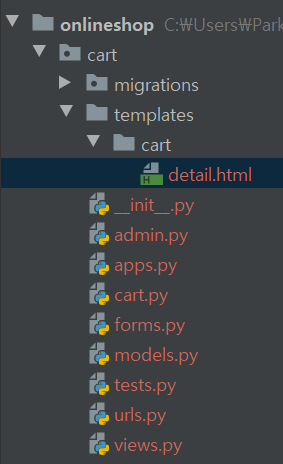  


```html




    Shopping Cart



    <table class="table table-striped">
        <thead>
            <tr>
                <th scope="col">Image</th>
                <th scope="col">Product</th>
                <th scope="col">Quantity</th>
                <th scope="col">Remove</th>
                <th scope="col">Unit Price</th>
                <th scope="col">Price</th>
            </tr>
        </thead>
        <tbody>
            
                
                <tr>
                    <th scope="row">
                        <a href="{{ product.get_absolute_url }}">
                            
                        </a>
                    </th>
                    <td>{{ product.name }}</td>
                    <td>
                        <form action="" method="post">
                            {{ item.quantity_form.quantity }}
                            {{ item.quantity_form.is_update }}
                            <input type="submit" class="btn btn-primary" value="Update">
                            
                        </form>
                    </td>
                    <td>
                        <a href="">Remove</a>
                    </td>
                    <td class="num">${{ item.price }}</td>
                    <td class="num">${{ item.total_price }}</td>
                </tr>
                
            
                <tr class="total">
                    <td>Total</td>
                    <td colspan="4"></td>
                    <td class="num">${{ cart.get_total_price | floatformat:"2"}}</td>
                </tr>
        </tbody>
    </table>

```  

50. css 추가  

css 파일을 추가하기 위해서 아래와 같이 ``onlineshop`` 밑에 static이라는 폴더를 생성 후 css라는 폴더 생성하고 style.css이라는 파일을 생성 후 편집

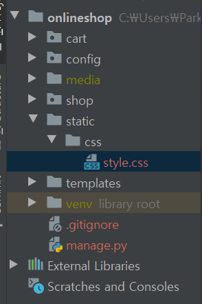  

```css
body {
    background: black;
}
```  

51. cart 기능을 templates에서 활성화 시키기 (버튼 추가하기)  

detail 페이지에서 cart로 담는 버튼을 활성화 하기 위해  

``shop/views.py`` 수정 

```py
...

from cart.forms import AddProductForm

...

def product_detail(request, id, product_slug=None):
    product = get_object_or_404(Product, id=id, slug=product_slug)
    add_to_cart = AddProductForm(initial={'quantity': 1})

    return render(request, 'shop/detail.html', {'product': product, 'add_to_cart': add_to_cart})

...
```  

52. detail 템플릿도 수정  

``templates/shop/detail.html`` 수정  

```py


 Product Detail 


    <div class="container">
        <div class="row">
            <div class="col-4">
                
            </div>
            <div class="col">
                <h1 class="display-6">
                    {{ product.name }}
                </h1>
                <p>
                    <span class="badge badge-secondary">Price</span>
                    {{ product.price }}
                </p>
                <form action="" method="post">
                    {{ add_to_cart }}
                    
                    <input type="submit" class="btn btn-primary btn-sm" value="Add to Cart">
                </form>
                <h5>
                    <span class="badge badge-secondary">Description</span>
                    {{ product.description | linebreaks }}
                </h5>
            </div>
        </div>
    </div>

```

> 따로 수정한 것은 x, 교수님은 {{ add_to_cart }}, 을 추가한 것뿐  

53. 전체 프로젝트인 config에 cart url 추가  

``config/urls.py`` 수정  

```py
urlpatterns = [
    path('admin/', admin.site.urls),
    path('', include('shop.urls')),
    path('cart/', include('cart.urls')),        # 추가
    path('accounts/', include('allauth.urls')),
]
```

54. 프로젝트 테스트  

``python manage.py runserver``

view detail을 클릭한 화면 결과

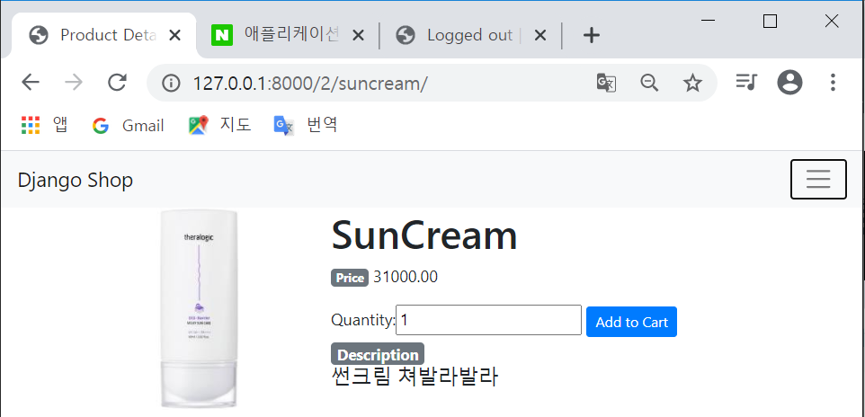  

[Add to Cart]버튼을 클릭한 결과  

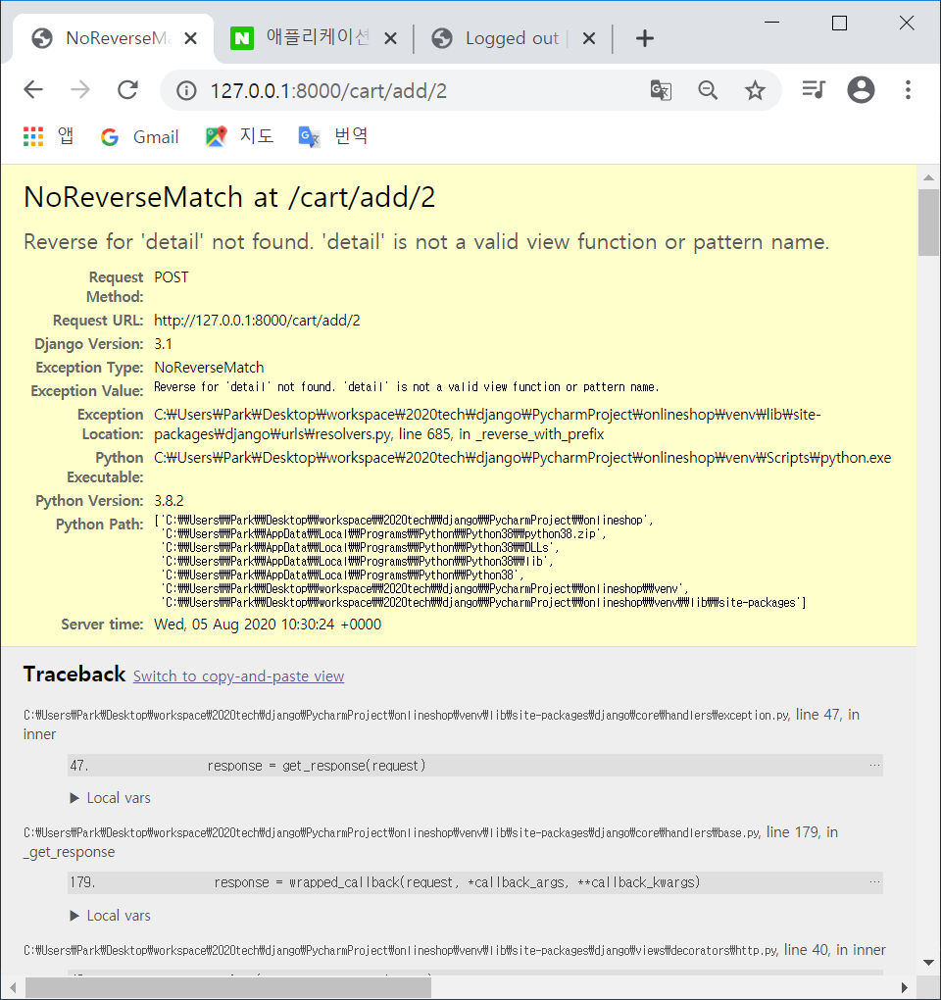  

reverse를 잘못설정함.  

수정하기 위해서 ``cart/urls.py`` 수정  

```py
...

urlpatterns = [
    path('', detail, name = 'detail'),      # 수정한 라인
    path('add/<int:product_id>', add, name='product_add'),  # add는 views.py에 있는 함수
    path('remove/<int:product_id>', remove, name='product_remove'),
]
```  

> 아오. 또 안된다.. 이 교수님이 하는거는 되는게 없네;;  

55. 계속 쇼핑하기 추가  

``cart/detail.html`` 수정  

```html
...
                </tr>
        </tbody>
    </table>
    <p class="text-right">
        <a href="" class="btn btn-secondary">Continue shopping</a>
    </p>
<% endblock %>
```  

56. main 페이지(홈페이지)에서 [Cart:Empty] 버튼을 누를시 Cart로 이동하게 하기  

``shop/views.py``에서 ``base.html``로 Cart 데이터를 바인딩 하도록 수정  

```py
from django.shortcuts import render, get_object_or_404

from .models import *

from cart.forms import AddProductForm
from cart.cart import Cart              # 추가

def product_in_category(request, category_slug=None):
    current_category = None
    categories = Category.objects.all()
    products = Product.objects.filter(available_display=True)

    if category_slug:
        current_category = get_object_or_404(Category, slug=category_slug)
        products = products.filter(category=current_category)

    cart = Cart(request)        # 추가

    return render(request, 'shop/list.html', {'current_category': current_category, 'categories': categories, 'products': products, 'cart':cart})   # 수정


def product_detail(request, id, product_slug=None):
    product = get_object_or_404(Product, id=id, slug=product_slug)
    add_to_cart = AddProductForm(initial={'quantity': 1})

    cart = Cart(request)    # 추가

    return render(request, 'shop/detail.html', {'product': product, 'add_to_cart': add_to_cart, 'cart':cart})   # 수정
```

``base.html`` 수정  

```html
...

        <li class="nav-item">
            <a class="nav-link btn btn-outline-success">
                Cart
                
                    <!-- get_product_total로 수정-->
                    ${{ cart.get_product_total }} with {{ cart | length }} items    
                
                    : Empty
                
            </a>
        </li>

...
```  

57. 쿠폰 추가하기위해 쿠폰 app 추가  

``python manage.py startapp coupon``  

58. 프로젝트에 coupon app 추가한 것을 설정  

``config/settings.py`` 수정  

```py
...

INSTALLED_APPS = [
    'django.contrib.admin',
    'django.contrib.auth',
    'django.contrib.contenttypes',
    'django.contrib.sessions',
    'django.contrib.messages',
    'django.contrib.staticfiles',
    'shop',
    'django.contrib.sites',
    'allauth',
    'allauth.account',
    'allauth.socialaccount',
    'allauth.socialaccount.providers.naver',
    'cart',
    'coupon',       # 추가
]

...
```  

59. model에서 coupon 클래스 추가  

``coupon/models.py`` 수정  

```py
from django.db import models
from django.core.validators import MinValueValidator, MaxValueValidator

# Create your models here.

class Coupon(models.Model):
    code = models.CharField(max_length=50, unique=True)

    use_from = models.DateTimeField()
    use_to = models.DateTimeField()
    amount = models.IntegerField(validators=[MinValueValidator(0), MaxValueValidator(100000)])
    active = models.BooleanField()

    def __str__(self):
        return self.code
```  

60. coupon에 대해서 모델을 추가하였으니 makemigration  

``python manage.py makemigrations coupon``

61. coupon에 대해서 마이그레이션 한 것을 적용  

``python manage.py migrate coupon`` 

62. 데이터베이스 확인  

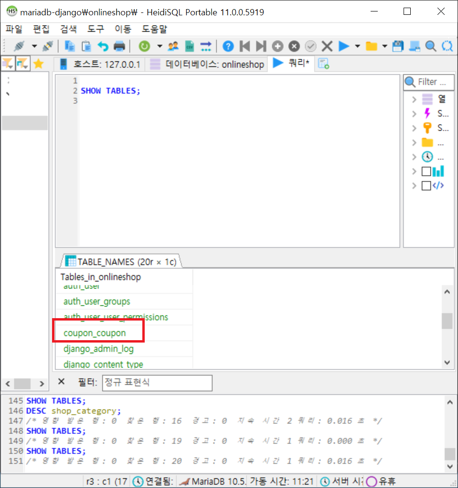  


63. cart와 마찬가지로 coupon에 대해서도 form 생성  

``coupon`` 폴더 밑에 forms.py 생성 후 편집

```py
from django import forms

class AddCouponForm(forms.Form):
    code = forms.CharField(label='Your Coupon Code')

```

64. coupon에 view 에 영향을 미치는 함수를 생성  

``coupon/views.py`` 수정  

```py
from django.shortcuts import redirect
from django.utils import timezone
from django.views.decorators.http import require_POST

from .models import Coupon
from .forms import AddCouponForm

@require_POST
def add_coupon(request):
    now = timezone.now()
    form = AddCouponForm(request.POST)

    if form.is_valid():
        code = form.cleaned_data['code']

        try:
            coupon = Coupon.objects.get(code__exact=code, use_from__lte=now, use_to__gte=now, active=True)
            request.session['coupon_id'] = coupon.id

        except Coupon.DoseNotExist:
            request.session['coupon_id'] = None
    return redirect('cart:detail')  
```  

65. 작성한 view 함수들을 활용하기 위해서 urls.py 수정  

``coupon`` 폴더에 urls.py을 생성하고 편집  

```py
from django.urls import path

from .views import add_coupon

app_name = 'coupon'

urlpatterns = [
    path('add/', add_coupon, name='add'),
]
```  

66. coupon url을 전체 프로젝트 url에 알려주기.  

``config/urls.py`` 수정

```py
...

urlpatterns = [
    path('admin/', admin.site.urls),
    path('accounts/', include('allauth.urls')),
    path('cart/', include('cart.urls')),
    path('coupon/', include('coupon.urls')),
    path('', include('shop.urls')),
]

...
```

67. 쿠폰을 카트에서 사용하므로 cart.py에 coupon 기능 추가  

``cart/cart.py`` 수정

```py
...

    def __init__(self, request):
        self.session = request.session
        cart = self.session.get(settings.CART_ID)
        if not cart:
            cart = self.session[settings.CART_ID] = {}
        self.cart = cart
        self.coupon_id = self.session.get('coupon_id')  # 추가

...
```  

68. 쿠폰 삭제 기능 추가  

``cart/cart.py`` 수정

```py
...

    def clear(self):
        self.session[settings.CART_ID] = {}
        self.session['coupon_id'] = None
        self.session.modified = True

...
```  

69. 카트에서 쿠폰 정보를 얻어오게하는 함수 작성

``cart/cart.py`` 수정  

```py
...

# 맨 밑에 추가
@property
    def coupon(self):
        if self.coupon_id:
            return Coupon.objects.get(id=self.coupon_id)
        return None

    def get_discount_total(self):
        if self.coupon:
            if self.get_product_total() >= self.coupon.amount:
                return self.coupon.amount
            return Decimal(0)

    def get_total_price(self):
        return self.get_product_total() - self.get_discount_total()
```

70. view에서 쿠폰 함수 작성

``cart/views.py`` 수정  

```py
...

def detail(request):
    cart = Cart(request)
    add_coupon = AddProductForm()   # 추가

    for product in cart:
        product['quantity_form'] = AddProductForm(initial={'quantity': product['quantity'], 'is_update': True })

    return render(request, 'cart/detail.html', {'cart': cart, 'add_coupon': add_coupon})    # 수정
```  

71. template에 쿠폰에 관한 기능 추가  

``cart/detail.html`` 수정  

```html
...

    </table>
    <p>
        Add Coupon:
    </p>
    <form action="" method="post">
        {{ add_coupon }}
        <input type="submit" value="Add">
        
    </form>
    <p class="text-right">
        <a href="" class="btn btn-secondary">Continue shopping</a>
    </p>

```  

72. 관리자 페이지에서 쿠폰 생성  

``coupon/admin.py`` 수정  

```py
from django.contrib import admin
from .models import Coupon

class CouponAdmin(admin.ModelAdmin):
    list_display = ['code', 'use_from', 'use_to', 'amount', 'action']
    list_filter = ['active', 'use_from', 'use_to']
    search_fields = ['code']

admin.site.register(Coupon, CouponAdmin)

```  

73. 프로젝트를 실행하여 쿠폰 등록해보기  

``python manage.py runserver``  

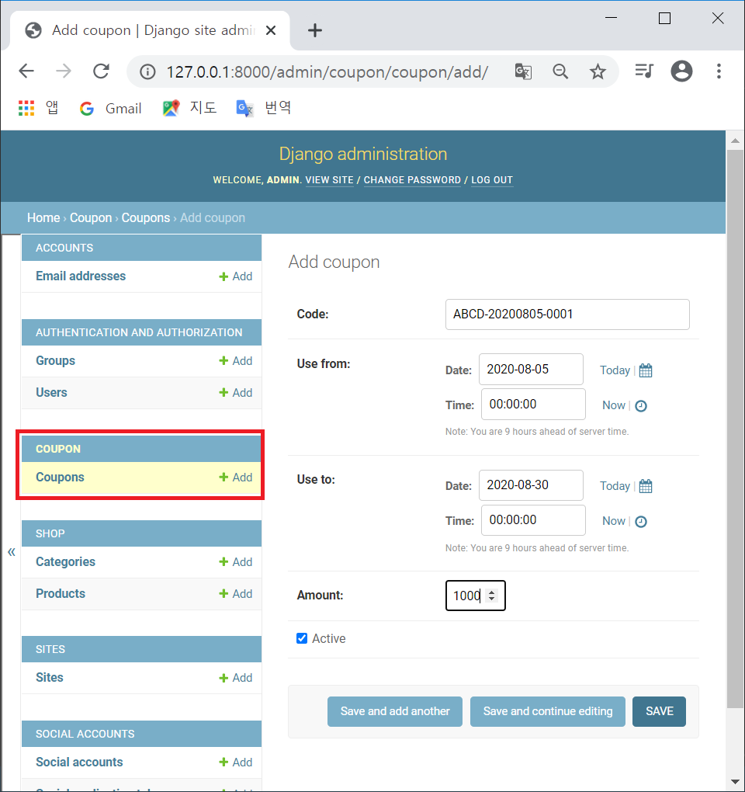  

74. cart에 가서 coupon 테스트  

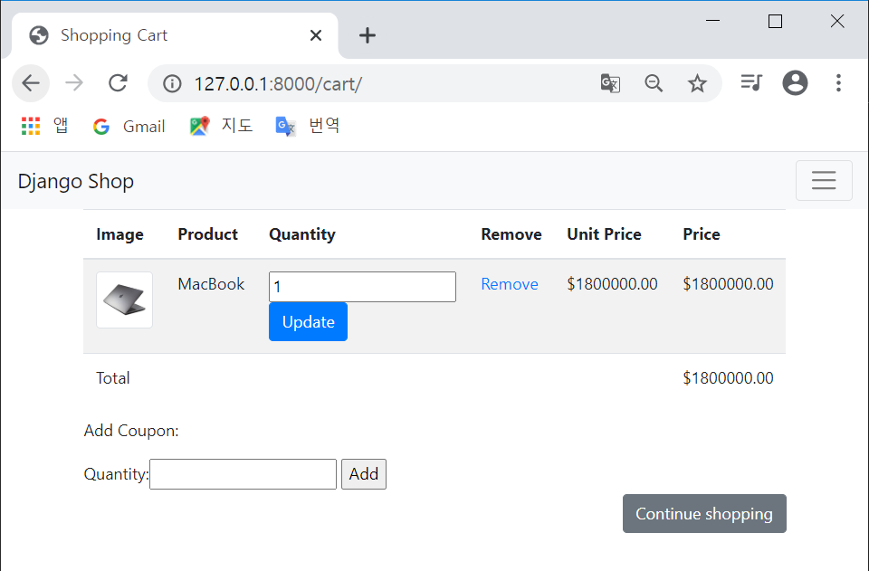  


> quantity가 아니라 code가 나와야하는데..  

75. cart/views.py 수정  

```py
...

from coupon.forms import AddCouponForm

...

def detail(request):
    cart = Cart(request)
    add_coupon = AddCouponForm()        # 수정

    for product in cart:
        product['quantity_form'] = AddProductForm(initial={'quantity': product['quantity'], 'is_update': True })

    return render(request, 'cart/detail.html', {'cart': cart, 'add_coupon': add_coupon})
```

76. 쿠폰이 적용한 것을 확인하기 위해 detail 페이지 수정  

``cart/detail.html`` 수정

```html
...

    


    <tr class="subtotal">
        <td>SubTotal</td>
        <td colspan="4"></td>
        <td>${{cart.get_product_total}}</td>
    </tr>
    <tr>
        <td>"{{ cart.coupon.code }}" coupon (${{ cart.coupon.amount }})</td>
        <td colspan="4"></td>
        <td>- %{{ cart.get_discount_total | floatformat:"2" }}</td>
    </tr>
    
    <tr class="total">
        <td>Total</td>
        <td colspan="4"></td>
        <td class="num">${{ cart.get_total_price | floatformat:"2"}}</td>
    </tr>

...
```  

결과 화면  

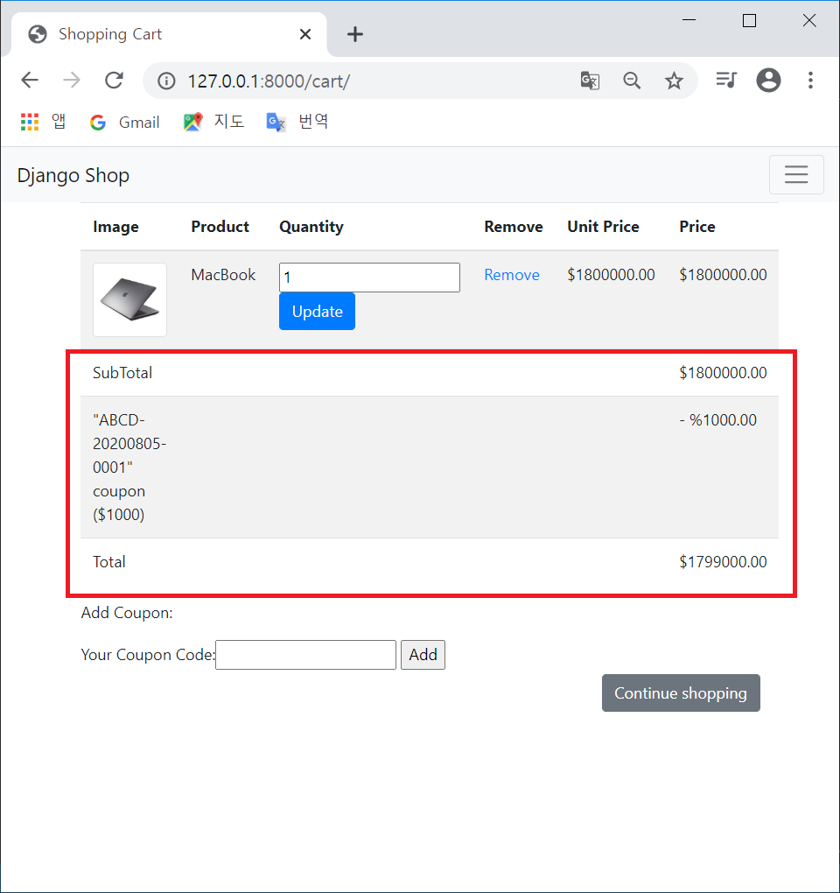  

77. logger 구현  

앱을 만들 때에는 log를 구현하는것이 좋다.  

``config/settings.py`` 수정  

```py
...

LOGGING = {
    'version': 1,
    # 기존의 로깅 설정을 비활성화 할 것인가?
    'disable_existing_loggers': False,
    'formatters': {
        'format1': {
            'format': '[%(asctime)s%] %(levelname)s [%(name)s:%(lineno)s] %(message)s',
            'datefmt': '%d/%b/%Y %H:%M:%S'
        }
    },
    'handlers': {
        'console': {
            'level':'DEBUG',
            'class': 'logging.StreamHandler',
            'formatter': 'detailFormatter'
        },
    },
    'loggers': {
        'shop': {
            'handlers': ['console'],
            'level': 'DEBUG',
        }
    }
}
```

78. views.py 에서 logging할 함수 logger 적용  

loggers의 타겟이 shop이므로  

``shop/views.py`` 수정  

```py
from django.shortcuts import render, get_object_or_404

from .models import *

from cart.forms import AddProductForm
from cart.cart import Cart

import logging      # 추가

logger = logging.getLogger(__name__)        # logger 추가

def product_in_category(request, category_slug=None):
    current_category = None
    categories = Category.objects.all()
    products = Product.objects.filter(available_display=True)

    logger.debug('current_category = {}'.format(current_category))      # logger 적용

    if category_slug:
        current_category = get_object_or_404(Category, slug=category_slug)
        products = products.filter(category=current_category)

    cart = Cart(request)

    return render(request, 'shop/list.html', {'current_category': current_category, 'categories': categories, 'products': products, 'cart':cart})


def product_detail(request, id, product_slug=None):
    product = get_object_or_404(Product, id=id, slug=product_slug)
    add_to_cart = AddProductForm(initial={'quantity': 1})

    cart = Cart(request)

    logger.debug('cart = {}'.format(cart))  # logger 적용

    return render(request, 'shop/detail.html', {'product': product, 'add_to_cart': add_to_cart, 'cart':cart})

```  

> Terminal에서 log가 찍히는 것을 잘 확인.  
