# 2020-08-12 Study

장고기간 웹 프로그래밍 (Django based Web Programming)

2020-08-12 **온라인** 강의 수업 내용  


## Django로 쇼핑몰 페이지 만들기 2 

### 주문 오더 만들기  

1. order app을 만든다.  

``python manage.py startapp order``  

2. 만든 order app을 ``settings.py``에 추가  

```py
# in config/settings.py
...

INSTALLED_APPS = [
    'django.contrib.admin',
    'django.contrib.auth',
    'django.contrib.contenttypes',
    'django.contrib.sessions',
    'django.contrib.messages',
    'django.contrib.staticfiles',
    'shop',
    'django.contrib.sites',
    'allauth',
    'allauth.account',
    'allauth.socialaccount',
    'allauth.socialaccount.providers.naver',
    'cart',
    'coupon',
    'order',        # 추가
]
```

3. 아임포트를 이용해서 결제 처리하기위해 아임포트 회원가입  

[아임포트 홈페이지 바로가기](https://admin.iamport.kr/users/login)  

들어가서 회원가입  

4. 시스템 설정  

다음과 같이 [시스템 설정]으로 들어간다.  

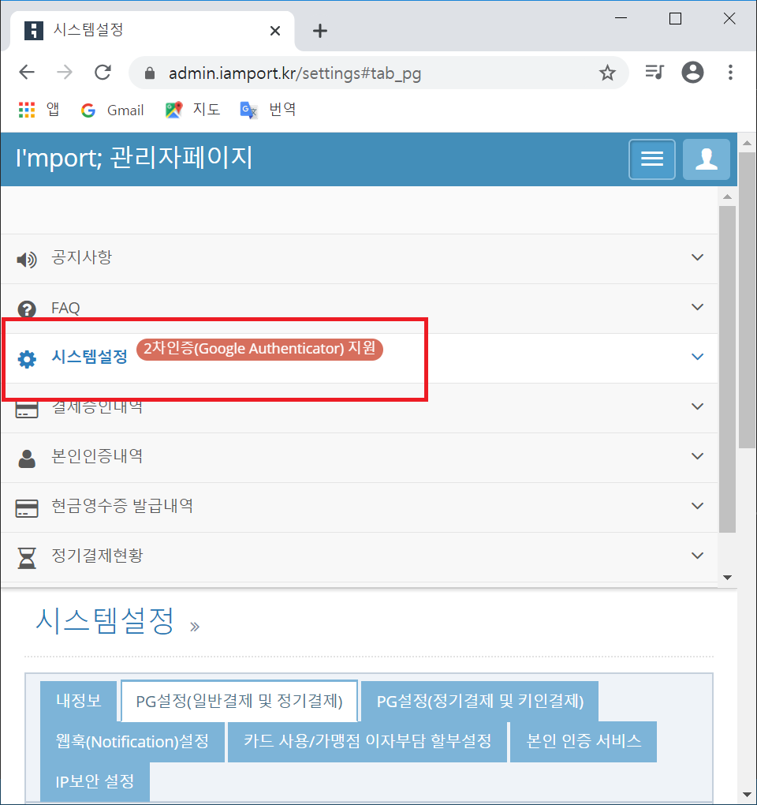  

다음과 같이 [PG 설정(일반결제 및 정기결제)]에서 PG사를 KG이니시스로 설정한 뒤 [전체 저장] 클릭.

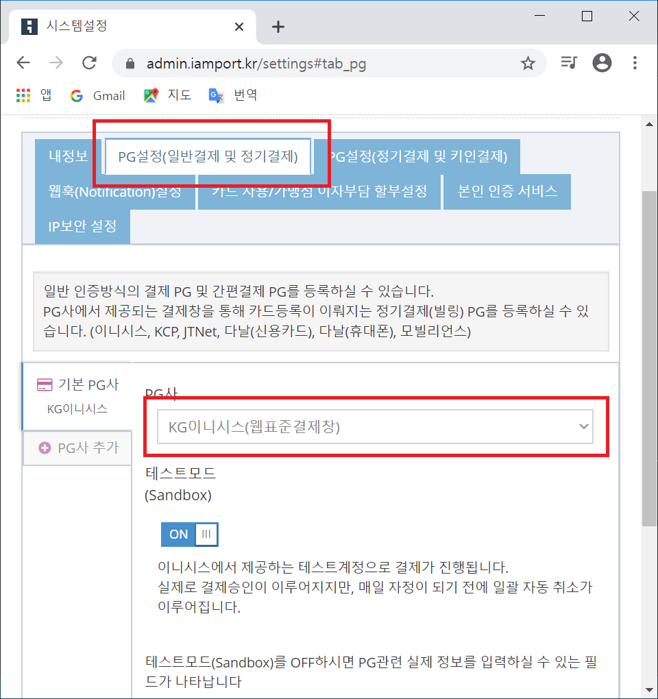  

기본적인 값들을 설정했고 앱에 적용하기 위해 [REST API 키]와 [REST API secret]을 알아야 한다.  

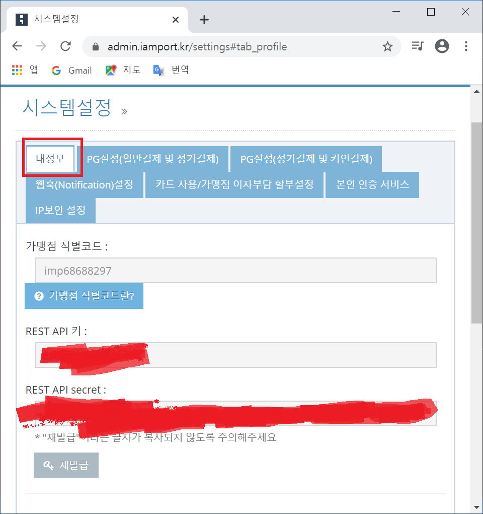  

5. 키 값을 settings.py에 적용  

``config/settings.py`` 수정

```py
IAMPORT_KEY = 'REST API 키'
IAMPORT_SECRET_KEY = 'REST API secret'
```  

6. iamport에서 제공한 rest api와 통신하기 위한 코드를 작성  

``order`` app 밑에 ``iamport.py``를 생성 후 편집 

```py
import requests

from django.conf import settings

def get_token():
    access_data = {
        'imp_key' : settings.IAMPORT_KEY,
        'imp_secret' : settings.IAMPORT_SECRET,
    }

    url = 'http://api.iamport.kr/users/getToken'

    req = requests.post(url, data=access_data)
    data = req.json()

    if data['code'] is 0:
        return data['response']['access_token']
    else:
        return None

def payments_prepare(order_id, amount, *args, **kwargs):
    access_token = get_token()

    if access_token:
        access_data = {
            'merchant_uid' : order_id,
            'amount' : amount
        }

        url = 'https://api.iamport.kr/payments/prepare'

        headers = {
            'Authorization' : access_token
        }

        req = requests.post(url, data=access_data, headers=headers)
        data = req.json()

        if data['code'] is not 0:
            raise ValueError('API 통신 오류')

    else:
        raise ValueError('토큰 오류')
```  

7. 주문받기 위한 model 작성  

``order/models.py`` 수정

```py
from django.db import models
from django.core.validators import MinValueValidator, MaxValueValidator

from coupon.models import Coupon

class Order(models.Model):
    first_name = models.CharField(max_length=50)
    last_name = models.CharField(max_length=50)
    email = models.EmailField()
    address = models.CharField(max_length=250)
    postal_code = models.CharField(max_length=20)
    city = models.CharField(max_length=100)
    created = models.DateTimeField(auto_now_add=True)
    updated = models.DateTimeField(auto_now=True)
    paid = models.BooleanField(default=False)

    coupon = models.ForeignKey(Coupon, on_delete=models.PROTECT, related_name='order_coupon', null=True, blank=True)
    discount = models.IntegerField(default=0, validators=[MinValueValidator(0), MaxValueValidator(100000)])

    def Meta:
        ordering = ['-created']

    def __str__(self):
        return 'Order {}'.format(self.id)

    def get_total_product(self):
        return sum(item.get_item_price() for item in self.item.all())

    def get_total_price(self):
        total_product = self.get_total_product()
        return total_product - self.discount
```

8. 주문에 들어갈 아이템들을 만들기  

``order/models.py`` 에 클래스 추가  

```py
from django.db import models
from django.core.validators import MinValueValidator, MaxValueValidator

from coupon.models import Coupon
from shop.models import Product

import hashlib

from .iamport import payments_prepare

class Order(models.Model):
    first_name = models.CharField(max_length=50)
    last_name = models.CharField(max_length=50)
    email = models.EmailField()
    address = models.CharField(max_length=250)
    postal_code = models.CharField(max_length=20)
    city = models.CharField(max_length=100)
    created = models.DateTimeField(auto_now_add=True)
    updated = models.DateTimeField(auto_now=True)
    paid = models.BooleanField(default=False)

    coupon = models.ForeignKey(Coupon, on_delete=models.PROTECT, related_name='order_coupon', null=True, blank=True)
    discount = models.IntegerField(default=0, validators=[MinValueValidator(0), MaxValueValidator(100000)])

    class Meta:
        ordering = ['-created']

    def __str__(self):
        return 'Order {}'.format(self.id)

    def get_total_product(self):
        return sum(item.get_item_price() for item in self.items.all())

    def get_total_price(self):
        total_product = self.get_total_product()
        return total_product - self.discount


class OrderItem(models.Model):
    order = models.ForeignKey(Order, on_delete=models.CASCADE, related_name='items')
    product = models.ForeignKey(Product, on_delete=models.PROTECT, related_name='order_products')
    price = models.DecimalField(max_digits=10, decimal_places=2)
    quantity = models.PositiveIntegerField(default=1)

    def __str__(self):
        return '{}'.format(self.id)

    def get_item_price(self):
        return self.price * self.quantity

class OrderTransactionManager(models.Manager):
    def create_new(self, order, amount, success=True, transaction_status=None):
        if not order:
            raise ValueError("주문 오류")
        order_hash = hashlib.sha1(str(order.id).encode('utf-8')).hexdigest()
        email_hash = str(order.email).split('@')[0]
        final_hash = hashlib.sha1((order_hash + email_hash).encode('utf-8')).hexdigest()[:10]
        merchant_order_id = "%s"%(final_hash)

        payments_prepare(merchant_order_id, amount)

        transaction = self.model(
            order=order,
            merchant_order_id=merchant_order_id,
            amount=amount
        )

        if success is not None:
            transaction.success = success
            transaction.transaction_status = transaction_status

        try:
            transaction.save()
        except Exception as e:
            print("Save Error", e)

        return transaction.merchant_order_id
```

9. 결제가 이루어졌는지 확인할 수 있는 함수 만들기  

``order/iamport.py``에 코드 추가

```py
...

def find_transaction(order_id, **kwargs):
    access_token = get_token()
    if access_token:
        url = "https://api.iamport.kr/payments/find/" + order_id

        headers = {
            'Authorization' : access_token
        }

        req = requests.post(url, headers=headers)
        res = req.json()

        if res['code'] is 0:
            context = {
                'iap_id' : res['response']['imp_uid'],
                'merchant_order_id' : res['response']['merchant_uid'],
                'amount' : res['respons']['amount'],
                'status' : res['respons']['status'],
                'type' : res['respons']['type'],
                'receipt_url' : res['respons']['receipt_url']
            }

            return context

        else:
            return None
    else:
        raise ValueError("토큰 오류")
```

10. ``find_transaction`` 메소드를 이용하여 거래 정보를 확인하는 모델 만들기

``order/models.py`` 수정

```py
from django.db import models
from django.core.validators import MinValueValidator, MaxValueValidator

from coupon.models import Coupon
from shop.models import Product

import hashlib

from .iamport import payments_prepare, find_transaction

class Order(models.Model):
    first_name = models.CharField(max_length=50)
    last_name = models.CharField(max_length=50)
    email = models.EmailField()
    address = models.CharField(max_length=250)
    postal_code = models.CharField(max_length=20)
    city = models.CharField(max_length=100)
    created = models.DateTimeField(auto_now_add=True)
    updated = models.DateTimeField(auto_now=True)
    paid = models.BooleanField(default=False)

    coupon = models.ForeignKey(Coupon, on_delete=models.PROTECT, related_name='order_coupon', null=True, blank=True)
    discount = models.IntegerField(default=0, validators=[MinValueValidator(0), MaxValueValidator(100000)])

    class Meta:
        ordering = ['-created']

    def __str__(self):
        return 'Order {}'.format(self.id)

    def get_total_product(self):
        return sum(item.get_item_price() for item in self.items.all())

    def get_total_price(self):
        total_product = self.get_total_product()
        return total_product - self.discount


class OrderItem(models.Model):
    order = models.ForeignKey(Order, on_delete=models.CASCADE, related_name='items')
    product = models.ForeignKey(Product, on_delete=models.PROTECT, related_name='order_products')
    price = models.DecimalField(max_digits=10, decimal_places=2)
    quantity = models.PositiveIntegerField(default=1)

    def __str__(self):
        return '{}'.format(self.id)

    def get_item_price(self):
        return self.price * self.quantity

class OrderTransactionManager(models.Manager):
    def create_new(self, order, amount, success=True, transaction_status=None):
        if not order:
            raise ValueError("주문 오류")
        order_hash = hashlib.sha1(str(order.id).encode('utf-8')).hexdigest()
        email_hash = str(order.email).split('@')[0]
        final_hash = hashlib.sha1((order_hash + email_hash).encode('utf-8')).hexdigest()[:10]
        merchant_order_id = "%s"%(final_hash)

        payments_prepare(merchant_order_id, amount)

        transaction = self.model(
            order=order,
            merchant_order_id=merchant_order_id,
            amount=amount
        )

        if success is not None:
            transaction.success = success
            transaction.transaction_status = transaction_status

        try:
            transaction.save()
        except Exception as e:
            print("Save Error", e)

        return transaction.merchant_order_id

    def get_transaction(selfs, merchant_order_id):

        result = find_transaction(merchant_order_id)

        if result['status'] == 'paid':  # 성공
            return result
        else:
            return None
```

11. order transaction 모델(거래정보를 저장하는)을 생성하기

``order/models.py`` 에 ``OrderTransaction`` 클래스 생성  

```py
 class OrderTransaction(models.Model):
    order = models.ForeignKey(Order, on_delete=models.CASCADE)
    merchant_order_id = models.CharField(max_length=120, null=True, blank=True)
    transaction_td = models.CharField(max_length=120, null=True, blank=True)
    amount = models.PositiveIntegerField(default=0)
    transaction_status = models.CharField(max_length=220, null=True, blank=True)
    type = models.CharField(max_length=120, blank=True)
    created = models.DateTimeField(auto_now_add=True, auto_now=False)

    objects = OrderTransactionManager()

    def __str__(self):
        return str(self.order.id)

    class Meta:
        ordering = ['-created']
```  

12. 주문 검증 함수 만들기  

``order/models.py`` 수정

```py
# 맨 마지막에 추가. OrderTransaction 클래스에 포함된 메소드 x, 그냥 함수임.
def order_payment_validation(sender, instance, created, *args, **kwargs):
    if instance.transaction_id:
        import_transaction = OrderTransaction.objects.get_transaction(
            merchant_order_id=instance.merchant_order_id
        )

        merchant_order_id = import_transaction['merchant_order_id']
        imp_id = import_transaction['imp_id']
        amount = import_transaction['amount']

        local_transaction = OrderTransaction.objects.filter(merchant_order_id=merchant_order_id, transaction_id=imp_id, amount=amount).exists()

        if not local_transaction or not local_transaction:
            raise ValueError("비정상거래입니다.")
```  

13. 방금 만든 거래 내용 검증 함수와 주문 트랜잭션을 연결  

``order/models.py``에 내용 추가

```py
from django.db.models.signals import post_save

...

# 맨 마지막에 추가
post_save.connect(order_payment_validation, sender=OrderTransaction)  
```  

14. 만든 모델을 토대로 마이그레이션 만들기

``python manage.py makemigrations order``  

15. 만든 마이그레이션으로 db 적용  

``python manage.py migrate order``  

16. DB 확인  

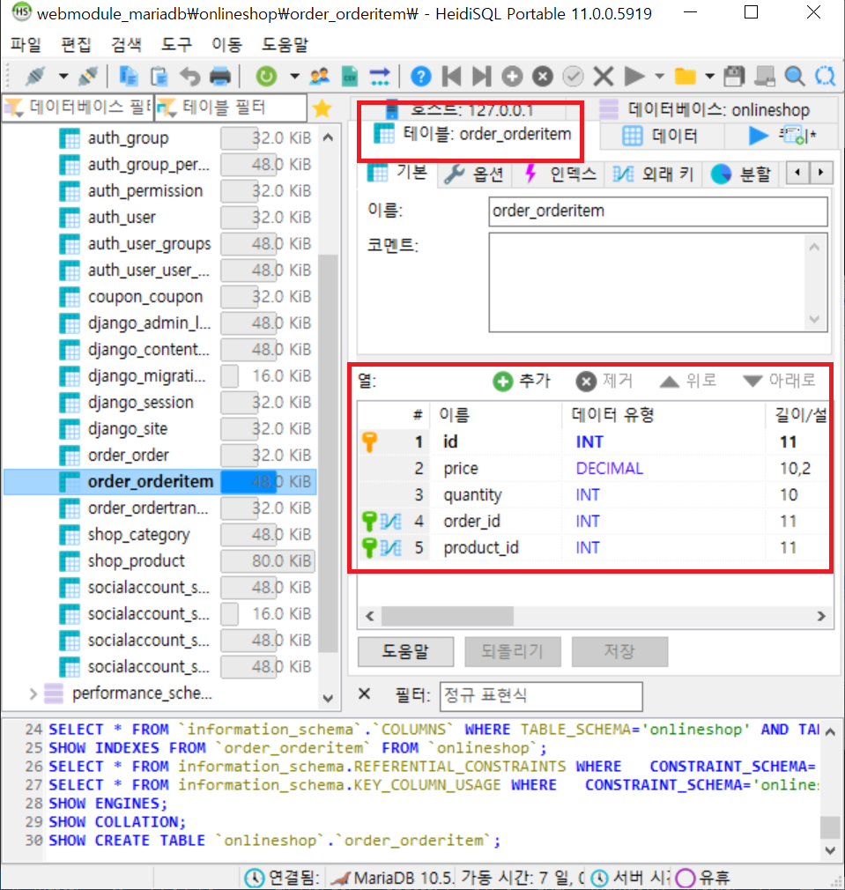  

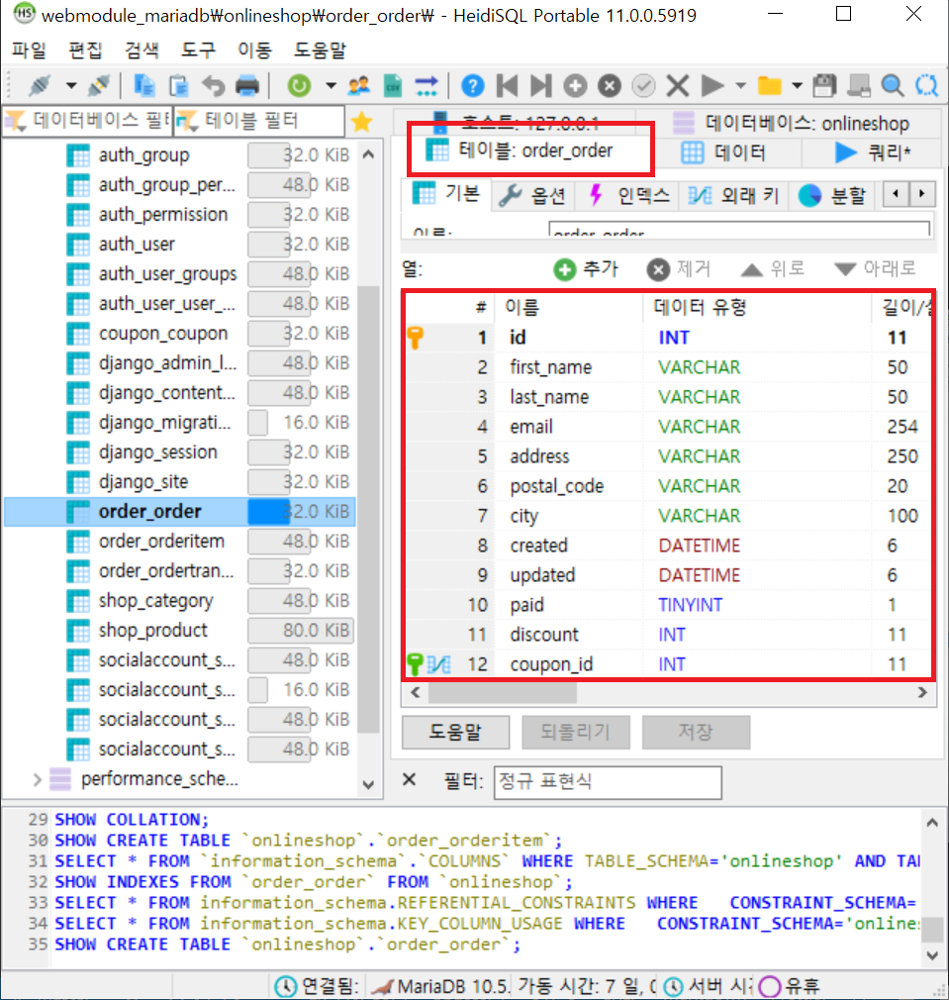  


### 주문 오더 view 만들기  

1. 주문정보입력하는 폼 만들기  

``order``에 ``forms.py`` 파일 생성 후 편집  

```py
from django import forms

from .models import Order

class OrderCreateForm(forms.ModelForm):
    class Meta:
        model = Order

        fields = ['first_name', 'last_name', 'email', 'address', 'postal_code', 'city']
```  

2. 주문정보 입력 기능 만들기

``order/views.py`` 수정  

```py
from django.shortcuts import render

from cart.cart import Cart
from .forms import *
from .models import *

def order_create(request):
    cart = Cart(request)
    if request.method == 'POST':
        form = OrderCreateForm(request.POST)

        if form.is_valid():
            order = form.save()

            if cart.coupon:
                order.coupon = cart.coupon
                order.discount = cart.coupon.amount
                order.save()

            for item in cart:
                OrderItem.objects.create(order=order, product=item['product'], price=item['price'],
                                         quantity=item['quantity'])

            cart.clear()
            return render(request, 'order/craete.html', {'order', order})
    else:
        form = OrderCreateForm()

    return render(request, 'order/create.html', {'cart':cart, 'form': form})
```  

3. 주문 완료 기능 만들기  

``order/views.py`` 에 ``order_complete`` 함수 추가  

```py
...

def order_complete(request):
    order_id = request.GET.get('order_id')
    order = Order.objects.get(id=order_id)

    return render(request, 'order/created.html', {'order' : order })
```  

4. 주문입력 view 만들기  

``order/views.py``에 ``OrderCreateAjaxView``라고 하는 클래스 객체를 생성  

```py
...

class OrderCreateAjaxView(View):
    def post(self, request, *args, **kwargs):
        if not request.user.is_authenticated:
            return JsonResponse({"authenticated":False}, status=403)

        cart = Cart(request)
        form = OrderCreateForm(request.POST)

        if form.is_valid():
            order = form.save(commit=False)

            if cart.coupon:
                order.coupon = cart.coupon
                order.discount = cart.coupon.amount
                order = form.save()

            for item in cart:
                OrderItem.objects.create(order=order, product=item['product'], price=item['price'],
                                         quantity=item['quantity'])
            cart.clear()

            data = {
                "order_id":order.id
            }

            return JsonResponse(data)

        else:
            return JsonResponse({}, status=401)
```  

5. 결제창을 생성하는 view 만들기

``order/views.py``에 ``OrderCheckoutAjaxView``라고 하는 클래스 객체를 생성  

```py
...

class OrderCheckoutAjaxView(View):
    def post(self, request, *args, **kwargs):
        if not request.user.is_authenticated:
            return JsonResponse({"authenticated":False}, status=403)

        order_id = request.POST.get('order_id')
        order = Order.objects.get(id=order_id)
        amount = request.POST.get('amount')

        try:
            merchant_order_id = OrderTransaction.objects.create_new(
                order=order,
                amount=amount
            )
        except:
            merchant_order_id = None

        if merchant_order_id is not None:
            data = {
                "works":True,
                "merchant_id":merchant_order_id
            }

            return JsonResponse(data)

        else:
            return JsonResponse({}, status=401)
```  

6. 결제 제대로 생성됐는지 확인(KG이니시스 결제)하는 view 만들기

``order/views.py`` 에 ``OrderImpAjaxView`` 클래스 객체 생성

```py
...
class OrderImpAjaxView(View):
    def post(self, request, *args, **kwargs):
        if not request.user.is_authenticated:
            return JsonResponse({"authenticated":False}, status=403)

        order_id = request.POST.get('order_id')
        order = Order.objects.get(id=order_id)
        merchant_id = request.POST.get('merchant_id')
        imp_id = request.POST.get('imp_id')
        amount = request.POST.get('amount')

        try:
            trans = OrderTransaction.objects.get(
                order = order,
                merchant = merchant_id,
                amount = amount
            )

        except:
            trans = None

        if trans is not None:
            trans.transaction_id = imp_id
            trans.success = True
            trans.save()
            order.paid = True
            order.save()

            data = {
                'works': True
            }

            return JsonResponse(data)
        else:
            return JsonResponse({}, status=401)
```  

7. view를 매핑할 url 만들기  

``order``에 ``urls.py`` 생성 후 편집  

```py
from django.urls import path

from .views import *

app_name = 'orders'

urlpatterns = [
    path('craete/', order_create, name='order_create'),
    path('create_ajax/', OrderCreateAjaxView.as_view(), name='order_create_ajax'),
    path('checkout/', OrderCheckoutAjaxView.as_view(), name='order_checkout'),
    path('validation/', OrderImpAjaxView.as_view(), name='order_validation'),
    path('complete/', order_complete, name='order_validation'),
]
```

8. order url을 전체 프로젝트에 추가

``config/urls.py``에 추가

```py
...

urlpatterns = [
    path('admin/', admin.site.urls),
    path('accounts/', include('allauth.urls')),
    path('cart/', include('cart.urls')),
    path('coupon/', include('coupon.urls')),
    path('order/', include('order.urls')),  # 추가
    path('', include('shop.urls')),
]

...
```  

9. 보여줄 template - create.html 만들기

다음과 같이 ``create.html``를 생성  

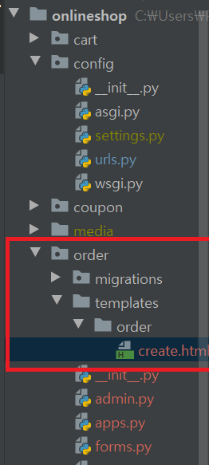  

```html



Checkout



<!-- "orders"는 order/urls.py에 app_name -->
<script type="text/javascript">
    csrf_token = '{{ csrf_token }}'
    order_create_url = ''
    order_checkout_url = ''
    order_validation_url = ''
    order_complete_url = ''
</script>

<script src="https://cdn.iamport.kr/js/iamport.payment-1.1.5.js" type="text/javascript"></script>


<script src="" type="text/javascript"></script>




<div class="row">
    <div class="col">
        <div class="alert alert-info" role="alert">
            Your Order
        </div>

        <ul class="list-group">
            
            <li class="list-group-item">
                {{ item.quantity }} X {{ item.product.name }}
                <span>{{ item.total_price }}</span>
            </li>
            
            
            <li class="list-group-item">
                "{{ cart.coupon.code }}" ({{ cart.coupon.amoun }}% off)
                <span> - ${{ cart.get_total_discount | floatformat:"2" }}</span>
            </li>
            
        </ul>
        <div class="alert alert-success" role="alert">Total : {{ cart.get_total_price | floatformat : "2"}}</div>
        <form action="" method="post" class="order-form">
            {{ form.as_p }}
            
            <!-- hidden -->
            <input type="hidden" name="pre_order_id" value="0">
            <input type="hidden" name="amount" value="{{ cart.get_total_price | floatformat:'2' }}">
            <input type="submit" class="btn btn-primary float-right" value="Place Order">
        </form>
    </div>
</div>
```  

10. checkout js 파일 만들기  

다음과 같이 ``checkout.js`` 만들기  

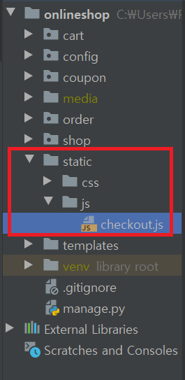  


```js
$(function() {
    var IMP = window.IMP;       // IAMPORT에서 제공해주는 객체
    IMP.init('가맹점 식별코드');

    $('.order-form').on('submit', function (e) {
        var amount = parseFloat($('.order-form input[name="amount"]').val().replace(',', ''));
        var type = $('.order-form input[name="type"]:checked').val();

        // 폼데이터를 기준으로 주문 생성
        var order_id = AjaxCreateOrder(e);
        if (order_id == false) {
            alert('주문 생성 실패\n 다시 시도해주세요.');
            return false;
        }

        // 결제 정보를 생성
        var merchant_id = AjaxStoreTransaction(e, order_id, amount, type)

        // iamport 결제
        if (merchant_id !== '') {
            IMP.request_pay({
                merchant_uid : merchant_id,
                name : 'E-Shop product',
                buyer_name : $('input[name="first_name"]').val() + " " + $('input[name="last_name"]').val(),
                buyer_email : $('input[name="email"]').val(),
                amount : amount
            }, function (rsp) {
                if (rsp.success) {
                    var msg = '결제가 완료되었습니다.';
                    msg += '고유ID : ' + rsp.imp_uid;
                    msg += '상점 거래ID : ' + rsp.merchant_uid;
                    msg += '결제 금액 : ' + rsp.paid_amount;
                    msg += '카드 승신번호 : ' + rsp.apply_num;

                    console.log(msg);

                    // 결제가 완료되었으면 비교해서 DB에 반영
                    ImpTransaction(e, order_id, rsp.merchant_uid, rsp.imp_uid, rsp.paid_amount);
                } else {
                    var msg = '결제에 실패했습니다.';
                    msg += '에러 내용: ' + rsp.error_msg;
                    console.log(msg);
                }
            });
        }
    })
})
```  

11. checkout.js에 주문 생성하는 Ajax 추가  

```js
...

// 폼 데이터를 기준으로 주문 생성
function AjaxCreateOrder(e) {
    e.preventDefault();

    var order_id = '';
    var request = $.ajax({
        method: 'POST',
        url: order_create_url,
        async: false,
        data: $('.order-form').serialize()
    });

    request.done(function (data) {
        if (data.order_id) {
            order_id = data.order_id
        }
    });

    request.fail(function (jqXHR, textStatus) {
        // jqXHR은 일종의 클라이언트, 즉 Ajax의 클라이언트 (상태코드)
        if (jqXHR.status == 404) {
            alert("페이지가 존재하지 않습니다.");
        } else if (jqXHR.status == 403) {
            alert("로그인 해주세요.");
        } else {
            alert("문제가 발생했습니다. 다시 시도해주세요.");
        }
    });

    return order_id;
}
```

12. 결제 정보를 생성하는 Ajax 코드 만들기

``checkout.js`` 에 추가

```js
...

function AjaxStoreTransaction(e, order_id, amount, type) {
    e.preventDefault();

    var merchant_id = '';
    var request = $.ajax({
        method: 'POST',
        url: order_checkout_url,
        async : false,
        data: {
            order_id : order_id,
            amount : amount,
            type: type,
            csrfMiddlewareToken : csrf_token
        }
    });

    request.done(function (data) {
        if (data.works) {
            merchant_id = data.merchant_id
        }
    });

    request.fail(function (jqXHR, textStatus) {
        if (jqXHR.status == 404) {
            alert("페이지가 존재하지 않습니다.");
        } else if (jqXHR.status == 403) {
            alert("로그인 해주세요.");
        } else {
            alert("문제가 발생했습니다. 다시 시도해주세요.");
        }
    });

    return merchant_id;
}
```

13. 결제확인 페이지로 이동하는 함수 만들기

``checkout.js`` 에 추가

```js
...

function ImpTransaction(e, order_id, merchant_uid, imp_id, amount) {
    e.preventDefault();

    var request = $.ajax({
        method: 'POST',
        url: order_validation_url,
        async: false,
        data : {
            order_id: order_id,
            merchant_id : merchant_id,
            imp_id: imp_id,
            amount : amount,
            csrfMiddlewareToken: csrf_token
        }
    });

    request.done(function (data) {
        if (data.works) {
            $(location).attr('href', location.origin + order_complete_url + '?order_id=' + order_id);
        }
    });

    request.fail(function (jqXHR, textStatus) {
        if (jqXHR.status == 404) {
            alert("페이지가 존재하지 않습니다.");
        } else if (jqXHR.status == 403) {
            alert("로그인 해주세요.");
        } else {
            alert("문제가 발생했습니다. 다시 시도해주세요.");
        }
    });
}
```  

14. create template 생성

``order/templates/order``에 ``created.html`` 생성


```html



Order Complete



<div class="row">
    <div class="col">
        <div class="alert alert-success" role="alert">
            Thank you!<br/>
            Your order has been successfully completed.<br/>
            Your order number is <strong>{{ order.id }}</strong>

        </div>
    </div>
</div>

```  

15. cart의 detail.html에 checkout 버튼을 넣고 테스트

우선 ``cart/templates/cart/detail.html`` 수정

```html
...

    <p>
        Add Coupon:
    </p>
    <form action="" method="post">
        {{ add_coupon }}
        <input type="submit" value="Add">
        
    </form>
    <p class="text-right">
        <a href="" class="btn btn-secondary">Continue shopping</a>
        <!-- 추가 -->
        <a href="" class="btn btn-primary">Checkout</a>  
    </p>
...
```

서버 실행

``python manage.py runserver``

> 갑자기 cart.py 에서 Deimal 에러가 발생.. 저번주는 됐던건데 갑자기..


16. 체크아웃 버튼을 누르면 나오는 화면

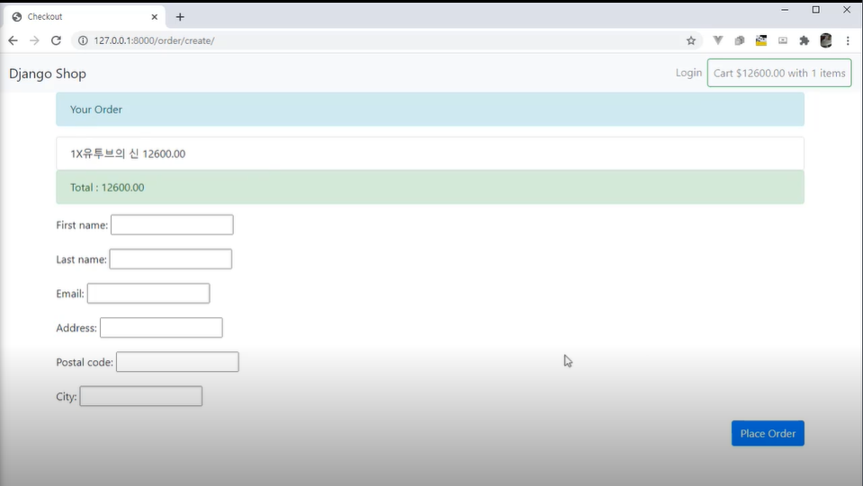  

> 보면 KG이니시스 결제창이 뜨질 않는다.

17. settings.py에 js파일 경로 읽게하기  

``config/settings.py`` 수정  

```py
# 이거랑 STATIC_URL 차이를 정확히 모르겠습니다.. 공부!
STATICFILES_DIRS = [
    os.path.join(BASE_DIR, 'static'),
]
```  

18. KG이니시스 화면  

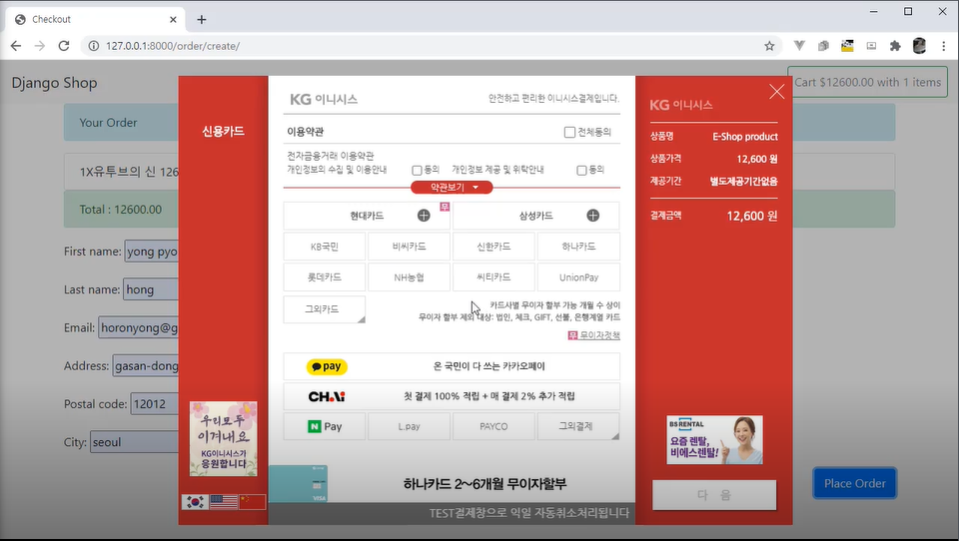  

19. 결제 완료 화면  

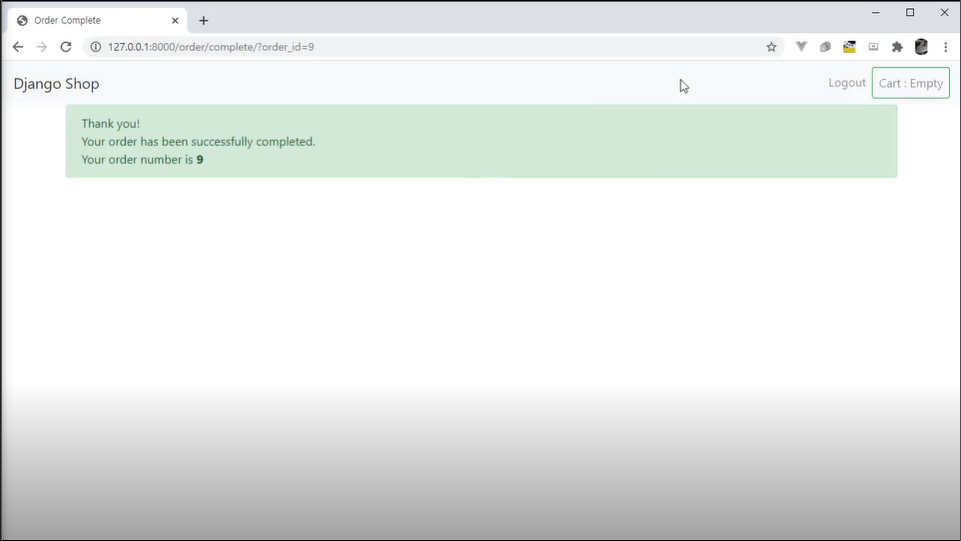  

> iamport 결제승인내역에 가보면 결제된 내역을 확인할 수 있다

20. 결제정보를 관리자페이지에서 볼 수 있도록 관리자페이지 커스터마이징  

``order/admin.py``에 코드 추가

```py
from django.contrib import admin
from django.http import HttpResponse
import csv
import datetime

def export_to_csv(modeladmin, request, queryset):
    opts = modeladmin.model._meta
    response = HttpResponse(content_type='text/csv')
    response['Content-Disposition'] = 'attachment;filename={}.csv'.format(opts.verbose_name)

    # 배열을 만드는 것
    fields = [field for field in opts.get_fields() if not field.many_to_many and not field.one_to_many]
    writer = csv.writer(response)

    # csv 파일 컬럼 타이틀 줄
    writer.writerow([field.verbose_name for field in fields])

    # 실제 데이터 출력
    for obj in queryset:
        data_row = []
        for field in fields:
            value = getattr(obj, field.name)
            if isinstance(value, datetime.datetime):
                value = value.strftime("%Y-%m-%d")
            data_row.append(value)
        writer.writerow(data_row)

    return response

export_to_csv.short_description = 'Export to CSV'
```

21. order의 상세내용을 admin에서 볼 수 있게 하기

``order/admin.py``에 추가  

```py
...

from django.utils.safestring import mark_safe
from django.urls import reverse

...

def order_detail(obj):
    # 왜 해주는 건지 공부
    return mark_safe('<a href="{}">Detail</a>'.format(reverse('orders:admin_order_detail', args=[obj.id])))

order_detail.short_description = 'Detail'
```  

22. pdf파일로 볼 수 있게 하기

``order/admin.py``에 추가  

```py
def order_pdf(obj):
    return mark_safe('<a href="{}">PDF</a>'.format(reverse('orders:admin_order_pdf', args=[obj.id])))

order_pdf.short_description = 'PDF'
```  

23. 주문 목록을 보여주게 하기  

``order/admin.py``에 수정  

```py
from django.contrib import admin
from django.http import HttpResponse
import csv
import datetime
from django.utils.safestring import mark_safe
from django.urls import reverse
from .models import OrderItem, Order

def export_to_csv(modeladmin, request, queryset):
    opts = modeladmin.model._meta
    response = HttpResponse(content_type='text/csv')
    response['Content-Disposition'] = 'attachment;filename={}.csv'.format(opts.verbose_name)

    # 배열을 만드는 것
    fields = [field for field in opts.get_fields() if not field.many_to_many and not field.one_to_many]
    writer = csv.writer(response)

    # csv 파일 컬럼 타이틀 줄
    writer.writerow([field.verbose_name for field in fields])

    # 실제 데이터 출력
    for obj in queryset:
        data_row = []
        for field in fields:
            value = getattr(obj, field.name)
            if isinstance(value, datetime.datetime):
                value = value.strftime("%Y-%m-%d")
            data_row.append(value)
        writer.writerow(data_row)

    return response
export_to_csv.short_description = 'Export to CSV'


def order_detail(obj):
    # 왜 해주는 건지 공부
    return mark_safe('<a href="{}">Detail</a>'.format(reverse('orders:admin_order_detail', args=[obj.id])))
order_detail.short_description = 'Detail'

def order_pdf(obj):
    return mark_safe('<a href="{}">PDF</a>'.format(reverse('orders:admin_order_pdf', args=[obj.id])))
order_pdf.short_description = 'PDF'


class OrderItemInline(admin.TabularInline):
    model = OrderItem
    raw_id_fields = ['product']

class OrderAdmin(admin.ModelAdmin):
    list_display = ['id', 'first_name', 'last_name', 'email', 'address', 'postal_code', 'city', 'paid', order_detail,
                    order_pdf, 'created', 'updated']
    list_filter = ['paid', 'created', 'updated']
    inlines = [OrderItemInline]
    actions = [export_to_csv]

admin.site.register(Order, OrderAdmin)
```  

24. csv, pdf에 대해서 view 작업  

``order/views.py``에 admin order detail 추가

```py
from django.shortcuts import render, get_object_or_404

...

def admin_order_detail(request, order_id):
    order = get_object_or_404(Order, id=order_id)
    return render(request, 'order/admin/detail.html', {'order':order})

...
```  

25. admin_order_detail 함수 url매칭  

``order/urls.py`` 수정  

```py
from django.urls import path

from .views import *

app_name = 'orders'

urlpatterns = [
    path('create/', order_create, name='order_create'),
    path('create_ajax/', OrderCreateAjaxView.as_view(), name='order_create_ajax'),
    path('checkout/', OrderCheckoutAjaxView.as_view(), name='order_checkout'),
    path('validation/', OrderImpAjaxView.as_view(), name='order_validation'),
    path('complete/', order_complete, name='order_validation'),
    path('admin/order/<int:order_id>', admin_order_detail, name='admin_order_detail'),  # 추가
]
```  

26. 해당하는 template 만들기  

다음과 같이 detail.html 만들기

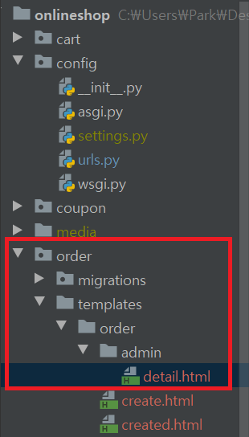  

```html
 


    Order {{ order.id }}



    <div class="breadcrumbs">
        <a href="{% url 'admin:index' }">Home</a> &rsaquo;
        <a href="{% url 'admin:order_order_changelist' }">Orders</a> &rsaquo;
        <a href="{% url 'admin:order_order_change' order_id }">Order {{ order.id }}</a> &rsaquo;
        Detail
    </div>



<h1>Order {{ order.id }}</h1>
<ul class="object-tools">
    <li>
        <a href="#" onclick="window.print();">Print order</a>
    </li>
</ul>
<table>
    <tr>
        <th>Created</th>
        <td>{{ order.created }}</td>
    </tr>
    <tr>
        <th>Customer</th>
        <td>{{ order.first_name }} {{ order.last_name }}</td>
    </tr>
    <tr>
        <th>E-mail</th>
        <td>{{ order.email }}</td>
    </tr>
    <tr>
        <th>Address</th>
        <td>{{ order.address }} {{ order.postal_code }} {{ order.city }}</td>
    </tr>
    <tr>
        <th>Total amount</th>
        <td>{{ order.get_total_price }}</td>
    </tr>
</table>

```  

27. admin pdf 추가  

``order/views.py``에 pdf에 관한 함수 추가

```py
...

from django.conf import settings
import weasyprint

...

def admin_order_pdf(request, order_id):
    order = get_object_or_404(Order, id=order_id)
    html = render_to_string('order/admin/pdf.html', {'order':order})
    response = HttpResponse(content_type='application/pdf')
    response['Content-Disposition'] = 'filename=order_{}.pdf'.foramt(order.id)
    weasyprint.HTML(string=html).write_pdf(response, stylesheets=[weasyprint.CSS(settings.STATICFILES_DIRS[0] + '/css/pdf.css')])

...
```  

28. pdf.html 생성

``order/templates/order/admin``에 ``pdf.html`` 생성 후 편집  

```html
<html>
<body>
    <h1>Django onlineshop</h1>
    <p>
        Invoice no. {{ order.id }}</br>
        <span class="secondary">{{ order.created|date: "H d, Y" }}</span>
    </p>

    <h3>
            Payment Accepted
        
            Pending payment
        
    </h3>
    <p>
        {{ order.first_name }} {{ order.last_name }}<br>
        {{ order.email }} <br>
        {{ order.address }} <br>
        {{ order.postal_code }}, {{ order.city }}
    </p>

    <h3>Product List</h3>
    <table>
        <thead>
            <tr>
                <th>Product</th>
                <th>Price</th>
                <th>Quantity</th>
                <th>Cost</th>
            </tr>
        </thead>
        <tbody>
        
            <tr class="row">
                <td>{{ item.product.name }}</td>
                <td class="num">$ {{ item.price }}</td>
                <td class="num">{{ item.quantity }}</td>
                <td class="num">{{ item.get_item_price }}</td>
            </tr>
        
        
        <tr class="discount">
            <td colspan="3">Discount</td>
            <td class="num">$ {{ order.discount }}</td>
        </tr>
        
        <tr class="total">
            <td colspan="3">Total</td>
            <td class="num">$ {{ order.get_total_price }}</td>
        </tr>
        </tbody>
    </table>
</body>
</html>
```  

29. pdf 경로 url 맵핑

``order/urls.py`` 수정

```py
from django.urls import path

from .views import *

app_name = 'orders'

urlpatterns = [
    path('create/', order_create, name='order_create'),
    path('create_ajax/', OrderCreateAjaxView.as_view(), name='order_create_ajax'),
    path('checkout/', OrderCheckoutAjaxView.as_view(), name='order_checkout'),
    path('validation/', OrderImpAjaxView.as_view(), name='order_validation'),
    path('complete/', order_complete, name='order_validation'),
    path('admin/order/<int:order_id>', admin_order_detail, name='admin_order_detail'),
    path('admin/order/<int:order_id>/pdf/', admin_order_pdf, name='admin_order_pdf'),   # 추가
]
```

30. pdf.css 만들기  

다음과 같은 구조로 ``pdf.css`` 만들고 수정  

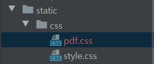  

> 후..ㅋㅋㅋㅋㅋ 코드 안보여주고 그냥 복붙하고 넘어감..  

31. weasyprint 설치

weasyprint를 설치하려면 setuptools을 먼저 설치해야한다.

``pip install --upgrade pip setuptools``  

> pycharm 터미널에서 실행하면 액세스가 거부됨. 따라서 커맨드창(관리자 권한)에서 실행  

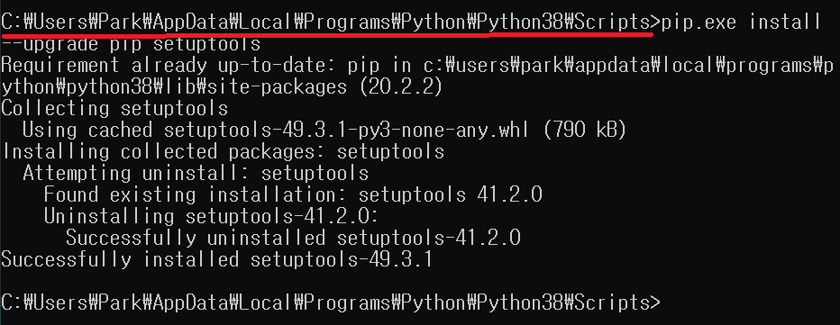  

``pip install weasyprint``

> 이건 명령어는 그냥 Pycharm 터미널에서 실행.  

32. MSYS2 설치  

> 왜 설치해야하는지는 말씀은 하셨긴 했는데.. 제대로 안들려서 그냥.. 그냥 하는걸로.. --> weasyprint를 하려면 설치해야하나 보다

[MSYS2 바로가기](https://www.msys2.org/)  

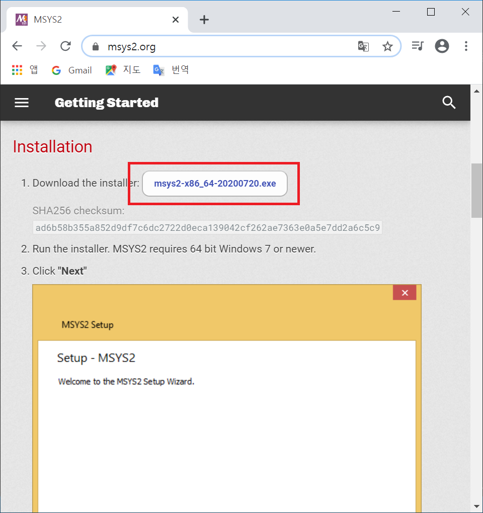  

> 설치파일만 설치하고 윈도우에 설치는 안하는걸로.. 랜섬웨어 어쩌고 저쩌고가 뜸...  

실행파일을 실행하면 git bash같은 cli 창이 나온다  

다음과 같이 명령 실행

``pacman -5 mingw-w64-x86_64-gtk3``  

33. 서버 실행

``python manage.py runserver``

결제내역 리스트

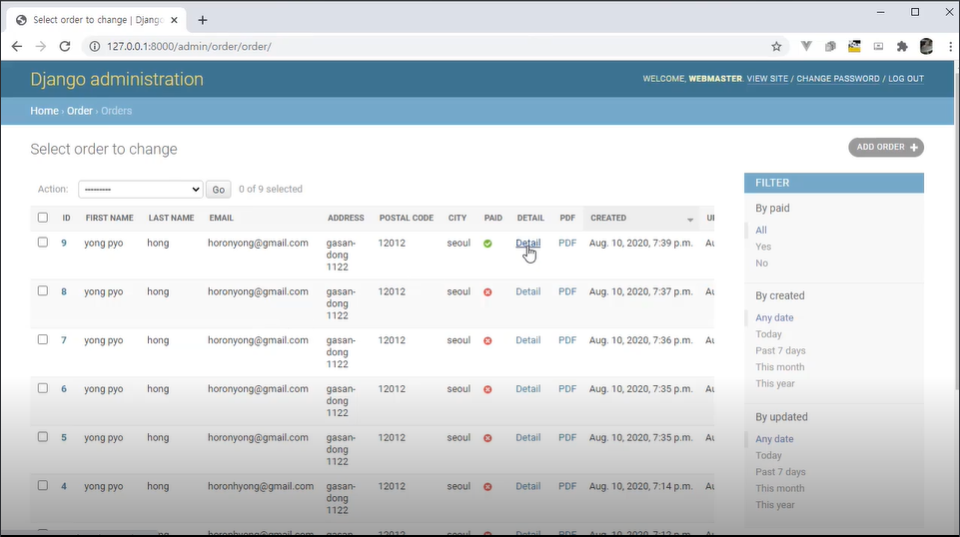  

결제내역 상세보기

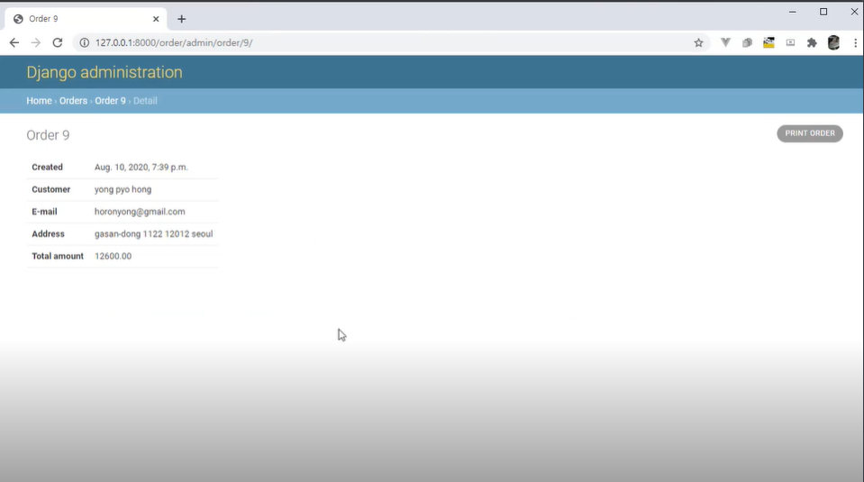  


> pdf 파일은 에러가 발생.  

> 에러 발생하고 그냥 안하기로 한거같음.

### vuejs랑 연동하기  

1. 다음과 같이 새 프로젝트 만들기 

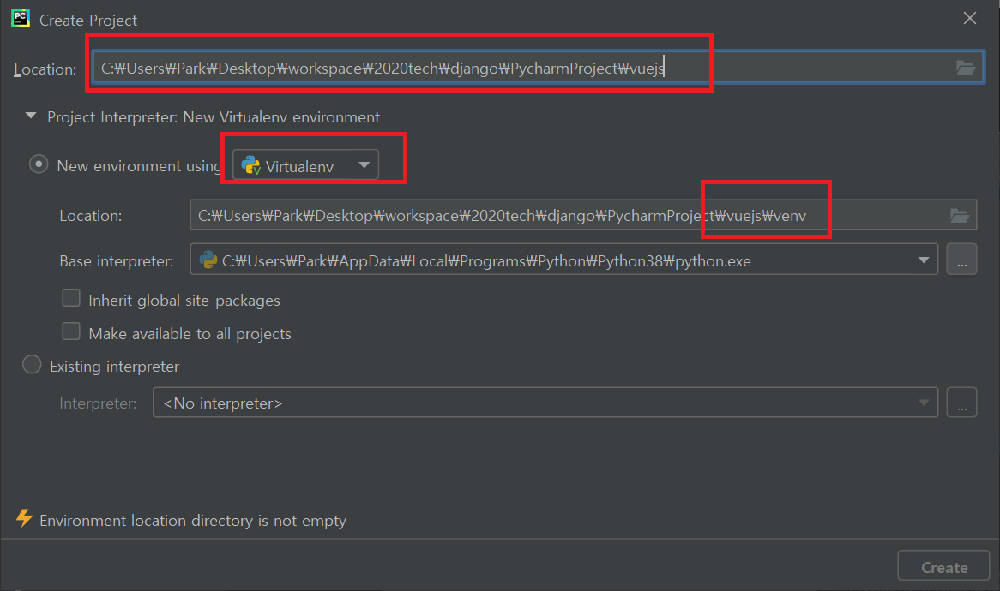  

2. 프로젝트 가상환경에 django 설치  

``pip install django``  

3. config라는 전체 프로젝트 생성  

``django-admin startproject config .``  

4. db 연동

``python manage.py migrate``  

5. 관리자 계정 생성

``python manage.py createsuperuser``

6. todo app 생성

``python manage.py startapp todo``  

7. 생성한 todo 앱 전체 프로젝트 config에 연동  

``config/settings.py`` 수정

```py
...

INSTALLED_APPS = [
    'django.contrib.admin',
    'django.contrib.auth',
    'django.contrib.contenttypes',
    'django.contrib.sessions',
    'django.contrib.messages',
    'django.contrib.staticfiles',
    'todo',         # 추가
]

...
```  

8. todo db 스키마 모델링  

``todo/models.py`` 수정

```py
from django.db import models

class Todo(models.Model):
    title = models.CharField(max_length=100)
    completed = models.BooleanField()

    def __str__(self):
        return self.title

```

9. model을 기반으로 db 스키마 적용할 마이그레이션 생성  

``python manage.py makemigrations todo``  

10. db에 마이그레이션 연동  

``python manage.py migrate todo``  

11. 관리자 페이지 설정

``todo/admin.py`` 수정

```py
from django.contrib import admin
from .models import Todo

class TodoAdmin(admin.ModelAdmin):
    list_display = ['title', 'completed']

admin.site.register(Todo, TodoAdmin)
```

12. template에 데이터를 바인딩 하기 전 가공하기위한 view 작업 - todo 목록 view 작업

``todo/views.py`` 수정

```py
from django.shortcuts import render
from .models import Todo
from django.http import JsonResponse

# 리스트를 보여주기위한 로직
def todo_fetch(request):
    todos = Todo.objects.all()
    todo_list = []

    for idx, todo in enumerate(todos, start=1):
        todo_list.append({'id' : idx, 'title':todo.title, 'completed' : todo.completed})

    return JsonResponse(todo_list, safe=False)
```  

13. todo 데이터를 저장하기 전 입력 폼을 만들자

``todo`` 폴더 밑에 ``forms.py`` 생성 후 편집  

```py
from django import forms
from .models import Todo

class TodoForm(forms.ModelForm):
    class Meta:
        model = Todo
        fields = ['title', 'completed']
```

14. todo 데이터 저장 로직 view 작업

``todo/views.py`` 수정  

```py
...

from django.views.decorators.csrf import csrf_exempt
import json
from .forms import TodoForm

...

@csrf_exempt
def todo_save(request):
    if request.body:
        data = json.loads(request.body)

        if 'todos' in data:
            todos = data['todos']

            Todo.objects.all().delete()

            for todo in todos:
                form = TodoForm(todo)

                if form.is_valid():
                    form.save()

    return JsonResponse({})
...
```

15. 라우팅을 위해 url 지정

``todo/urls.py``를 생성 후 편집

```py
from django.urls import path
from .views import *

urlpatterns = [
    path('fetch/', todo_fetch, name='fetch'),
    path('save/', todo_save, name='save'),
]
```  

16. todo url을 root url에 지정  

``config/urls.py`` 수정

```py
from django.contrib import admin
from django.urls import path, include

urlpatterns = [
    path('admin/', admin.site.urls),
    path('', include('todo.urls'))
]
```  

17. save(todo 저장하는 로직)은 request POST일 때에만 동작하도록 하기  

``todo/views.py`` 수정

```py
...

from django.views.decorators.http import require_POST   # 추가

...

@csrf_exempt
@require_POST   # 추가
def todo_save(request):
    if request.body:
        data = json.loads(request.body)

        if 'todos' in data:
            todos = data['todos']

            Todo.objects.all().delete()

            for todo in todos:
                form = TodoForm(todo)

                if form.is_valid():
                    form.save()

    return JsonResponse({})
```  

18. vuejs로 front를 만들기 위해 우선 기본이 되는 base.html 생성  

다음과 같이 구조를 잡고 ``base.html`` 생성  

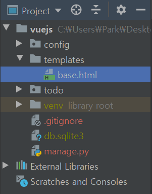  

```html
<!DOCTYPE html>
<html lang="en">
<head>
    <meta charset="UTF-8">
    <title>
        
            Django Todo with Vue.js
        
    </title>
    
    <script src=""></script>
    <script src=""></script>
    <link rel="stylesheet" type="text/css" href="">
</head>
<body>
<section class="todoapp">
    <header class="header">
        <h1>todos</h1>
        <input class="new-todo"
               autofocus autocomplete="off"
               placeholder="What needs to be done?"
               v-model="newTodo"
               @keyup.enter="addTodo">
    </header>
    
    
</section>
<footer class="info">
    <p>Double-click to edit a todo</p>
    <p>Written by <a href="http://evanyou.me">Evan You</a></p>
    <p>Edited by <a href="https://github.com/baepeu">Baepue</a> Ver. Django</p>
    <p>Part of <a href="http://todomvc.com">TodoMVC</a></p>
</footer>


</body>
</html>
```

> extra_script_footer가 우리가 짠 vuejs 코드가 들어가는 곳

19. todo list html 만들기  

다음과 같은 구조로 list.html 생성 후 편집  

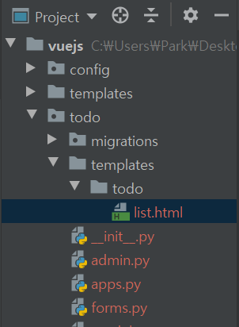  

```html



<section class="main" v-show="todos.length" v-clock>
    <input class="toggle-all" type="checkbox" v-model="allDone">
    <ul class="todo-list">
        <li v-for="todo in filteredTodos"
            class="todo"
            :key="todo.id"
            :class="{ completed: todo.completed, editing : todo == editedTodo }">
            <div class="view">
                <input class="toggle" type="checkbox" v-model="todo.completed">
                <label @dblclick="editTodo(todo)">[[ todo.title ]]</label>
                <button class="destroy" @click="removeTodo(todo)"></button>
            </div>
            <input class="edit" type="text" v-model="todo.title"
                   v-todo-focus="todo == editedTodo"
                   @blur="doneEdit(todo)"
                   @keyup.enter="doneEdit(todo)"
                   @keyup.esc="cancelEdit(todo)">
        </li>
    </ul>
</section>
<footer class="footer" v-show="todos.length" v-cloak>
    <span class="todo-count">
        <strong>[[ remaining ]]</strong> [[ remaining | pluralize ]] left
    </span>
    <ul class="filters">
        <li><a href="#/all" :class="{ selected: visibility == 'all' }">All</a></li>
        <li><a href="#/active" :class="{ selected: visibility == 'active' }">Active</a></li>
        <li><a href="#/completed" :class="{ selected: visibility == 'completed' }">Completed</a></li>
    </ul>
    <button class="clear-completed" @click="removeCompleted" v-show="todos.length > remaining ">
        Clear completed
    </button>
</footer>



    
    <script src=""></script>

```

> v-clock은 vue가 렌더링되기전에 보여지지말아라.  

> @blur은 뭐지..?

> @keyup은 키보드 키값을 말한다.  

> [[]]은 vue가 아닌 django에서 바인딩 되는 값을 의미. vue는 {{}} 을 사용  

20. base template를 사용할 수 있도록 셋팅  

``config/settings.py`` 수정

```py
...

import os

...

TEMPLATES = [
    {
        'BACKEND': 'django.template.backends.django.DjangoTemplates',
        'DIRS': [os.path.join(BASE_DIR, 'templates')],  # 추가
        'APP_DIRS': True,
        'OPTIONS': {
            'context_processors': [
                'django.template.context_processors.debug',
                'django.template.context_processors.request',
                'django.contrib.auth.context_processors.auth',
                'django.contrib.messages.context_processors.messages',
            ],
        },
    },
]

...
```

21. todo앱에 static 폴더 만들기  

css와 javascript를 관리하기 위해 todo앱 폴더 밑에 static 폴더를 다음과 같이 추가  

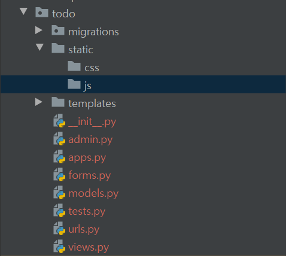  

22. todo앱에 css 추가  

``todo/static/css`` 밑에 ``style.css``와 ``todo.css``를 생성하고 수정 

> 물론 코드는 안보여주신다 ^^...  

23. todo앱에 js 파일 추가

``todo/static/js`` 밑에 ``vue.js``와 ``axis.min.js``와 ``script.js``를 생성하고 수정 

> 물론 코드는 안보여주신다 ^^... 뭐가 그리 급하신건지..  
