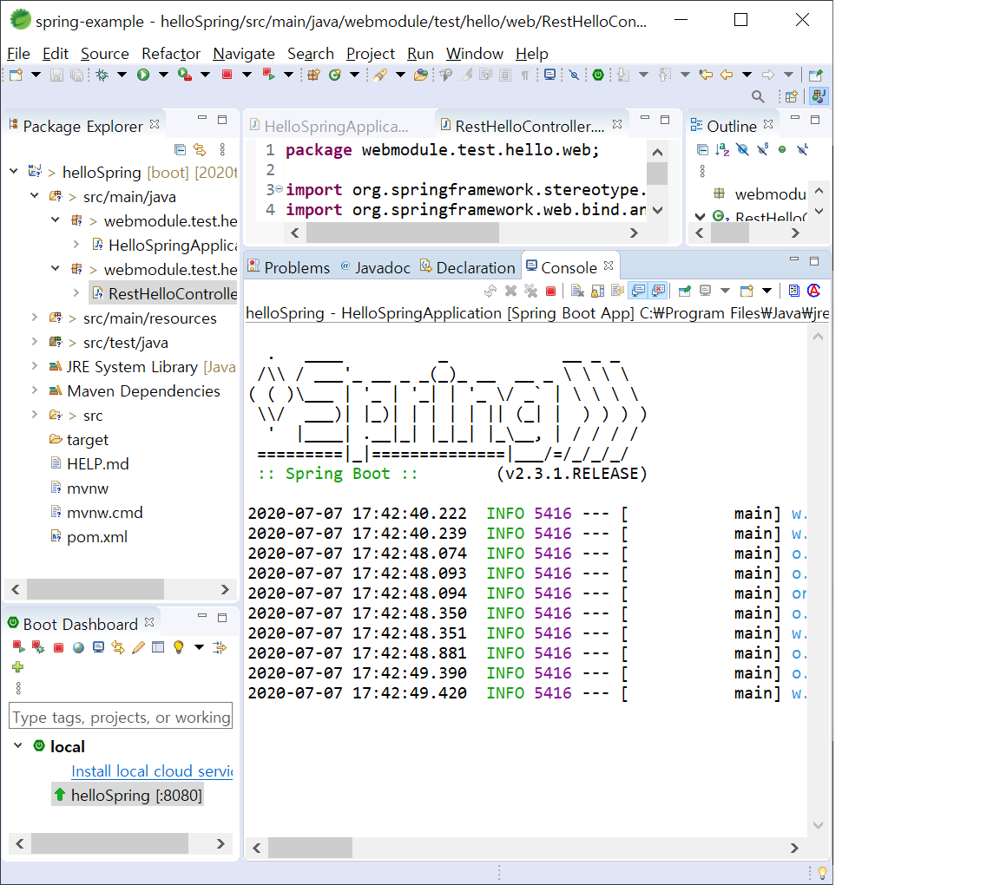
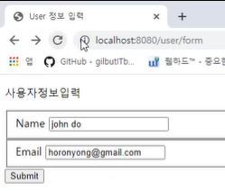

# 2020-06-16 Study

Spring & Vue web framework

2020-06-16 **온라인** 강의 수업 내용

## 웹 프로그램 개요

   - **웹 프로그래밍이란 ?**

   - 웹 브라우저를 통해 서버에 접속하여 필요한 정보나 업무를 처리할 수 있는 기능을 제공하는 프로그램

   - 브라우저에서 HTML을 기반으로 렌더링을 담당하고 프론트엔드와 HTML에 출력한 필요한 정보 및 리소스를 제공하는 서버 어플리케이션으로 구성

   - HTTP 프로토콜을 기반으로 클라이언트가 요청한 업무를 수행하도록 시스템을 구성하고 조직화

## 서버 웹 어플리케이션

   웹 서버가 운용될 수 있는 다양한 OS에서 다양한 언어로 개발

   - **1. 정적 HTML에서 동적 HTML로 변화**

   정적페이지: 동일한 요청에 대해서 동일한 내용의 페이지를 변환(리소스)

   동적페이지: 사용자에 따라 파라미터에 다라 다른 내용을 반환

   - **2. CGI(Common Gateway Interface) 방식**

   웹서버가 CGI라는 규정을 통해 표준 입출력을 통해 입력과 출력을 받아 클라이언트에게 제공

   C/C++, Perl, PHP 프로그램이 표준 입력으로 들어온 데이터를 분석하여 HTML을 출력

   - **3. 웹 어플리케이션 서버(web application server) 방식**

   요청을 처리할 프로그램을 내장하는 업무 처리 전용 서버

   언어 및 플랫폼마다 전용 어플리케이션이 존재

   현재 사용하는 방식이다.

## 웹 프레임워크를 사용해야 하는 이유

   생활의 중심이 인터넷으로 이동 / 다양하고 복잡한 서비스 추구 / 사용자 UX의 개선 --> 복잡성의 증가 / 팀단위의 개발 --> 생산성의 증가 / 협업 용이 --> 객체 지향 언어 및 스크립트 언어를 주력으로 사용 / 플랫폼 사용 / 프레임워크 등장

   1. 장점

      체계적인 코드 관리로 유지 보수가 용이하다.

      기본 설계 및 기능 라이브러리를 제공하여 개발 생산성이 높다.

      코드에 대한 재사용성이 높다.

      추상화된 코드 제공을 통해 확장성이 좋다.

   2. 단점

      학습 난이도가 높다.

      기본 설계된 구조에 의해 자유로운 개발에 한계가 있다.

      사용하지 않는 기능에 대한 라이브러리가 포함될 수 있다.

## 자바 웹 프로그램

   - **JAVA 웹 어플리케이션**

      웹 컨테이너를 이용해 클라이언트의 요청을 처리하고 그 결과를 다시 클라이언트에게 전송하는 Servlet / JSP를 의미

      표준화된 디렉토리 구조를 가지고 있고 WAR 형태로 배포됨.

      root/WEB-INF : 웹 어플리케이션에 관한 정보가 저장 외부에서 접근할 수 없는 디렉터리

      /WEB-INF/classes : 웹 어플리케이션이 수행하는 서블릿과 다른 일반 클래스들이 위치

      /WEB-INF/lib : 웹 어플리케이션에서 사용하는 라이브러리(Jar) 위치

      /WEB-INF/web.xml : 배치 지시자(deployment descripotr)로써 일종의 환경 설정 파일

   - **JAVA EE 컨테이너**

      WebContainer : 서블릿의 생명주기를 관리하고, URL과 특정 서블릿을 맵핑하며 URL 요청이 올바른 접근 권한을 갖도록 보장

      ApplicationContainer: Java EE의 전체를 지원하며 특히 EJB의 생명주기를 다룬다.

## 스프링 프레임워크의 개요

   스프링 프레임워크는 최신 자바 기반 어플리케이션 개발을 위한 포괄적인 프로그래밍 및 구성 모델을 제공한다

   1. 목적

      다양한 자바 EE 기술 요소를 연결하는 필요한 표준 요소를 제공하여 개발자가 비즈니스 업무 로직에 집중할 수 있도록 지원

   2. 배경

      기존 EJB 개발 방식은 복잡한 프로그램 모델로 인해 배우기가 어렵고 또한 특정환경에 종속되어 이식성이 부족하며 테스트하기도 매우 어렵기에 이를 대체할 경량 컨테이너로써 개발됨.

   3. 스프링 프레임워크의 장점

      DI를 이용한 쉽고 편리한 테스트 지원

      반복적이고 복잡한 작업을 숨겨 간결한 코드를 생성할 수 있다.

      스프링은 코어를 제외한 다른 요소들이 독립적으로 존재하고 결합할 수 있는 유연한 아키텍쳐를 구성할 수 있다.

   4. 스프링 모듈

      - **코어(Core)**

         **DI(Dependency Injection : 의존성 주입), IoC(Inversion of Control : 제어의 역전) 컨테이너 및 어플리케이션 콘텍스트의 핵심 기능**

         - Beans : 스프링 IoC 컨테이너에 의해 관리되며 어플리케이션의 핵심을 이루는 객체
         - Core : 스프링 모듈이 사용하는 유틸리티
         - Context : 빈 팩토리를 사옥하는 어플리케이션 콘텍스트를 구현
         - SpEL : EL(JSP 표현 언어)을 확장하고 빈 속성 및 접근, 처리를 위한 언어

      - **횡단관심(Crosscutting Concerns)**

         **시스템의 업무로직 같은 핵심적인 기능이 아닌 모든 어플리케이션 레이어에 적용되어야 하는 기능(관심)**

         - AOP : 메소드 인터셉터와 포인트 컷을 사용해 관점 지향 프로그래밍에 대한 기본적인 지원
         - Aspect : 가장 인기 있고 완벽한 기능을 갖춘 AOP 프레임워크인 AspectJ와의 통합을 제공
         - Instrumentation : 기본적인 인스트루멘테이션(instrumentation) 기능

      - **메시징**

         **메시지 기반 app을 작성할 수 있는 인터페이스 및 기본 구현체 제공**


      - **웹(Web)**

         **다른 대중적인 웹 프레임워크와 통합을 지원하거나 자체 MVC 프레임워크인 스프링 MVC 제공**

         - web : 멀티 파트 파일 업로드, 서블릿 리스너 등 웹 지향 통합 기능을 제공
         - webmvc : Web-Servlet 모듈이라고도 하며, Spring MVC, REST 웹 서비스 구현을 포함
         - websocket : 웹 소켓을 지원
         - protlet : 포틀릿 환경에서 사용할 MVC 구현을 제공

      - **데이터(Data)**

         **데이터 레이어는 일반적으로 데이터베이스 또는 외부 인터페이스와 통신을 지원하는 모듈로 JDBC, ORM, OXM, JMS, 트랜잭션 모듈로 구성**

         - JDBC : JDBC 프로그래밍을 쉽게 사용할 수 있도록 지원
         - ORM : ORM 프레임워크, JPA, 하이버네이트 등과의 통합을 제공
         - OXM : JAXB, Castor, XMLBeans, JiBX, XStream과 같은 Object/XML 맵핑
         - JMS : 메시지 생성, 사용을 통해 비동기 프로그램을 지원

      - **테스팅(Testing)**

         **테스트 컨텍스트 프레임워크나 목(mock) 오브젝트 등 쉽게 테스트를 수행할 수 있는 모듈 지원**

      - **스프링 부트**

         **스프링 기반의 어플리케이션을 개발하기 쉽도록 기본설정되어있는 디폴트 설정을 기반으로 해서 빠르게 개발할 수 있도록 해주는 개발 플랫폼**

      - **스프링 클라우드**

         **클라우드용 어플리케이션을 개발할 수 있는 분산 시스템의 일반적인 패턴을 위한 솔루션을 제공**

      - **스프링 데이터**

         **RDMS와 NoSQL 데이터베이스 통합하는 일관되는 데이터 접근 방식을 제공**

      - **스프링 배치**

         **대용량 데이터 배치 처리에 대한 기능을 지원 모듈과 패턴을 제시**

      - **스프링 시큐리티**

         **시스템에 대한 선언적 인증 및 권한 부여 기능을 제공함.**

## 개발환경 설정

   1. JDK 설치

   2. STS (Spring tool suit) 설치

   3. Tomcat 설치

## 기본적인 rest spring example (Controller)

   1. STS 실행

   2. workspace 지정 후

   3. 왼쪽에 있는 Create new Spring Starter Project 클릭

   4. 그림과 같이 프로젝트 이름, 프로젝트 (빌드)타입, 그룹, 패키지 등을 설정 후 Next

      

      > 디폴트로 해도 상관없지만 사진과 같이하면 이렇게 된다~ 라는 것을 더 빨리 이해하기 쉽다.

   5. 그림과 같이 사용가능한 모듈 중 web 밑에 있는 Spring Web을 선택 후 Finish를 누르면 두 번째 사진 처럼 프로젝트가 생성된 것을 확인

      

      

   6. 웹 어플리케이션을 제작하기 위해서 그림과 같이 패키지 생성. src/main/java 오른쪽 클릭 후 new java package.

      

   7. 생성된 패키지 오른쪽 클릭 후 Create a new java class 클릭. 클래스명 만든 후 finish

      

   8. 기본적인 소스코드 작성

      ```java
      // package webmodule.test.hello.web;

      // import org.springframework.stereotype.Controller;
      // import org.springframework.web.bind.annotation.RequestMapping;

      // @Controller
      // public class RestHelloController {

      // 	@RequestMapping("/rest-welcome")
      // 	public String hello() {
      // 		return "Hello Spring!";
      // 	}
      // }      교수님이 실수한 코드

      package webmodule.test.hello.web;

      import org.springframework.web.bind.annotation.RequestMapping;
      import org.springframework.web.bind.annotation.RestController;

      @RestController
      public class RestHelloController {

         @RequestMapping("/rest-welcome")
         public String hello() {
            return "Hello Spring!";
         }
      }

      ```

      > IDE의 자동 임포트 키는 `ctrl + shift + o`키 이다.

   9. Spring 실행. 사진과 같이 local을 선택하여 자신의 프로젝트인 `helloSpring`을 클릭하고 사진 상 빨간색 부분 왼쪽 위에 있는 빨간색 네모 구석 start 모양인 아이콘을 누르면 스프링 실행

      

   10. 스프링 실행화면

      

      

## JSP 페이지(View) 출력

   1. webapp이라는 폴더 생성 후 그림과 같은 구조 생성

      

      > 교수님이 에러내심.. src/main밑으로 넣어주면 오류 해결!

   2. 프로젝트가 view 파일의 위치가 어디인지 인식시켜주기 위해 `src/main/resources`에 위치한 application.properties 파일을 열어서 코드 작성

      ```java
      // view들은 스프링에 view파일이 어디에 위치했는지 알려주어야
      // view를 렌더링 가능
      spring.mvc.view.prefix=/WEB-INF/jsp/
      spring.mvc.view.suffix=.jsp
      ```

   3. 실제로 화면을 보여줄 view 파일 생성. 1번에서 생성한 jsp 폴더에 예시로 hello.jsp 파일 생성한 후 기본 소스 코드 작성

      ```jsp
      // hello.jsp
      <%@ page language="java" contentType="text/html; charset=EUC-KR"
      pageEncoding="EUC-KR"%>
      <!DOCTYPE html>
      <html>
      <head>
         <meta charset="EUC-KR" />
         <title>Hello Spring!</title>
      </head>
      <body>
         <p>Hello Spring</p>
      </body>
      </html>
      ```

   4. 작성한 hello.jsp를 controller에서 사용하기 위해 `webmodule.test.hello.web` 패키지 밑에 `JspHelloController` 클래스 생성 후 코드 작성

      ```java
      package webmodule.test.hello.web;

      import org.springframework.stereotype.Controller;
      import org.springframework.web.bind.annotation.RequestMapping;

      @Controller
      public class JspHelloController {

         @RequestMapping("/jsp-welcome")
         public String hello() {
            return "hello";     // 내 느낌 상 "hello"가 hello.jsp를 가르키는 거라고 생각됨. hello를 다르게 쓰면 에러를 뱉는다.
         }
      }
      ```

   5. 만든 프로젝트 폴더에서 pom.xml 파일을 찾아서 의존성(dependency)을 추가!

      ```xml
      <dependencies>
            <dependency>
               <groupId>org.springframework.boot</groupId>
               <artifactId>spring-boot-starter-web</artifactId>
            </dependency>

         <!-- 의존성 추가 -->
            <dependency>
               <groupId>org.apache.tomcat.embed</groupId>
               <artifactId>tomcat-embed-jasper</artifactId>
            </dependency>
            <!--이 부분까지! -->

            <dependency>
               <groupId>org.springframework.boot</groupId>
               <artifactId>spring-boot-starter-test</artifactId>
               <scope>test</scope>
               <exclusions>
                  <exclusion>
                     <groupId>org.junit.vintage</groupId>
                     <artifactId>junit-vintage-engine</artifactId>
                  </exclusion>
               </exclusions>
            </dependency>
         </dependencies>
      ```

      > 의존성을 추가해주었으니 boot dashboard에서 spring 서버를 중지 시키고 다시 시작!

      

## 로그 찍어보기

   디버그를 해서 에러를 잡아낼 수도 있지만 로그를 찍어서 에러를 찾는 것을 권장

   1. `application.properties` 로깅 설정하는 방법

      ```
      spring.mvc.view.prefix=/WEB-INF/jsp/
      spring.mvc.view.suffix=.jsp

      logging.level.root=debug   // debug 설정 ; logging level은 root(처음부터 끝까지) 디버깅
      ```

      하다보면 너무 많은 디버깅 문제를 느낌.

      수정

      ```
      spring.mvc.view.prefix=/WEB-INF/jsp/
      spring.mvc.view.suffix=.jsp

      logging.level.webmodule.test.hello=debug    // webmodule.test.hello 패키지만 디버깅
      ```

      테스트용 `RestHelloController` 수정

      ```java
      package webmodule.test.hello.web;

      import org.springframework.web.bind.annotation.RequestMapping;
      import org.springframework.web.bind.annotation.RestController;
      import org.slf4j.Logger;
      import org.slf4j.LoggerFactory;

      @RestController
      public class RestHelloController {

         private final Logger logger = LoggerFactory.getLogger(this.getClass());

         @RequestMapping("/rest-welcome")
         public String hello() {
            logger.debug("rest hello controller logger test");
            return "Hello Spring!";
         }
      }

      ```

      저장 후 다시 실행시켜서 `localhost:8080/rest-welcome`에 접속해보면 `rest hello controller logger test`라는 문구가 Console에 나온다.

      

## 의존성 주입

   1. 의존성 주입(DI)이란?

      A 객체를 생성하는 B 객체를 이용하거나 그 객체의 존재가 A 객체가 정상적으로 운영되는데 필요하다면 A 객체에 의존성이 있음.

      A 객체가 B 객체를 사용하기 위해서는 먼저 new를 통해 B 객체를 생성해야 한다.

      스프링에서 의존성 주입이란 A 객체가 B 객체를 직접 생성하지 않고 선언(어노테이션이나 XML 설정)에 의해 스프링 컨테이너가 B 객체를 생성하고 A가 필요하다고 할 때 B 객체를 전달하여 주는 것을 의미한다.

      즉, 의존성 제어가 A에서 스프링으로 전가되고 이것을 제어의 역전(IoC)라고 한다.

   2. IoC 컨테이너

      IoC 대상 객체의 생성, 초기화, 종료 의 라이프 사이클을 담당하는 컨테이너

      `빈 (Bean)` : IoC 컨테이너의 관리 대상이 되는 객체 , POJO  
      `BeanFactory` : bean(오브젝트)의 생성과 관계 설정 제어를 담당하는 IoC 오브젝트  
      `애플리케이션 컨텍스트` : DI를 위한 bean factory에 엔터프라이즈 어플리케이션을 개발하는 데 필요한 여러가지 컨테이너 기능을 추가한 것

## 의존성 주입을 코드를 통해 배워보자!

   1. 간단한 예제로 `MessageRepository`의 도움을 받아서 메세지를 저장하는 `MessageService`를 만들어보자

      새로운 spring 프로젝트를 new로 생성한 다음

      

      사진과 같이 메시지자체 객체인 `Message.java`

      메시지를 저장하는 객체인 `MessageService.java`

      메시지를 저장하는데 도움을 주는 객체인 `MessageRepository.java` 를 만든다.

   2. `Message.java` 수정

      ```java
      package webmodule.test.message;

      public class Message {

         private String text;

         // 생성자
         public Message(String text) {
            this.text = text;
         }

         public String getText() {
            return this.text;
         }
      }
      ```

   3. `MessageRepository` 수정

      원래 Repository는 일반적으로 db나 파일을 저장하는 클래스.

      하지만 이번 예제에서는 단순히 화면에 출력하는 것으로 대체.

      ```java
      package webmodule.test.message;

         public class MessageRepository {

         public void saveMessage(Message message) {
            System.out.println("saved!: " + message.getText());
         }
      }
      ```

   4. `MessageService` 수정

      MessageRepository를 이용하여 데이터 저장

      ```java
      package webmodule.test.message;

      public class MessageService {

         private MessageRepository repository;

         // 생성자
         public MessageService(MessageRepository repository) {
            this.repository = repository;
         }

         public void save(String text) {
            this.repository.saveMessage(new Message(text));
         }
      }
      ```

   5. `testMessageApplication.java` 수정

      ```java
      package webmodule.test.message;

      public class testMessageApplication {

         public static void main(String[] args) {

            MessageRepository repository = new MessageRepository();
            MessageService messageService = new MessageService(repository);

            messageService.save("Hello, Spring, I am testing DI");
         }
      }

      ```

   6. 결과 확인

      

   7. 이 코드에 DI 적용

      먼저 어플리케이션 컨텍스트를 만들기 위해 `testMessageApplication.java` 수정

      ```java
      package webmodule.test.message;

      import org.springframework.context.ApplicationContext;
      import org.springframework.context.annotation.AnnotationConfigApplicationContext;

      public class TestMessageApplication {

         public static void main(String[] args) {

         // 일반적인 어플리케이션 방식
            // MessageRepository repository = new MessageRepository();
            // MessageService messageService = new MessageService(repository);
            // messageService.save("Hello, Spring, I am testing DI");
      
            // 빨간 표시가 나옴. 왜? 어플리케이션 컨텍스트가
            // 관리할 컨테이너의 필요한 설정들을 지정해주지 않아서 나오는것
            // 설정을 지정해주는 방법은 여러가지가 있다.
            // 1. 스프링 어노테이션하는 방법 등등 이 있지만 어노테이션 설정을 선호.
            // ApplicationContext ctx = new ApplicationContext();

            ApplicationContext ctx = new AnnotationConfigApplicationContext(AppConfig.class);
         }
      }

      ```

   8. AppConfig class 생성

      같은 패키지내에서 AppConfig.java를 만들고 편집

      ```java
      package webmodule.test.message;

      import org.springframework.context.annotation.Bean;
      import org.springframework.context.annotation.Configuration;

      @Configuration
      public class AppConfig {

         // bean 객체 생성
         // 스프링은 messageRepository라는 함수명으로 Bean 객체를 관리하게 된다.
         // 실제 실행이 되면 messageRepository라는 이름으로
         // messageRepository 타입을 지닌 객체가 생성
         @Bean
         public MessageRepository messageRepository() {
            return new MessageRepository();
         }

         @Bean
         public MessageService messageService() {
            return new MessageService(messageRepository());
         }
      }
      ```

   9. Bean 객체를 이용한 어플리케이션 코딩을 위해 다시 `testMessageApplication.java` 수정

      ```java
      ...

         public static void main(String[] args) {

         // 일반적인 어플리케이션 방식
            // MessageRepository repository = new MessageRepository();
            // MessageService messageService = new MessageService(repository);
            // messageService.save("Hello, Spring, I am testing DI");

            // 빨간 표시가 나옴. 왜? 어플리케이션 컨텍스트가
            // 관리할 컨테이너의 필요한 설정들을 지정해주지 않아서 나오는것
            // 설정을 지정해주는 방법은 여러가지가 있다.
            // 1. 스프링 어노테이션하는 방법 등등 이 있지만 어노테이션 설정을 선호.
            // ApplicationContext ctx = new ApplicationContext();

            ApplicationContext ctx = new AnnotationConfigApplicationContext(AppConfig.class);

            MessageService messageService = ctx.getBean(MessageService.class);

            messageService.save("hello, spring! this text bean object testing text!");
         }

      ...
      ```

      결과 화면

      

## XML을 이용한 코딩 방식 (주로 2 ~ 3년 전에 많이 사용)

   1. `src/main/resources` 밑에 `config` 밑에 `xmlconfig.xml`이라는 xml파일 만들고 편집

      

   2. 하단에 `[Source]` 탭을 눌러 수정

      ```xml
      <?xml version="1.0" encoding="UTF-8"?>

      <beans xmlns="http://www.springframework.org/schema/beans"
         xmlns:xsi="http://www.w3.org/2001/XMLSchema-instance"
         xsi:schemaLocation="http://www.springframework.org/schema/beans http://www.springframework.org/schema/beans/spring-beans.xsd">

      <!-- @Bean
         public MessageRepository messageRepository() {
            return new MessageRepository();
         }   -->
         <bean id="messageRepository" class="webmodule.test.message.MessageRepository">
         </bean>

      <!-- @Bean
         public MessageService messageService() {
            return new MessageService(messageRepository());
         } -->
         <bean id="messageService" class="webmodule.test.message.MessageService">
            <constructor-arg>
               <ref bean="messageRepository" />
            </constructor-arg>
         </bean>
      </beans>
      ```

   3. main 함수 수정

      ```java
      ...

      // xml파일 위치 찾아주기
         ApplicationContext ctx = new ClassPathXmlApplicationContext("config/xmlconfig.xml");

         MessageService messageService = ctx.getBean(MessageService.class);

         messageService.save("hello, spring! this text bean object testing text to xml!");

      ...
      ```

      결과 화면

      

## 컴포넌트 스캔 방식 적용

   DI를 적용하여 bean 객체를 생성하는 방식은 지금은 작은 어플리케이션이라 상관이 없지만 규모가 커지면 만들어줘야 하는 bean 객체가 무수히 많아진다.

   그래서 **컴포넌트 스캔 방식**을 사용하여 이 것이 bean으로 사용될 클래스야! 라고 지정해두면 스프링이 알아서 자기 컨테이너에 적용하도록 한다.

   1. 먼저 컴포넌트 스캔 방식을 사용하겠다고 스프링에게 알려주어야 한다.

      `AppConfig.java` 수정

      ```java
      ...

      import org.springframework.context.annotation.Bean;
      import org.springframework.context.annotation.ComponentScan;
      import org.springframework.context.annotation.Configuration;

      @Configuration
      // 이 패키지부터 컴포넌트 스캔을 적용하겠다!!!
      @ComponentScan(basePackages = "webmodule.test.msssage")
      public class AppConfig {
      // 해당 클래스 안에 내용을 다 주석처리
      }
      ```

   2. `MessageRepository` 자동등록

      `MessageRepository.java` 수정 (Bean 객체라는 것을 표시)

      ```java
      package webmodule.test.message;

      import org.springframework.stereotype.Component;

      // @Component를 이용하여 bean 객체라는 것을 표시
      @Component
      public class MessageRepository {

         public void saveMessage(Message message) {
            System.out.println("saved!: " + message.getText());
         }
      }

      ```

   3. `MessageService` 자동등록

      `MessageService.java` 수정 (Bean 객체라는 것을 표시)

      ```java
      package webmodule.test.message;

      import org.springframework.beans.factory.annotation.Autowired;
      import org.springframework.stereotype.Component;

      // @Component를 이용하여 bean 객체라는 것을 표시
      @Component
      public class MessageService {

         private MessageRepository repository;

         // @Autowired를 이용하여 자신인 MessageService도 bean 객체이고
         // 자신의 생성자의 파라미터인 MessageRepository로 bean 객체인 것을 알림.
         // wiring이라고 연결하는 의미라고 보자.
         public MessageService(@Autowired MessageRepository repository) {
            this.repository = repository;
         }

         public void save(String text) {
            this.repository.saveMessage(new Message(text));
         }
      }

      ```

   결과 화면

   

   > component scan 방식을 사용한 것을 알리기 위해 main 함수 text부분을 사진처럼 바꿈.

## 스프링 MVC

   1. 자바 웹 어플리케이션 모델

      - 모델 1 아키텍쳐

         뷰와 로직을 모두 JSP 페이지 하나에서 처리하는 구조

      - 모델 2 아키텍쳐

         모델 뷰 컨트롤러의 명확한 역할 분리

      


      - 모델 2 프론트 컨트롤러 아키텍쳐

         공통 업무를 수행하는 프론트 컨트롤러라는 단일한 모듈을 통해 내부 컨트롤러로 라우팅

      

## view가 없는 MVC 실습 예제

   1. 새로운 Spring 프로젝트 생성

      생성 후 사진과 같은 구조로 `MessageController.java` 클래스 생성

      

   2. `MessageController.java` 수정

      ```java
      package webmodule.test.example;

      import javax.servlet.http.HttpServletRequest;

      import org.springframework.web.bind.annotation.RequestMapping;
      import org.springframework.web.bind.annotation.RequestMethod;
      import org.springframework.web.bind.annotation.RestController;

      @RestController
      public class MessageController {

         // get일 때만 동작
         @RequestMapping(value="/message/save", method= RequestMethod.GET)
         public String saveMessage(HttpServletRequest request) {

            String text = request.getParameter("msg");

            return text;
         }
      }

      ```

      결과 화면

      

   3.  프로젝트 패키지 구조화시키기

      다음과 같이 패키기 구조화

      

      - `MessageDao.java` 수정

         ```java
         package webmodule.test.example.dao;

         import org.springframework.stereotype.Repository;

         import webmodule.test.example.dto.MessageDto;

         // 파일 시스템, 네트워크를 통해 다른 서비스 자원을 이용하는 것은
         // 보통 Repository 어노테이션을 사용
         @Repository
         public class MessageDao {

            public void saveMessage(MessageDto message) {
               System.out.println("saved! : " + message.getText());
            }
         }
         ```

      - `MessageDto.java` 수정

         ```java
         package webmodule.test.example.dto;

         public class MessageDto {

            private String text;

            public void setText(String text) {
               this.text = text;
            }

            public String getText() {
               return this.text;
            }
         }
         ```

      - `MessageService.java` 수정

         ```java
         package webmodule.test.example.service;

         import org.springframework.beans.factory.annotation.Autowired;
         import org.springframework.stereotype.Service;

         import webmodule.test.example.dao.MessageDao;
         import webmodule.test.example.dto.MessageDto;

         // Component 말고 다른 bean 객체를 뜻하는 다른 어노테이션도 존재
         // 특별한 기능이 더 있는것이 아니고 용도와 의미를 명확하게 하기 위해서 사용
         // @Component
         @Service
         public class MessageService {
            @Autowired
            private MessageDao messageDao;

            public void save(String text) {
               MessageDto messageDto = new MessageDto();
               messageDto.setText(text);

               messageDao.saveMessage(messageDto);
            }
         }

         ```

      - `MessageController.java` 수정

         ```java
         package webmodule.test.example.controller;

         import javax.servlet.http.HttpServletRequest;

         import org.springframework.beans.factory.annotation.Autowired;
         import org.springframework.web.bind.annotation.RequestMapping;
         import org.springframework.web.bind.annotation.RequestMethod;
         import org.springframework.web.bind.annotation.RestController;

         import webmodule.test.example.service.MessageService;

         @RestController
         public class MessageController {
            // MessageService를 Service 어노테이션으로
            // bean 객체로 선언한 후 wiring 시킨다.
            @Autowired
            private MessageService messageService;

            // get일 때만 동작
            @RequestMapping(value="/message/save", method= RequestMethod.GET)
            public String saveMessage(HttpServletRequest request) {

               String text = request.getParameter("msg");
               messageService.save(text);
               return "Save OK!";
            }
         }
         ```

      - 결과 화면

         

         

## rest api 테스트를 위해 postman 다운로드

   구글링해서 다운 ㄱㄱ

## 파라미터 wiring 처리하기

   ```java
   // in MessageController.java

   ...
   public String saveMessage(HttpServletRequest request) {
    	String text = request.getParameter("msg");
    	messageService.save(text);
   }
   ```

   이런 코드는 request라는 객체를 이용해서 파라미터 값을 뽑아오는데 스프링은 이런 것들을 조금 더 수월하게 해줄 수 있다.


   ```java
   ...

   import org.springframework.web.bind.annotation.RequestParam;

   ...

   // get일 때만 동작
   @RequestMapping(value="/message/save", method= RequestMethod.GET)
   // public String saveMessage(HttpServletRequest request) {

   public String saveMessage(@RequestParam("msg") String msg) {

   // 이렇게 하면 request를 통해서 뽑아서 하지 않아도 바로 할당 가능
   // String text = request.getParameter("msg");
   messageService.save(msg);
      return "Save OK!";
   }
   ```

   정상작동 되는 것을 확인하자!

## JSON 객체로 데이터 뿌려보기

   1. `MessageResultDto.java` 생성 (DTO 패키지안에) 후 수정

      ```java
      package webmodule.test.example.dto;

      public class MessageResultDto {

         private String Input;
         private String Output;
         public String getInput() {
            return Input;
         }
         public void setInput(String input) {
            Input = input;
         }
         public String getOutput() {
            return Output;
         }
         public void setOutput(String output) {
            Output = output;
         }
      }
      ```

   2. `MessageController.java` 수정

      ```java
      ...

      import org.springframework.web.bind.annotation.ResponseBody;

      ...

      import webmodule.test.example.dto.MessageResultDto;

      ...

      // get일 때만 동작
      @RequestMapping(value="/message/save", method= RequestMethod.GET)
      @ResponseBody
      public MessageResultDto saveMessage(@RequestParam("msg") String msg) {
         messageService.save(msg);

         MessageResultDto resultDto = new MessageResultDto();
         resultDto.setInput(msg);
         resultDto.setOutput("Hello, " + msg);

         return resultDto;
      }

      ```

   3. 결과 확인

      

## 입력값 JSON 처리 - 즉, GET이 아닌 POST 데이터 처리

   1. `MessageController.java` 수정

      ```java
      ...

      import org.springframework.web.bind.annotation.RequestBody;

      ...

      import webmodule.test.example.dto.MessageDto;
      
      ...

      @RequestMapping(value="/message/save", method= RequestMethod.POST)
      @ResponseBody
      public MessageResultDto saveMessage(@RequestBody MessageDto message) {

         MessageResultDto resultDto = new MessageResultDto();
         resultDto.setInput(message.getText());
         resultDto.setOutput("Hello, " + message.getText());

         return resultDto;
      }

      ...
      ```

      


## View(JSP)가 있는 MVC 심화 예제

   view(JSP)를 사용하기 위해서는 ``application.properties`` 파일에서 jsp resolver를 등록해야 한다.  

   1. ``application.properties`` 수정  

      ```java
      // in src/main/resource
      spring.mvc.view.prefix=/WEB-INF/views/
      spring.mvc.view.suffix=.jsp  
      ```  

   2. 예제를 위한 ``UserController`` 클래스 생성 및 수정  

      ```java
      package webmodule.test.example.controller;

      import org.springframework.stereotype.Controller;
      import org.springframework.web.bind.annotation.RequestMapping;
      import org.springframework.web.bind.annotation.RequestMethod;
      import org.springframework.web.bind.annotation.RequestParam;

      @Controller
      public class UserController {
            
         @RequestMapping(value="/user/info", method=RequestMethod.GET)
         private String getUserInfo(@RequestParam("username") String username) {
            // return 하는 string 값과 보여줄 view의 이름이 같아야 한다.
            return "userinfo";
         }
      }
      ```

        

   3. 사진과 같은 구조로 jsp 파일 생성 및 수정  

        

      ```jsp
      <%@ page language="java" contentType="text/html; charset=EUC-KR" pageEncoding="UTF-8"%>
      <!DOCTYPE html>
      <html>
      <head>
         <meta charset="UTF-8">
         <title>사용자 정보</title>
      </head>
      <body>
         여기에 사용자 정보를 표시할 예정입니다.
      </body>
      </html>
      ```  

   4. jsp를 사용할 수 있도록 라이브러리 추가  

      ``pom.xml`` 수정  

      ```xml
      <dependencies>
		   <dependency>
			   <groupId>org.springframework.boot</groupId>
			   <artifactId>spring-boot-starter-web</artifactId>
		   </dependency>
		
         <!-- 이걸 추가! -->
		   <dependency>
			   <groupId>org.apache.tomcat.embed</groupId>
			   <artifactId>tomcat-embed-jasper</artifactId>
		   </dependency>
      </dependencies>
      ```  

   5. 실행 결과 확인

        

      > helloSpring project에서는 실행이 잘되던 jsp가 exampleMVC project에서는 설정을 똑같이 해줘도 path를 찾을 수 없다는 에러가 발생. 그래서 일단 helloSpring project에서 ``src/main/java`` 밑에 ``webmodule.test.example.controller``라는 패키지 밑에다가 따로 만들어서 테스팅 하였다.  

      > 근데 이것도 패키지가 다르면 인식을 못함.. 아 STS 왜케 불안정한지를 모르겠네;; 그냥 다시 ``webmodule.test.hello.web`` 패키지에 ``UserController.java``만들고 테스팅 함.  

   6. 입력하는 username을 jsp에 표시  

      ``userinfo.jsp`` 수정

      ```jsp
      ... 

      <body>
         제 이름은 ${username}입니다.
      </body>

      ...
      ``` 

      jsp가 username을 인식하게 하기 위해서 ``UserController.java`` 수정  

      ```java
      ...
      import org.springframework.ui.Model;

      ...

      @RequestMapping(value="/user/info", method=RequestMethod.GET)
	   public String getUserInfo(@RequestParam("username") String username, Model model) {  
         
         // jsp에게 username이라는 model attributes 전달
		   model.addAttribute("username", username);
		
		
		   // return 하는 string 값과 보여줄 view의 이름이 같아야 한다.
		   return "userinfo";
	   }

      ...  
      ```  

   7. 결과 화면

        


   8. ``UserController.java`` 코드 고도화  

      ```java

      import org.springframework.web.servlet.ModelAndView;

      ...

      @RequestMapping(value="/user/info", method=RequestMethod.GET)
      public ModelAndView getUserInfo(@RequestParam("username") String username) {  
            
         ModelAndView mv = new ModelAndView("userinfo");
         
         // 전달하려고 하는 값 추가
         mv.addObject("username",username);
         
         // 이렇게도 jsp 설정 가능
         // mv.setViewName("userinfo");
         return mv;
      }
      ```  

## 사용자 입력폼 만들어서 데이터 처리하기  

   1. ``UserDto`` 클래스 생성  

        

      사진과 같은 구조로 유저에 대한 정보를 담을 ``UserDto.java`` 생성 후 수정

      ```java
      package webmodule.test.example.dto;

      public class UserDto {
         private String guid;
         private String username;
         private String email;
         
         public String getGuid() {
            return guid;
         }
         
         public void setGuid(String guid) {
            this.guid = guid;
         }
         
         public String getUsername() {
            return username;
         }
         
         public void setUsername(String username) {
            this.username = username;
         }
         
         public String getEmail() {
            return email;
         }
         
         public void setEmail(String email) {
            this.email = email;
         }
      }

      ```  

   2. 데이터에 접근하는 DAO인 ``UserDao`` 만들기

      ``UserDao.java`` 생성 후 편집

      ```java
      package webmodule.test.example.dao;

      import org.springframework.stereotype.Repository;

      import webmodule.test.example.dto.UserDto;

      @Repository
      public class UserDao {

         public int saveUser(UserDto user) {
            
            System.out.println("Saved! : " + user);
            
            // 보통 DAO는 저장이나 업데이트 같은 경우는 1(성공)이나 0(실패)를 반환
            return 1;
         }
      }
      ```  

   3. 데이터를 저장하는 클래스 ``UserService`` 만들기

      ```java
      package webmodule.test.example.service;

      import java.util.UUID;

      import org.springframework.stereotype.Service;

      import webmodule.test.example.dao.UserDao;
      import webmodule.test.example.dto.UserDto;

      @Service
      public class UserService {

         private UserDao userDao;
            
         public boolean save(UserDto user) {
               
            // 실무에서는 uuid를 많이 사용한다.
            String uuid = UUID.randomUUID().toString();
               
            user.setGuid(uuid);
               
            int affected = userDao.saveUser(user);
               
            return affected > 0 ? true: false;
         }
      }
      ```

   4. 생성한 클래스들을 사용하는 ``UserController`` 수정

      ```java
      @Controller
      public class UserController {
         
         @Autowired
         private UserService userService;
               
         @RequestMapping(value="/user/info", method=RequestMethod.GET)
         public ModelAndView getUserInfo(@RequestParam("username") String username) {
               
            UserDto user = new UserDto();
            user.setUsername(username);
               
            userService.save(user);
               
            // 생성자 인자로 view jsp template 이름을 지정해줘도 되지만
            // mv.setViewName("userinfo")로도 설정이 가능하다
            ModelAndView mv = new ModelAndView("userinfo");
               
            // 전달하려고 하는 값 추가
            mv.addObject("username", username);
               
            return mv;
         }
      }
      ```

   5. Controller에서 유저에 대한 form에 접근할 수 있도록 해주기  

      ```java
      ...

      // userform에 대한 메소드 삽입
      @RequestMapping(value="/user/form", method=RequestMethod.GET)
      public ModelAndView getUserForm() {
         
         ModelAndView mv = new ModelAndView("userform");
         
         return mv;
      }      
      ```

   
   6. Spring은 form data를 서버에서 바로 바인딩할 수 있게 해주는 편리한 기능이 있다  

      우선 user data를 view에 넘겨주기 위해서 ``UserController.java`` 수정

      ```java
      ...

      // userform에 대한 메소드 삽입
      @RequestMapping(value="/user/form", method=RequestMethod.GET)
      public ModelAndView getUserForm() {
         
         ModelAndView mv = new ModelAndView("userform");
         
         // Spring은 user data를 view로 바로 바인딩할 수 있게 해준다.
         mv.addObject("user", new UserDto());
         
         return mv;
      }
      ```

   7. 사용자가 입력할 user 정보를 위해 jsp 폼 만들기  

      ```jsp
      <%@ page language="java" contentType="text/html; charset=UTF-8" pageEncoding="UTF-8"%>
      <%@ taglib url="http://java.sun.com/jsp/jstl/core" prefix="c" %>
      <%@ taglib url="http://java.sun.com/jsp/jstl/fmt" prefix="fmt" %>
      <%@ taglib url="http://www.springframework.org/tags/form" prefix="form" %>
      <%@ taglib url="http://www.springframework.org/tags" prefix="spring" %>
      <!DOCTYPE html>
      <html>
      <head>
      <meta charset="UTF-8">
      <title>User 정보 입력</title>
      </head>
      <body>
         
      <p>사용자 정보 입력</p>
      <form:form modelAttribute="user">
         <fieldset>
            <form:label path="username">Name</form:label>
            <form:input path="username" type="text" />
         </fieldset>
         <fieldset>
            <form:label path="email">Email</form:label>
            <form:input path="email" type="text" />
         </fieldset>
         <input type="submit" value="Submit"/>
      </form:form>
      </body>
      </html>
      ```

   8. 의존성 추가

      ``pom.xml``에 maven 의존성 추가

      ```xml
      <dependencies>

         ...

         <dependency>
			   <groupId>javax.servlet</groupId>
			   <artifactId>jstl</artifactId>
		   </dependency>

         ...

      </dependencies>
      ```

   9. 결과 화면  

        

   10. Submit 버튼 누를 시 데이터 전송 처리 구현

      ``UserController.java`` 수정

      ```java
      ...

      // userform에 대한 메소드 삽입
      @RequestMapping(value="/user/form", method=RequestMethod.GET)
      public ModelAndView getUserForm() {
         
         ModelAndView mv = new ModelAndView("userform");
         
         // Spring은 user data를 view로 바로 바인딩할 수 있게 해준다.
         mv.addObject("user", new UserDto());
         
         return mv;
      }
      
      // form에서 데이터를 넘겨 줄 페이지 구현  
      @RequestMapping(value="/user/form", method=RequestMethod.POST)
      public String saveUser(UserDto user) {
         
         userService.save(user);
         
         return "redirect:userInfo?username="+user.getUsername();
      }
      
      // /user/form에서 받은 데이터를 리다이렉트할 페이지 구현
      // 코드를 열어보면 위에 mv를 return하는 같은 기능을 하는 메소드가 있는데 교수님은 이 메소드를 다시 만듦.
      @RequestMapping(value="/user/userInfo", method=RequestMethod.GET)
      public String userInfo(@RequestParam("username") String username, Model model) {
         
         model.addAttribute("username", username);
         
         return "userInfo";
      }
      ```

   11. ``UserService.java``에 error나서 수정

      userDao에 wiring을 안해줘서 생긴 오류. wiring 처리

      ```java
      ...

      @Autowired
	   private UserDao userDao;
      ...
      ```

   12. 결과화면  

        

        


## 프로젝트 예외처리 하기

   spring boot는 error가 발생하면 기본적으로 사진과 같은 ``/error``라는 곳에 맵핑된다.

     


   1. ``/error``를 처리할 ``ErrorController`` 생성  

      ```java
      package webmodule.test.example.controller;

      import javax.servlet.http.HttpServletRequest;

      import org.springframework.stereotype.Controller;
      import org.springframework.web.bind.annotation.ExceptionHandler;
      import org.springframework.web.bind.annotation.RequestMapping;

      @RequestMapping("/error")
      @Controller
      public class ErrorController {
         
         @ExceptionHandler(Exception.class)
         public String handleError(HttpServletRequest request, Exception e) {
            
            // error.jsp를 맵핑
            return "error";
         }
      }
      ```

   2. ``error.jsp`` 생성

      ```jsp
      <%@ page language="java" contentType="text/html; charset=UTF-8" pageEncoding="UTF-8"%>
      <%@ taglib prefix="c" url="http://java.sun.com/jsp/jstl/core" %>
      <!DOCTYPE html>
      <html>
      <head>
      <meta charset="UTF-8">
      <title>Error 500</title>
      </head>
      <body>
      내용: <c:out value="${requestScope['javax.servlet.error.exception']}"/>
      </body>
      </html>
      ```  

   3. 결과 화면

        