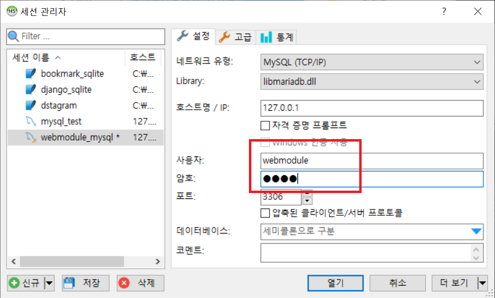
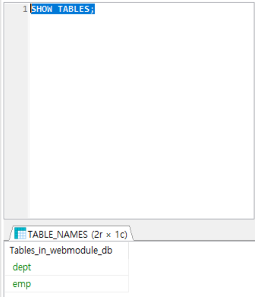
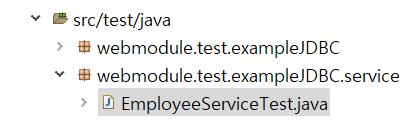
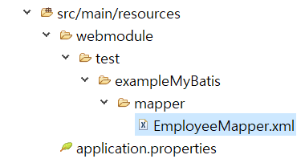

# 2020-06-23 Study

Spring & Vue web framework

2020-06-23 **온라인** 강의 수업 내용  

## DATABASE  

데이터베이스란 일반적으로 컴퓨터 시스템에 전자 방식으로 저장된 구조화된 정보 또는 데이터의 체계적인 집합을 의미  

* DBMS : 데이터를 제어하는 어플리케이션 관리 시스템  
* SQL : SQL은 데이터를 쿼리, 조작, 정의하고 엑세스 제어를 제공할 목적으로 사용되는 프로그래밍 언어  

| 데이터베이스 종류 | 내용 | 비고 |
|---|:---:|---:|
| 관계형 데이터베이스 | 관계형 데이터베이스 내 항목들은 행과 열을 가진 일련의 표로써 체계화된다. 관계형 데이터베이스 기술은 구조화된 정보에 액세스할 수 있는 가장 효율적으로 유연한 방식을 제공 | Oracle, Sybase, Tibreo, MS SQL Server |
| 객체 지향형 데이터베이스 | 객체 지향형 데이터베이스 내 정보는 객체 형태로 표현 | PostgreSQL |
| 분산 데이터베이스 | 여러 대의 서버에 네트워크로 분산되어 데이터가 저장되고 관리 | Oracle, Sybase, Tibreo, MS SQL Server  |
| NoSQL 데이터베이스 | 데이터베이스에 입력되는 모든 데이터가 구성되는 방식을 정의하는 관계형 데이터베이스와 달리 비정형 데이터와 반정형 데이터가 저장 및 조작될 수 있음 | MongoDB, HBase |  

* 빅데이터 : 빅 데이터는 전례 없이 빠른 속도로 쏟아져 나오는 다양한 종류의 대량 데이터


## SQL (Structured Query Language)  

관계형 데이터베이스에서 데이터를 쿼리, 조작, 정의하고 액세스 제어를 제공할 목적으로 사용되는 프로그래밍 언어  

- 세부 구분

    - DDL : 데이터베이스의 여러 요소를 정의하는 언어  
    - DML : 데이터의 CRUD를 담당하는 언어  
    - DCL : 데이터베이스 접근이나 DDL로 생성된 객체에 대한 권한을 부여  

- 개발 프로세스  

    1. SQL 표준을 정의 (구문규칙, 포맷팅, 가이드)  
    2. 역할을 구분 : DB, DBA, 개발자  


## JDBC (Java Database Connectivity)

**JDBC** : 자바 언어로 다양한 종류의 관계형 데이터베이스에 접속하고 SQL문을 수행하여 처리하고자 할 때 사용되는 표준 SQL 인터페이스 API  

DB 프로그램 - JDBC 인터페이스 - JDBC 드라이버 - DB  

**SpringJDBC** : JDBC의 장점과 단순성을 그대로 유지하면서도 기존 JDBC의 단점을 극복할 수 있게 해주고, 간결한 형태의 API 사용법을 제공하며, JDBC API에서 지원되지 않는 편리한 기능을 제공  

**Mybatis** : 마이바티스는 개발자가 지정한 SQL, 저장프로시저 그리고 몇 가지 고급 맵핑을 지원하는 피시스턴스 프레임워크  


## 개발에 필요한 DB mariadb로 선택  

[MariaDB 바로가기](https://downloads.mariadb.org/)  

stable 버전 다운받기. 

> stable 버전이 안정화가 된 버전  

10.4.13 버전에 들어가서 사진에서 박스 표시된 파일 다운받기  

  

> 물론 사용하는 pc 운영체제에 맞게 다운받아야 하는게 맞다.

다운받은 msi 파일을 install 하는 도중에 사용할 포트 번호.  

  

> 기존에 사용하고 있던 mysql 포트가 3306이므로 3307을 사용하기로 결정

> 흠.. Mysql이 설치되어있어서 그런지 mariadb 설치가 안된다. 그냥 mysql 사용  


## 프로젝트용 데이터베이스 만들기 

1. 프로젝트용 데이터베이스 webmodule_db 만들기  

HeidiSQL을 실행 시켜 쿼리 탭을 열어 아래와 같이 실행  

```sql
USE mysql;

CREATE DATABASE webmodule_db DEFAULT CHARACTER SET UTF8;

SHOW DATABASES;
```

  

2. 데이터베이스 계정 추가

```sql
grant all privileges ON 
webmodule_db.* TO 
'webmodule'@localhost 
identified by 'test';

flush privileges;
```

webmodule라는 사용자에게 webmodule_db에 모든 테이블의 모든 권한을 부여  

3. webmodule로 db 접속 

  

비밀번호는 'test'  

4. webmodule로 webmodule_db에 테이블 생성

```sql
CREATE TABLE dept (
	deptno		INT 	NOT NULL AUTO_INCREMENT,
	dname			VARCHAR(20),
	loc			VARCHAR(20),
	CONSTRAINT PRIMARY KEY (deptno)
)

CREATE TABLE emp (
	empno 		INT 	NOT NULL AUTO_INCREMENT,
	ename			VARCHAR(20),
	job			VARCHAR(20),
	mgr			SMALLINT,
	hiredate		DATE,
	sal			NUMERIC(7,2),
	comm			NUMERIC(7,2),
	deptno		INT,
	CONSTRAINT PRIMARY KEY (empno)
)

CREATE INDEX idx_map ON emp (deptno);

ALTER TABLE emp ADD CONSTRAINT fk_emp_dept FOREIGN KEY ( deptno )
REFERENCES dept(deptno)
ON DELETE NO ACTION ON UPDATE NO ACTION;
// 이 부서가 삭제될 때에는 아무 행동도 하지않고 업데이트 할 때에도 아무 행동도 하지 않는다.
```

결과 확인

  

5. 데이터 넣기

```SQL
INSERT INTO dept VALUES(10, 'ACCOUNTING', 'NEW YORK');
INSERT INTO dept VALUES(20, 'RESEARCH', 'DALLAS');
INSERT INTO dept VALUES(30, 'SALES', 'CHICAGO');
INSERT INTO dept VALUES(40, 'OPERATIONS', 'BOSTON');
```

결과 확인

  


## db를 이용한 프로젝트 예시 만들기  

1. STS4에서 new project

  

  

> STS에 maria db 설정이 없으므로 의존성을 추가하여 설정  

2. mariadb 의존성 추가

``pom.xml`` 수정

```xml
<dependencies>
    ...
    <dependency>
        <groupId>org.mariadb.jdbc</groupId>
        <artifactId>mariadb-java-client</artifactId>
    </dependency>
    ...
</dependencies>
```

3. 의존성을 추가한 후 maven update

사진과 같이 클릭

  

  


4. 데이터베이스 커넥션 테스트

``application.properties`` 수정

```
spring.datasource.driver-class-name=org.mariadb.jdbc.Driver
spring.datasource.url=jdbc:mariadb://127.0.0.1:3306/webmodule_db
spring.datasource.username=webmodule
spring.datasource.password=test
```

5. Employee dto 생성

사진과 같은 구조로 ``Employee.java`` 생성 후 수정 

  

```java
package webmodule.test.exampleJDBC.dto;

import java.util.Date;

public class Employee {
	
	private long empno;			// 직원일련번호
	private String ename;			// 직원 이름
	private String job;				// 직위
	private Date hiredate;			// 입사일
	private int sal;				// 급여
	private int deptno;				// 부서번호
	public long getEmpno() {
		return empno;
	}
	public void setEmpno(long empno) {
		this.empno = empno;
	}
	public String getEname() {
		return ename;
	}
	public void setEname(String ename) {
		this.ename = ename;
	}
	public String getJob() {
		return job;
	}
	public void setJob(String job) {
		this.job = job;
	}
	public Date getHiredate() {
		return hiredate;
	}
	public void setHiredate(Date hiredate) {
		this.hiredate = hiredate;
	}
	public int getSal() {
		return sal;
	}
	public void setSal(int sal) {
		this.sal = sal;
	}
	public int getDeptno() {
		return deptno;
	}
	public void setDeptno(int deptno) {
		this.deptno = deptno;
	}
	
	@Override
	public String toString() {
		return "Employee [empno=" + empno + ", ename=" + ename + ", job=" + job + ", hiredate=" + hiredate + ", sal="
				+ sal + ", deptno=" + deptno + "]";
	}
}

```

6. Department dto 만들기  

``webmodule.test.exampleJDBC.dto`` 밑에 ``department.java`` 생성 후 수정  

```java
package webmodule.test.exampleJDBC.dto;

public class Department {
	
	private int deptno;			// 부서일련번호
	private String dname;		// 부서이름
	private String loc;			// 부서위치
	
	public int getDeptno() {
		return deptno;
	}
	public void setDeptno(int deptno) {
		this.deptno = deptno;
	}
	public String getDname() {
		return dname;
	}
	public void setDname(String dname) {
		this.dname = dname;
	}
	public String getLoc() {
		return loc;
	}
	public void setLoc(String loc) {
		this.loc = loc;
	}
	
	@Override
	public String toString() {
		return "Department [deptno=" + deptno + ", dname=" + dname + ", loc=" + loc + "]";
	}
}

```

7. Employee DAO 생성

``webmodule.test.exampleJDBC.dao`` 밑에 ``EmployeeDao.java`` 생성 후 수정  

```java
package webmodule.test.exampleJDBC.dao;

import java.util.List;

import webmodule.test.exampleJDBC.dto.Employee;

public interface EmployeeDao {
	
	/**
	 * 직원일련번호로 직원 정보를 조회
	 * @param empno 직원일련번호
	 * @return 직원정보객체
	 */
	Employee getById(int empno);
	
	/**
	 * 직원이름으로 직원 정보를 조회
	 *  
	 * @param name
	 * @return 검색된 직원 정보 객체의 배열
	 */
	
	List<Employee> searchByName(String name);
}
```

> DAO는 interface.

8. dao 구현체 생성

``webmodule.test.exampleJDBC.dao`` 밑에 EmployeeDao interface를 상속받는 ``EmployeeDaoImpl.java`` 클래스 생성 후 수정

```java
package webmodule.test.exampleJDBC.dao;

import java.sql.ResultSet;
import java.sql.SQLException;
import java.util.Date;
import java.util.List;

import org.springframework.beans.factory.annotation.Autowired;
import org.springframework.jdbc.core.JdbcTemplate;
import org.springframework.jdbc.core.RowMapper;
import org.springframework.stereotype.Repository;

import webmodule.test.exampleJDBC.dto.Employee;

@Repository
public class EmployeeDaoImpl implements EmployeeDao {
	
	@Autowired
	private JdbcTemplate jdbcTemplate;
	
	@Override
	public Employee getById(int empno) {
		String sql = "SELECT empno, \r\n" +
					 "		ename, \r\n" +
					 "		job, \r\n" +
					 "		hiredate, \r\n" +
					 "		sal, \r\n" +
					 "		deptno \r\n" +
					 "FROM emp \r\n" +
					 "WEHRE empno = ?";
		
		Employee resultEmployee = jdbcTemplate.queryForObject(sql, new Object[] {empno}, new RowMapper<Employee>() {
			
			@Override
			public Employee mapRow(ResultSet rs, int rowNum) throws SQLException {
				
				Employee employee = new Employee();
				
				employee.setEmpno(rs.getInt("empno"));
				employee.setEname(rs.getString("ename"));
				employee.setJob(rs.getString("job"));
				employee.setHiredate(new Date(rs.getDate("hiredate").getTime()));
				employee.setSal(rs.getInt("sal"));
				employee.setDeptno(rs.getInt("deptno"));
				
				return employee;
			}
		});
		return resultEmployee;
	}
	
	@Override
	public List<Employee> searchByName(String name) {
		
		return null;
	}
	
	@Override
	public int raiseSalary(Employee empl) {
		
		return 0;
	};
}
```

> raiseSalaray는 교수님이 갑자기 ``EmployeeDao.java``에서 생성한 인터페이스 메소드. 생성해주고 셋팅

> 이후 교수님이 emp insert 내용을 보여주지 않아서 직접 실습은 못하고 캡처로 대체.

> 답답하다 답답해  

9. Service 구현  

``webmodule.test.exampleJDBC.service``를 만들고 서비스 인터페이스인 ``EmployeeService.java`` 생성 후 편집  

```java
package webmodule.test.exampleJDBC.service;

import java.util.List;

import webmodule.test.exampleJDBC.dto.Employee;

public interface EmployeeService {
		
	/**
	 * 고객 일련번호로 고객 정보를 가져온다.
	 * @param empno
	 * @return
	 */
	Employee getEmployee(int empno);
	
	/**
	 * 직원이름과 소속부서이름으로 직원정보 목록을 조회
	 * 검색조건이 비어있으면 전체 목록을 반환한다.
	 * @param employeeName 직원이름
	 * @param deptName	직원정보
	 * @return	직원정보목록
	 */
	List<Employee> searchEmployee(String employeeName, String deptName);
	
	
	/**
	 * 보너스를 계산하고 급여에 반영된다.
	 */
	void calculateBonus();
}
```

10. 서비스 구현체 생성  

``webmodule.test.exampleJDBC.service`` 밑에 서비스 구현체(``EmployeeService``를 상속받는) ``EmployeeServiceImpl.java`` 클래스를 생성 후 수정

```java
package webmodule.test.exampleJDBC.service;

import java.util.List;

import org.springframework.beans.factory.annotation.Autowired;
import org.springframework.stereotype.Service;

import webmodule.test.exampleJDBC.dao.EmployeeDao;
import webmodule.test.exampleJDBC.dto.Employee;

@Service
public class EmployeeServiceImpl implements EmployeeService {

	@Autowired
	private EmployeeDao employeeDao;
	
	@Override
	public Employee getEmployee(int empno) {
		// TODO Auto-generated method stub
		
		if (empno <= 0) {
			throw new IllegalArgumentException("고객일련번호가 틀립니다.");
		}
		
		Employee employee = employeeDao.getById(empno); 
				
		return employee;
	}

	@Override
	public List<Employee> searchEmployee(String employeeName, String deptName) {
		// TODO Auto-generated method stub
		return null;
	}

	@Override
	public void calculateBonus() {
		// TODO Auto-generated method stub

	}
}
```  

## 단위 테스트  

단위 테스트는 모듈이나 어플리케이션 안에 있는 개별적인 코드 단위가 예상대로 작동하는지 확인하는 반복적인 행위  

테스트들은 서로 분리되어 있고, 실행은 자동화되어야 한다. --> 지속적인 통합  

**Junit** : 자바 환경의 단위테스트 도구


1. 우리가 만든 프로젝트 단위테스트 실행  

우선 ``pom.xml``에서 Junit 의존성 추가  

```xml
...
    <dependency>
	    <groupId>org.springframework.boot</groupId>
		<artifactId>spring-boot-starter-test</artifactId>
		<scope>test</scope>
		<exclusions>
			<exclusion>
				<groupId>org.junit.vintage</groupId>
				<artifactId>junit-vintage-engine</artifactId>
			</exclusion>
		</exclusions>
	</dependency>
...
```

> 일반적으로 default 셋팅되어 있음.

2. ``src/test/java`` 밑에 테스트 패키지, 클래스 생성

``src/test/java``밑에 ``webmodule.test.exampleJDBC.service`` (서비스를 테스트하므로) 패키지 생성 후 밑에 ``EmployeeServiceTest.java`` 클래스 생성 후 편집

  

```java
package webmodule.test.exampleJDBC.service;

import static org.assertj.core.api.Assertions.not;
import static org.hamcrest.CoreMatchers.is;
import static org.hamcrest.CoreMatchers.nullValue;
import static org.hamcrest.MatcherAssert.assertThat;
import org.junit.Test;
import org.junit.runner.RunWith;
import org.springframework.beans.factory.annotation.Autowired;
import org.springframework.boot.test.context.SpringBootTest;
import org.springframework.test.context.junit4.SpringRunner;

import webmodule.test.exampleJDBC.dto.Employee;

@RunWith(SpringRunner.class)
@SpringBootTest
public class EmployeeServiceTest {
	
	@Autowired
	private EmployeeService employeeService;
	
	@Test
	public void testGetById() {
		
		Employee employee = employeeService.getEmployee(7369);
		
		assertThat(employee, is(not(nullValue())));
	}
}
```

> 설정이 잘못된건지 RunWith가 불어와지질 않는다.. 

3. 결과 화면

  

4. 단위테스트 수정 후 다시 테스트  

``EmployeeServiceTest.java`` 수정 

```java
package webmodule.test.exampleJDBC.service;

import static org.assertj.core.api.Assertions.not;
import static org.hamcrest.CoreMatchers.is;
import static org.hamcrest.CoreMatchers.nullValue;
import static org.hamcrest.MatcherAssert.assertThat;
import org.junit.Test;
import org.junit.runner.RunWith;
import org.springframework.beans.factory.annotation.Autowired;
import org.springframework.boot.test.context.SpringBootTest;
import org.springframework.test.context.junit4.SpringRunner;

import webmodule.test.exampleJDBC.dto.Employee;

@RunWith(SpringRunner.class)
@SpringBootTest
public class EmployeeServiceTest {
	
	@Autowired
	private EmployeeService employeeService;
	
	@Test
	public void testGetById() {
		
		int empno = 7369;
		
		Employee employee = employeeService.getEmployee(empno);
		
		assertThat(employee, is(not(nullValue())));
		assertThat(employee.getEmpno(), is(empno));
	}
}
```  

5. 테스트 심화

```java
...

	@Autowired
	private EmployeeService employeeService;
	
	@MockBean
	private EmployeeDao employeeDao;
	
	@Test
	public void testGetById() {
		
		int empno = 7369;
		
		Employee expected = new Employee();
		expected.setDeptno(empno);
		
		when(employeeDao.getById(empno)).thenReturn(expected);
		
		Employee employee = employeeService.getEmployee(empno);
		
		assertThat(employee, is(not(nullValue())));
		assertThat(employee.getEmpno(), is(empno));
	}
...
```

> 3번 결과 화면과 같이 나오면 성공. 여기서는 각 라인들의 의미를 파악하면서 코딩.  

6. search employee 테스팅

name을 가지고 데이터를 가져오는 메소드. 

테스트 하기 전 부서이름을 잘 보기 위해 employee dto인 ``Employee.java`` 의 ``deptno``를 ``deptName``으로 수정

```java
package webmodule.test.exampleJDBC.dto;

import java.util.Date;

public class Employee {
	
	private long empno;			// 직원일련번호
	private String ename;			// 직원 이름
	private String job;				// 직위
	private Date hiredate;			// 입사일
	private int sal;				// 급여
	private String deptName;		// 부서이름 - 수정
	
	public long getEmpno() {
		return empno;
	}
	public void setEmpno(long empno) {
		this.empno = empno;
	}
	public String getEname() {
		return ename;
	}
	public void setEname(String ename) {
		this.ename = ename;
	}
	public String getJob() {
		return job;
	}
	public void setJob(String job) {
		this.job = job;
	}
	public Date getHiredate() {
		return hiredate;
	}
	public void setHiredate(Date hiredate) {
		this.hiredate = hiredate;
	}
	public int getSal() {
		return sal;
	}
	public void setSal(int sal) {
		this.sal = sal;
	}

	public String getDeptName() {   // 수정
		return deptName;    
	}
	public void setDeptName(String deptName) {  // 수정
		this.deptName = deptName;
	}
	
	@Override
	public String toString() {
		return "Employee [empno=" + empno + ", ename=" + ename + ", job=" + job + ", hiredate=" + hiredate + ", sal=" + sal + ", deptName=" + deptName + "]";
	}   // deptno -> deptName으로 수정
}
```

> 다른 코드도 알아서.. 지우거나 변경하길.. 교수님 답답하다;  

``EmployeeServiceTest.java`` search에 관한 test 메소드 추가

```java
...

    @Test
	public void testSearchEmployee() {
		
		String employeeName = "ADAMS";
		String deptName = "RESEARCH";
		
		List<Employee> list = employeeService.searchEmployee(employeeName, deptName);
		
		assertThat(list.size(), is(1));
		assertThat(list.get(0).getEname(), is(equals(employeeName)));
		assertThat(list.get(0).getDeptName(), is(equals(deptName)));
	}
```

결과로는 일단 실패.

WHY? ``EmployeeServiceImpl.java`` 에서 

```java
	@Override
	public List<Employee> searchEmployee(String employeeName, String deptName) {
		// TODO Auto-generated method stub
		return null;
	}
```

``return null`` 이기 때문.  

따라서 ``EmployeeServiceImpl.java`` 수정  

```java
...

@Override
	public List<Employee> searchEmployee(String employeeName, String deptName) {
		// TODO Auto-generated method 
		
		// employeeDao.searchByName(employeeName, deptName); 도 가능하지만 DAO는 DTO를 하나만 받는것을 원칙으로 한다.
		// 따라서 search param이라는 것을 생성해야 한다.
		return null;
	}

...
```

``webmodule.test.exampleJDBC.dto`` 밑에 ``EmployeeSearchParam.java`` 클래스를 생성하고 편집  

```java
package webmodule.test.exampleJDBC.dto;

public class EmployeeSearchParam {
	private String employeeName;	// 직원 이름
	private String deptName;		// 소속부서이름
	
	public String getEmployeeName() {
		return employeeName;
	}
	public void setEmployeeName(String employeeName) {
		this.employeeName = employeeName;
	}
	public String getDeptName() {
		return deptName;
	}
	public void setDeptName(String deptName) {
		this.deptName = deptName;
	}
	
}
```

두 인자를 받는 param 클래스를 만들었으니 ``EmployeeDao.java``에서 그에 관한 메소드를 수정  

```java
...

List<Employee> searchByName(EmployeeSearchParam param);

...
```

``EmployeeDaoImpl.java``에서 쿼리를 작성하고 나머지 수정

```java
package webmodule.test.exampleJDBC.dao;

import java.sql.ResultSet;
import java.sql.SQLException;
import java.util.Date;
import java.util.List;

import org.springframework.beans.factory.annotation.Autowired;
import org.springframework.jdbc.core.JdbcTemplate;
import org.springframework.jdbc.core.RowMapper;
import org.springframework.stereotype.Repository;

import webmodule.test.exampleJDBC.dto.Employee;
import webmodule.test.exampleJDBC.dto.EmployeeSearchParam;

@Repository
public class EmployeeDaoImpl implements EmployeeDao {
	
	@Autowired
	private JdbcTemplate jdbcTemplate;
	
	@Override
	public Employee getById(int empno) {
		String sql = "SELECT a.empno AS empno,\r\n" + 
					"	a.ename AS ename,\r\n" + 
					"	a.job AS job,\r\n" + 
					"	a.hiredate AS hiredate,\r\n" + 
					"	a.sal AS sal,\r\n" + 
					" 	a.dname AS dname \r\n" +
					"FROM emp a JOIN dept b ON a.deptno =b.deptno\r\n" + 
					"WEHRE a.empno = ?";
		
		Employee resultEmployee = jdbcTemplate.queryForObject(sql, new Object[] {empno}, new EmployeeRowMapper());
		return resultEmployee;
	}
	
	@Override
	public List<Employee> searchByName(EmployeeSearchParam param) {
		
		String sql = "SELECT a.empno AS empno,\r\n" + 
				"	a.ename AS ename,\r\n" + 
				"	a.job AS job,\r\n" + 
				"	a.hiredate AS hiredate,\r\n" + 
				"	a.sal AS sal,\r\n" + 
				" 	a.dname AS dname \r\n" +
				"FROM emp a JOIN dept b ON a.deptno =b.deptno\r\n" + 
				"WHERE a.ename LIKE concat(?, '%') AND b.dname LIKE concat(?, '%')";
		
		List<Employee> result = jdbcTemplate.query(sql, new EmployeeRowMapper(), new Object[] {param.getEmployeeName(), param.getDeptName()}); 
		
		return result;
	}
	
	@Override
	public int raiseSalary(Employee empl) {
		
		return 0;
	};
	
	// rowMapper는 여러번 사용하기 때문에 따로 이너클래스로 빼냈다.
	public class EmployeeRowMapper implements RowMapper<Employee> {
		
		@Override
		public Employee mapRow(ResultSet rs, int rowNum) throws SQLException {
			
			Employee employee = new Employee();
			
			employee.setEmpno(rs.getInt("empno"));
			employee.setEname(rs.getString("ename"));
			employee.setJob(rs.getString("job"));
			employee.setHiredate(new Date(rs.getDate("hiredate").getTime()));
			employee.setSal(rs.getInt("sal"));
			employee.setDeptName(rs.getString("dname"));

			return employee;
		}
	}
}

```

다시 ``EmployeeServiceImpl.java`` 수정  

```java
...

	@Override
	public List<Employee> searchEmployee(String employeeName, String deptName) {
		// TODO Auto-generated method stub
		
		// employeeDao.searchByName(employeeName, deptName); 도 가능하지만 DAO는 DTO를 하나만 받는것을 원칙으로 한다.
		// 따라서 search param이라는 것을 생성해야 한다.
		
		EmployeeSearchParam param = new EmployeeSearchParam();
		param.setEmployeeName(employeeName);
		param.setDeptName(deptName);
				
		List<Employee> list = employeeDao.searchByName(param);
		
		return list;
	}

...
```

테스트 코드 에러 수정 - ``EmployeeServiceTest.java`` 수정

```java
...

	@Test
	public void testSearchEmployee() {
		
		String employeeName = "ADAMS";
		String deptName = "RESEARCH";
		
		List<Employee> list = employeeService.searchEmployee(employeeName, deptName);
		
		assertThat(list.size(), is(1));
		assertThat(list.get(0).getEname(), equalTo(employeeName));
		assertThat(list.get(0).getDeptName(), equalTo(deptName));
	}

...
```  

더 유연한 쿼리를 위해 쿼리 수정 ``EmployeeDaoImpl.java`` 수정

```java
...

	@Override
	public List<Employee> searchByName(EmployeeSearchParam param) {
		
		String sql = "SELECT a.empno AS empno,\r\n" + 
				"	a.ename AS ename,\r\n" + 
				"	a.job AS job,\r\n" + 
				"	a.hiredate AS hiredate,\r\n" + 
				"	a.sal AS sal,\r\n" + 
				" 	a.dname AS dname \r\n" +
				"FROM emp a JOIN dept b ON a.deptno =b.deptno\r\n" + 
				"WHERE 1 = 1 \r\n";
			
		Object[] params = null;
		if (param == null) {
			params = new Object[] {};
		} else {
			List<Object> paramList = new ArrayList<Object>();
			if (StringUtils.isEmpty(param.getEmployeeName())) {
				paramList.add(param.getEmployeeName());
				sql += "AND a.ename LIKE concat(?, '%')\r\n";
			}
			
			if (StringUtils.isEmpty(param.getDeptName())) {
				paramList.add(param.getDeptName());
				sql += "AND b.dname LIKE concat(?, '%')\r\n";
			}
			
			params = paramList.toArray(new Object[] {});
		}
		
		List<Employee> result = jdbcTemplate.query(sql, new EmployeeRowMapper(), params); 
		
		return result;
	}

...
```

7. search employee 검색조건이 비어있으면 전체목록을 반환하도록 쿼리 작성

``EmployeeServiceTest.java`` 수정

```java
...

	@Test
	public void testSearchEmployeeNoParam() {
		
		String employeeName = "ADAMS";
		String deptName = "RESEARCH";
		
		List<Employee> list = employeeService.searchEmployee(null, null);
		
		boolean isMatched = false;
		for (Employee item : list) {
			if (employeeName.equals(item.getEname()) && deptName.equals(item.getDeptName())) {
				isMatched = true;
				break;
			}
		}
		
		assertThat(isMatched, equalTo(true));
	}
```

8. 보너스 계산 기능 추가

``EmployeeService.java`` 수정

```java
	/**
	 * 보너스를 계산하고 급여에 반영된다.
	 * 부서를 입력받아 입력받을 퍼센트만큼 보너스로 계산한다.
	 * 보너스를 지급받은 직원들의 목록을 반환한다.
	 */
	List<Employee> calculateBonus(String depth, float percent);
```

``EmployeeDao.java`` 에 부서명리스트를 받아오는 추상메소드 추가

```java
...

List<Employee> getByDeptName(String deptName);
```

``EmployeeDaoImpl.java`` 에서 추가한 추상메소드 기능을 구현

```java
...

	@Override
	public List<Employee> getByDeptName(String deptName) {
		
		String sql = "SELECT a.empno AS empno,\r\n" + 
				"	a.ename AS ename,\r\n" + 
				"	a.job AS job,\r\n" + 
				"	a.hiredate AS hiredate,\r\n" + 
				"	a.sal AS sal,\r\n" + 
				" 	a.dname AS dname \r\n" +
				"FROM emp a JOIN dept b ON a.deptno =b.deptno\r\n" + 
				"WHERE b.dname = ? \r\n";
		
		List<Employee> result = jdbcTemplate.query(sql, new EmployeeRowMapper(), new Object[] {deptName});
		
		return result;
	}
```

``EmployeeServiceImpl.java`` 수정

```java
...

	@Override
	public List<Employee> calculateBonus(String deptName, float percent) {
		// TODO Auto-generated method stub
		
		if (StringUtils.isEmpty(deptName) || percent < 0.0f) {
			throw new IllegalArgumentException("지급하고자 하는 부서명과 지급퍼센트 값이 없습니다.");
			
		}
		
		List<Employee> employeeList = employeeDao.getByDeptName(deptName);
		
		for (Employee employee : employeeList) {
			int resultSalary = Math.round(employee.getSal() * (1 + percent));
			employee.setSal(resultSalary);
		}
		
		return employeeList;
	}

...
```  

급여가 오른 것을 저장하고 싶으니 EmployeeDao에 있는 기능 ``int raiseSalary``에 대해서 기능 구현 (``EmployeeDaoImpl.java`` 수정)

```java
...

	@Override
	public int raiseSalary(Employee employee) {
		
		String sql = "UPDATE emp SET sal = ? WHERE empno = ?";
		
		int affected = jdbcTemplate.update(sql, employee.getSal(), employee.getEmpno());
		
		return affected;
	};
```

다시 이 return 값을 통해서 참, 거짓 파악해서 서비스 구현 (``EmployeeServiceImpl.java`` 수정)

```java
...

	@Override
	public List<Employee> calculateBonus(String deptName, float percent) {
		// TODO Auto-generated method stub
		
		if (StringUtils.isEmpty(deptName) || percent < 0.0f) {
			throw new IllegalArgumentException("지급하고자 하는 부서명과 지급퍼센트 값이 없습니다.");
			
		}
		
		List<Employee> employeeList = employeeDao.getByDeptName(deptName);
		
		for (Employee employee : employeeList) {
			int resultSalary = Math.round(employee.getSal() * (1 + percent));
			employee.setSal(resultSalary);
			
			employeeDao.raiseSalary(employee);
		}
		
		return employeeList;
	}

...
```

## MyBatis 사용해보기

### MyBatis

자바 오브젝트와 SQL문 사이의 자동 Mapping 기능을 지원하는 ORM 프레임워크

- 장점

	- 쉬운 접근성과 코드의 간결함 -> 다른 ORM 보다 직관적
	- SQL문과 프로그래밍 코드의 분리
	- 다양한 프로그래밍 언어로 구현 가능  

  


- MyBatis 설정파일 : 데이터베이스의 접속 주소 정보나 Mapping 파일의 경로 관리  
- SqlSession : SQL 실행과 트랜잭션 관리  
- Mapping 파일 : SQL문과 OR Mapping을 설정  

1. 새로운 프로젝트 생성  

아래 사진과 같이 순서대로 프로젝트 생성

  

  

2. JDBC Connection 설정

MyBatis도 [spring-example214] 사진을 보듯이 JDBC가 필요하므로 connection 설정하기 위해 ``pom.xml``에 JDBC 설정

```xml
<dependencies>

	...

	<dependency>
        	<groupId>org.mariadb.jdbc</groupId>
        	<artifactId>mariadb-java-client</artifactId>
	</dependency>

	...

</dependencies>
```

``application.property``도 수정

```property
spring.datasource.driver-class-name: net.sf.log4jdbc.sql.jdbcapi.DriverSpy
spring.datasource.url=jdbc:log4jdbc:mariadb://127.0.0.1:3309/webmodule_db
spring.datasource.username=root
spring.datasource.password=test
```

> jdbc:log4jdbc:mariadb 는 mariadb 안에 무슨일이 벌어지는 log로 찍어볼 수 있도록 한다.  

따라서 이에 따른 의존성도 추가 ``pom.xml`` 수정

```xml
<dependencies>

...

	<!-- 마리아DB용 JDBC 연결 -->
	<dependency>
        <groupId>org.mariadb.jdbc</groupId>
        <artifactId>mariadb-java-client</artifactId>
    </dependency>
    	
    <!-- JDBC Spy -->
    <dependency>
        <groupId>org.bgee.log4jdbc-log4j2</groupId>
        <artifactId>log4jdbc-log4j2-jdbc4.1</artifactId>
    </dependency>

...

</dependencies>	
```

3. MyBatis 설정파일 만들기  

우선 아래와 같이 패키지 설정  

  

설정해주기 위해 ``ExampleMyBatisApplication.java`` 수정

```java
package webmodule.test.exampleMyBatis;

import org.mybatis.spring.annotation.MapperScan;
import org.springframework.boot.SpringApplication;
import org.springframework.boot.autoconfigure.SpringBootApplication;

@SpringBootApplication
@MapperScan(basePackages = "webmodule.test.exampleMyBatis.mapper")
public class ExampleMyBatisApplication {

	public static void main(String[] args) {
		SpringApplication.run(ExampleMyBatisApplication.class, args);
	}
}
```  

한가지 더 설정하기 위해 ``application.properties`` 수정

```properties
spring.datasource.driver-class-name: net.sf.log4jdbc.sql.jdbcapi.DriverSpy
spring.datasource.url=jdbc:log4jdbc:mariadb://127.0.0.1:3309/webmodule_db
spring.datasource.username=root
spring.datasource.password=test

mybatis.type-aliases-package=webmodule.test.exampleMyBatis.model

logging.level.webmodule.test.exampleMyBatis.mapper=TRACE
```

> logging은 추가적인 설정 옵션으로 로깅을 해서 추적하겠다.

4. 모델 추가

Employee에 대한 model 추가 (model 패키지 안에..)

> 기본적인 내용은 exampleJDBC와 동일하기 때문에 모델도 동일

```java
package webmodule.test.exampleMyBtis.model;

import java.util.Date;

public class Employee {
	private long empno;			// 직원일련번호
	private String ename;			// 직원 이름
	private String job;				// 직위
	private Date hiredate;			// 입사일
	private int sal;				// 급여
	private String deptName;		// 부서이름
	
	public long getEmpno() {
		return empno;
	}
	public void setEmpno(long empno) {
		this.empno = empno;
	}
	public String getEname() {
		return ename;
	}
	public void setEname(String ename) {
		this.ename = ename;
	}
	public String getJob() {
		return job;
	}
	public void setJob(String job) {
		this.job = job;
	}
	public Date getHiredate() {
		return hiredate;
	}
	public void setHiredate(Date hiredate) {
		this.hiredate = hiredate;
	}
	public int getSal() {
		return sal;
	}
	public void setSal(int sal) {
		this.sal = sal;
	}

	public String getDeptName() {
		return deptName;
	}
	public void setDeptName(String deptName) {
		this.deptName = deptName;
	}
	
	@Override
	public String toString() {
		return "Employee [empno=" + empno + ", ename=" + ename + ", job=" + job + ", hiredate=" + hiredate + ", sal="
				+ sal + ", deptName=" + deptName + "]";
	}
}

```  

5. Mapper 추가

JDBC를 이용해서 한 프로젝트인 exampleJDBC는 인터페이스를 만들고 그 인터페이스를 구현하는 클래스를 따로 만들어서 작성했지만 MyBatis를 사용하는 프로젝트는 그럴 필요가 없다.

Mapper는 인터페이스 역할을 하고 xml파일은 컴파일돼서 구현클래스가 된다고 생각하면 편하다.  

따라서 ``EmployeeMapper.java`` 추가 (mapper 패키지안에..)

```java
package webmodule.test.exampleMyBatis.mapper;

import org.apache.ibatis.annotations.Mapper;

import webmodule.test.exampleMyBtis.model.Employee;

@Mapper
public interface EmployeeMapper {
		
	/**
	 * 직원일련번호로 직원 정보를 조회
	 * @param empno 직원일련번호
	 * @return 직원정보객체
	 */
	Employee getById(int empno);
}

```  

6. Mapper가 사용할 xml을 생성  

아래와 같은 구조로 ``EmployeeMapper.xml`` 생성  

  

```xml
<?xml version="1.0" encoding="UTF-8"?>

<!DOCTYPE mapper PUBLIC "-//mybatis.org//DTD Mapper 3.0//EN"
		"http://mybatis.org/dtd/mybatis-3-mapper.dtd">
<mapper namespace="webmodule.test.exampleMyBatis.mapper.EmployeeMapper">
	
	<select id="getById" parameterType="Integer" resultType="Employee">
		SELECT a.empno AS empno,
			   a.ename AS ename,
			   a.job AS job,
			   a.hiredate AS hiredate,
			   a.sal AS sal,
			   b.dname AS deptName
			   FROM emp a JOIN dept b ON a.deptno = b.deptno
			   WHERE a.empno = #{empno}
	</select>
</mapper>
```

7. 서비스 생성  

``webmodule.test.exampleMyBatis.service`` 밑에 인터페이스인 ``EmployeeService.java``와 그 인터페이스를 상속받아서 구현하는 클래스인 ``EmployeeServiceImpl.java`` 생성 및 편집

```java
// EmployeeService.java

package webmodule.test.exampleMyBatis.service;

import java.util.List;

import webmodule.test.exampleMyBtis.model.Employee;

public interface EmployeeService {
	/**
	 * 고객 일련번호로 고객 정보를 가져온다.
	 * @param empno
	 * @return
	 */
	Employee getEmployee(int empno);
	
	/**
	 * 직원이름과 소속부서이름으로 직원정보 목록을 조회
	 * 검색조건이 비어있으면 전체 목록을 반환한다.
	 * @param employeeName 직원이름
	 * @param deptName	직원정보
	 * @return	직원정보목록
	 */
	// List<Employee> searchEmployee(String employeeName, String deptName);
	
	
	/**
	 * 보너스를 계산하고 급여에 반영된다.
	 * 부서를 입력받아 입력받을 퍼센트만큼 보너스로 계산한다.
	 * 
	 * 보너스를 지급받은 직원들의 목록을 반환한다.
	 */
	// List<Employee> calculateBonus(String deptName, float percent);
}
```

> 아직 주석처리한 기능들은 당장 사용하진 않아서 주석처리함

```java
// EmployeeServiceImpl.java
package webmodule.test.exampleMyBatis.service;

import org.springframework.beans.factory.annotation.Autowired;
import org.springframework.stereotype.Service;

import webmodule.test.exampleMyBatis.mapper.EmployeeMapper;
import webmodule.test.exampleMyBtis.model.Employee;

@Service
public class EmployeeServiceImpl implements EmployeeService {
	
	@Autowired
	private EmployeeMapper employeeMapper;
	
	@Override
	public Employee getEmployee(int empno) {
		// TODO Auto-generated method stub
		
		if (empno <= 0) {
			throw new IllegalArgumentException("고객일련번호가 틀립니다.");
		}
		
		Employee employee = employeeMapper.getById(empno); 
				
		return employee;
	}
}
```

> 코드 밑에 보면 exampleJDBC에서 사용했던 overriding된 클래스가 주석처리된 것 확인.  

8. 유닛테스트를 위한 테스트 클래스 생성

``src/test/java``밑에 ``webmodule.test.exampleMyBatis.service`` 라는 패키지를 생성한 후 ``EmployeeServiceTest.java`` 생성 후 편집  

```java
package webmodule.test.exampleMyBatis.service;

import static org.assertj.core.api.Assertions.not;
import static org.hamcrest.CoreMatchers.is;
import static org.hamcrest.CoreMatchers.nullValue;
import static org.hamcrest.MatcherAssert.assertThat;
import static org.mockito.Mockito.when;

import java.util.List;

import org.junit.Test;
import org.junit.runner.RunWith;
import org.springframework.beans.factory.annotation.Autowired;
import org.springframework.boot.test.context.SpringBootTest;
import org.springframework.test.context.junit4.SpringRunner;

import webmodule.test.exampleMyBtis.model.Employee;

@RunWith(SpringRunner.class)
@SpringBootTest
public class EmployeeServiceTest {
	
	@Autowired
	private EmployeeService employeeService;
	
	@Test
	public void testGetById() {
		
		int empno = 7369;
		
		Employee employee = employeeService.getEmployee(empno);
		
		assertThat(employee, is(not(nullValue())));
		assertThat(employee.getEmpno(), is(empno));
	}
	
//	@Test
//	public void testSearchEmployee() {
//		
//		String employeeName = "ADAMS";
//		String deptName = "RESEARCH";
//		
//		List<Employee> list = employeeService.searchEmployee(employeeName, deptName);
//		
//		assertThat(list.size(), is(1));
//		assertThat(list.get(0).getEname(), equals(employeeName));
//		assertThat(list.get(0).getDeptName(), equals(deptName));
//	}
//	
//	@Test
//	public void testSearchEmployeeNoParam() {
//		
//		String employeeName = "ADAMS";
//		String deptName = "RESEARCH";
//		
//		List<Employee> list = employeeService.searchEmployee(null, null);
//		
//		boolean isMatched = false;
//		for (Employee item : list) {
//			if (employeeName.equals(item.getEname()) && deptName.equals(item.getDeptName())) {
//				isMatched = true;
//				break;
//			}
//		}
//		
//		assertThat(isMatched, equalTo(true));
//	}
}

```  

> RunWith를 import 시키려면 RunWith에 에러를 보고 [Add JUnit 4 library to the build path]를 클릭하면 import org.junit.Test; import org.junit.runner.Runwith;가 정상적으로 임포트 된다.  

9. 테스트 실행  

가끔씩 보면 원래 프로젝트에서 하던 테스트가 Edit tool내부에는 적용되어있기 때문에 다음과 같은 에러가 발생할 수 있음.  

  

이럴 때에는 다음 사진과 같이 해보자.  

Run Configuration에 들어가서

  

JUnit 버전을 변경해준다.

  


10. 다른 Dao sql 기능 추가하기

우선 Mapper 수정 ``EmployeeMapper.java`` 수정

```java
package webmodule.test.exampleMyBatis.mapper;

import java.util.List;

import org.apache.ibatis.annotations.Mapper;

import webmodule.test.exampleMyBatis.model.EmployeeSearchParam;
import webmodule.test.exampleMyBatis.model.Employee;

@Mapper
public interface EmployeeMapper {
		
	/**
	 * 직원일련번호로 직원 정보를 조회
	 * @param empno 직원일련번호
	 * @return 직원정보객체
	 */
	Employee getById(int empno);
	
	/**
	 * 직원이름으로 직원 정보를 조회
	 *  
	 * @param name
	 * @return 검색된 직원 정보 객체의 배열
	 */
	List<Employee> searchByName(EmployeeSearchParam param);
}
```  

model 패키지에 ``EmployeeSearchParam.java`` 생성 후 편집

```java
package webmodule.test.exampleMyBatis.model;

public class EmployeeSearchParam {
	private String employeeName;	// 직원 이름
	private String deptName;		// 소속부서이름
	
	public String getEmployeeName() {
		return employeeName;
	}
	public void setEmployeeName(String employeeName) {
		this.employeeName = employeeName;
	}
	public String getDeptName() {
		return deptName;
	}
	public void setDeptName(String deptName) {
		this.deptName = deptName;
	}
}
```  

mapper에 추가된 기능 service 수정하기 - ``EmployeeService.java`` 수정

```java
...
	/**
	 * 직원이름과 소속부서이름으로 직원정보 목록을 조회
	 * 검색조건이 비어있으면 전체 목록을 반환한다.
	 * @param employeeName 직원이름
	 * @param deptName	직원정보
	 * @return	직원정보목록
	 */
	List<Employee> searchEmployee(String employeeName, String deptName);
	// 주석처리한 추상메소드 주석처리 제거
...
```

service 기능 구현 - ``EmployeeServiceImpl.java`` 수정

```java
...
	@Override
	public List<Employee> searchEmployee(String employeeName, String deptName) {
		// TODO Auto-generated method stub
		
		EmployeeSearchParam param = new EmployeeSearchParam();
		param.setEmployeeName(employeeName);
		param.setDeptName(deptName);
				
		List<Employee> list = employeeMapper.searchByName(param);
		
		return list;
	}
...
```  

searchByName 쿼리를 위해 ``EmployeeMapper.xml``에 selectByName 쿼리 추가

```xml
<?xml version="1.0" encoding="UTF-8"?>

<!DOCTYPE mapper PUBLIC "-//mybatis.org//DTD Mapper 3.0//EN"
		"http://mybatis.org/dtd/mybatis-3-mapper.dtd">
<mapper namespace="webmodule.test.exampleMyBatis.mapper.EmployeeMapper">
	
	<select id="getById" parameterType="Integer" resultType="Employee">
		SELECT a.empno AS empno,
			   a.ename AS ename,
			   a.job AS job,
			   a.hiredate AS hiredate,
			   a.sal AS sal,
			   b.dname AS deptName
			   FROM emp a JOIN dept b ON a.deptno = b.deptno
			   WHERE a.empno = #{empno}
	</select>
	
	<select id="searchByName" parameterType="EmployeeSearchParam" resultType="Employee">
		SELECT a.empno AS empno,
			   a.ename AS ename,
			   a.job AS job,
			   a.hiredate AS hiredate,
			   a.sal AS sal,
			   b.dname AS deptName
			FROM emp a JOIN dept b ON a.deptno = b.deptno
			WHERE 1 = 1
	<if test='employeeName != null and employeeName != ""'>
		AND a.ename LIKE concat(#{employeeName}, '%')
	</if>
	<if test='deptName != null and deptName != ""'>
		AND b.dname LIKE concat(#{deptName}, '%')
	</if>		
	</select>
</mapper>
```

> [b.dname AS deptName] 여기에서 deptName은 model의 필드 값이랑 일치해야 하기 때문에 넣어준다.  

테스트 코드 추가 - ``EmployeeServiceTest.java`` 수정

```java
...
	@Test
	public void testSearchEmployee() {
		
		String employeeName = "ADAMS";
		String deptName = "RESEARCH";
		
		List<Employee> list = employeeService.searchEmployee(employeeName, deptName);
		
		assertThat(list.size(), is(1));
		assertThat(list.get(0).getEname(), equals(employeeName));
		assertThat(list.get(0).getDeptName(), equals(deptName));
	}
...
```

11. 나머지 dao sql 기능 추가  

``EmployeeMapper.java`` 수정

```java
package webmodule.test.exampleMyBatis.mapper;

import java.util.List;

import org.apache.ibatis.annotations.Mapper;

import webmodule.test.exampleMyBatis.model.EmployeeSearchParam;
import webmodule.test.exampleMyBatis.model.Employee;

@Mapper
public interface EmployeeMapper {
		
	/**
	 * 직원일련번호로 직원 정보를 조회
	 * @param empno 직원일련번호
	 * @return 직원정보객체
	 */
	Employee getById(int empno);
	
	/**
	 * 직원이름으로 직원 정보를 조회
	 *  
	 * @param name
	 * @return 검색된 직원 정보 객체의 배열
	 */
	List<Employee> searchByName(EmployeeSearchParam param);
	
	/**
	 * 급여를 수정
	 * @param employee
	 * @return
	 */
	int raiseSalary(Employee employee);	// 추가

	
	/**
	 * 
	 * @param depthName
	 * @return
	 */
	List<Employee> getByDepthName(String depthName); // 추가
}  

```  

sql 쿼리 추가 - ``EmployeeMapper.xml`` 수정

```xml
...
	<select id="getByDeptName" parameterType="String" resultType="Employee">
		SELECT a.empno AS empno,
			   a.ename AS ename,
			   a.job AS job,
			   a.hiredate AS hiredate,
			   a.sal AS sal,
			   b.dname AS deptName
			   FROM emp a JOIN dept b ON a.deptno = b.deptno
			   WHERE b.dname = #{deptName}
	</select>
	
	<update id="raiseSalary" parameterType="Employee">
		UPDATE emp
		   SET sal = #{sal}
		 WHERE empno = #{empno} 
	
	</update>
...
```  

``EmployeeService.java`` 인터페이스 기능 주석처리 해제

```java
...
	/**
	 * 보너스를 계산하고 급여에 반영된다.
	 * 부서를 입력받아 입력받을 퍼센트만큼 보너스로 계산한다.
	 * 
	 * 보너스를 지급받은 직원들의 목록을 반환한다.
	 */
	List<Employee> calculateBonus(String depthName, float percent); // 주석 해제
```  

``EmployeeServiceImpl.java`` 인터페이스 구현 메소드 주석 해제

```java
	@Override
	public List<Employee> calculateBonus(String depthName, float percent) {
		// TODO Auto-generated method stub
		
		if (StringUtils.isEmpty(depthName) || percent < 0.0f) {
			throw new IllegalArgumentException("지급하고자 하는 부서명과 지급퍼센트 값이 없습니다.");
			
		}
		
		List<Employee> employeeList = employeeMapper.getByDepthName(depthName);
		
		for (Employee employee : employeeList) {
			int resultSalary = Math.round(employee.getSal() * (1 + percent));
			employee.setSal(resultSalary);
			
			employeeMapper.raiseSalary(employee);
		}
		
		return employeeList;
	}
```  

calculateBonus에 대한 테스트 코드 생성 - ``EmployeeServiceTest.java`` 수정

```java
...
	public void testCalculateBonus() {
		int empno = 7369;
		
		Employee employee = employeeService.getEmployee(empno);
		assertThat(employee.getDeptName(), equalTo("RESEARCH"));
		
		int expectedSal = Math.round(employee.getSal() * (1.1f));
		
		employeeService.calculateBonus("RESEARCH", 0.1f);
		
		employee = employeeService.getEmployee(empno);
		assertThat(employee.getDeptName(), equalTo("RESEARCH"));
		assertThat(employee.getSal(), equalTo(expectedSal));
	}
```  

12. Mapper xml에서 반복적인 sql문 처리하기

``EmployeeMapper.xml`` 수정 

```xml
<?xml version="1.0" encoding="UTF-8"?>

<!DOCTYPE mapper PUBLIC "-//mybatis.org//DTD Mapper 3.0//EN"
		"http://mybatis.org/dtd/mybatis-3-mapper.dtd">
<mapper namespace="webmodule.test.exampleMyBatis.mapper.EmployeeMapper">
	
	<sql id="selectEmployeePart">
		SELECT a.empno AS empno,
			   a.ename AS ename,
			   a.job AS job,
			   a.hiredate AS hiredate,
			   a.sal AS sal,
			   b.dname AS deptName
			   FROM emp a JOIN dept b ON a.deptno = b.deptno
	</sql>
	
	<select id="getById" parameterType="Integer" resultType="Employee">
		<include refid="selectEmployeePart"></include>
			   WHERE a.empno = #{empno}
	</select>
	
	<select id="searchByName" parameterType="EmployeeSearchParam" resultType="Employee">
		<include refid="selectEmployeePart"></include>
			WHERE 1 = 1
		<if test='employeeName != null and employeeName != ""'>
			AND a.ename LIKE concat(#{employeeName}, '%')
		</if>
		<if test='deptName != null and deptName != ""'>
			AND b.dname LIKE concat(#{deptName}, '%')
		</if>		
	</select>
	
	<select id="getByDeptName" parameterType="String" resultType="Employee">
		<include refid="selectEmployeePart"></include>
			   WHERE b.dname = #{deptName}
	</select>
	
	<update id="raiseSalary" parameterType="Employee">
		UPDATE emp
		   SET sal = #{sal}
		 WHERE empno = #{empno} 
	
	</update>
</mapper>
```

> sql 태그로 반복적인 쿼리문을 작성. 이 쿼리문을 사용하는 곳에 include refid라는 태그로 연결  

13. 자기 필드에서 다른 모델에 있는 필드를 참조하고 싶을 때

ex) 직원테이블을 가져올 때 부서위치정보를 알아오고 싶다.

우선 model 패키지에 Employee밖에 없으므로 Department 모델 클래스 생성  

```java
// model/Department.java

package webmodule.test.exampleMyBatis.model;

public class Department {
	private int deptno;			// 부서일련번호
	private String dname;		// 부서이름
	private String loc;			// 부서위치
	
	public int getDeptno() {
		return deptno;
	}
	public void setDeptno(int deptno) {
		this.deptno = deptno;
	}
	public String getDname() {
		return dname;
	}
	public void setDname(String dname) {
		this.dname = dname;
	}
	public String getLoc() {
		return loc;
	}
	public void setLoc(String loc) {
		this.loc = loc;
	}
	
	@Override
	public String toString() {
		return "Department [deptno=" + deptno + ", dname=" + dname + ", loc=" + loc + "]";
	}
}

```

model에 있는 ``Employee.java`` 수정

```java
package webmodule.test.exampleMyBatis.model;

import java.util.Date;

public class Employee {
	private long empno;			// 직원일련번호
	private String ename;			// 직원 이름
	private String job;				// 직위
	private Date hiredate;			// 입사일
	private int sal;				// 급여
	private int deptno;			// 소속 부서 일련번호
	private Department department;
	
	public long getEmpno() {
		return empno;
	}
	public void setEmpno(long empno) {
		this.empno = empno;
	}
	public String getEname() {
		return ename;
	}
	public void setEname(String ename) {
		this.ename = ename;
	}
	public String getJob() {
		return job;
	}
	public void setJob(String job) {
		this.job = job;
	}
	public Date getHiredate() {
		return hiredate;
	}
	public void setHiredate(Date hiredate) {
		this.hiredate = hiredate;
	}
	public int getSal() {
		return sal;
	}
	public void setSal(int sal) {
		this.sal = sal;
	}
	public Department getDepartment() {
		return department;
	}
	public void setDepartment(Department department) {
		this.department = department;
	}
	
	public int getDeptno() {
		return deptno;
	}
	public void setDeptno(int deptno) {
		this.deptno = deptno;
	}
	
	@Override
	public String toString() {
		return "Employee [empno=" + empno + ", ename=" + ename + ", job=" + job + ", hiredate=" + hiredate + ", sal="
				+ sal + ", department=" + department + "]";
	}
}
```  

Department에 대한 mapper 인터페이스 생성 - mapper 패키지 밑에 ``DepartmentMapper.java`` 생성 후 편집

```java
package webmodule.test.exampleMyBatis.mapper;

import org.apache.ibatis.annotations.Mapper;

import webmodule.test.exampleMyBatis.model.Department;

@Mapper
public interface DepartmentMapper {
	
	Department getDepartmentById(int deptno);
}

```

Department에 대한 mapper xml 생성 - ``DepartmentMapper.xml`` 생성 후 편집

```xml
<?xml version="1.0" encoding="UTF-8"?>

<!DOCTYPE mapper PUBLIC "-//mybatis.org//DTD Mapper 3.0//EN"
		"http://mybatis.org/dtd/mybatis-3-mapper.dtd">
<mapper namespace="webmodule.test.exampleMyBatis.mapper.DepartmentMapper">
	
	<select id="getById" parameterType="Integer" resultType="Employee">
		SELECT	deptno AS deptno,
			  	dname AS dname,
			  	loc AS loc
		FROM	dept
	   WHERE	deptno = #{deptno}
	</select>
</mapper>
```  

employee service에서 employee 를 가져올 때 부서정보까지 가져오도록 하기 - ``EmployeeService.java`` 수정

```java
...
	@Autowired
	private DepartmentMapper departmentMapper;
	
	@Override
	public Employee getEmployee(int empno) {
		// TODO Auto-generated method stub
		
		if (empno <= 0) {
			throw new IllegalArgumentException("고객일련번호가 틀립니다.");
		}
		
		Employee employee = employeeMapper.getById(empno); 
		Department department = departmentMapper.getDepartmentById(employee.getDeptno());	// 교수님은 employee.getEmpno()로 했는데 처음에 설정할 때 empno는 long 형이라서 오류 발생.. 알아서 하도록^^;  --> 나중에 보니 결국은 교수님이 실수한것 deptno가 맞음!
		
		employee.setDepartment(department);
		
		return employee;
	}
...
```

employee model 필드가 변경됐으므로 ``EmployeeMapper.xml``에서 필드값에 맞춰서 수정

```xml
...
	<sql id="selectEmployeePart">
		SELECT a.empno AS empno,
			   a.ename AS ename,
			   a.job AS job,
			   a.hiredate AS hiredate,
			   a.sal AS sal,
			   a.deptno AS deptno,
			   b.dname AS deptName
			   FROM emp a JOIN dept b ON a.deptno = b.deptno
	</sql>
...
```

> a.deptno AS deptno 추가


14. ResultMap 사용하기  

ResultMap은 join 같은 것들을 한번에 할 수 있도록 해준다..?  

ResultMap은 Mapper.xml에 만들어야 한다. 따라서 ``EmployeeMapper.xml`` 수정  

```xml
...
	<resultMap id="employeeMap" type="Employee">
		<id property="empno" column="empno" />
		<result property="ename" column="ename"/>
		<result property="job" column="job"/>
		<result property="hiredate" column="hiredate"/>
		<result property="sal" column="sal"/>
		<result property="deptno" column="deptno"/>
		<association property="department">
			<id property="deptno" column="dept_deptno" />
			<result property="dname" column="deptName"/>
			<result property="loc" column="loc"/>
		</association>
	</resultMap>
	
	
	<select id="getById" parameterType="Integer" resultMap="employeeMap">
		SELECT a.empno AS empno,
			   a.ename AS ename,
			   a.job AS job,
			   a.hiredate AS hiredate,
			   a.sal AS sal,
			   a.deptno AS deptno,
			   b.deptno AS dept_deptno,
			   b.dname AS deptName,
			   b.loc AS loc
		FROM emp a JOIN dept b ON a.deptno = b.deptno
		WHERE a.empno = #{empno}
	</select>
...
```


> 보면 property와 column은 AS의 왼쪽, 오른쪽을 참조하고 있는 것을 확인. 그리고 보면 Employee 필드값과 동일하며 id 태그는 pk값을 넣어주는 것을 확인할 수 있다  

``EmployeeMapper.xml`` 수정하였으니 서비스 수정 - ``EmployeeServiceImpl.java`` 수정

```java
	@Override
	public Employee getEmployee(int empno) {
		// TODO Auto-generated method stub
		
		if (empno <= 0) {
			throw new IllegalArgumentException("고객일련번호가 틀립니다.");
		}
		
		Employee employee = employeeMapper.getById(empno); 
//		Department department = departmentMapper.getDepartmentById(employee.getDeptno());	
		
//		employee.setDepartment(department);
		
		return employee;
	}
```  

> 주석처리만 해주어도 EmployeeMapper에서 설정을 이미 다 해놓았기 때문에 괜찮다. ResultMap의 장점