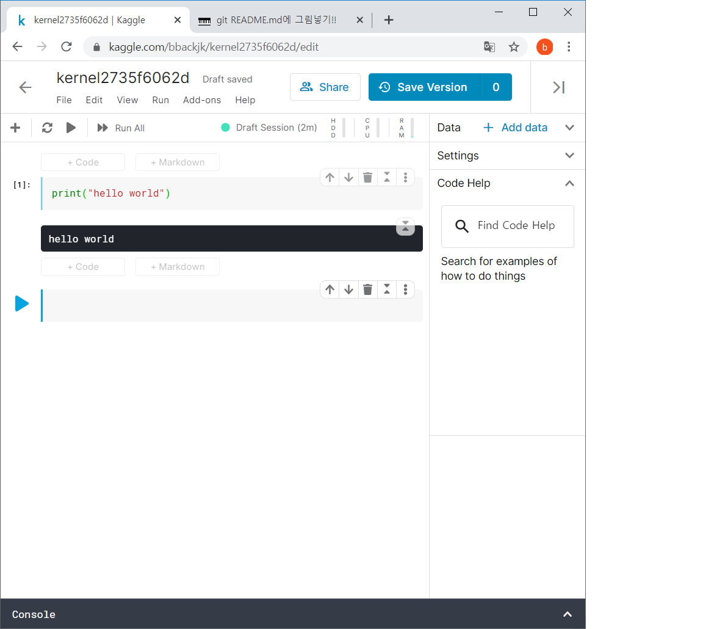
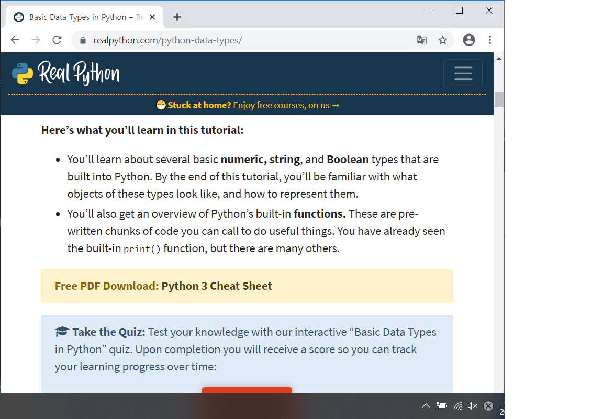

# 2020-05-07 Study

2020-05-07 목요일 수업 내용

## 강사님 info

강환수 강사님

컴퓨터정보공학과

> 강사님 pdf 자료들은 <https://github.com/lee7py/Python-IDE-VE>로 가면 볼 수 있다.

### 모듈

라이브러리 파일 (파일 단위! 패키지와 구분하자)

> 내부에는 함수, 클래스 등의 파이썬 소스가 있음.

### 파이썬의 철학

import this  
할 시 나오는 문구들이 있다.

### 파이썬은 인터프리터 언어

C는 컴파일 언어.

인터프리터는 바로 해석을 해서 바로 실행을 한다.

컴파일 같은 과정이 필요가 없다.

장점은 쉽고 단점은 느리다

> 왜? 컴파일 언어는 컴파일을 해서 실행 파일을 만든다. 즉, 한번만 느리면 다음 부터는 그 파일에 대해서 컴파일 할 필요가 없지만 **인터프리터 언어는 실행 시 마다 인터프리터를 실행시키기 때문**에 느리다.

### eval과 float

eval은 문자열 안에 있는 연산식을 계산해서 값을 알려준다.

float은 그냥 float.

### Tuple

python에서 중요한 자료형.

소괄호(**()**)를 이용해서 값들을 나열한다.

list는 mutable
tuple은 immutable

### 문자열

```python
a = "python"
type(a)         # class 'str'

print(a[0])     # 'p' ; 문자열을 자체적으로 list로 생각해서 값을 기억한다.

print(len(a))   # 6 ; 문자열의 길이를 알려주는 내장 함수 len()
```

### slicing

```python
a = 'python'
print(a[0:5])   # pytho ; slicing이라고 하며, 시작 index와 끝나는 지점의 index 값을 지정하여서 출력.

print(a[0:5:1]) # pytho ; 마지막 index는 step으로 1칸씩 띄어서 출력됨. 만약 0:5:2라면 2칸씩 띄어져서 pto.

print(a[::-1])  #nohtyp ; 역순으로 출력

print(a[::-1][::-1])    # python ; 역순을 역순으로 출력
```

### 캐글 (Kaggle)

머신러닝, 딥 러닝을 연습하고 싶은 사람들에게 최고의 플랫폼.

초보자가 접근하기에는 다소 진입 장벽이 높다. (사용하기가 어렵다.)

- <https://kaggle.com>로 들어가 gmail로 sign in

- sign in 후 왼쪽 메뉴 리스트에서 notebook을 클릭해 오른쪽 위에 있는 new notebook을 선택.

- 언어를 선택하고 notebook create.

- 간단한 온라인 개발 환경이 완성. (설치 없이)



> 참고 [캐글 사용법 바로가기](<https://github.com/lee7py/Python-IDE-VE/blob/master/%5B%EB%8B%A4%EC%96%91%ED%95%9C%20%EA%B0%9C%EB%B0%9C%ED%99%98%EA%B2%BD%200507%EB%AA%A9%5D%20(4~4%EC%8B%9C%EA%B0%84)%20%EC%BA%90%EA%B8%80%20%ED%99%9C%EC%9A%A9.pdf>)

### realpython



> 참고 [realpython 바로가기](https://realpython.com/python-data-types/)

### float은 왜 float라 할까?

내 생각) 정수가 아닌 실수는 정수로 표현할 때 표현할 수 있는 정도(?) 넘치기 때문에 float이라고 표현.

강사님) 3.4같은 실수에서 3과 4에 사이에 있는 점(**.**), point가 어디로든 움직일 수 있어서(둥둥 떠 다닐 수 있어서 float이라고 한다.)

> 더 깊게 들어가면 너무 어렵고 복잡해 진다고 한다.

### Escape Sequence in Strings

역슬래시(\)는 문장이 너무 길어서 `enter`키를 입력해도 실행되거나 끝나지 않고 다음 줄 에서 이어서 코딩이 가능해진다.
