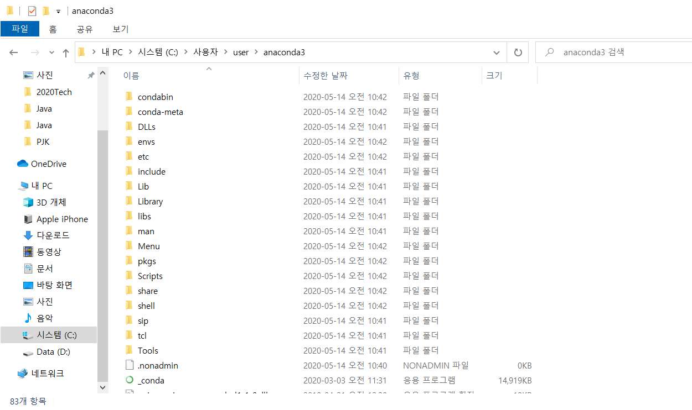
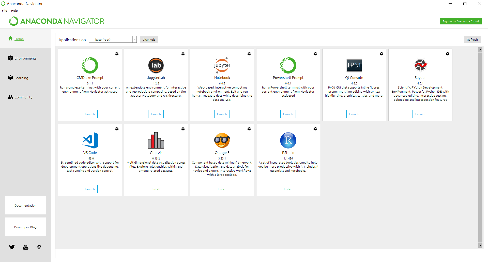
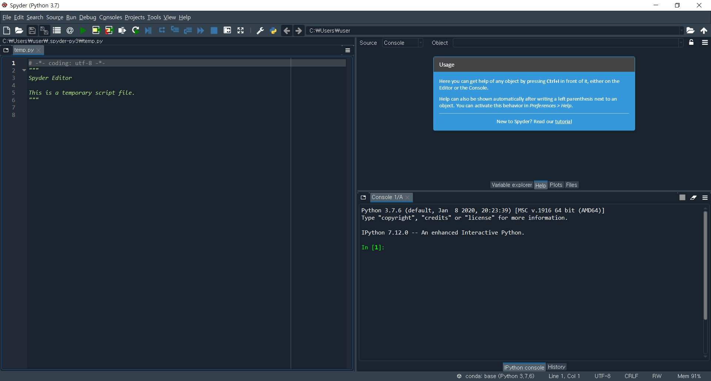
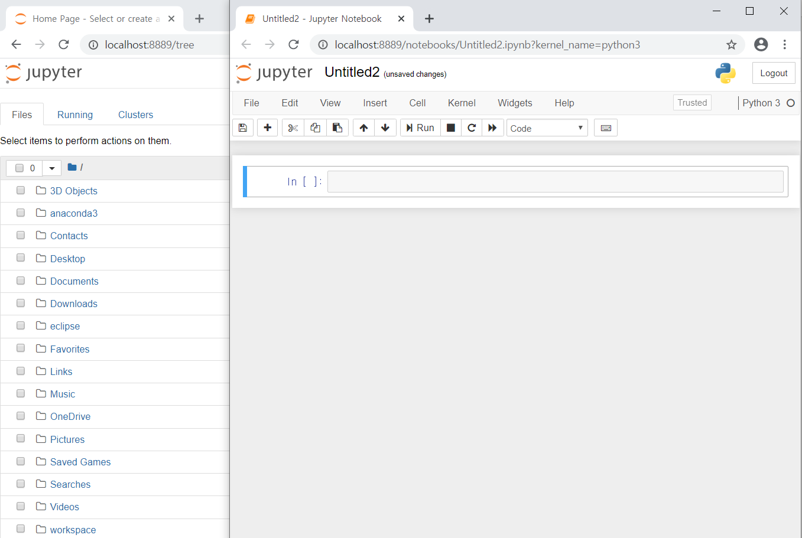

# 2020-05-14 Study

2020-05-14 수요일 수업 내용

## 참고 git page

[교수님 pdf](https://github.com/lee7py/Python-IDE-VE/blob/master/%5B%EB%8B%A4%EC%96%91%ED%95%9C%20%EA%B0%9C%EB%B0%9C%ED%99%98%EA%B2%BD%200514%EB%AA%A9%5D%20(1~2%EC%8B%9C%EA%B0%84)%20%EC%95%84%EB%82%98%EC%BD%98%EB%8B%A4%20%EA%B0%9C%EC%9A%94%EC%99%80%20%EC%84%A4%EC%B9%98.pdf)

## 아나콘다 설치

### 아나콘다

데이터 과학자용 소프트웨어 툴 (**ipython** 인터프리터를 사용한 개발 플랫폼)  

Python / R 데이터 과학 및 기계 학습을 수행하는 가장 쉬운 방법  

과학용 모듈이 기본적으로 설치  

> [아나콘다 설치 사이트](https://www.anaconda.com/products/individual)

python 3.7의 64비트 installer를 설치

### 개발환경

1. 일반 IDE (통합개발환경)

ex) Pycharm, Spyder, Wing etc..

2. 웹 기반 IDE

ex) jupyter notebook, kaggle etc..

3. 텍스트 편집기 기반 IDE

ex) Sublime Text, Atom, Vscode etc..

> 아나콘다를 설치하면 기본적으로 Spyder IDE가 설치가 된다.

### VE

개발환경을 내 컴퓨터 상에서 독립적으로 여러 개를 만들 수 있는 것  

Virtual Environment

AI 같은 게 아니다!

### 설치 전 확인

DOS창에서 Path 확인

### 설치 

모두 Next 후에 

Just Me를 선택한 후 (불편하지만 선택함.. 이유는 모르겠음)

> 이렇게 설치하면 C:\Users\[사용자이름]\anaconda3 에 설치됨

이 후 PATH를 환경변수에 자동적으로 추가하라는 선택지가 나옴

밑에 있는 선택지는 default로 선택되어 있음.

PATH 자동 추가 선택지 선택한 후 (2가지 같이 선택) 설치

### anaconda navigator

데이터 과학 분야의 인기 개발 도구; Jupyter notebook, jupyther lab

인기 IDE; Spyder

> jupyter lab은 웹 브라우저에서 실행된다.

### anaconda spyder

### anaconda_jupyter_notebook

> ``ctrl+enter``로 쉘 실행

### 아나콘다와 미니콘다

아나콘다의 단점: 너무 크다!!!!

따라서 **미니콘다**라고 아나콘다의 작은 미니 버전이 따로 있다. 이것을 사용하면 된다.

### 주피터 노트북 실행

자신의 워크스페이스 폴더를 생성. 

> 나는 폴더를 C:\Users\user\anaconda3\workspace 으로 잡았다.
 
폴더 탐색창에 cmd를 입력 (default 경로가 폴더로 나온다.)

그 default 경로에서 ``jupyter notebook``

할 시 jupyter notebook 오픈.

> 참고 [주피터 실행](https://github.com/lee7py/Python-IDE-VE/blob/master/%5B%EB%8B%A4%EC%96%91%ED%95%9C%20%EA%B0%9C%EB%B0%9C%ED%99%98%EA%B2%BD%200514%EB%AA%A9%5D%20(3~4%EC%8B%9C%EA%B0%84)%20%EC%A3%BC%ED%94%BC%ED%84%B0%20%EB%85%B8%ED%8A%B8%EB%B6%81%20%EA%B0%9C%EC%9A%94%EC%99%80%20%ED%99%9C%EC%9A%A9%20%EA%B8%B0%EC%B4%88.pdf)

