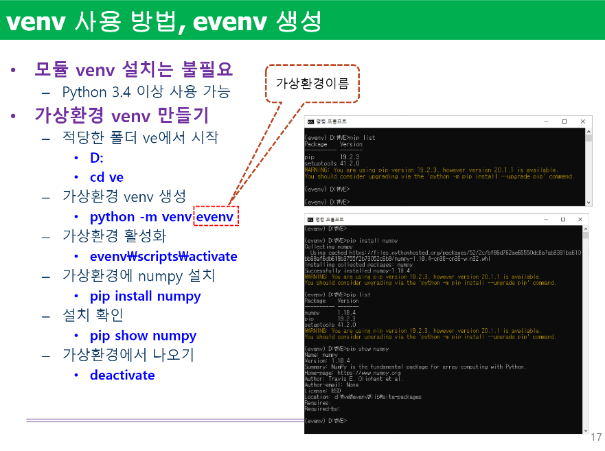
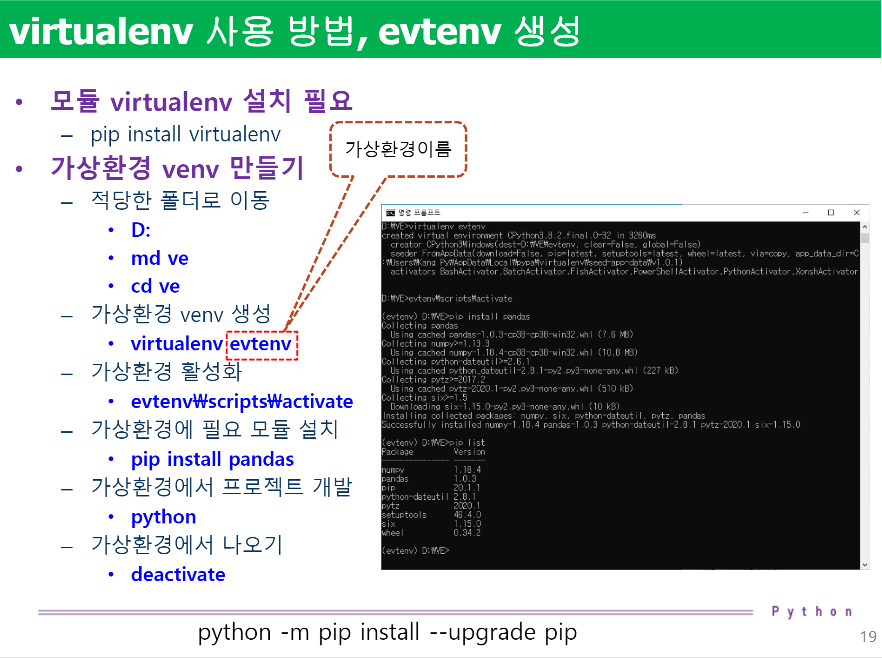
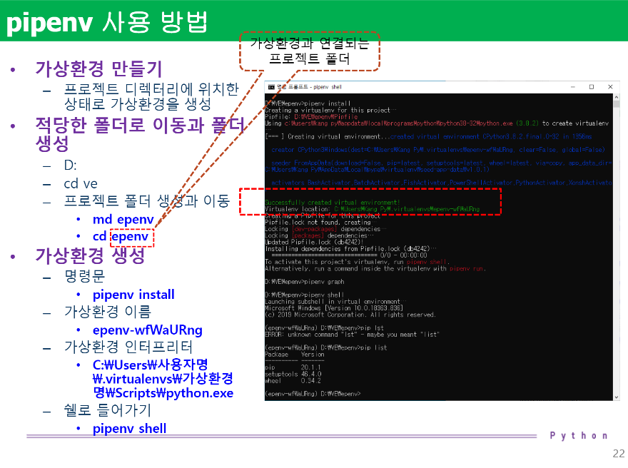
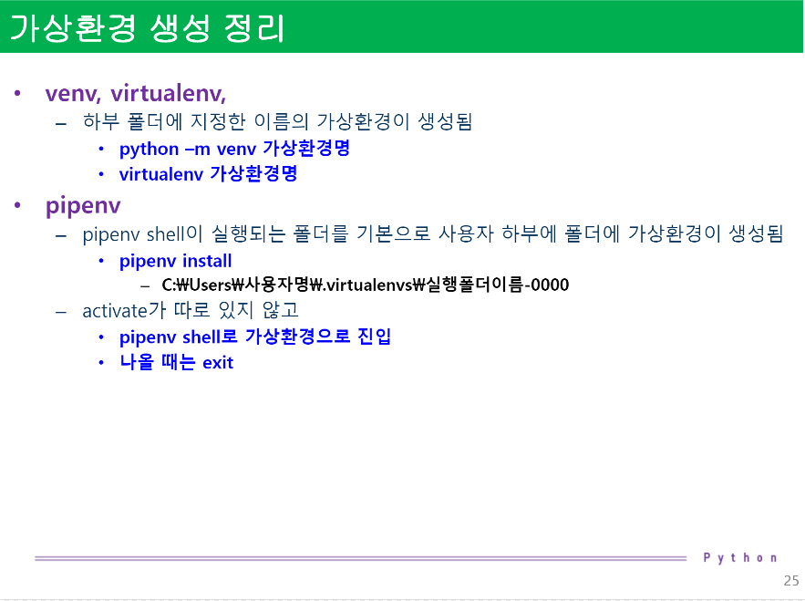
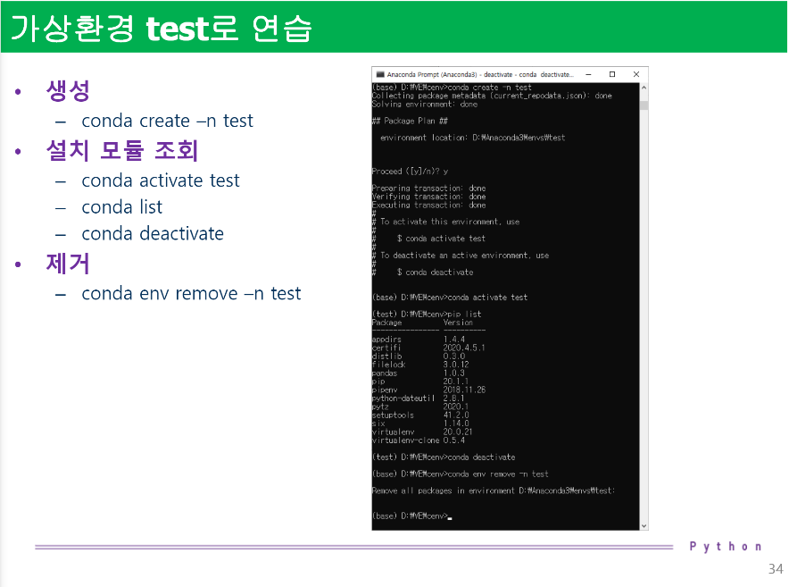
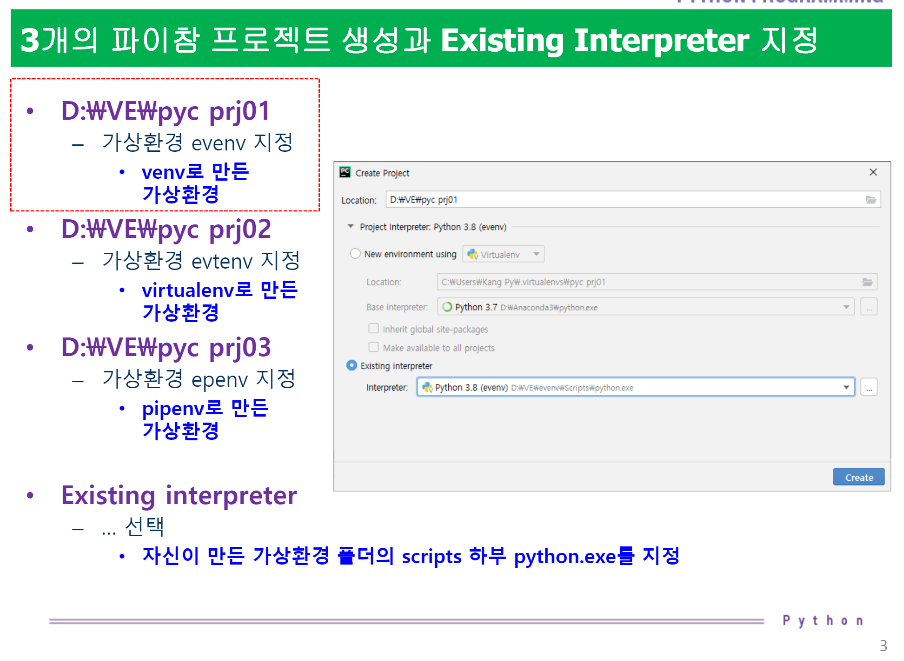

# 2020-05-28 Study

2020-05-28 목요일 수업 내용

## 1~2교시 참고 git page
[교수님 pdf](https://github.com/lee7py/Python-IDE-VE/blob/master/%5B%EB%8B%A4%EC%96%91%ED%95%9C%20%EA%B0%9C%EB%B0%9C%ED%99%98%EA%B2%BD%200528%EB%AA%A9%5D%20(1~2%EC%8B%9C%EA%B0%84)%20%ED%8C%8C%EC%9D%B4%EC%8D%AC%20%EA%B0%80%EC%83%81%ED%99%98%EA%B2%BD%20%EC%9D%B4%ED%95%B4%EC%99%80%20%EB%8B%A4%EC%96%91%ED%95%9C%20%EC%83%9D%EC%84%B1%20%EB%B0%A9%EB%B2%95.pdf)

## 파이썬 가상환경의 이해

### 가상환경의 이해

- **가상환경(Virtual Environment)**

격리된 별도의 라이브러리 설치 폴더 ; 원하는 python 환경을 구축하기 위해 필요한 모듈만 담아 놓는 바구니  

같은 모듈을 사용한다고 하더라도 다른 버전이 필요한 경우 발생  

- **가상환경의 필요성**  

하나의 환경에는 여러 버전의 설치를 할 수 없음 ; 여러 환경을 만들고 각각의 환경에 여러 버전 설치는 가능  

python 프로그램을 실행하기 위한 다양한 환경을 마련  

- **가상환경의 주 목적**

python 프로젝트를 위한 격리된 개발환경을 만드는것 ; 다른 모든 프로젝트의 종속성에 관계없이 각 프로젝트마다 고유한 종속성을 가질 수 있음을 의미  

### 가상환경 생성 방법

- **python에서 가상환경을 만드는 방법**  

크게 2가지로 virtualenv와 conda를 사용 ; venv, pipenv 등 매우 다양

## 명령 프롬프트에서 path 점검과 파이참 가상환경 생성 도구 점검  

### 명령 프롬프트 path 점검

- **명령어 pip 사용 위치 확인**

cmd에서 ``where pip``

> 이 때 환경은 anaconda3와 python3.8의 pip가 둘다 잡혀있음. 사용할 pip를 환경변수를 통해 path에서 상위로 올리고 사용하면 사용하고 싶은 pip가 사용된다.

### 파이참 가상환경 생성 도구 점검  

- Pipenv / VirtualEnv

## 모듈 설치 PIP 명령과 여러 가상환경 생성 절차  

### 현재의 시스템

- python 인터프리터 기본 환경

표준 파이썬, 아나콘다 파이썬, 가상환경 1, 가상환경 2, ...

> pip를 사용하여 패키지를 설치할 때 어느 환경인지 인지하고 설치를 해야 오류가 없다!!

### 가상환경 생성 4단계 절차

- **1. 가상환경 생성**

도구에 따라 여러 방법

- **2. 생성된 가상환경을 활성화(들어가기)**

> pipenv인 경우; ``pipenv shell``

- **3. 활성화된 가상환경 내에서 필요 패키지를 설치, 개발을 진행**  

``pip install 모듈명``  

``pipenv install 모듈명``  

``conda install 모듈명``

- **4. 현재 활성화된 가상환경을 비활성화(빠져나오기)**

``exit``

## venv, virtualenv, pipenv 활용 가상환경 생성 

## 아나콘다 가상환경 

### conda 프롬프트 열기

검색에서 ``Anaconda Prompt(anaconda3)`` 실행

base 경로에서 내 workspace로 이동하여서

conda 가상환경 설정

## pip 사용 가상환경 설치모듈과 버전 복사

### pip로 패키지 목록 버전 관리하기

상대방의 프로젝트를 받아서 설치하여 실행해보려고 한다.  

하지만 내 pip 패키지 버전들과 상대방 프로젝트의 pip 패키지 버전들은 충돌이 나는 상황이 발생  

이럴때 ``pip freeze > requirements.txt``명령어로 버전 충돌이 막아주고 업데이트 해준다.

## 파이참 프로젝트에 이미 생성된 가상환경 설정  

